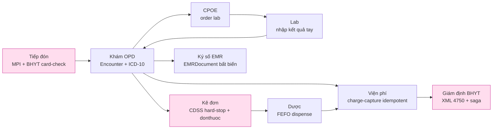

# 00 · Tổng quan — Vision chuyển đổi số bệnh viện, personas, phạm vi & non-goals

> Điểm bắt đầu của bộ tài liệu thiết kế HMS. Mô tả bài toán bỏ giấy, luận điểm chuyển đổi số theo từng khoa, các persona vận hành, phạm vi MVP (một khoa OPD-BHYT), non-goals và ràng buộc pháp lý day-1.
> Liên quan: [`01-kien-truc-tong-the.md`](01-kien-truc-tong-the.md) · [`02-backend-architecture.md`](02-backend-architecture.md) · [`12-roadmap.md`](12-roadmap.md) · [`13-adr.md`](13-adr.md). Repo **CHƯA CÓ CODE** — đây là thiết kế mục tiêu; mọi tham chiếu code path đánh dấu *(planned)*.

---

## 1. Bài toán & mục tiêu chuyển đổi số

Hospital Management System (HMS) là hệ thống **production số hóa bệnh viện Việt Nam**, mục tiêu bỏ quản lý thủ công (sổ giấy / Excel). Nguyên tắc bất biến xuyên suốt:

> **Mọi thao tác giấy có người chịu trách nhiệm → một sự kiện số có chủ thể ký số + vết audit bất biến.**

Đo lường chuyển đổi không phải bằng "đã có module CRUD nào" mà bằng **"đã tắt được sổ/phiếu giấy gì"**. Hệ thống được thiết kế quanh **HÀNH TRÌNH NGƯỜI BỆNH**, mỏ neo lâm sàng là **Encounter** — KHÔNG phải 10 module hành chính rời rạc (ADR-004). Mọi vitals, chẩn đoán ICD-10, order CLS, kết quả, đơn thuốc, charge đều FK tới `encounter_id`, kết tinh thành **Bệnh án điện tử (EMRDocument) ký số bất biến**.

Stack **CỐ ĐỊNH** (ADR-001/002, không bàn lại): **Backend Go · Frontend ReactJS · API Gateway Kong · Kubernetes · DevSecOps**. Toàn bộ hạ tầng và dữ liệu PHI **onshore tại Việt Nam** (NĐ 53/2022 + NĐ 13/2023).

## 2. Transformation thesis — số hóa từng khoa (tắt giấy gì)

Mỗi dòng dưới đây là một cặp "thao tác giấy bị xóa → cơ chế số thay thế" — neo vào BC và ADR liên quan.

| Khoa / luồng | Giấy bị xóa | Cơ chế số thay thế | BC sở hữu | Neo |
|---|---|---|---|---|
| **Tiếp đón** (Reception) | Sổ tiếp đón giấy, kiểm đúng-tuyến tay | Tra cứu CCCD/số thẻ qua blind-index HMAC → MPI; **LIVE BHYT card-check** (giá trị thẻ + miễn cùng chi-trả + cờ thu hồi + 6 lần khám) → verdict eligible/ineligible/co-pay; walk-in lấy số thứ tự; degraded-mode admit-and-flag | scheduling-reception | ADR-006 |
| **Khám OPD** | Bệnh án giấy, tờ điều trị, phiếu khám tay | Encounter state machine; bệnh sử/khám/vitals (LOINC)/chẩn đoán ICD-10 (QĐ 4469); kết tinh **EMRDocument ký số PKI** | encounter | ADR-004 |
| **Chỉ định CLS** (CPOE) | Phiếu chỉ định tay bệnh nhân cầm sang khoa, sổ trả kết quả | ServiceOrder điện tử route tới lab/CĐHA; kết quả trả về Encounter để bác sĩ duyệt (MVP nhập kết quả tay) | orders, lab | ADR-004 |
| **Dược** (Pharmacy) | Đơn thuốc viết tay, sổ giao nhận tủ trực, phiếu lĩnh | Kê đơn điện tử + **CDSS dị ứng/tương tác hard-stop** (enforce backend, fail-closed); đẩy LIVE **donthuocquocgia.vn** lấy mã đơn quốc gia; cấp phát **FEFO** theo lô/hạn, stock_ledger append-only | pharmacy | ADR-007, ADR-008 |
| **Viện phí** (Cashier) | Phiếu thu giấy, Excel đối soát | Charge-capture tự động idempotent từ mọi order/dispense vào Invoice; tách BHYT vs tự túc; biên lai in được; degraded-mode thu + reconcile-later | billing | ADR-011 |
| **Giám định BHYT** | Gõ tay/đối soát XML, xử lý từ chối qua điện thoại | Sinh **XML1–XML15 (QĐ 4750** sửa QĐ 3176, hiệu lực 01/01/2025**)** từ chính ChargeItem; đẩy cổng giám định qua saga + idempotency + retry; phản hồi/từ chối là state machine | insurance | ADR-006, ADR-011 |
| **Nội trú** (IPD) *(Phase 2)* | Sổ nhập viện, bảng theo dõi giường tay, sổ chuyển khoa | ADT + bed board + y lệnh hàng ngày + MAR; điều kiện cứng adoption: **device fleet** (cart/tablet/HID scanner) cho bedside | encounter (Admission) | ADR-004 |
| **Kho/HR/Báo cáo/HIE** *(Phase 2–4)* | Thẻ kho giấy, bảng chấm công, báo cáo tổng hợp tay | inventory đa kho, payroll, analytics-reporting, FHIR/HIE quốc gia | inventory, analytics, interoperability | ADR-002 |

**Cơ chế adoption xuyên suốt:** dual-run 2–4 tuần/khoa với super-user tại khoa, in được **phiếu pháp lý** (đơn thuốc TT 26/2025 có QR mã đơn + block chữ ký số, phiếu thanh toán theo bảng 4750, giấy ra viện), và **feature-flag tắt giấy** khi khoa đạt KPI áp dụng.

## 3. Personas & vai trò

Personas ánh xạ 1-1 với Keycloak group + RBAC, object-level/ABAC enforce trong Go (ADR-013). Mỗi persona có một surface FE riêng (xem [`14-frontend-architecture.md`](14-frontend-architecture.md)).

| Persona | Keycloak role | Trách nhiệm chính | Surface & control nổi bật |
|---|---|---|---|
| **le_tan** (Tiếp đón) | `le_tan` | Tra cứu MPI, check-in, số thứ tự, BHYT card-check | Degraded-mode admit-and-flag; merge bệnh nhân tạm/chưa định danh |
| **bac_si** (Bác sĩ) | `bac_si` | Khám, chẩn đoán ICD-10, CPOE order, kê đơn, ký số EMR | CDSS hard-stop modal; ký số PKI; allergy-unknown banner |
| **dieu_duong** (Điều dưỡng) | `dieu_duong` | Vitals, thực hiện y lệnh, MAR *(Phase 2)* | VitalsGrid; bedside (device fleet, Phase 2) |
| **duoc_si** (Dược sĩ) | `duoc_si` | Duyệt/cấp phát đơn, FEFO, tồn lô/hạn | Hard-online gate dispense; FEFO theo lô; CDSS override audit |
| **thu_ngan** (Thu ngân) | `thu_ngan` | Charge-capture, thu tiền, biên lai, tạm ứng | Degraded-mode "đã lưu, chờ gửi cổng"; tách BHYT vs tự túc |
| **giam_dinh** (Giám định BHYT) | `giam_dinh` | Sinh & đẩy XML 4750, xử lý phản hồi/từ chối | Rejection-code state machine; cross-branch reader |
| **quan_tri** (Quản trị) | `quan_tri` | Cấu hình hệ thống, chargemaster, RBAC, review break-the-glass | Reviewer break-the-glass; quản trị catalog |

**Quan hệ điều trị + minimum-necessary + branch_id** là input của ABAC: một bác sĩ chỉ thấy bệnh nhân trong phạm vi điều trị + chi nhánh; truy cập ngoài phạm vi đi qua **break-the-glass** time-boxed + scoped + closed review loop (ADR-010). Audit-of-reads ghi cả hành vi ĐỌC PHI (ADR-009).

## 4. Phạm vi MVP — một khoa OPD-BHYT trọn vòng *(MVP)*

MVP là **MỘT phòng khám OPD-BHYT** chạy trọn vòng end-to-end (thin vertical slice), KHÔNG phải nhiều khoa nông.

Phạm vi cụ thể (canon §6):

1. Tiếp đón: MPI blind-index HMAC + LIVE BHYT card-check (verdict eligible/ineligible/co-pay) + walk-in + bệnh nhân tạm + degraded admit-and-flag.
2. Khám OPD: Encounter state machine, vitals (LOINC), chẩn đoán ICD-10 (QĐ 4469), clinical notes, **EMRDocument ký số PKI** (TT 13/2025).
3. CPOE: order lab cơ bản → nhập kết quả tay + validation + critical-value flag (interface máy post-MVP).
4. Pharmacy: kê đơn + **CDSS hard-stop fail-closed**; liên thông donthuocquocgia.vn lấy mã đơn quốc gia (TT 26/2025); cấp phát FEFO.
5. Billing: charge-capture idempotent, tách BHYT vs tự túc, biên lai in; degraded thu + reconcile-later.
6. Insurance: XML1–XML15 (QĐ 4750 sửa 3176) từ ChargeItem; claim↔bill↔encounter FK; ký số + đẩy cổng qua saga/idempotency/retry; rejection state machine.
7. Identity/RBAC: Keycloak OIDC + MFA, object-level/ABAC ở Go, break-the-glass cho ED.
8. **Compliance Phase-0** (không backfill được): FORCE RLS keystone + CI branch-isolation test merge-blocking; audit-of-reads commit-with-response + hash-chain + WORM; app-side envelope encryption + blind-index cho cột nhạy cảm hẹp; DPIA + consent + data-subject-rights.
9. Dual-run + in phiếu pháp lý + feature-flag tắt giấy theo KPI.
10. **Bake-in foundations** (không build external): cột (code,system,display) triplet, Encounter anchor, transactional outbox, terminology catalog seeded từ danh mục dùng chung BYT.

## 5. Non-goals (MVP cố ý KHÔNG làm)

| Non-goal | Phase | Lý do / ADR |
|---|---|---|
| Microservices-per-BC; broker ngoài (NATS/Kafka/Debezium) | swap khi tách service | Modular monolith đủ ACID; outbox in-process (ADR-001, ADR-012) |
| Vault-đầy-đủ / dynamic DB creds / HA-Postgres sync 2-node | earn-in | MVP component budget; KMS/ESO đủ; sync gấp đôi write-latency (ADR-002) |
| IPD/giường, MAR, PACS/Orthanc, lab interface máy, OIE HL7v2 | Phase 2 | Mở rộng lâm sàng + device fleet (ADR-002) |
| FHIR R4 facade, terminology $expand, SMART-on-FHIR | Phase 2–3 | Bake-in foundation rẻ; **KHÔNG lock samply/golang-fhir-models** (thư viện chết, đánh giá lại Phase 2) |
| analytics-reporting / CDC / báo cáo BYT định kỳ | Phase 3 | MVP dùng scheduled SQL→read-table, không CDC (ADR-012) |
| PWA write-outbox offline (FE) | — | Read-only cached reference + **hard-online gate** cho dispense/cashier (giảm bề mặt double-post) |
| Argo Rollouts canary / Tempo distributed-tracing / service mesh | Phase 3 | Argo CD rolling + Prometheus+Loki ở MVP (ADR-002) |
| Báo cáo BYT, HR/payroll, kho đa kho | Phase 2–4 | Ngoài thin slice OPD-BHYT |

## 6. Ràng buộc pháp lý day-1

EMR ký số và e-prescription là **remediation-of-non-compliance** cho bệnh viện đã cấp phép (cả hai deadline đã lapsed mid-2026) → **không deferrable**.

| Văn bản | Yêu cầu | Tác động thiết kế | ADR |
|---|---|---|---|
| **TT 13/2025/TT-BYT** (hạn 30/9/2025) | Bệnh án điện tử ký số | EMRDocument bất biến ký số PKI; signed→amendment-only + `*_history` | ADR-004 |
| **TT 26/2025 + QĐ 808** (hạn 1/10/2025) | Đơn thuốc điện tử liên thông donthuocquocgia.vn | Adapter `donthuoc-quocgia` trong pharmacy; mã đơn quốc gia; QR trên đơn in | ADR-007 |
| **QĐ 4750** (sửa QĐ 3176, hiệu lực 01/01/2025) | Bộ XML giám định BHYT 1–15 | Sinh XML1–XML15 từ ChargeItem; claim↔bill FK; saga đẩy cổng | ADR-006, ADR-011 |
| **NĐ 13/2023 + NĐ 53/2022** | Bảo vệ DLCN + data residency | PHI onshore VN; DPIA + consent + data-subject-rights (Phase-0); A05 trong 60 ngày từ go-live | ADR-009 |
| **QĐ 4469** | Danh mục ICD-10 | Chẩn đoán mã hóa ICD-10; (code,system,display) triplet | ADR-004 |

Tham chiếu quốc tế (không bắt buộc MVP): HIPAA §164.312(b), GDPR, FHIR R4.

## 7. MVP component budget — named operating model *(MVP)*

Quyết định nền tảng nhất, đứng **TRƯỚC** cả lựa chọn stack (ADR-002): chốt **mô hình vận hành** — *một đội IT bệnh viện nhỏ vừa rời giấy kiêm ops ở MVP; dedicated SRE khi mở rộng*. Vì một Vault/HA-Postgres/Kafka vận hành kém còn **nguy hiểm cho PHI hơn** lựa chọn managed đơn giản, MVP bị ràng vào một **budget cứng**:

| Thành phần MVP (cho phép) | Mọi thứ khác (DEFER sau trigger viết sẵn) |
|---|---|
| Managed/CNPG-async **PostgreSQL 16+** | Vault-đầy-đủ, NATS/Kafka, Debezium |
| **Go monolith** (hms-api) | OIE/HL7v2, Orthanc/PACS, FHIR facade |
| **Kong KIC DB-less** | service mesh, Argo Rollouts canary |
| **KMS + External-Secrets** | Tempo distributed-tracing |
| **Argo CD rolling** deploy | (mọi stateful system khác) |
| **Prometheus + Loki + Grafana** | — |

Mỗi hệ thống defer gắn một **earn-in trigger** cụ thể trong [`10-deployment-operations.md`](10-deployment-operations.md) và [`12-roadmap.md`](12-roadmap.md). Mọi đề xuất thêm stateful system phải dẫn chứng trigger đã đạt; review pipeline kiểm budget.

## 8. Mục lục bộ tài liệu

| File | Nội dung |
|---|---|
| `00-tong-quan.md` | **(file này)** Vision, personas, phạm vi, non-goals, pháp lý day-1 |
| `01-kien-truc-tong-the.md` | Kiến trúc tổng thể, tech stack pinned, 4 tầng defense-in-depth, luồng dữ liệu |
| `02-backend-architecture.md` | Bounded Contexts, Clean+DDD+CQRS, layer rule, outbox in-process |
| `03-clinical-encounter-emr.md` | Encounter anchor & Bệnh án điện tử ký số |
| `04-orders-lab-pharmacy.md` | CPOE, Lab, Pharmacy (FEFO + CDSS) |
| `05-billing-insurance-bhyt.md` | Viện phí & Giám định BHYT (charge-capture, saga, XML 4750) |
| `06-identity-rbac-audit.md` | Identity, RBAC/ABAC, Audit & Break-the-glass |
| `07-api-specification.md` | API conventions, response envelope, endpoint catalog |
| `08-database-schema.md` | Schema, migrations, RLS, ERD |
| `09-security.md` | AuthN/Z, defense-in-depth, encryption, RLS, OWASP, PHI compliance |
| `10-deployment-operations.md` | K8s onshore, component budget, backup/DR, runbooks |
| `11-coding-testing-standards.md` | Go style, testing strategy, coverage 80% |
| `12-roadmap.md` | Roadmap 5 phase + Definition of Done + earn-in gates |
| `13-adr.md` | 25 ADR đầy đủ |
| `14-frontend-architecture.md` | Vite SPA, AntD, Kong BFF, per-persona surfaces |
| `15-devsecops-cicd.md` | Security gates, GitOps, supply-chain, observability |
| `16-iac-runbooks.md` | OpenTofu/Helm/Kustomize, degraded-mode & DR runbooks |
| `17-interoperability.md` | Phasing, FHIR facade, terminology, OIE/PACS |

Giáo trình learn-by-doing 27 module: xem `doc_tech/` (bắt đầu từ `doc_tech/capstone/00-reading-paths.md`).
