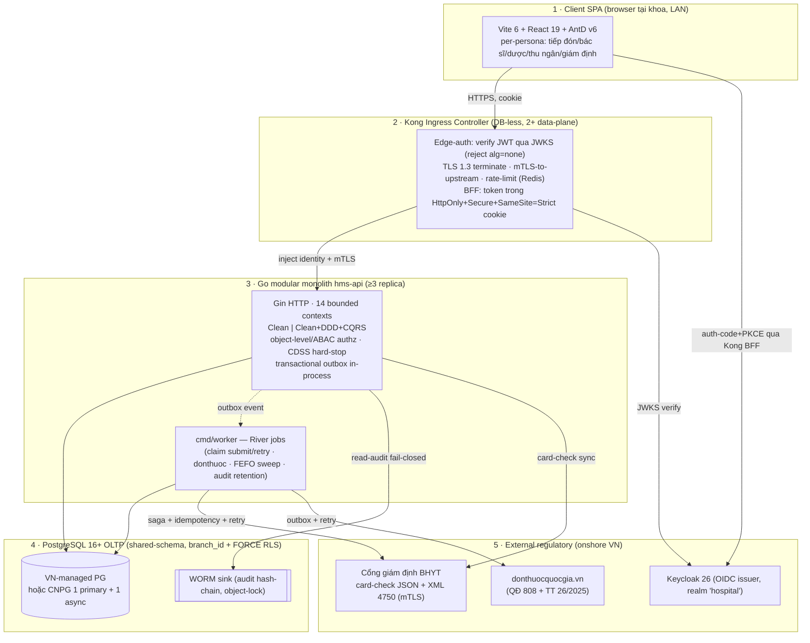
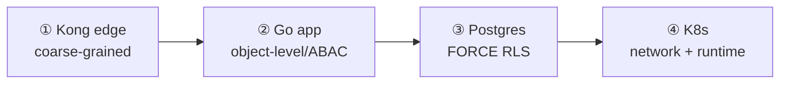
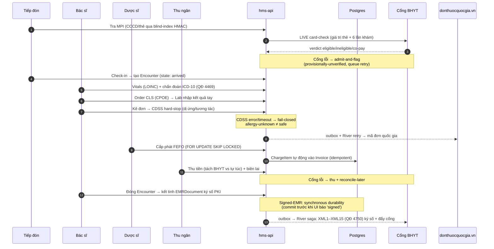
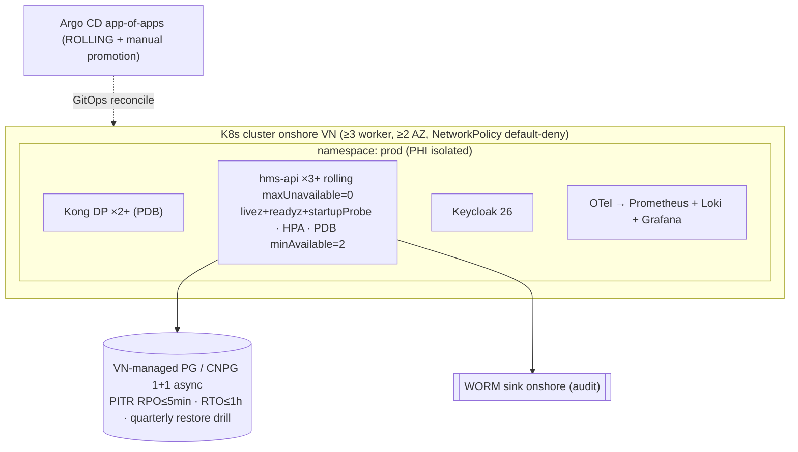

# 01 — Kiến trúc tổng thể

> Bức tranh kiến trúc HMS: Go modular monolith sau Kong, một PostgreSQL OLTP, K8s onshore Việt Nam, tech stack pinned, 4 tầng defense-in-depth, và luồng dữ liệu OPD-BHYT trọn vòng.
> Liên quan: [`00-tong-quan.md`](./00-tong-quan.md) (vision & personas), [`02-backend-architecture.md`](./02-backend-architecture.md) (BC & outbox), [`05-billing-insurance-bhyt.md`](./05-billing-insurance-bhyt.md) (BHYT two-touch), [`06-identity-rbac-audit.md`](./06-identity-rbac-audit.md) (authz & audit). Nguồn sự thật: DESIGN_CANON §3, §4, §6, ADR-001..025.

---

## 1. Nguyên tắc bất biến (đứng trên mọi quyết định kỹ thuật)

- Hệ thống được thiết kế quanh **HÀNH TRÌNH NGƯỜI BỆNH**, mỏ neo lâm sàng là **Encounter** (ADR-004) — KHÔNG phải 10 module CRUD. Mọi vitals, chẩn đoán ICD-10, order CLS, kết quả, đơn thuốc, charge đều FK tới `encounter_id`.
- Mọi thao tác giấy → một sự kiện số có chủ thể **ký số** + vết **audit bất biến**.
- Stack CỐ ĐỊNH (không bàn lại): **Backend Go · Frontend ReactJS · API Gateway Kong · Kubernetes · DevSecOps**.
- PHI **onshore** tại Việt Nam (NĐ 53/2022 + NĐ 13/2023). Tuân thủ TT 13/2025 (EMR ký số), QĐ 4750 (sửa 3176, XML giám định BHYT 1–15), TT 26/2025 + QĐ 808 (đơn thuốc liên thông), QĐ 4469 (ICD-10).
- Mô hình vận hành chốt TRƯỚC stack (ADR-002): một đội IT bệnh viện nhỏ vừa rời giấy → MVP bị ràng vào **MVP component budget** cứng; mọi hệ thống stateful khác bị defer sau trigger viết sẵn.

---

## 2. Sơ đồ kiến trúc tổng thể (5 tầng)

Client SPA → Kong (edge) → Go monolith `hms-api` → PostgreSQL OLTP → external regulatory (BHYT + đơn thuốc quốc gia).



> *(planned)* Toàn bộ code path tham chiếu dưới đây dùng layout MỤC TIÊU ở DESIGN_CANON §9 — repo HIỆN CHƯA CÓ CODE.

---

## 3. Tech stack (PINNED versions — dùng nguyên văn)

| Tầng | Lựa chọn pinned | ADR |
|---|---|---|
| **Backend** | Go modular monolith (`hms-api`, một deployable) — Gin (HTTP behind Kong) + **pgx/v5** + **sqlc** (no ORM) + **golang-migrate** | ADR-001, ADR-024 |
| Background jobs | **River** (Postgres-native) — DUY NHẤT framework job; KHÔNG ship River + Watermill song song | ADR-012 |
| Messaging | Transactional **outbox in-process** (`SELECT FOR UPDATE SKIP LOCKED`); KHÔNG NATS/Kafka/Debezium ở MVP | ADR-012 |
| **Frontend** | **Vite 6 + React 19 + TypeScript strict**, single SPA static behind Kong (KHÔNG Next.js) | ADR-018 |
| UI kit | **Ant Design v6** (ConfigProvider `vi_VN`) + ProTable/ProForm + thin Tailwind cho UI lâm sàng dày | ADR-018 |
| FE state/routing | **TanStack Router** (typed routes) + **TanStack Query v5** + **Zustand** (global ephemeral only) | ADR-018 |
| FE forms/types | **react-hook-form + zod**, một schema = form + API type, gen từ OpenAPI qua **orval/openapi-typescript**; barcode/QR (HID + html5-qrcode) | ADR-018 |
| **Gateway** | **Kong Ingress Controller (KIC) DB-less/declarative** qua Gateway API + KongPlugin CRD, 2+ data-plane + PDB, version-pinned (CVE-2026-29413 là CI/admission gate) | ADR-019, ADR-013 |
| **Identity** | **Keycloak 26** self-hosted onshore (một realm `hospital`, branch là group/attribute) — OIDC/OAuth2 issuer; Go KHÔNG quản password | ADR-013 |
| **Datastore** | **PostgreSQL 16+** OLTP shared-schema single cluster — MVP ưu tiên VN-managed PG (VNG/Viettel/FPT); fallback CNPG 1 primary + 1 ASYNC replica + PITR | ADR-015 |
| **Deploy** | **Kubernetes onshore VN** · Argo CD app-of-apps ROLLING deploy + manual promotion (KHÔNG canary) · OpenTofu (cloud/cluster) + Helm (operators) + Kustomize (overlays) · cert-manager | ADR-019 |
| **Observability** | OpenTelemetry Collector → **Prometheus + Loki + Grafana + Alertmanager** multi-window burn-rate; KHÔNG Tempo/tracing ở MVP; audit log ship riêng WORM | ADR-019 |
| **Secrets** | Cloud **KMS** (VNG/Viettel) HOẶC **External Secrets Operator**; app-side **AES-256-GCM envelope** (KMS-wrapped DEK) cho cột siêu nhạy + **blind-index HMAC** cho cột tra cứu; MỘT cơ chế crypto (KHÔNG pgcrypto + Vault Transit song song) | ADR-014 |
| **Interop** | MVP ships ZERO external FHIR/HL7/PACS — chỉ bake-in nền móng rẻ (code/system/display triplet + Encounter anchor + outbox + terminology catalog) | ADR-016, ADR-017 |

---

## 4. Bốn tầng defense-in-depth (fail-closed có test)

Object-level authz KHÔNG bao giờ ở một tầng duy nhất. Bốn lớp độc lập, mỗi lớp giả định lớp trước có thể bị bypass:



| # | Tầng | Trách nhiệm | Bất biến cốt lõi | ADR |
|---|---|---|---|---|
| ① | **Kong edge** | Verify JWT qua JWKS (reject `alg=none`), TLS 1.3, mTLS-to-upstream, rate-limit, request-size, ip-restriction admin, bot-detect | Kong CHỈ coarse-grained; **KHÔNG bao giờ** quyết định "bác sĩ này xem bệnh nhân kia" | ADR-013, ADR-019 |
| ② | **Go app** | Object-level/ABAC (role + branch + quan hệ điều trị + minimum-necessary); CDSS hard-stop fail-closed; audit-of-reads commit-with-response | Go **verify JWT độc lập** — KHÔNG mù tin `X-Userinfo` header (defense chống CVE-2026-29413 auth-bypass) | ADR-008, ADR-009, ADR-013 |
| ③ | **Postgres RLS** | ENABLE + **FORCE ROW LEVEL SECURITY** mọi bảng PHI; policy có CẢ `USING` VÀ `WITH CHECK` lọc `branch_id`; migration-owner role tách app-role | App-role là `NOSUPERUSER, NOBYPASSRLS`, KHÔNG sở hữu bảng (owner bypass RLS kể cả NOBYPASSRLS) | ADR-003, ADR-005 |
| ④ | **K8s runtime** | NetworkPolicy default-deny; PHI namespace isolated; `runAsNonRoot` + `readOnlyRootFS` + drop-ALL-caps + seccomp RuntimeDefault; etcd encryption-at-rest | PHI traffic không rời cluster onshore | ADR-019 |

Cốt lõi tầng ③ (keystone PHI, Phase-0, không retrofit được): `branch_id` không bao giờ lấy từ client — Go middleware `SET LOCAL app.current_branch` trong tx, trích từ JWT đã verify. Resource khác branch trả **404 (không 403)**.

```sql
-- migration 000001 (planned) — keystone, mọi bảng PHI (ADR-003)
ALTER TABLE encounters ENABLE ROW LEVEL SECURITY;
ALTER TABLE encounters FORCE ROW LEVEL SECURITY;          -- owner cũng phải tuân
CREATE POLICY branch_isolation ON encounters
  USING       (branch_id = current_setting('app.current_branch')::uuid)
  WITH CHECK  (branch_id = current_setting('app.current_branch')::uuid); -- chặn write cross-tenant
```

```go
// shared/rls (planned) — invariant: MỌI PHI query chạy trong tx đã SET LOCAL GUC.
// pgx pool reuse connection → query ngoài tx mất filter = leak. Có explicit test.
tx, _ := pool.Begin(ctx)
_, _ = tx.Exec(ctx, "SET LOCAL app.current_branch = $1", branchIDFromVerifiedJWT)
// ... toàn bộ PHI query trong tx này ...
```

> CI integration test (testcontainers) chứng minh dữ liệu branch-B **vô hình** dưới `app.current_branch=A` là **merge-blocking gate** (ADR-003, ADR-025).

---

## 5. Luồng dữ liệu chính — OPD-BHYT trọn vòng *(MVP)*

Thin vertical slice một phòng khám OPD-BHYT (DESIGN_CANON §6): tiếp đón → khám → CLS → kê đơn → viện phí → XML giám định → ký số EMR.



Tính chất cross-BC: mọi liên kết BC đi qua **domain event + transactional outbox in-process** (ADR-012) — đủ ACID cho charge-capture, claim↔bill↔encounter linkage và FEFO mà không cần broker ngoài. Tách BC ra service riêng = swap relay adapter sang Kafka, domain code không đổi (ADR-001).

---

## 6. BHYT two-touch + degraded-mode (ADR-006)

BHYT là phụ thuộc LIVE **hai chạm** — không bao giờ chặn người bệnh khi cổng/mạng lỗi.

| Chạm | Khi nào | Giao thức | Degraded-mode bắt buộc |
|---|---|---|---|
| **Touch 1 — card-check** | Tại tiếp đón (`scheduling-reception` BC) | LIVE web service JSON, sync + timeout | **admit-and-flag**: thẻ `provisionally-unverified`, queue retry (River) |
| **Touch 2 — XML giám định** | Lúc quyết toán (`insurance` BC) | XML1–XML15 QĐ 4750 (sửa 3176), mTLS + saga + idempotency | **queue-and-retry / reconcile-later**, UI hiện "đã lưu, chờ gửi cổng" |

Cashier áp dụng cùng nguyên tắc (ADR-011): thu + reconcile-later. Rejection-code từ cổng là **state machine first-class** trong `insurance` BC (ADR-023). BHXH sandbox + rejection-code mapping là **Phase-0 blocker** (ADR-023).

---

## 7. Deployment topology onshore VN *(MVP)*



- **IaC**: OpenTofu (cloud/cluster) · Helm (operators) · Kustomize overlays (`base` + `overlays/{dev,staging,prod}`). Dev/staging/prod là namespace-per-env ngày 1; prod tách cluster riêng tại go-live (ADR-019).
- **Signed-EMR/MAR write path** cần **synchronous durability** riêng — commit confirmed trước khi UI báo `signed`/`administered`, survive PITR restore (ADR-004, ADR-015).
- **Security gates merge-blocking** (rẻ, high-value): Gitleaks, govulncheck, golangci-lint (+ depguard cấm cross-BC import), Trivy. SLSA/Cosign/ZAP follow sau khi pipeline ổn (ADR-019).

---

## 8. MVP component budget (cứng — ADR-002)

MVP chỉ chạy đúng các thành phần stateful này; mỗi hệ thống defer gắn một earn-in trigger viết sẵn (chi tiết tại `10-deployment-operations.md` *(planned)* + `12-roadmap.md` *(planned)*).

| Trong budget MVP | Defer (earn-in trigger) |
|---|---|
| Managed/CNPG-async **Postgres** | Vault-đầy-đủ → cần PKI signing thật / dynamic DB creds / service extraction |
| **Go monolith** `hms-api` | NATS/Kafka/Debezium → tách BC ra service (proven scaling/compliance isolation) |
| **Kong KIC DB-less** | Service mesh (Linkerd) → khi BC tách (Phase 3) |
| **KMS / External Secrets** | OIE HL7v2 sidecar, Orthanc DICOM, FHIR facade → Phase 2 |
| **Argo CD rolling** | Argo Rollouts canary + SLO-auto-rollback → multi-service maturity |
| **Prometheus + Loki** | Tempo / distributed-tracing → khi có nhiều service |

> Nguyên tắc: một Vault/HA-Postgres/Kafka **vận hành kém** còn nguy hiểm cho PHI hơn lựa chọn managed đơn giản. Mọi đề xuất thêm stateful system phải dẫn chứng trigger đã đạt (ADR-002).

---

## 9. Cross-cutting concerns (cố định toàn hệ thống)

- **Identity** (ADR-013): auth-code+PKCE cho SPA qua Kong BFF (token trong HttpOnly cookie, SPA không thấy token); client_credentials cho service-to-service; short-TTL token 5–15m + cached roles (KHÔNG per-request DB lookup); MFA bắt buộc (TOTP tối thiểu, WebAuthn ưu tiên) + step-up cho hành động nhạy cảm.
- **Audit-of-reads** (ADR-009): ghi commit cùng/trước response (fail-closed — KHÔNG trả PHI nếu audit write fail); `audit_log` INSERT-only + hash-chain + WORM sink ngoài Postgres (chống DBA/superuser tamper).
- **Break-the-glass** (ADR-010): time-boxed (auto-expire) + scoped (patient/encounter) + named reviewer + hard SLA, áp dụng cho CẢ access VÀ creation/ordering (ED register-first-identify-later).
- **Field-level encryption** (ADR-014): app-side AES-256-GCM envelope cho CHỈ cột siêu nhạy (CCCD, số thẻ BHYT, HIV/tâm thần/di truyền) + blind-index HMAC cho cột tra cứu exact-match; scope chốt trong `08-database-schema.md` *(planned)* TRƯỚC data.
- **Idempotency** (ADR-011): FE idempotency-key và backend charge/claim idempotency-key PHẢI là MỘT scheme end-to-end (chống double-post khi replay); `idempotency_keys` unique-constraint.
- **DPIA + consent + data-subject-rights** (ADR-020): Phase-0 legal deliverable (NĐ13: nộp A05 trong 60 ngày từ go-live); consent enforcement ở Go trước xử lý ngoài mục đích điều trị.

---

## 10. Tham chiếu nhanh

| Cần biết | Đọc file |
|---|---|
| Vision, personas, non-goals | [`00-tong-quan.md`](./00-tong-quan.md) |
| BC map, layer rule, outbox, composition root | [`02-backend-architecture.md`](./02-backend-architecture.md) |
| Encounter state machine, EMR ký số | [`03-clinical-encounter-emr.md`](./03-clinical-encounter-emr.md) |
| CPOE, Lab, Pharmacy (FEFO + CDSS) | [`04-orders-lab-pharmacy.md`](./04-orders-lab-pharmacy.md) |
| Charge-capture, saga, XML 4750 | [`05-billing-insurance-bhyt.md`](./05-billing-insurance-bhyt.md) |
| Identity, RBAC/ABAC, audit, break-the-glass | [`06-identity-rbac-audit.md`](./06-identity-rbac-audit.md) |
| Database schema, RLS, encryption scope | `08-database-schema.md` *(planned)* |
| Deployment, runbook degraded-mode | `10-deployment-operations.md` *(planned)* |
| Roadmap 5 phase + earn-in trigger | `12-roadmap.md` *(planned)* |
