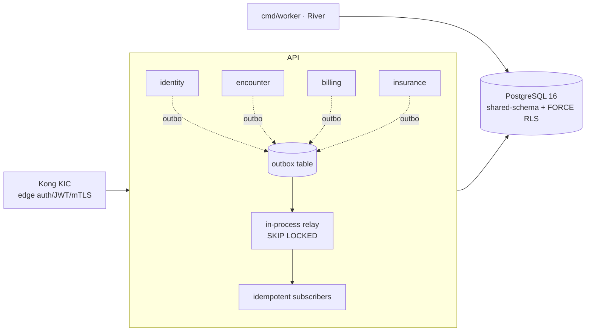
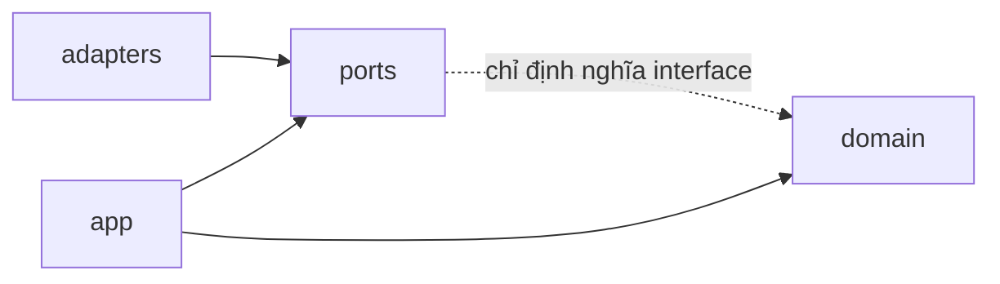
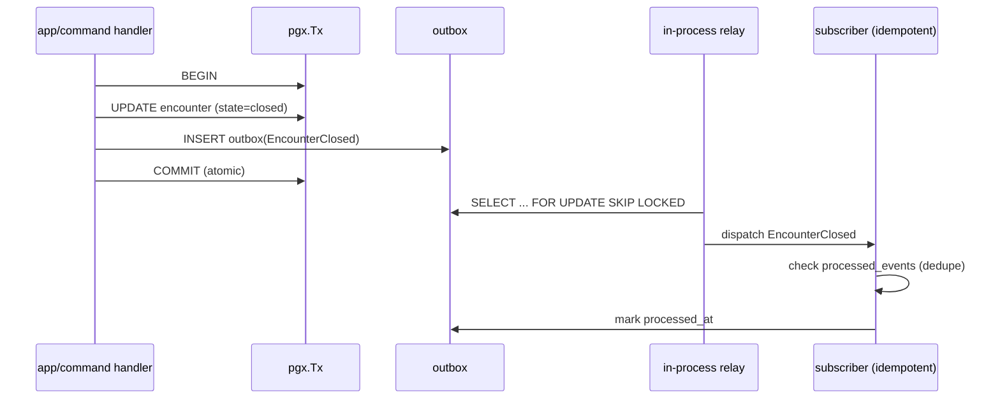

# 02 — Backend Architecture

> Kiến trúc backend HMS *trước khi viết code*: 14 Bounded Context, arch-style split (Clean vs Clean+DDD+CQRS), layer rule một chiều, domain event + transactional outbox in-process, River job framework, composition root.
> Repo **chưa có code** — tài liệu mô tả thiết kế mục tiêu; mọi code path đánh dấu *(planned)* theo layout canon §9.
> Liên quan: [`01-kien-truc-tong-the.md`](01-kien-truc-tong-the.md) (bức tranh tổng thể), [`03-clinical-encounter-emr.md`](03-clinical-encounter-emr.md), [`04-orders-lab-pharmacy.md`](04-orders-lab-pharmacy.md), [`05-billing-insurance-bhyt.md`](05-billing-insurance-bhyt.md), [`06-identity-rbac-audit.md`](06-identity-rbac-audit.md), [`08-database-schema.md`](08-database-schema.md).

---

## 1. Quyết định nền: Go modular monolith (ADR-001, ADR-002)

HMS là **một Go modular monolith** — một module `hms`, một binary `hms-api`, một deployable (ADR-001). KHÔNG microservices-per-BC ở MVP. Lý do: bệnh viện rời giấy cần **ACID nội-process** cho charge-capture, claim↔bill↔encounter linkage và FEFO stock movement — distributed transaction chỉ làm phức tạp; đội IT bệnh viện nhỏ vận hành được một deployable.

Vì cross-BC đã đi qua **outbox**, việc tách một BC ra service riêng = *swap relay adapter sang Kafka, domain code không đổi*. Đây là đường tiến hóa thiết kế sẵn, chỉ kích hoạt khi có **trigger proven** (scaling độc lập hoặc cô lập compliance) — không front-load (ADR-002 MVP component budget).



---

## 2. Bounded Context map (14) — tên & arch style (ĐÚNG canon §4)

| # | Bounded Context | Arch style | Vai trò ngắn | MVP? |
|---|---|---|---|---|
| 1 | **identity-access** | `clean` | Đồng bộ user/role Keycloak, session, MFA, step-up, break-the-glass, branch membership | ✅ |
| 2 | **organization** | `clean` | Registry branch/department/room/bed, chargemaster (`service_catalog`), price list, facility external codes | ✅ |
| 3 | **patient** (MPI) | `clean` | Master Patient Index xuyên chi nhánh, identifiers mã hóa + blind-index, allergy, consent, terminology catalog | ✅ |
| 4 | **scheduling-reception** | `clean` | Appointment, queue (walk-in), check-in, LIVE BHYT eligibility + degraded-mode | ✅ |
| 5 | **encounter** (EMR core) | `clean+ddd+cqrs` | Mỏ neo lâm sàng, state machine, EMRDocument ký số bất biến | ✅ |
| 6 | **orders** (CPOE) | `clean+ddd+cqrs` | ServiceOrder lifecycle, route lab/pharmacy, sinh charge | ✅ |
| 7 | **lab** (LIS-lite) | `clean+ddd+cqrs` | Specimen, nhập kết quả tay, critical-value → CDSS | ✅ |
| 8 | **pharmacy** | `clean+ddd+cqrs` | Kê đơn + CDSS hard-stop, donthuoc liên thông, FEFO dispense | ✅ |
| 9 | **inventory** | `clean` | Kho đa kho, stock_ledger append-only, reorder | Phase 2 |
| 10 | **billing** | `clean+ddd+cqrs` | Charge-capture idempotent, Invoice, payment, saga quyết toán | ✅ |
| 11 | **insurance** (BHYT) | `clean+ddd+cqrs` | XML1–XML15 QĐ4750, claim↔bill↔encounter, saga submit/retry | ✅ |
| 12 | **audit-compliance** | `clean+ddd+cqrs` | Audit-of-reads fail-closed, hash-chain, WORM, DPIA, DSR | ✅ |
| 13 | **analytics-reporting** | `clean+ddd+cqrs` | Read-models/warehouse (scheduled SQL→read-table) | Phase 3 |
| 14 | **interoperability** | `clean+ddd+cqrs` | FHIR R4 facade, terminology, OIE/Orthanc boundary | Phase 2 |

**Quy tắc chọn style** (ADR-001/004/011): `clean` cho BC CRUD-ish quanh reference data; `clean+ddd+cqrs` cho BC có **vòng đời thật** (state machine, invariant nghiệp vụ phức, hai phía read/write tách biệt) — encounter, orders, lab, pharmacy, billing, insurance, audit. KHÔNG over-engineer BC đơn giản thành CQRS.

---

## 3. Layout `internal/<bc>/{domain,app,ports,adapters}` (planned §9)

```
backend/                              # module: hms
├── cmd/hms-api/main.go               # composition root DUY NHẤT (wiring/DI)  (planned)
├── cmd/migrate/                      # golang-migrate runner                 (planned)
├── cmd/worker/                       # River background jobs                 (planned)
├── migrations/000001_phase0_compliance.up.sql  ...                          (planned)
├── internal/
│   ├── identity/      {domain,app,ports,adapters}            # clean
│   ├── organization/  {domain,app,ports,adapters}            # clean
│   ├── patient/       {domain,app,ports,adapters}            # clean
│   ├── scheduling/    {domain,app,ports,adapters}            # clean
│   ├── encounter/     {domain,app/{command,query},ports,adapters}  # clean+ddd+cqrs
│   ├── orders/        {domain,app/{command,query},ports,adapters}
│   ├── lab/           {domain,app/{command,query},ports,adapters}
│   ├── pharmacy/      {domain,app/{command,query},ports,adapters}
│   ├── billing/       {domain,app/{command,query},ports,adapters}
│   ├── insurance/     {domain,app/{command,query},ports,adapters}
│   ├── audit/         {domain,app,ports,adapters}
│   └── shared/        {auth,outbox,middleware,metrics,tracing,errors,httpx,crypto,rls,config}
├── sqlc.yaml   .golangci.yml   go.mod
```

Mỗi BC là **một domain folder** với 4 layer cố định. CQRS BC tách thêm `app/{command,query}`. `shared/` là kernel cắt ngang (KHÔNG chứa logic nghiệp vụ của bất kỳ BC nào).

---

## 4. Layer rule một chiều — bất khả xâm phạm (ADR-001)



Chiều phụ thuộc duy nhất: **`adapters → ports ← app → domain`**.

| Layer | Được import | TUYỆT ĐỐI KHÔNG |
|---|---|---|
| `domain/` | chỉ Go stdlib | framework, pgx, gin, BC khác |
| `ports/` | `domain` (cho signature) | adapters, app |
| `app/` | `domain` + `ports` | adapters, gin, pgx trực tiếp |
| `adapters/` | `ports` + `domain` + libs (pgx, gin, sqlc, Keycloak…) | `app` của BC khác |

- `domain/` chứa aggregate, value object, business rule thuần — không I/O.
- `ports/` là interface (repository, event publisher, external client) do `app` cần.
- `app/` là use case orchestration (command/query handler) — phụ thuộc *interface*, không implementation.
- `adapters/` là implementation cụ thể (pgx repo, Gin handler, BHYT/donthuoc HTTP client).
- `cmd/hms-api/main.go` là **nơi DUY NHẤT** wiring (DI) — không có DI container ma thuật.

**Cross-BC**: KHÔNG import chéo `internal/<a>` từ `internal/<b>`. Giao tiếp chỉ qua **domain event + transactional outbox in-process**.

**Cưỡng chế bằng `depguard` (golangci-lint)** — merge-blocking:

```yaml
# .golangci.yml (planned) — minh họa rule depguard
linters-settings:
  depguard:
    rules:
      domain-pure:
        files: ["**/internal/*/domain/**"]
        deny:
          - { pkg: "github.com/jackc/pgx", desc: "domain phải thuần, không I/O" }
          - { pkg: "github.com/gin-gonic/gin", desc: "domain không biết HTTP" }
      no-cross-bc:
        files: ["**/internal/billing/**"]
        deny:
          - { pkg: "hms/internal/pharmacy", desc: "cross-BC chỉ qua outbox event" }
          - { pkg: "hms/internal/encounter", desc: "cross-BC chỉ qua outbox event" }
```

---

## 5. Transactional outbox in-process (ADR-012, ADR-011)

MVP dùng **transactional outbox table** ghi trong **cùng `pgx.Tx`** với state change, relay tới **in-process pub/sub**. KHÔNG NATS/Kafka/Debezium ở MVP — hai messaging system cho một monolith zero cross-process consumer là vô nghĩa (ADR-012).

**Bất biến cốt lõi**: domain state + outbox row được ghi **atomic** trong một transaction. Không có cửa sổ "đã đổi state nhưng mất event".

```go
// internal/shared/outbox/publisher.go (planned)
// Ghi event trong CÙNG tx với state change — atomic, không lost-update.
func (p *TxPublisher) Publish(ctx context.Context, tx pgx.Tx, ev DomainEvent) error {
    _, err := tx.Exec(ctx, `
        INSERT INTO outbox (id, branch_id, aggregate_type, aggregate_id,
                            event_type, payload, occurred_at)
        VALUES ($1,$2,$3,$4,$5,$6, now())`,
        ev.ID, ev.BranchID, ev.AggregateType, ev.AggregateID,
        ev.Type, ev.Payload)
    return err // tx commit/rollback do caller (use case) quyết định
}
```

Relay quét outbox bằng **`SELECT … FOR UPDATE SKIP LOCKED`** (nhiều replica `hms-api` không tranh nhau cùng row):

```sql
-- relay claim batch (planned) — SKIP LOCKED cho phép concurrent relay an toàn
SELECT id, event_type, payload
FROM outbox
WHERE processed_at IS NULL
ORDER BY id          -- BIGINT IDENTITY: thứ tự phát sinh
LIMIT 100
FOR UPDATE SKIP LOCKED;
```

**Subscriber idempotent** qua bảng `processed_events` (dedupe theo `(subscriber, event_id)`) — relay là **at-least-once**, handler phải an toàn khi replay. Đây cũng là lý do FE idempotency-key và backend charge/claim idempotency-key phải là **MỘT scheme end-to-end** (ADR-011, risk: double-post khi replay).



**Event chính chảy qua outbox** (canon §4): `EncounterClosed/Diagnosed/EMRSigned` (encounter) → drive charge + claim + interop; `ResultReleased/CriticalValue` (lab); `DrugDispensed` (pharmacy); `LoginAudited/RoleChanged/BreakGlassActivated` (identity); state-change audit (audit-compliance).

> ⚠️ **Phân biệt audit READ vs audit state-change** (ADR-009): audit **đọc PHI** KHÔNG đi qua outbox — phải **commit-with-response fail-closed** (không trả PHI nếu audit write fail). Chỉ **state-change audit** mới đi outbox. Outbox là cho event nghiệp vụ, không phải cho read-audit durable path.

---

## 6. River — DUY NHẤT job framework (ADR-012)

**River** (Postgres-native) là framework background job DUY NHẤT — KHÔNG ship River + Watermill song song (overlap, cùng Postgres-native). Chạy trong `cmd/worker` *(planned)*.

| Job | BC | Mục đích |
|---|---|---|
| `reminder.appointment` | scheduling | Nhắc lịch hẹn |
| `claim.submit` / `claim.retry` | insurance | Đẩy XML 4750 cổng giám định, retry khi cổng quá tải (saga, idempotent dedupe theo claim ref) — ADR-011/023 |
| `rx.national_link` | pharmacy | Đẩy đơn lên donthuocquocgia.vn, retry khi national system down — ADR-007 |
| `stock.fefo_sweep` | pharmacy/inventory | Quét lô cận hạn (StockExpiring) — ADR-021 |
| `audit.retention` | audit | Partition rollover, WORM ship |
| `outbox.cleanup` | shared | Dọn outbox đã processed |

River dùng cùng Postgres → không thêm stateful system (giữ MVP component budget ADR-002). External call trong job phải **idempotent** (at-least-once) — dedupe trên reference ngoài (claim ref, mã đơn quốc gia).

---

## 7. Composition root `cmd/hms-api/main.go` (planned)

Wiring tập trung MỘT nơi: mở pgx pool, dựng repo adapter, inject vào app handler, đăng ký HTTP route (Gin behind Kong), khởi động relay. KHÔNG init ngầm trong package `init()`.

```go
// cmd/hms-api/main.go (planned) — minh họa wiring một chiều
func main() {
    cfg := config.Load()
    pool := db.NewPool(cfg.PostgresDSN)            // pgx/v5
    defer pool.Close()

    pub := outbox.NewTxPublisher()                  // shared
    auditor := audit.NewFailClosedAuditor(pool)     // ADR-009

    // encounter BC: adapters wire vào ports, ports được app dùng
    encRepo := encadapters.NewPgRepo(pool)          // implements encounter/ports.Repository
    encCmd  := encapp.NewCommandService(encRepo, pub, auditor)
    encQry  := encapp.NewQueryService(encRepo, auditor)

    r := httpx.NewRouter(cfg)                       // Gin + RLS middleware (SET LOCAL app.current_branch)
    encadapters.RegisterHTTP(r, encCmd, encQry)     // adapter biết app, app KHÔNG biết adapter
    // ... các BC khác

    relay := outbox.NewRelay(pool, subscribers...)  // SKIP LOCKED
    go relay.Run(ctx)
    r.Run()                                         // behind Kong
}
```

**RLS contract** (ADR-003/005): middleware `shared/rls` `SET LOCAL app.current_branch` (từ JWT đã verify, KHÔNG từ client) **bên trong tx**. MỌI PHI query phải chạy trong tx đã set GUC — pgx pool reuse connection, query ngoài tx mất filter → leak (open risk critical §8). Đây là invariant **có test**, không phải prose.

---

## 8. Data access & error/validation boundary

- **Data access**: pgx/v5 + **sqlc** (no ORM) đọc cùng schema với golang-migrate (ADR-024). sqlc gen type-safe query trong `adapters/`; `domain`/`app` không chạm SQL.
- **UUID v7 PK**; **BIGINT IDENTITY** cho `audit_log`/`stock_ledger`/`outbox` (thứ tự + hash-chain). `branch_id` là cột dẫn đầu index (ADR-003).
- **Error envelope** (ADR theo patterns canon): API trả envelope nhất quán `{success, data, error}`; cross-branch resource trả **404 không 403** (ADR-003 — không tiết lộ tồn tại); error không leak PHI/stack.
- **Validation boundary**: validate tại biên adapter (request → command DTO) bằng schema; domain invariant enforce trong aggregate (vd CDSS hard-stop ở order/dispense aggregate — ADR-008, fail-closed). FE↔BE chống drift qua **OpenAPI codegen** (orval/openapi-typescript — ADR-018).

```go
// internal/shared/errors/envelope.go (planned)
type Envelope[T any] struct {
    Success bool     `json:"success"`
    Data    *T       `json:"data,omitempty"`
    Error   *APIError `json:"error,omitempty"` // message an toàn, KHÔNG PHI/stack
}
```

---

## 9. Tách BC ra service — đường tiến hóa (ADR-001/012)

Khi có **trigger proven** (Pharmacy hoặc integration/FHIR engine cần scaling/compliance isolation — Phase 3 roadmap §7):

1. BC đã thuần qua `ports` + outbox event → biên đã rõ.
2. Swap **relay adapter** in-process → **Kafka** (domain code KHÔNG đổi — ADR-012 hệ quả).
3. Thêm service mesh (Linkerd) khi BC tách; bật canary/Tempo earn-in (ADR-019).

Không có trigger → giữ monolith. Mọi đề xuất thêm stateful system phải dẫn chứng trigger đã đạt (MVP component budget gate, ADR-002).

---

## 10. Testing invariants backend (ADR-025)

| Invariant | Test type | Gate |
|---|---|---|
| RLS branch-B invisible dưới `app.current_branch=A` | integration (testcontainers, real PG) | **merge-blocking** (ADR-003) |
| Outbox atomic + relay at-least-once + idempotent subscriber | integration | required |
| FEFO `FOR UPDATE SKIP LOCKED` chọn lô đúng + no double-allocate | integration | required |
| Idempotency-key chống double charge/claim | integration | required |
| Audit-of-reads fail-closed (audit fail → không trả PHI) | integration + E2E | required |
| CDSS hard-stop fail-closed (timeout → không confirm safe) | unit + E2E | required |
| Domain/app logic | table-driven unit, ≥80% | coverage gate |

RLS/outbox/FEFO/idempotency là **invariant ở DB layer — không mock được**, phải test against real Postgres qua testcontainers-go (ADR-025).

---

## Tham chiếu ADR

ADR-001 (modular monolith), ADR-002 (MVP component budget), ADR-003 (FORCE RLS keystone), ADR-008 (CDSS hard-stop fail-closed), ADR-009 (audit-of-reads), ADR-011 (charge/claim idempotent + saga), ADR-012 (một messaging + River), ADR-018 (OpenAPI codegen), ADR-024 (migrations + Phase-0), ADR-025 (testing). Mọi quyết định neo về DESIGN_CANON §3–§5.
