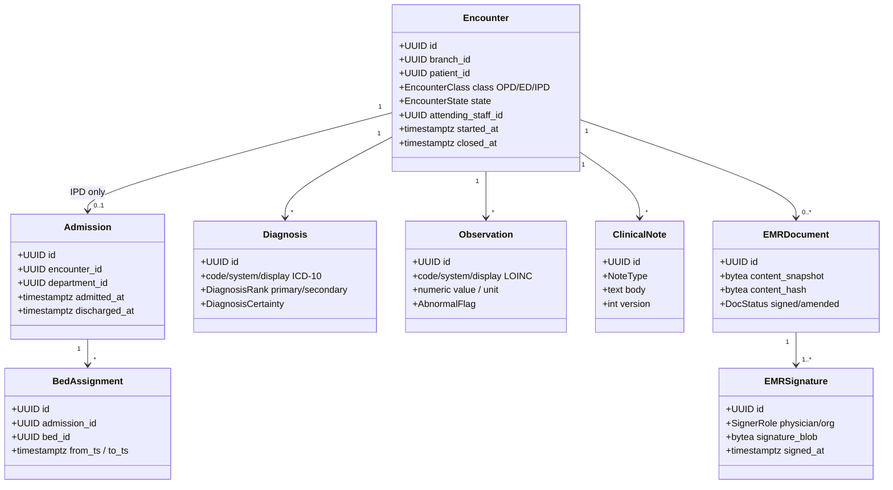
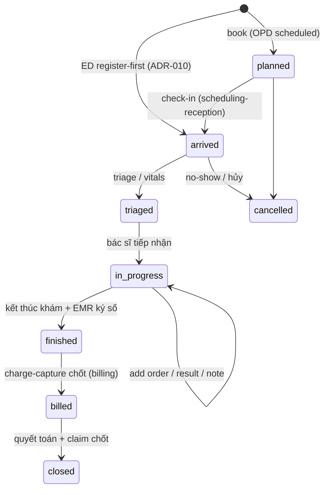

# 03 — Domain design: Encounter (mỏ neo lâm sàng) & Bệnh án điện tử ký số

> Thiết kế domain của bounded context **encounter (EMR core)** — mỏ neo lâm sàng và system-of-record của HMS: vòng đời Encounter (OPD/ED/IPD), vitals LOINC, chẩn đoán ICD-10 (QĐ 4469), clinical notes + history, và kết tinh **EMRDocument bất biến ký số PKI** (TT 13/2025). Neo vào **ADR-004** (Encounter anchor + EMR ký số), **ADR-005** (multi-tenancy branch_id + RLS), **ADR-008** (CDSS hard-stop), **ADR-010** (break-the-glass / ED), **ADR-015** (synchronous durability cho signed write).
>
> Liên quan: `doc/02-backend-architecture.md` (Clean+DDD+CQRS, outbox), `doc/04-orders-lab-pharmacy.md` (order/result treo vào Encounter), `doc/05-billing-insurance-bhyt.md` (charge↔claim↔encounter FK), `doc/06-identity-rbac-audit.md` (ABAC + audit-of-reads), `doc/08-database-schema.md` (bảng + RLS + versioning), `doc/13-adr.md`.

---

## 1. Vì sao Encounter là mỏ neo, không phải patient_id

Theo **ADR-004**, mọi sự kiện lâm sàng (vitals, chẩn đoán, order CLS, kết quả, đơn thuốc, charge) FK tới `encounter_id` — **KHÔNG** treo trực tiếp vào `patient_id`. Một Encounter mô hình hóa đúng một nghiệp vụ thực: **một lượt khám OPD/ED hoặc một đợt điều trị IPD**. Lợi ích:

- **Phản ánh nghiệp vụ**: bác sĩ làm việc theo "lượt khám", không theo "toàn bộ lịch sử bệnh nhân"; claim BHYT và charge cũng tính theo lượt.
- **Claim↔bill↔encounter nhất quán** (ADR-011): InsuranceClaim và Invoice đều FK về `encounter_id`, không thể lệch.
- **FHIR-mappable seam** (ADR-016): `Encounter` map thẳng FHIR `Encounter`; mọi resource lâm sàng tham chiếu nó. Foundation rẻ bake-in MVP, FHIR facade Phase 2.

BC `encounter` dùng arch-style **clean+ddd+cqrs** (canon §4) vì có vòng đời thật, invariant phức tạp và bất biến pháp lý — không phải CRUD. Bảng sở hữu: `encounters, admissions, bed_assignments, diagnoses, observations, clinical_notes, clinical_notes_history, emr_documents, emr_signatures`.

---

## 2. Aggregates & quan hệ



**Aggregate roots** (consistency boundary của riêng nó): `Encounter` (chứa Diagnosis/Observation/ClinicalNote như entity con cùng tx), `Admission` (IPD, chứa BedAssignment), `EMRDocument` (chứa EMRSignature). Cross-aggregate chỉ qua `encounter_id` reference + domain event qua outbox (ADR-012) — KHÔNG import chéo aggregate trong cùng tx ngoài root.

---

## 3. Encounter state machine (OPD / ED / IPD)



Trạng thái chốt: `planned → arrived → triaged → in-progress → finished → billed → closed` (ADR-004). Phân loại bằng `class ∈ {OPD, ED, IPD}`.

| Class | Lối vào | Khác biệt vòng đời |
|---|---|---|
| **OPD** *(MVP)* | `planned` (có appointment) hoặc `arrived` (walk-in lấy số thứ tự) | Không Admission; `finished` ngay sau khám; là khoa của MVP. |
| **ED** *(MVP, register-first)* | `arrived` trực tiếp, **identify-later** (ADR-010): tạo Encounter không cần appointment, `patient_id` có thể là MPI tạm chưa-định-danh, merge sau. | Cho phép order/dispense trong break-the-glass scope; MPI merge cập nhật `patient_id` qua MergeLink. |
| **IPD** *(Phase 2)* | `arrived → admitted` sinh `Admission` con + `BedAssignment` | ADT + bed board + MAR; nhiều ngày, nhiều `BedAssignment`. Cần device fleet (risk medium). |

**Invariants state machine** (enforce trong `Encounter` aggregate, Go domain):

- Transition chỉ theo cạnh hợp lệ; mọi transition trái phép trả `ErrInvalidEncounterTransition` (422), KHÔNG mutate.
- Chỉ chuyển `in-progress → finished` khi đã có **≥1 Diagnosis primary** và **EMRDocument đã ký** (xem §6).
- `finished → billed` do event `EncounterFinished` kích hoạt charge-capture (billing BC, ADR-011) — encounter BC không tự tính tiền.
- ED `register-first`: cho phép tạo Encounter với `patient_id` trỏ MPI provisional; invariant "không đóng (`closed`) khi MPI chưa confirm".

```go
// internal/encounter/domain/encounter.go (planned)
// Bất biến: state machine thuần, KHÔNG mutate — trả Encounter mới (coding-style immutability).
func (e Encounter) Finish(now time.Time) (Encounter, []DomainEvent, error) {
    if e.State != StateInProgress {
        return e, nil, ErrInvalidEncounterTransition{From: e.State, To: StateFinished}
    }
    if !e.hasPrimaryDiagnosis() {
        return e, nil, ErrPrimaryDiagnosisRequired
    }
    if !e.hasSignedEMR() {
        return e, nil, ErrEMRNotSigned // ADR-004: ký số trước khi finish
    }
    next := e // copy
    next.State, next.ClosedAt = StateFinished, &now
    return next, []DomainEvent{EncounterFinished{EncounterID: e.ID, BranchID: e.BranchID}}, nil
}
```

---

## 4. Diagnosis (ICD-10 QĐ 4469) & Observation/Vitals (LOINC)

Mọi field lâm sàng mang **triplet `(code, system, display)`** (ADR-016) — foundation interop bake-in MVP, làm Phase 2 FHIR rẻ. `terminology_concepts` (catalog dùng chung, do patient BC sở hữu) seed từ danh mục dùng chung BYT.

**Diagnosis** *(MVP)*:

| Trường | Ghi chú |
|---|---|
| `code` / `system='ICD-10'` / `display` | Mã chương/mục theo **QĐ 4469** (BYT); `system` cố định `ICD-10`. |
| `rank` | `primary` (bắt buộc ≥1 để `finish`) / `secondary`. |
| `certainty` | `confirmed` / `provisional` / `differential`. |
| `present_on_admission` | dùng cho IPD (Phase 2). |

**Observation / Vitals** *(MVP)* — mã hóa **LOINC** (ADR-004, §4 brief):

| Vital | LOINC | Unit |
|---|---|---|
| Mạch (HR) | `8867-4` | /min |
| Huyết áp tâm thu | `8480-6` | mmHg |
| Huyết áp tâm trương | `8462-4` | mmHg |
| Nhiệt độ | `8310-5` | °C |
| Nhịp thở | `9279-1` | /min |
| SpO₂ | `59408-5` | % |
| Cân nặng | `29463-7` | kg |

`Observation` có `value` (NUMERIC) + `unit` + `abnormal_flag` (so reference range). Critical/abnormal vitals và **PatientAllergy** (patient BC) là input cho **CDSS hard-stop** ở order/dispense (ADR-008): trạng thái dị ứng `unknown` ≠ `safe` — không bao giờ render là an toàn. Encounter BC chỉ cung cấp dữ liệu; enforcement nằm ở orders/pharmacy aggregate (xem `doc/04`).

---

## 5. Clinical notes + history versioning

`ClinicalNote` (bệnh sử / khám / diễn biến / tờ điều trị số hóa) là entity con của Encounter, có `version` tăng dần. **Trước khi EMR ký**, note được sửa **bằng versioning append-only** chứ KHÔNG update tại chỗ (coding-style: immutability):

- Mỗi lần sửa: ghi bản hiện tại vào `clinical_notes_history` (giữ `version` cũ + `valid_to`), rồi viết bản mới vào `clinical_notes` (`version+1`).
- `clinical_notes_history` có RLS + INSERT-only; không bao giờ DELETE.
- Sau khi Encounter `finished` và EMR ký: note thuộc EMRDocument bất biến → mọi thay đổi chỉ qua **addendum/amendment** (xem §6), KHÔNG sửa note gốc.

Đây là cơ chế `signed→addendum + *_history` chốt ở ADR-004.

---

## 6. EMRDocument bất biến ký số PKI (TT 13/2025)

```mermaid
sequenceDiagram
    participant BS as Bác sĩ (FE)
    participant App as encounter/app (command)
    participant Sign as signing service (PKI)
    participant DB as Postgres (sync durable)
    participant OB as outbox

    BS->>App: SignEMR(encounter_id)
    App->>App: render snapshot (notes+dx+obs) → bytes
    App->>App: content_hash = SHA-256(snapshot)
    App->>Sign: sign(content_hash) [chữ ký BS + tổ chức]
    Sign-->>App: signature_blob (PKI)
    App->>DB: BEGIN; INSERT emr_documents(status=signed, hash, snapshot)
    App->>DB: INSERT emr_signatures(physician, org, blob, signed_at)
    App->>OB: INSERT outbox(EMRSigned)
    App->>DB: COMMIT (synchronous durability — ADR-015)
    DB-->>App: confirmed
    App-->>BS: "đã ký" (CHỈ sau commit confirmed)
```

**Cơ chế (ADR-004 + ADR-015 + ADR-022)**:

1. Khi bác sĩ kết thúc khám, encounter BC **kết tinh snapshot** bất biến từ Diagnosis + Observation + ClinicalNote hiện hành → `content_snapshot` (bytes, định dạng cố định để tái dựng + so hash).
2. Tính `content_hash = SHA-256(snapshot)`. Ký số PKI **hai chữ ký**: bác sĩ chịu trách nhiệm + chữ ký tổ chức (TT 13/2025). `signature_blob`, `signed_by`, `signed_at` là trường first-class từ đầu.
3. **Synchronous durability bắt buộc** (ADR-015): commit phải `confirmed` (không async, không best-effort) **trước khi** UI báo `"đã ký"`. Platform RPO≤5min KHÔNG đủ cho record pháp lý — signed-EMR write path tách durability riêng, phải survive PITR restore.
4. Sau ký: `emr_documents.status='signed'`, immutable. Sửa = **amendment-only**: tạo `EMRDocument` mới `status='amended'` liên kết bản gốc + lý do sửa, ký lại; bản gốc KHÔNG bao giờ mutate/delete.

```sql
-- backend/migrations/0000NN_encounter.up.sql (planned) — emr_documents bất biến
CREATE TABLE emr_documents (
  id               uuid PRIMARY KEY DEFAULT uuidv7(),
  branch_id        uuid NOT NULL,
  encounter_id     uuid NOT NULL REFERENCES encounters(id),
  status           text NOT NULL CHECK (status IN ('signed','amended')),
  amends_id        uuid REFERENCES emr_documents(id), -- addendum trỏ bản gốc
  content_snapshot bytea NOT NULL,
  content_hash     bytea NOT NULL,        -- SHA-256(snapshot)
  created_at       timestamptz NOT NULL DEFAULT now()
);
ALTER TABLE emr_documents ENABLE ROW LEVEL SECURITY;
ALTER TABLE emr_documents FORCE ROW LEVEL SECURITY; -- ADR-003 keystone
-- INSERT-only: chặn UPDATE/DELETE kể cả app-role (bất biến pháp lý)
CREATE POLICY emr_no_mutate ON emr_documents
  FOR UPDATE USING (false);
CREATE POLICY emr_no_delete ON emr_documents
  FOR DELETE USING (false);
CREATE POLICY emr_branch ON emr_documents
  USING      (branch_id = current_setting('app.current_branch')::uuid)
  WITH CHECK (branch_id = current_setting('app.current_branch')::uuid);
```

> **Lưu ý pháp lý**: TT 13/2025 (hạn 30/9/2025) bắt buộc EMR ký số cho bệnh viện đã cấp phép → đây là **remediation-of-non-compliance**, KHÔNG deferrable (ADR-004, risk critical §8). MVP scope: kết tinh + ký + amendment-only; signing service backend (PDF ký số) cũng phục vụ in phiếu pháp lý (đơn thuốc QR, giấy ra viện) theo ADR-022.

---

## 7. Domain events (qua transactional outbox in-process)

Theo **ADR-012**: event viết vào bảng `outbox` trong **cùng `pgx.Tx`** với state change; relay in-process `SELECT FOR UPDATE SKIP LOCKED`, subscriber idempotent qua `processed_events`. KHÔNG broker ngoài ở MVP.

| Event | Phát khi | Subscriber (downstream) |
|---|---|---|
| `EncounterArrived` | check-in / ED register | scheduling-reception, audit |
| `EncounterDiagnosed` | thêm/đổi Diagnosis primary | insurance (chuẩn bị mapping XML 4750), analytics |
| `EncounterFinished` | `in-progress → finished` | billing (charge-capture idempotent — ADR-011) |
| `EMRSigned` | ký EMRDocument thành công | audit (state-change), interop (FHIR seam Phase 2), insurance |
| `EncounterClosed` | quyết toán + claim chốt | analytics, reporting |
| `AdmissionRecorded` *(Phase 2)* | tạo Admission IPD | bed board, MAR |

`EMRSigned` / `EncounterFinished` là driver chính: charge + claim + interop đều bắt nguồn từ Encounter (ADR-004 "drives charge + claim + interop"). Audit-of-reads (đọc PHI Encounter) commit-with-response fail-closed riêng (ADR-009) — không qua outbox cho path READ.

---

## 8. Multi-tenancy, audit & code path

- **RLS keystone (ADR-003/005)**: mọi bảng encounter có `branch_id NOT NULL` + `ENABLE + FORCE ROW LEVEL SECURITY`, policy `USING` **và** `WITH CHECK` theo `current_setting('app.current_branch')`. `branch_id` lấy từ JWT đã verify (Go middleware `SET LOCAL` trong tx — ADR-013), KHÔNG từ client. Resource khác branch trả **404** (không 403). Mọi PHI query PHẢI chạy trong tx đã `SET LOCAL` GUC (risk critical: pgx pool reuse connection).
- **Audit (ADR-009)**: đọc bất kỳ record Encounter/EMR ghi `data_access_log` commit-with-response fail-closed (không trả PHI nếu audit fail); thao tác `print`/`export` EMR cũng audit.
- **ABAC object-level (ADR-013)**: "bác sĩ này được xem Encounter này không" enforce trong Go (role + branch + quan hệ điều trị + minimum-necessary) — Kong KHÔNG quyết. Break-the-glass (ADR-010) cho ED access + creation, time-boxed + scoped tới encounter + reviewer SLA.

**Code path mục tiêu** *(planned — ADR-001 layout)*:

```
internal/encounter/
├── domain/       encounter.go (state machine), diagnosis.go, observation.go,
│                 clinical_note.go, emr_document.go (bất biến, hash), events.go
├── app/
│   ├── command/  start_encounter.go, record_vitals.go, add_diagnosis.go,
│   │             write_note.go, sign_emr.go, finish_encounter.go, amend_emr.go
│   └── query/    get_encounter.go, list_encounters.go, get_emr_document.go
├── ports/        repository.go, signing_service.go, terminology_lookup.go, event_publisher.go
└── adapters/     postgres/ (repo + outbox INSERT cùng tx, sqlc), http/ (Gin handlers),
                  pki/ (signing service adapter)
```

Layer rule (ADR-001, một chiều bất khả xâm phạm): `adapters → ports ← app → domain`; `domain/` chỉ import stdlib; cross-BC chỉ qua outbox, KHÔNG import chéo BC (depguard golangci-lint).

---

## 9. Testing invariants (ADR-025)

| Invariant | Loại test | Công cụ |
|---|---|---|
| State machine transition hợp lệ/trái phép | unit table-driven (domain thuần) | `go test` |
| `finish` chặn khi thiếu primary Dx / chưa ký EMR | unit | `go test` |
| RLS: Encounter branch-B vô hình dưới `app.current_branch=A` | integration **(merge-blocking)** | testcontainers real PG |
| EMRDocument INSERT-only (UPDATE/DELETE bị chặn kể cả app-role) | integration | testcontainers |
| Outbox `EMRSigned` viết cùng tx, idempotent replay | integration | testcontainers |
| Signed-EMR durable + hash-chain survive PITR restore | restore drill | ephemeral namespace (ADR-015) |
| E2E: check-in → vitals → Dx → ký EMR → finished | E2E critical flow | Playwright qua Kong BFF |

Coverage ≥80% (testing rule); RLS branch-isolation test là **merge-blocking gate** (ADR-003).

---

## 10. Tóm tắt quyết định

- Encounter là **mỏ neo lâm sàng duy nhất** — mọi dữ liệu FK `encounter_id`, KHÔNG `patient_id` trực tiếp (ADR-004).
- State machine `planned→arrived→triaged→in-progress→finished→billed→closed`; OPD *(MVP)*, ED register-first *(MVP)*, IPD *(Phase 2)*.
- Diagnosis ICD-10 (QĐ 4469) + Observation LOINC, triplet `(code,system,display)` bake-in cho interop Phase 2.
- ClinicalNote versioning append-only trước ký; sau ký → amendment-only + `*_history`.
- EMRDocument **bất biến ký số PKI** (TT 13/2025), synchronous durability (ADR-015), INSERT-only RLS keystone (ADR-003), survive PITR.
- Cross-BC qua outbox in-process (ADR-012); audit-of-reads fail-closed (ADR-009); ABAC + break-the-glass (ADR-010/013).
