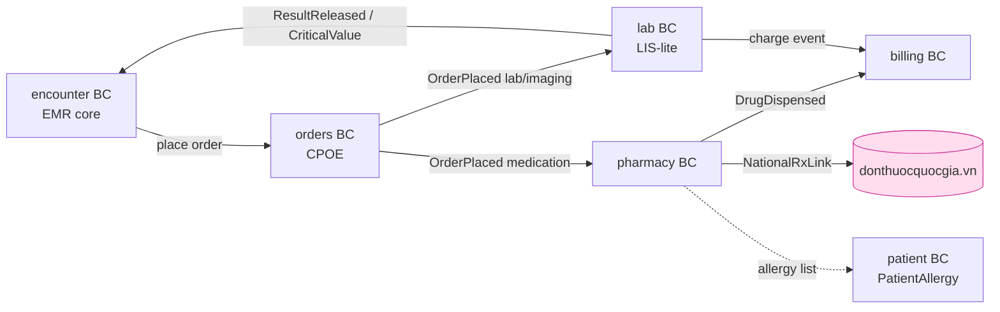
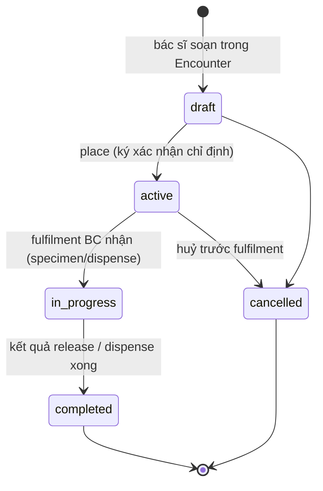
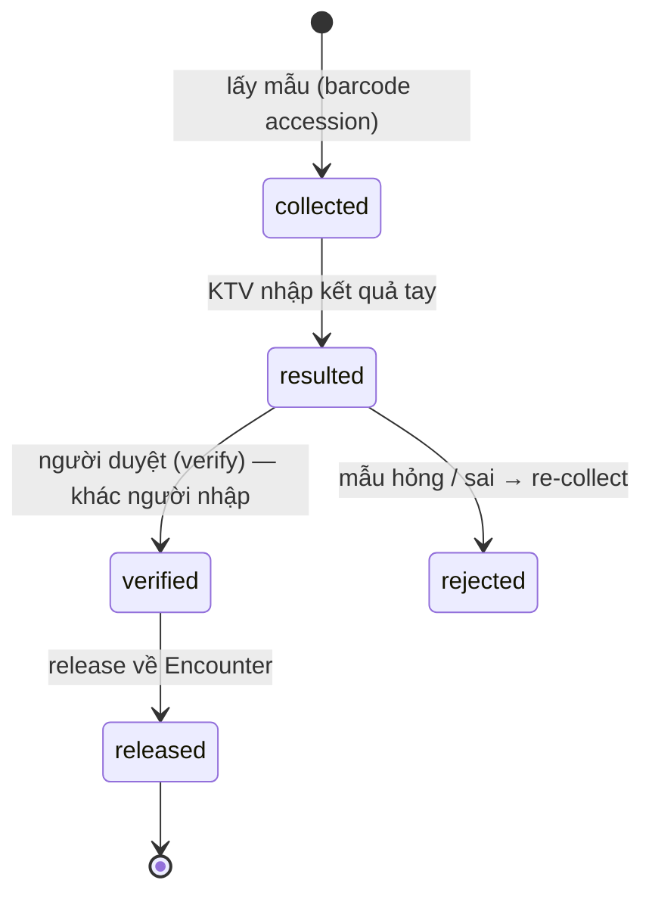
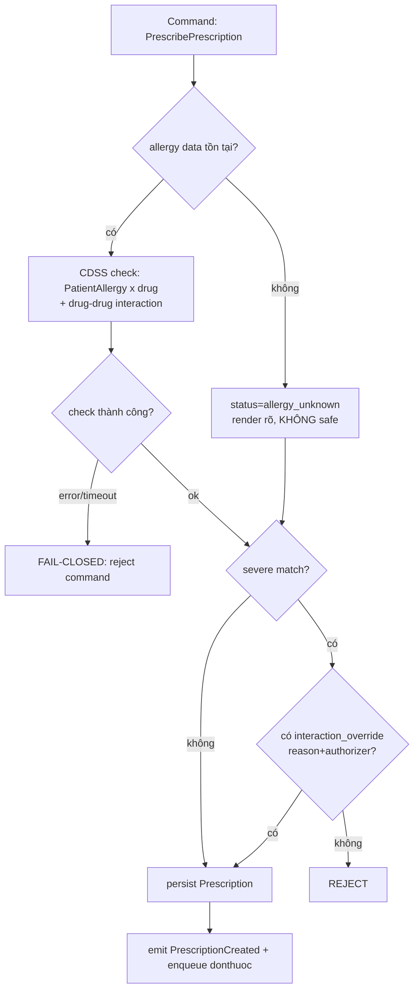

# 04 — Orders (CPOE) · Lab (LIS-lite) · Pharmacy

> Thiết kế domain ba bounded context CLS & dược của HMS: **orders** (CPOE state machine), **lab** (specimen→result→verify→critical-value), **pharmacy** (e-prescription + CDSS hard-stop fail-closed + FEFO lô/hạn + liên thông donthuocquocgia.vn).
> Liên quan: [02-backend-architecture.md](./02-backend-architecture.md) (Clean+DDD+CQRS, outbox, River) · [03-clinical-encounter-emr.md](./03-clinical-encounter-emr.md) (Encounter anchor) · [05-billing-insurance-bhyt.md](./05-billing-insurance-bhyt.md) (charge-capture từ order/dispense) · [06-identity-rbac-audit.md](./06-identity-rbac-audit.md) (override audit, break-the-glass) · [08-database-schema.md](./08-database-schema.md) (RLS, stock_ledger).
> ADR neo: **ADR-004** (Encounter anchor), **ADR-007** (donthuoc MVP), **ADR-008** (CDSS hard-stop fail-closed), **ADR-011** (charge-capture idempotent), **ADR-012** (outbox/River), **ADR-021** (FEFO + stock_ledger append-only), **ADR-024** (migrations), **ADR-025** (testcontainers test).

Ba BC này đều là `clean+ddd+cqrs` (canon §4). Mọi sự kiện FK tới `encounter_id` chứ KHÔNG `patient_id` trực tiếp (ADR-004). Cross-BC chỉ qua **domain event + transactional outbox in-process** (SELECT FOR UPDATE SKIP LOCKED) — KHÔNG import chéo BC, KHÔNG broker ngoài ở MVP (ADR-012). Code path bên dưới đánh dấu *(planned)* — repo chưa có code.

---

## 1. Bản đồ ba BC & dòng chảy *(MVP)*



Quy tắc đường đi (bất biến): `orders` là "thần kinh trung ương" nối phòng khám với CLS — nó route order tới `lab`/`pharmacy` qua outbox, KHÔNG gọi trực tiếp. `lab`/`pharmacy` trả kết quả về `encounter` qua outbox event. Charge sinh từ order/dispense (ADR-011) chảy sang `billing` qua outbox với `Idempotency-Key`.

| BC | Bảng sở hữu (canon §4) | Aggregates | Sync/Async |
|----|------------------------|------------|------------|
| orders | `service_orders`, `order_items`, `order_status_history` | ServiceOrder(lab/imaging/medication), OrderItem | sync place; async fulfilment routing via outbox |
| lab | `specimens`, `lab_results`, `lab_reference_ranges` | Specimen, LabResult, ResultPanel | sync entry; emits ResultReleased/CriticalValue via outbox |
| pharmacy | `drugs`, `prescriptions`, `prescription_items`, `medication_dispenses`, `medication_lots`, `national_rx_links`, `interaction_overrides` | Prescription, MedicationDispense, MedicationLot, DrugInteractionCheck, NationalRxLink | sync dispense (hard-online); donthuoc qua outbox/River; emits DrugDispensed |

---

## 2. orders BC — CPOE ServiceOrder lifecycle *(MVP)*

ServiceOrder mô hình theo FHIR `ServiceRequest` lifecycle (seam ánh xạ FHIR, ADR-016) — bake-in cột `(code,system,display)` triplet cho mỗi `order_item` (mã DVKT/LOINC). State machine:



Invariant domain (enforce trong aggregate, KHÔNG ở handler):
- Chỉ `draft` mới sửa được `order_items`; `active`→ immutable, huỷ phải tạo lý do (ghi `order_status_history`).
- `place` yêu cầu `encounter.state ∈ {in-progress}` (ADR-004) và order phải FK `encounter_id` hợp lệ.
- Mỗi chuyển trạng thái append một dòng `order_status_history(order_id, from_state, to_state, actor_id, reason, occurred_at)` — KHÔNG mutate (immutability, coding-style).

Khi `place`, trong cùng `pgx.Tx`: ghi `service_orders` + `order_items` + outbox event `OrderPlaced{order_type}`. Relay in-process route:
- `order_type=lab|imaging` → consumer trong `lab` tạo `Specimen` (accession).
- `order_type=medication` → KHÔNG đi pharmacy tự động; đơn thuốc là aggregate riêng `Prescription` do bác sĩ kê (xem §4) vì cần CDSS hard-stop trước khi tồn tại — order medication MVP chủ yếu nội trú/y lệnh, OPD kê đơn đi thẳng pharmacy.

Code path *(planned)*: `backend/internal/orders/domain/service_order.go`, `backend/internal/orders/app/command/place_order.go`, `backend/internal/orders/adapters/pg/order_repo.go`.

```go
// backend/internal/orders/domain/service_order.go (planned)
func (o *ServiceOrder) Place(actor StaffID, now time.Time) error {
	if o.state != OrderDraft {
		return ErrOrderNotDraft // chỉ draft -> active
	}
	if len(o.items) == 0 {
		return ErrOrderEmpty
	}
	o.transition(OrderDraft, OrderActive, actor, "place", now) // append history
	o.raise(OrderPlaced{OrderID: o.id, EncounterID: o.encounterID, OrderType: o.orderType})
	return nil
}
```

---

## 3. lab BC — specimen → result → verify → critical-value *(MVP)*

MVP-thin (canon §4): nhập kết quả **tay** + validation; interface máy phân tích là Phase 2 qua OIE HL7v2 (ADR-016). Vòng đời:



- **Specimen/accession**: mỗi specimen có barcode (HID scanner, html5-qrcode ở FE — ADR-018). `specimens(id, order_id, accession_no, collected_at, status)`.
- **Result entry + validation**: `lab_results(id, specimen_id, analyte_code, system, display, value_num, value_text, unit, ref_low, ref_high, abnormal_flag, critical)`. Ref range tra `lab_reference_ranges` theo analyte + giới + tuổi. Triplet `(code,system,display)` cho analyte (LOINC) là hard requirement (ADR-016).
- **Verify**: nguyên tắc four-eyes — `verified_by ≠ resulted_by` (invariant domain, có test). Chỉ `verified` mới `released`.
- **Critical-value flag**: nếu `value_num` vượt ngưỡng critical (cấu hình theo analyte), set `critical=true` → emit `CriticalValue` event. Đây là **input cho CDSS/clinical alert** chứ không tự động hành động lâm sàng.

Khi `release` (trong cùng tx): cập nhật `lab_results.status`, emit `ResultReleased{encounter_id, panel}` (về encounter để bác sĩ duyệt) + charge event sang billing (ADR-011). Nếu `critical=true` emit thêm `CriticalValue{encounter_id, analyte, value}`.

Code path *(planned)*: `backend/internal/lab/app/command/enter_result.go`, `.../verify_result.go`, `.../release_result.go`; `backend/internal/lab/domain/lab_result.go`.

---

## 4. pharmacy BC — e-prescription + CDSS hard-stop *(MVP)*

### 4.1 Prescription aggregate & CDSS hard-stop fail-closed (ADR-008)

CDSS dị ứng/tương tác là **hard-stop enforce ở backend aggregate** — React modal CHỈ là UX, KHÔNG phải control (bypassable qua devtools/API). Ba quy tắc fail-closed bất di:

1. **Reject-by-default**: command kê đơn/dispense bị reject nếu có severe interaction/allergy match, TRỪ KHI tồn tại `interaction_override` record (reason + authorizer) ghi audit.
2. **Fail-closed khi CDSS lỗi/timeout**: KHÔNG BAO GIỜ confirm "no known interaction" khi check error → reject command, hiển thị "không kiểm tra được, không cấp phát".
3. **Allergy-unknown ≠ safe**: bệnh nhân không có allergy data → trạng thái `allergy_status = unknown` tách bạch, render rõ ràng, KHÔNG render là "safe" (canon §8 critical risk).



```go
// backend/internal/pharmacy/domain/prescription.go (planned)
func (p *Prescription) Approve(check CdssResult, ov *InteractionOverride) error {
	if check.Status == CdssError || check.Status == CdssTimeout {
		return ErrCdssUnavailable // FAIL-CLOSED: không bao giờ pass khi check fail
	}
	for _, alert := range check.SevereAlerts {
		if ov == nil || !ov.Covers(alert.Code) {
			return ErrHardStop{Alert: alert} // reject trừ khi override hợp lệ
		}
	}
	p.allergyStatus = check.AllergyStatus // unknown != safe, giữ tách bạch
	p.state = RxApproved
	p.raise(PrescriptionCreated{...})
	return nil
}
```

Override (`interaction_overrides`) luôn ghi `audit_log` (action=override) với reason + authorizer (ADR-008, ADR-009). CDSS đọc `PatientAllergy` từ patient BC (qua port read-model, KHÔNG import chéo) + interaction rules từ `terminology_concepts` (RxNorm/DMDC, patient BC catalog).

Code path *(planned)*: `backend/internal/pharmacy/domain/prescription.go`, `.../domain/cdss.go`, `backend/internal/pharmacy/app/command/approve_prescription.go`, `backend/internal/pharmacy/ports/cdss_port.go`.

### 4.2 Liên thông donthuocquocgia.vn (ADR-007, TT 26/2025 + QĐ 808) *(MVP)*

Đơn ngoại trú đẩy LIVE lên `donthuocquocgia.vn` **ngay sau khám**: dùng app-name/app-key + mã liên-thông cơ sở + mã liên-thông bác sĩ (organization BC `facility_external_codes`), lưu **mã đơn quốc gia** (semantics C/N/H/Y) vào `national_rx_links`. Đẩy qua **outbox + River retry idempotent** (KHÔNG đồng bộ chặn bác sĩ).

| Bước | Cơ chế | Degraded-mode |
|------|--------|---------------|
| Approve prescription | sync, trong tx | — |
| Submit national | outbox event → River job `donthuoc_submit` | national down → retry idempotent (dedupe trên rx reference) |
| Nhận mã đơn | cập nhật `national_rx_links.national_code` | UI "đã lưu, chờ gửi cổng" |
| Print đơn | server-PDF có **QR/mã đơn quốc gia + block chữ ký số** (ADR-022) | in tạm chỉ khi có mã, nếu chưa có → đánh dấu pending |

In đơn giấy KHÔNG có mã quốc gia = digitization giả (ADR-007). Print template theo TT 27/26-2025.

Code path *(planned)*: `backend/internal/pharmacy/adapters/donthuoc/client.go`, `backend/cmd/worker/` (River job `donthuoc_submit`), `backend/internal/pharmacy/ports/national_rx_port.go`.

### 4.3 FEFO dispense + stock_ledger append-only (ADR-021) *(MVP)*

Cấp phát (`MedicationDispense`) là **hard-online** (ADR-018: hard-online gate cho dispense — KHÔNG PWA write-outbox). Chọn lô theo **FEFO** (First-Expired-First-Out) trong tx với `FOR UPDATE SKIP LOCKED` để tránh hai dược sĩ khoá cùng lô:

```sql
-- chọn lô FEFO, khoá hàng tránh double-dispense (ADR-021) (planned)
SELECT id, lot_no, expiry_date, qty_available
FROM medication_lots
WHERE drug_id = $1 AND branch_id = current_setting('app.current_branch')::uuid
  AND qty_available > 0 AND expiry_date >= current_date
ORDER BY expiry_date ASC          -- FEFO: cận hạn xuất trước
FOR UPDATE SKIP LOCKED;
```

Mỗi lần xuất ghi một dòng `stock_ledger` **append-only** (BIGINT IDENTITY, KHÔNG mutate balance tại chỗ):

```sql
-- stock_ledger: append-only audit trail kho (ADR-021) (planned)
INSERT INTO stock_ledger (branch_id, drug_id, lot_id, movement_type, qty_delta, balance_after, ref_dispense_id, occurred_at)
VALUES ($branch, $drug, $lot, 'dispense', -$qty, $balance_after, $dispense_id, now());
```

`stock_ledger` dùng chung pharmacy + inventory BC (canon §4, ADR-021). `balance_after` tính trong tx sau khi khoá lô. River sweep job (`fefo_sweep`) cảnh báo lô cận hạn → emit `StockExpiring` (canon §4 pharmacy "emits charge + StockExpiring").

Sau dispense (cùng tx): ghi `medication_dispenses`, cập nhật `qty_available`, emit `DrugDispensed` (→ billing charge ADR-011) + ghi `stock_ledger`.

Code path *(planned)*: `backend/internal/pharmacy/app/command/dispense_medication.go`, `backend/internal/pharmacy/domain/fefo.go`, `backend/internal/pharmacy/adapters/pg/lot_repo.go`, `backend/cmd/worker/` (River `fefo_sweep`).

---

## 5. Outbox events ba BC phát ra *(MVP)*

| Event | BC phát | Consumer | Hệ quả |
|-------|---------|----------|--------|
| `OrderPlaced` | orders | lab (specimen) / (pharmacy nội trú) | tạo fulfilment |
| `ResultReleased` | lab | encounter | bác sĩ duyệt kết quả; charge event → billing |
| `CriticalValue` | lab | encounter (clinical alert) | flag critical, hiển thị nổi bật |
| `PrescriptionCreated` | pharmacy | River `donthuoc_submit` | đẩy national, charge khi dispense |
| `DrugDispensed` | pharmacy | billing | charge-capture idempotent (ADR-011) |
| `StockExpiring` | pharmacy | (UI cảnh báo / inventory Phase 2) | cảnh báo cận hạn |

Mọi event đi outbox in-process (SELECT FOR UPDATE SKIP LOCKED), subscriber idempotent qua `processed_events` (ADR-012). Charge/dispense idempotency-key end-to-end với FE (ADR-011, canon §8) — chống double-post khi replay.

---

## 6. Ràng buộc RLS, encryption & migrations *(MVP)*

- **RLS**: mọi bảng PHI ở ba BC (`service_orders`, `specimens`, `lab_results`, `prescriptions`, `medication_dispenses`, `medication_lots`, `stock_ledger`...) có `branch_id NOT NULL` + `ENABLE`+`FORCE ROW LEVEL SECURITY`, policy `USING & WITH CHECK (branch_id = current_setting('app.current_branch')::uuid)` (ADR-003, ADR-005). Mọi query chạy trong tx đã `SET LOCAL` GUC (canon §8 critical — pgx pool reuse connection).
- **Encryption**: ba BC này KHÔNG sở hữu cột siêu nhạy cần envelope encryption (CCCD/thẻ BHYT/HIV ở patient BC); chỉ tham chiếu `patient_id`/`encounter_id`. KHÔNG lưu plaintext định danh (ADR-014).
- **Migrations**: golang-migrate, schema theo phase — chỉ migrate ba BC này khi build Phase 1 (sau Phase-0 000001 RLS keystone, ADR-024). `stock_ledger`/outbox dùng BIGINT IDENTITY (canon §3 datastore).

---

## 7. Testing — invariant phải test against real Postgres (ADR-025) *(MVP)*

Theo testing rule (≥80% coverage) + ADR-025, các invariant KHÔNG mock được, phải test qua **testcontainers-go** với Postgres thật:

- **FEFO**: hai dispense đồng thời không khoá cùng lô (`FOR UPDATE SKIP LOCKED`), lô cận hạn xuất trước.
- **CDSS fail-closed**: CDSS timeout/error → command bị reject (KHÔNG pass); allergy-unknown KHÔNG render safe; override hợp lệ mới qua được hard-stop (E2E cho cả hai failure mode, canon §8).
- **stock_ledger append-only**: policy chặn UPDATE/DELETE; `balance_after` nhất quán sau N movement.
- **Idempotency**: replay `DrugDispensed` không double-charge (unique-constraint idempotency).
- **RLS branch-isolation**: order/result/prescription branch-B vô hình dưới `app.current_branch=A` (merge-blocking gate, ADR-003).
- **Contract test** `donthuoc` client (ADR-025): card semantics C/N/H/Y, retry idempotent khi national down.
- **E2E critical flow** (ADR-025): OPD order với CDSS hard-stop → dispense FEFO → charge.

Đề xuất luyện: `ecc:go-test` (table-driven + testcontainers), `ecc:go-review`, `ecc:security-review` (CDSS fail-closed, RLS).
