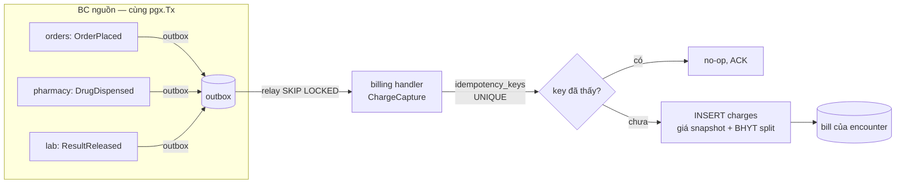
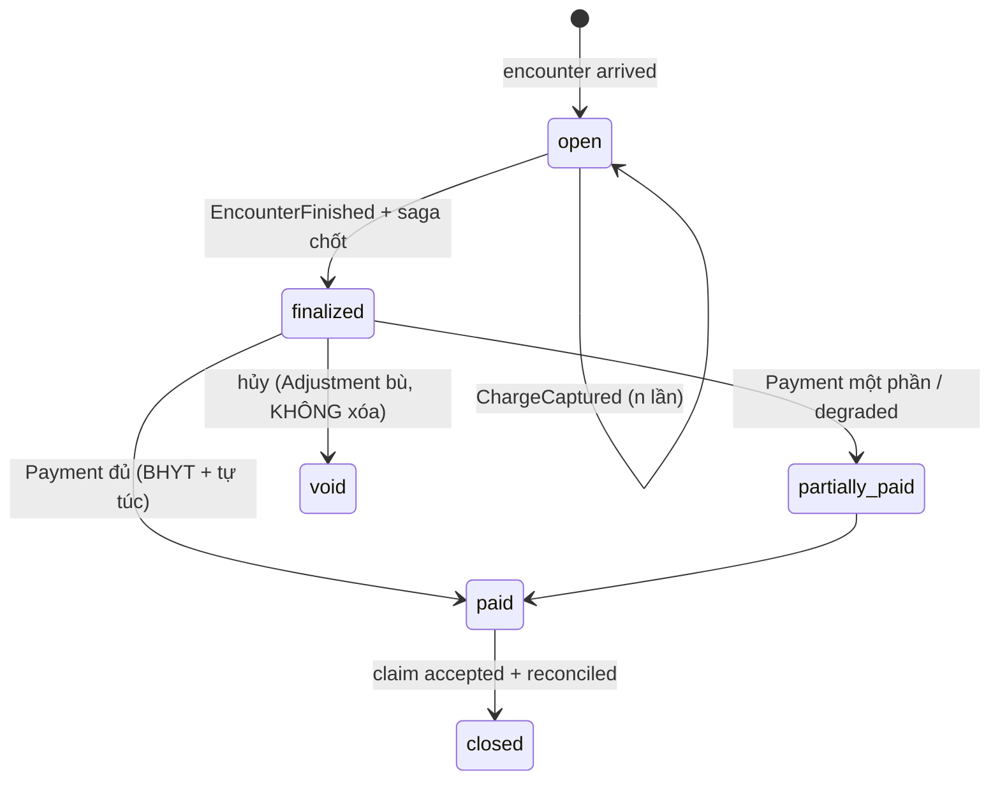
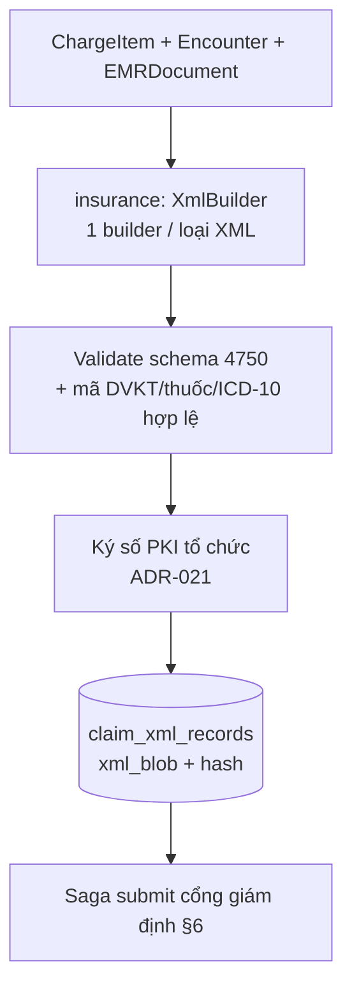
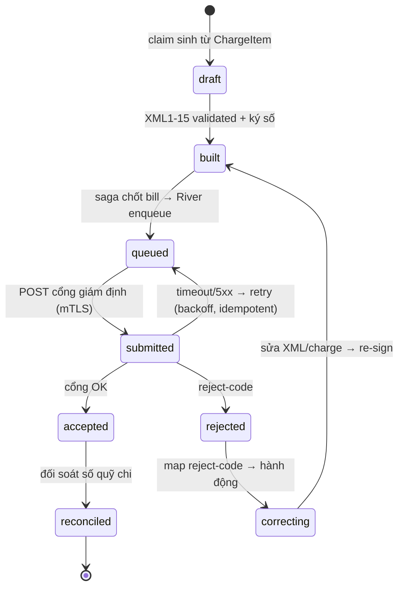

# 05 — Domain design: Viện phí (Billing) & Giám định BHYT (Insurance)

> Thiết kế domain cho hai bounded context tiền-bạc-pháp-lý của HMS: **billing** (charge-capture idempotent, Invoice của Encounter, payment/adjustment append-only, saga quyết toán) và **insurance** (sinh bộ XML1–XML15 theo QĐ 4750, claim↔bill↔encounter FK, đẩy cổng giám định BHYT qua saga + idempotency + retry, rejection-code state machine). Đây là *highest-consistency path* của hệ thống.
>
> Liên quan: [02-backend-architecture.md](./02-backend-architecture.md) (outbox, layer rule), [03-clinical-encounter-emr.md](./03-clinical-encounter-emr.md) (Encounter anchor), [04-orders-lab-pharmacy.md](./04-orders-lab-pharmacy.md) (nguồn charge từ order/dispense), [08-database-schema.md](./08-database-schema.md) (RLS, bảng), [09-security.md](./09-security.md) (mTLS BHYT, PCI scope), [13-adr.md](./13-adr.md).
>
> Neo quyết định: **ADR-011** (charge-capture idempotent + claim↔bill↔encounter + saga), **ADR-006** (BHYT two-touch + degraded-mode), **ADR-021** (tránh PCI scope, BHYT mTLS + ký số), **ADR-023** (BHXH sandbox + rejection-code là Phase-0 blocker), **ADR-012** (outbox in-process + River), **ADR-003/005** (FORCE RLS + branch_id).

---

## 1. Phạm vi & ranh giới hai BC

| BC | Arch style | Trách nhiệm cốt lõi | Sở hữu bảng |
|----|-----------|--------------------|-------------|
| **billing** | `clean+ddd+cqrs` | Charge-capture idempotent từ order/dispense/dịch vụ → Invoice của Encounter (giá snapshot từ chargemaster), tách BHYT-chi-trả vs tự-túc, payment/adjustment/advance append-only, saga quyết toán ra viện, biên lai. | `charges`, `bills`, `payments`, `adjustments`, `advances`, `idempotency_keys` |
| **insurance** | `clean+ddd+cqrs` | Sinh XML1–XML15 (QĐ 4750 sửa QĐ 3176, hiệu lực 01/01/2025) **từ chính ChargeItem**, ký số trước gửi, đẩy cổng giám định qua mTLS + saga + idempotency + retry, xử lý phản hồi/từ chối là state machine. | `insurance_claims`, `claim_xml_records`, `claim_responses`, `bhyt_submission_log` |

**Ranh giới rõ:** LIVE card-check tại tiếp đón (touch 1 của BHYT) **KHÔNG** thuộc insurance BC — do `scheduling-reception` gọi (bảng `bhyt_eligibility_checks`). Insurance BC chỉ lo touch 2 (XML giám định lúc quyết toán). Xem ADR-006. Cross-BC không import chéo — chỉ qua **domain event + transactional outbox in-process** (ADR-012).

*Tránh PCI scope (ADR-021):* thanh toán không-tiền-mặt qua cổng thứ ba (VNPay/Momo/napas) bằng redirect/tokenization. HMS **KHÔNG** chạm/lưu số thẻ thật — chỉ lưu `payment_token` + `gateway_txn_id`. Mọi field tiền dùng `NUMERIC(15,2)` + `CHAR(3)` currency (mặc định `VND`).

---

## 2. Charge-capture idempotent — từ event tới ChargeItem *(MVP)*

Mọi `OrderPlaced` / `DrugDispensed` / `ResultReleased` / dịch vụ khám sinh **ChargeItem tự động** vào Invoice (Bill) của Encounter, qua outbox, với **Idempotency-Key bền vững** chống double-post khi retry/replay (ADR-011). Giá **snapshot** từ `service_catalog` (chargemaster, organization BC) tại thời điểm capture — không tham chiếu live (giá có thể đổi).



**Idempotency end-to-end (open risk [high]):** FE offline-outbox key và backend charge/claim key PHẢI là **MỘT scheme**. MVP cắt PWA write-outbox (read-only cached + hard-online gate cho dispense/cashier — ADR-018) để giảm bề mặt; backend dùng `idempotency_keys(scope, key)` UNIQUE.

```go
// internal/billing/app/command/capture_charge.go (planned)
// Handler idempotent: processed_events + idempotency_keys trong CÙNG tx
func (h *ChargeCaptureHandler) Handle(ctx context.Context, evt OrderPlacedEvent) error {
    return h.tx.WithTx(ctx, func(q *db.Queries) error { // SET LOCAL app.current_branch đã chạy (RLS)
        if seen, _ := q.SeenIdempotencyKey(ctx, db.Scope("charge"), evt.IdempotencyKey); seen {
            return nil // ADR-011: replay-safe no-op
        }
        price := q.SnapshotPrice(ctx, evt.ServiceCode, evt.BranchID) // chargemaster snapshot
        split := bhyt.Split(price, evt.Coverage)                     // BHYT chi trả vs tự túc
        _ = q.InsertCharge(ctx, db.InsertChargeParams{
            EncounterID: evt.EncounterID, BillID: evt.BillID,
            Amount: price, BhytAmount: split.Insurer, SelfPay: split.Patient,
        })
        return q.MarkIdempotencyKey(ctx, db.Scope("charge"), evt.IdempotencyKey)
    })
}
```

**BHYT split** áp `bhyt_eligibility_checks` verdict (mức hưởng 80/95/100%, miễn/cùng chi-trả, trần thanh toán) — tách `bhyt_amount` (quỹ chi) vs `self_pay` (người bệnh) ngay tại capture để claim ↔ bill nhất quán về sau.

---

## 3. Aggregate Invoice/Bill — payment & adjustment append-only *(MVP)*



Bất biến (theo coding-style immutability + audit): **payments/adjustments INSERT-only** — sửa sai bằng `adjustment` bù trừ, không UPDATE/DELETE. `advances` (tạm ứng nội trú, Phase 2) treo vào encounter, saga ra viện giải phóng. Số dư là projection cộng dồn, không cột mutable.

| Bảng | Vai trò | Ghi chú |
|------|---------|---------|
| `bills` | Invoice 1-1 với Encounter | `branch_id`, `encounter_id` FK, `status`, totals projection |
| `charges` | ChargeItem (dòng phí) | giá snapshot, `bhyt_amount`/`self_pay`, FK `bill_id`+`encounter_id` |
| `payments` | thu (tiền mặt / token cổng) | append-only, `payment_token`+`gateway_txn_id` (ADR-021, ngoài PCI) |
| `adjustments` | miễn/giảm/bù sai | append-only, lý do + authorizer (audit) |
| `advances` | tạm ứng IPD *(Phase 2)* | giải phóng tại saga quyết toán |
| `idempotency_keys` | dedupe charge/payment/claim | `(scope,key)` UNIQUE — ADR-011 |

---

## 4. claim↔bill↔encounter linkage + InsuranceClaim từ ChargeItem *(MVP)*

ADR-011 đóng gap prior-analysis (claim không link bill). **InsuranceClaim sinh từ chính ChargeItem** của bill → claim & bill nhất quán theo construction; giữ **FK cứng** `insurance_claims.bill_id` → `bills.id` (1-1) và `bills.encounter_id` → `encounters.id`.

```sql
-- migrations/0000NN_insurance.up.sql (planned) — FK cứng + RLS (ADR-003/005)
CREATE TABLE insurance_claims (
  id            UUID PRIMARY KEY DEFAULT uuidv7(),
  branch_id     UUID NOT NULL,
  encounter_id  UUID NOT NULL REFERENCES encounters(id),
  bill_id       UUID NOT NULL UNIQUE REFERENCES bills(id),     -- 1-1 claim↔bill
  ma_lk         TEXT NOT NULL,                                  -- MA_LK liên kết XML1..15 (4750)
  status        TEXT NOT NULL DEFAULT 'draft',                  -- state machine §6
  total_bhyt    NUMERIC(15,2) NOT NULL,
  currency      CHAR(3) NOT NULL DEFAULT 'VND',
  created_at    TIMESTAMPTZ NOT NULL DEFAULT now()
);
ALTER TABLE insurance_claims ENABLE ROW LEVEL SECURITY;
ALTER TABLE insurance_claims FORCE ROW LEVEL SECURITY;          -- ADR-003 keystone
CREATE POLICY claim_branch ON insurance_claims
  USING      (branch_id = current_setting('app.current_branch')::uuid)
  WITH CHECK (branch_id = current_setting('app.current_branch')::uuid);
```

`MA_LK` (mã liên kết, khóa nối toàn bộ XML1–XML15 của một lượt) bám encounter — đảm bảo claim, bill và toàn bộ XML cùng một hồ sơ. Vai trò giám định liên-chi-nhánh dùng policy escalation `cross_branch_reader` (ADR-005), không bypass RLS.

---

## 5. Bộ XML1–XML15 theo QĐ 4750 (sửa QĐ 3176) *(MVP)*

Insurance BC sinh bộ hồ sơ XML giám định BHYT theo **QĐ 4750/QĐ-BYT** (sửa QĐ 3176/2024, hiệu lực 01/01/2025) **từ ChargeItem + Encounter + EMRDocument**, không gõ tay (ADR-006). Mỗi bảng XML lưu một bản ghi trong `claim_xml_records(claim_id, xml_no, xml_blob, hash, signed_at)`.

| XML | Nội dung (4750) | Nguồn dữ liệu HMS |
|-----|-----------------|-------------------|
| XML1 | Tổng hợp chi phí KCB (chỉ tiêu lượt) | `bills` + `encounters` + verdict tiếp đón |
| XML2 | Chi tiết thuốc | `pharmacy` dispense → `charges` |
| XML3 | Chi tiết DVKT / vật tư | `orders`/`lab` → `charges` + chargemaster |
| XML4 | Chi tiết CLS (xét nghiệm/CĐHA) | `lab` results + `orders` |
| XML5 | Diễn biến lâm sàng | `encounter` clinical_notes/observations |
| XML7 | Giấy ra viện | `emr_documents` (ký số TT13/2025) |
| XML8 | Tóm tắt hồ sơ bệnh án | `emr_documents` |
| XML9..15 | Giấy chuyển tuyến, hẹn khám lại, GĐ y khoa, thai sản, COVID... | encounter/clinical theo loại lượt |



Validate **trước khi ký**: mã DVKT/thuốc khớp danh mục dùng chung BYT (terminology catalog, patient BC), ICD-10 (QĐ 4469), tổng tiền XML1 = Σ chi tiết. Nền móng coded-data (`code,system,display` triplet — ADR-016) làm XML map rẻ. Ký số rồi mới ghi blob bất biến (ADR-021: BHYT outbound qua mTLS + chữ ký số, client cert trong secret store).

---

## 6. Submission saga + rejection-code state machine *(MVP)*

Quyết toán ra viện là **orchestration saga** (ADR-011): giải phóng tạm ứng → chốt bill → sinh+ký XML → đẩy cổng. Submission là **River job at-least-once + idempotent external call** (dedupe trên `ma_lk`/claim reference) chịu được cổng quá tải/chậm (ADR-006/012). Phản hồi giám định/từ chối là **state machine first-class** (ADR-023 — rejection-code mapping là Phase-0 blocker, không phải afterthought).



```go
// internal/insurance/domain/claim.go (planned) — transition fail-closed
func (c *Claim) Submit(now time.Time) error {
    if c.Status != StatusBuilt {           // chỉ submit khi đã build+ký
        return ErrInvalidTransition         // KHÔNG submit XML chưa ký (ADR-021)
    }
    c.Status = StatusQueued
    return nil
}
// Reject-code → next state (bảng map chốt từ BHXH sandbox — ADR-023)
func (c *Claim) ApplyResponse(r ClaimResponse) {
    switch r.Outcome {
    case Accepted: c.Status = StatusAccepted
    case Rejected: c.Status = StatusRejected; c.RejectCode = r.Code // → correcting
    }
}
```

`claim_responses` lưu mọi phản hồi (kể cả reject) append-only; `bhyt_submission_log` ghi mỗi lần gửi (timestamp, http-status, latency) cho audit + observability. Retry idempotent: gửi lại cùng `ma_lk` không tạo claim trùng phía cổng. Contract test cho BHYT client chạy với sandbox BHXH (ADR-025).

---

## 7. BHYT degraded-mode — không bao giờ chặn người bệnh *(MVP, HIGH)*

Open risk [high]: cổng/mạng down là **trigger #1 staff quay về giấy**. Degraded-mode là first-class, không try/catch lén (ADR-006):

| Điểm chạm | Bình thường | Degraded (cổng/mạng lỗi) |
|-----------|-------------|--------------------------|
| **Tiếp đón** (card-check) | verdict eligible/ineligible/co-pay | **admit-and-flag**: thẻ `provisionally-unverified`, queue retry (River) — vẫn tiếp nhận |
| **Cashier** (thu) | thu + tách BHYT/tự túc | **thu + reconcile-later**: lưu payment, cờ chờ đối soát |
| **Quyết toán** (claim submit) | submit + chờ accepted | claim `queued`, River retry backoff; UI **"đã lưu, chờ gửi cổng"** |

Khi verdict tiếp đón là provisional, charge-capture vẫn chạy với coverage tạm; reconcile khi card-check retry thành công có thể sinh `adjustment` bù phần BHYT chênh. Runbook degraded-mode ở [16-iac-runbooks.md](./16-iac-runbooks.md). UI luôn hiển thị trạng thái rõ ràng, không giả vờ "đã gửi".

---

## 8. Layer & code path *(planned)*

Theo layout repo mục tiêu (canon §9), layer rule một chiều `adapters -> ports <- app -> domain`:

```
backend/internal/billing/   {domain,app/{command,query},ports,adapters}   # clean+ddd+cqrs
backend/internal/insurance/ {domain,app/{command,query},ports,adapters}   # clean+ddd+cqrs
  domain/      claim.go, xml/*.go (builder mỗi loại XML), invoice.go      # chỉ Go stdlib
  app/command/ capture_charge.go, build_claim.go, submit_claim.go
  app/query/   bill_summary.go, claim_status.go
  ports/       chargemaster.go, bhyt_gateway.go, signer.go (interface)
  adapters/    pg/ (sqlc), bhyt/ (mTLS client), pdf/ (biên lai 4750)
backend/cmd/worker/   # River: claim submit/retry, reconcile sweep
```

`bhyt_gateway` là **port interface** — adapter mTLS thật cho prod, fake cho contract/E2E test. Cross-BC charge nhận event qua outbox subscriber (`processed_events` idempotent), KHÔNG import `orders`/`pharmacy`/`lab` (depguard chặn — ADR-001).

---

## 9. Testing & invariants *(MVP)*

Theo ADR-025 + testing rule (≥80% coverage), các invariant **không mock được** test với real Postgres (testcontainers-go):

- **Idempotency**: replay cùng `OrderPlaced` → đúng MỘT charge (UNIQUE `idempotency_keys`).
- **RLS branch-isolation**: claim/bill branch-B vô hình dưới `app.current_branch=A` (merge-blocking — ADR-003).
- **claim↔bill↔encounter FK**: không tạo claim mồ côi; 1-1 bill enforced.
- **Saga**: crash giữa chừng → re-run idempotent, không double-submit (dedupe `ma_lk`).
- **Reject-code state machine**: contract test với BHXH sandbox (ADR-023); mọi reject-code map về đúng next-state.
- **Degraded-mode**: cổng timeout → claim `queued` + UI flag, KHÔNG mất charge/payment.
- **E2E critical flow** (Playwright): check-in BHYT → order CDSS → dispense FEFO → cashier receipt+print → claim submit + reject handling.

---

## 10. Tóm tắt quyết định (neo ADR)

| Quyết định | ADR | Hệ quả thiết kế |
|-----------|-----|-----------------|
| Charge-capture idempotent + price snapshot | ADR-011 | `idempotency_keys` UNIQUE; giá snapshot tại capture |
| claim↔bill↔encounter FK + saga quyết toán | ADR-011 | FK cứng 1-1; saga giải phóng advance + chốt claim |
| BHYT two-touch + degraded-mode | ADR-006 | admit-and-flag / thu-reconcile-later / queued |
| XML1–15 từ ChargeItem + ký số + mTLS | ADR-021 | validate-then-sign; client cert secret store; ngoài PCI |
| Rejection-code state machine + sandbox | ADR-023 | reject-code map Phase-0; contract test BHXH |
| Outbox in-process + River retry | ADR-012 | submit/retry là River job; relay adapter swappable |
| FORCE RLS + branch_id | ADR-003/005 | mọi bảng billing/insurance ENABLE+FORCE RLS |
