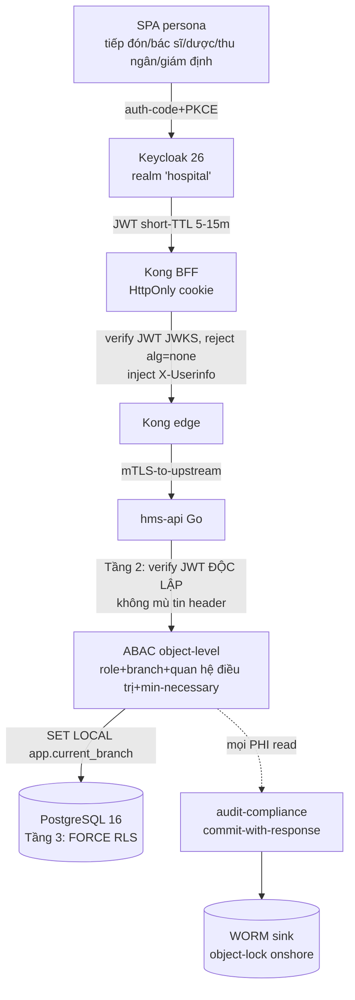
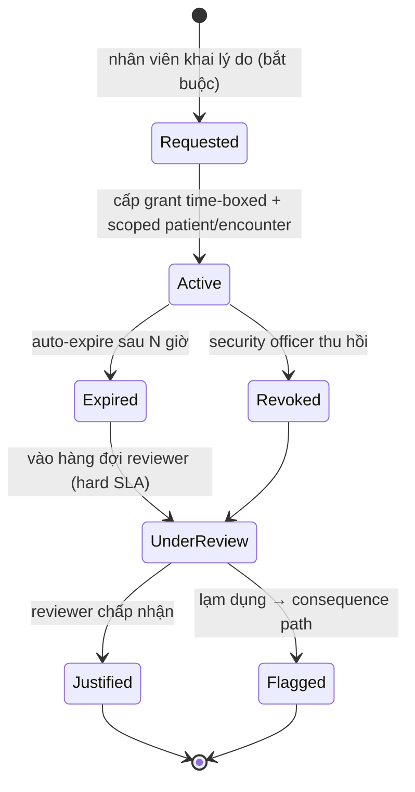

# 06 — Identity, RBAC/ABAC, Audit & Break-the-glass

> Thiết kế domain hai bounded context nền tảng cắt ngang: **identity-access (IAM)** và **audit-compliance**. Đây là lớp quyết định "ai được làm gì với hồ sơ nào" và "mọi chạm vào PHI để lại vết bất biến". Neo vào ADR-013 (Keycloak OIDC + Kong edge-auth + object-level authz ở Go), ADR-010 (break-the-glass), ADR-009 (audit-of-reads commit-with-response + hash-chain + WORM), ADR-003/ADR-005 (FORCE RLS + branch_id), ADR-020 (DPIA/consent/data-subject-rights).
>
> Liên quan: [01-kien-truc-tong-the.md](./01-kien-truc-tong-the.md) (4 tầng defense-in-depth) · [02-backend-architecture.md](./02-backend-architecture.md) (layer rule, outbox) · [08-database-schema.md](./08-database-schema.md) (RLS, audit_log partition) · [09-security.md](./09-security.md) (encryption, CVE-2026-29413) · [13-adr.md](./13-adr.md).

Repo HIỆN CHƯA CÓ CODE — tài liệu mô tả **thiết kế mục tiêu**. Code path đánh dấu *(planned)* theo layout canon §9.

---

## 1. Bức tranh: bốn tầng quyết định authz, không tầng nào đủ một mình



| Tầng | Thành phần | Quyết định | KHÔNG quyết định |
|------|-----------|-----------|------------------|
| 1. Edge | Kong (ADR-019) | JWT hợp lệ? rate-limit, TLS, request-size | object-level authz (BOLA) |
| 2. App | Go ABAC engine | "bác sĩ X xem được bệnh nhân Y?" | branch isolation cuối cùng |
| 3. Data | Postgres FORCE RLS (ADR-003) | branch_id = current_setting? | nghiệp vụ quan hệ điều trị |
| 4. Audit | audit-compliance (ADR-009) | có ghi được vết không? fail-closed | (cross-cutting, không cấp quyền) |

Nguyên tắc bất biến: **Kong KHÔNG BAO GIỜ quyết định object-level authz** (ADR-013). BOLA/IDOR là lỗ hổng #1 y tế và gateway không có context lâm sàng. Go **không mù tin** `X-Userinfo` header — verify chữ ký + claims JWT độc lập (defense-in-depth chống CVE-2026-29413, auth-bypass đã bị khai thác trên healthcare gateway, CISA-KEV).

---

## 2. identity-access (IAM) — aggregates & ranh giới

BC `identity-access` style `clean` (canon §4). KHÔNG lưu password (Keycloak giữ). Trách nhiệm: đồng bộ user/role từ Keycloak, quản lý phiên, MFA policy, step-up, break-the-glass grant, branch/facility membership. Phát hành/verify claims (branch_id, roles) cho RLS và object-level authz.

| Aggregate | Mô tả | Bảng sở hữu |
|-----------|-------|-------------|
| `Account` | Liên kết tới Keycloak subject (sub), không giữ secret | `accounts` |
| `StaffProfile` | Hồ sơ nhân viên (họ tên, chức danh, khoa) | `staff_profiles` |
| `Role` / `Permission` | RBAC persona ↔ quyền hạt | `roles`, `permissions`, `role_permissions` |
| `BranchMembership` | Nhân viên ↔ chi nhánh (nguồn branch khả dụng) | `branch_memberships`, `user_roles` |
| `MfaFactor` | TOTP / WebAuthn enrolled (metadata, không seed) | `mfa_factors` |
| `BreakGlassGrant` | Cấp quyền khẩn time-boxed + scoped | `break_glass_grants` |
| `Session` | Phiên app-side (mapping cookie ↔ token) | `sessions` |

Sync/Async: sync (REST behind Kong); emits `LoginAudited` / `RoleChanged` / `BreakGlassActivated` qua transactional outbox (ADR-012). Code path *(planned)*: `backend/internal/identity/{domain,app,ports,adapters}` (canon §9).

Quan hệ với Keycloak (ADR-013): một realm `hospital`, **branch là group/attribute, KHÔNG realm-per-branch**. Personas là Keycloak group; role **KHÔNG nhúng cứng** token. Token short-TTL 5–15m + cached roles app-side — **KHÔNG per-request DB lookup** (latency + load). Service-to-service dùng `client_credentials`.

---

## 3. RBAC personas + ABAC object-level (ADR-013)

### 3.1 Bảy persona (Keycloak group)

| Persona (group) | Phạm vi điển hình |
|-----------------|-------------------|
| `bac_si` | đọc/ghi Encounter, đặt order CPOE, ký EMR, kê đơn |
| `dieu_duong` | vitals, thực hiện y lệnh, MAR (Phase 2) |
| `duoc_si` | duyệt đơn, cấp phát FEFO, override CDSS có authorizer |
| `le_tan` | tiếp đón, MPI lookup, BHYT card-check, queue |
| `thu_ngan` | charge/payment, biên lai (không xem note lâm sàng) |
| `giam_dinh` | XML 4750, claim — vai trò có thể **cross-branch** |
| `quan_tri` | quản trị hệ thống, không mặc định xem PHI lâm sàng |

RBAC trả lời "persona này được gọi loại hành động nào". Nhưng RBAC **một mình không đủ**: nó không phân biệt "bác sĩ A xem bệnh nhân của bác sĩ A" với "bác sĩ A xem bệnh nhân lạ ở khoa khác". Đó là việc của ABAC.

### 3.2 ABAC — bốn thuộc tính enforce trong Go

Mọi truy cập object-level đánh giá đồng thời: **role + branch + quan hệ điều trị (treatment relationship) + minimum-necessary**.

```go
// (planned) backend/internal/shared/auth/abac.go
type AccessRequest struct {
    Subject   Principal // từ JWT đã verify ĐỘC LẬP (không từ X-Userinfo mù)
    Action    Action    // read|create|update|delete|print|export|sign
    Resource  ResourceRef // {Kind, ID, BranchID, PatientID, EncounterID}
}

// Quyết định fail-closed: thiếu thông tin => DENY, không default-allow.
func (e *Engine) Authorize(ctx context.Context, req AccessRequest) Decision {
    if !req.Subject.HasRole(req.Action.RequiredRole()) {
        return Deny("role")
    }
    // branch khác => 404 (không 403) để không lộ tồn tại resource (ADR-003)
    if !req.Subject.MemberOf(req.Resource.BranchID) &&
        !req.Subject.HasRole("cross_branch_reader") {
        return NotFound() // resource khác branch là "không tồn tại"
    }
    // quan hệ điều trị: clinician phải gắn với Encounter (treating/consulting)
    // trừ break-the-glass đang active & scoped tới chính resource này
    if req.Action.NeedsTreatmentRelationship() &&
        !e.hasRelationship(ctx, req.Subject, req.Resource) &&
        !e.activeBreakGlass(ctx, req.Subject, req.Resource) {
        return Deny("no-treatment-relationship")
    }
    return Allow()
}
```

Ghi chú nhất quán:
- **Resource khác branch trả 404, KHÔNG 403** (ADR-003) — 403 đã rò rỉ "có tồn tại record này".
- Vai trò liên-chi-nhánh (giám định/quản lý vùng) đi qua policy escalation `cross_branch_reader` (ADR-005), không nới RLS bừa.
- ABAC là **backstop chống BOLA** kể cả khi Kong bị bypass (ADR-013).
- "Minimum-necessary": `thu_ngan` thấy ChargeItem nhưng KHÔNG thấy ClinicalNote — projection theo persona ở tầng query (CQRS read-model).

### 3.3 Quan hệ với RLS (ADR-003/005)

ABAC và RLS là **hai tầng độc lập, không thay thế nhau**. ABAC quyết định nghiệp vụ ("quan hệ điều trị"); RLS là lưới an toàn cuối cùng ở DB lọc theo `branch_id`. Middleware `SET LOCAL app.current_branch = <branch từ JWT>` trong cùng `pgx.Tx` trước mọi PHI query — branch_id **không bao giờ lấy từ client** (chống tenant spoofing). Invariant: MỌI PHI query chạy trong tx đã SET LOCAL GUC (pgx pool reuse connection → query ngoài tx mất filter). Chi tiết RLS contract: [08-database-schema.md](./08-database-schema.md), [09-security.md](./09-security.md).

---

## 4. MFA bắt buộc + step-up (ADR-013)

| Hành động | Yêu cầu auth |
|-----------|--------------|
| Đăng nhập mọi persona | MFA bắt buộc — **TOTP tối thiểu, WebAuthn/passkey ưu tiên** |
| Đọc/ghi thông thường | session token còn hạn (acr đã thoả MFA) |
| Hành động nhạy cảm (ký EMR, kê đơn, override CDSS, export PHI, break-the-glass) | **step-up** — re-auth WebAuthn trong N phút gần đây |

Step-up enforce ở Go: kiểm `auth_time` / `acr` trong JWT đã verify; nếu quá ngưỡng → trả `401` với challenge → SPA gọi Keycloak step-up flow. MFA factor metadata lưu `mfa_factors`; secret/credential thật ở Keycloak. MFA **không phải** thay cho chữ ký số PKI — ký EMR/đơn thuốc (TT 13/2025) là PKI signature riêng (xem [03-clinical-encounter-emr.md](./03-clinical-encounter-emr.md)).

---

## 5. Break-the-glass: time-boxed + scoped + closed review loop (ADR-010)

Cấp cứu (ED) cần truy cập vượt quan hệ điều trị thông thường. Nhưng break-the-glass **không có closed loop = authz bypass có log side-effect**, auditor NĐ13 coi là finding. Thiết kế:



Đặc tính bắt buộc (canon §0, ADR-010):
- **Time-boxed**: auto-expire sau N giờ — grant không vĩnh viễn.
- **Scoped**: tới patient/encounter **cụ thể**, không broad grant.
- Áp dụng cho **CẢ access VÀ creation/ordering** trong cấp cứu — ED `register-first-identify-later` (tạo Encounter không cần appointment, chưa confirm MPI, merge sau).
- Sinh **audit cờ đỏ** + thông báo security officer ngay.
- **Named reviewer role + hard review SLA + consequence path** khi lạm dụng — đây là quy trình tổ chức đi kèm kỹ thuật (cần runbook review, xem [16-iac-runbooks.md](./16-iac-runbooks.md)).

Lưu `break_glass_grants(grant_id, subject, scope_patient_id, scope_encounter_id, reason, granted_at, expires_at, reviewer, review_state, reviewed_at)`. ABAC engine kiểm `activeBreakGlass()` đúng scope + chưa expire (§3.2). Emits `BreakGlassActivated` qua outbox → audit + alert.

---

## 6. audit-compliance — audit-of-reads fail-closed, hash-chain, WORM (ADR-009)

BC `audit-compliance` style `clean+ddd+cqrs`, cross-cutting, ghi từ mọi BC qua **shared middleware**. Code path *(planned)*: `backend/internal/audit/` + `backend/internal/shared/middleware/audit.go`.

### 6.1 Hai chế độ ghi, hai mức durability

Đây là điểm reconcile mâu thuẫn Data-tin-tx vs Security-async (ADR-009):

| Loại sự kiện | Cơ chế | Lý do |
|--------------|--------|-------|
| **PHI read** (đọc hồ sơ bệnh nhân) | **commit-with-response** — ghi audit durable **trước/cùng** response, fail-closed | rollback/crash mất audit = vi phạm HIPAA §164.312(b) / NĐ13 / TT13 |
| State-change (create/update/delete) | qua **outbox** trong cùng `pgx.Tx` với thay đổi | đã ACID cùng business write |

**Fail-closed cho read** (bất biến sống còn): nếu audit write fail → **KHÔNG trả PHI**. Không best-effort async, không "ghi sau".

```go
// (planned) backend/internal/shared/middleware/audit.go
func AuditedPHIRead(h PHIHandler) PHIHandler {
    return func(ctx context.Context, req Request) (Resp, error) {
        data, err := h(ctx, req) // đọc PHI trong tx (RLS đã SET LOCAL)
        if err != nil {
            return Resp{}, err
        }
        ev := AuditEvent{
            Who: subjectOf(ctx), When: clock.Now(), Action: "read",
            Resource: req.ResourceRef(), PatientID: data.PatientID,
            IP: ipOf(ctx), Session: sessionOf(ctx), Branch: branchOf(ctx),
        }
        // FAIL-CLOSED: audit không ghi được => không trả PHI
        if err := audit.AppendSync(ctx, ev); err != nil {
            return Resp{}, ErrAuditUnavailable // 503, KHÔNG lộ data
        }
        return data, nil
    }
}
```

### 6.2 Trường ghi bắt buộc

`who / when / action(read|create|update|delete|print|export) / resource / patient_id / before-after / ip / session / branch` (ADR-009). `print` và `export` là action first-class — in phiếu pháp lý / xuất XML cũng là chạm PHI.

### 6.3 INSERT-only + hash-chain + WORM

Bảng `audit_log`:
- **Partition theo tháng**, `BIGINT IDENTITY` PK, **INSERT-only**: policy chặn UPDATE/DELETE `USING false` **kể cả app-role** (ADR-009).
- **FORCE RLS** nhưng audit_log **không chịu branch-leak filter như PHI** — audit phải toàn cục cho compliance (ADR-009 hệ quả).
- **Hash-chain**: mỗi record chứa hash của record trước → tamper-evident.

```sql
-- (planned) backend/migrations/0000XX_audit.up.sql
-- prev_hash nối chuỗi; bất kỳ sửa nào làm gãy chain ở record kế tiếp
record_hash = sha256(prev_hash || who || when || action || resource || patient_id || ...)
```

- **WORM sink ngoài Postgres** (object-lock, onshore): vì Postgres-policy "immutable" **KHÔNG tamper-evident với DBA/superuser** — hash-chain + WORM external là **bắt buộc, không optional** (ADR-009). Audit log ship **riêng** tới WORM, không chỉ Loki (ADR-019).
- Hash-chain phải **sống sót PITR restore** (ADR-004/015) — có test restore + verify chain (open risk [high]).

### 6.4 Override CDSS cũng ghi audit

Mọi override CDSS hard-stop (ADR-008) ghi audit với `reason + authorizer` — không có "silent pass". Xem [04-orders-lab-pharmacy.md](./04-orders-lab-pharmacy.md).

---

## 7. Consent + data-subject-rights (NĐ13 / ADR-020)

Aggregates: `DataSubjectRequest`, `DpiaRecord`. Bảng: `data_subject_requests`, `dpia_records`, `data_access_log`.

- **DPIA** (hồ sơ đánh giá tác động xử lý DLCN) cho dữ liệu sức khỏe là **Phase-0 legal deliverable** có deadline: NĐ13 yêu cầu nộp Bộ Công an/A05 trong **60 ngày kể từ go-live** (bắt đầu xử lý). Không phải documentation — là nghĩa vụ pháp lý (ADR-020).
- **Consent enforcement ở Go TRƯỚC xử lý ngoài mục đích điều trị** — consent record (Patient BC sở hữu, xem [03/04]) được ABAC tham chiếu khi action vượt mục đích điều trị (vd nghiên cứu, chia sẻ).
- **Data-subject-rights**: truy cập / xóa / rút đồng ý — blocking legal artifact **trước production data**. Lưu ý: dữ liệu lâm sàng đã ký (EMRDocument) bất biến pháp lý → "xóa" xử lý theo quy định lưu trữ y tế, không hard-delete tuỳ tiện.
- Xác nhận nghĩa vụ theo **Luật Bảo vệ DLCN (hiệu lực 2026, đang superseding NĐ13)**, không chỉ Decree (ADR-020).

---

## 8. Migration 000001 — nền identity + audit không-backfill-được (ADR-024)

Migration `000001_phase0_compliance` *(planned `backend/migrations/`)* tạo nền identity/audit **trước bất kỳ PHI nào**:
- `branches`, `accounts`, `roles`, `permissions`, `role_permissions`, `audit_log`.
- **migration-owner role ≠ app-role**: app-role `NOSUPERUSER, NOBYPASSRLS, KHÔNG sở hữu bảng` (ADR-003) — vì table OWNER bypass RLS kể cả NOBYPASSRLS.
- **ENABLE + FORCE RLS** + USING & WITH CHECK trước mọi PHI table.
- audit_log INSERT-only policy + partition tháng.

CI integration test (testcontainers, ADR-025) chứng minh **branch-B invisible** dưới `app.current_branch=A` là **merge-blocking gate**, và test **audit-fail-closed** (không trả PHI khi audit write fail) chạy against real Postgres.

---

## 9. Bảng tổng hợp neo ADR

| Quyết định | ADR |
|------------|-----|
| Keycloak OIDC + Kong edge-auth + object-level authz ở Go; Go verify JWT độc lập (CVE-2026-29413) | ADR-013 |
| RBAC personas + ABAC; role không nhúng cứng token; short-TTL + cached roles | ADR-013 |
| MFA bắt buộc (TOTP/WebAuthn) + step-up | ADR-013 |
| Break-the-glass time-boxed + scoped + closed review loop (access & creation) | ADR-010 |
| Audit-of-reads commit-with-response fail-closed + hash-chain + WORM | ADR-009 |
| FORCE RLS + branch_id + USING & WITH CHECK; resource khác branch → 404 | ADR-003 |
| Shared-schema branch_id, MPI dùng chung, cross_branch_reader escalation | ADR-005 |
| CDSS override luôn ghi audit (reason + authorizer) | ADR-008 |
| DPIA + consent + data-subject-rights là Phase-0 legal blocker (NĐ13) | ADR-020 |
| Migration 000001 thiết lập identity + audit + RLS + role separation | ADR-024 |
| testcontainers: RLS branch-isolation + audit-fail-closed merge-blocking | ADR-025 |
