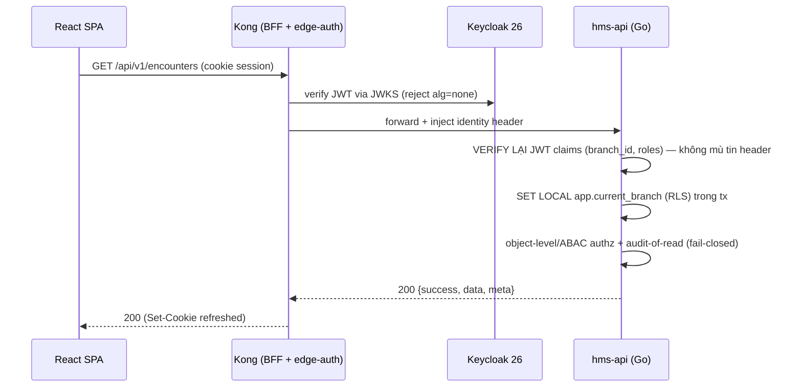
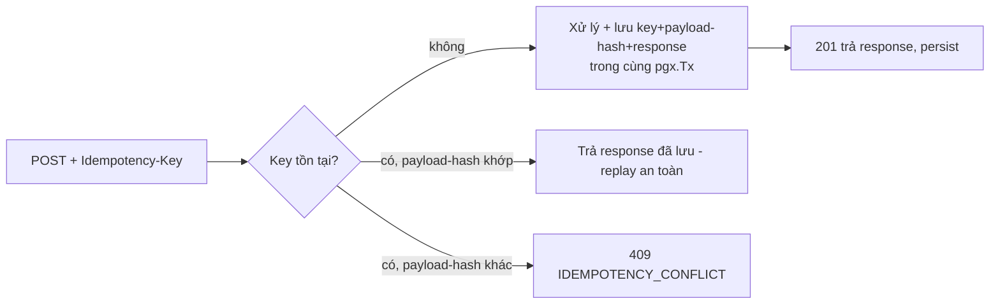
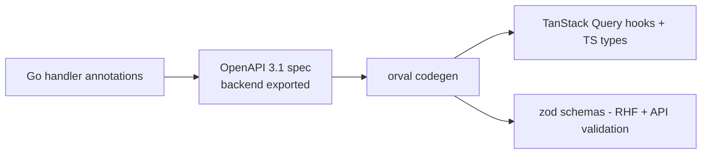

# 07 — API Specification

> Quy ước API, response envelope, error model, idempotency, versioning và endpoint catalog per bounded context cho HMS. OpenAPI là **nguồn sự thật** cho FE codegen (orval) — chống FE↔BE drift. Mọi traffic đi qua **Kong** (edge-auth + BFF); object-level authz enforce trong Go.
>
> Liên quan: [02-backend-architecture.md](02-backend-architecture.md) (BC map, outbox, error envelope) · [05-billing-insurance-bhyt.md](05-billing-insurance-bhyt.md) (charge/claim/idempotency) · [06-identity-rbac-audit.md](06-identity-rbac-audit.md) (authz, audit) · [09-security.md](09-security.md) (Kong BFF, CVE-2026-29413) · [14-frontend-architecture.md](14-frontend-architecture.md) (orval codegen) · [13-adr.md](13-adr.md).

Repo HIỆN CHƯA CÓ CODE — tài liệu mô tả **thiết kế mục tiêu**. Code path đánh dấu *(planned)* theo layout [canon §9](13-adr.md): handler HTTP sống ở `backend/internal/<bc>/adapters/http/` *(planned)*, helper envelope/error/pagination ở `backend/internal/shared/httpx/` *(planned)*.

---

## 1. Nguyên tắc nền (neo ADR)

| Nguyên tắc | Mô tả | ADR |
|---|---|---|
| REST-over-HTTP behind Kong | Gin (`pgx/v5`+`sqlc`) phía sau Kong. Kong CHỈ coarse-grained edge (verify JWT/JWKS, TLS 1.3, rate-limit, BFF). | ADR-013, ADR-019 |
| Object-level authz ở Go | Kong KHÔNG bao giờ quyết "bác sĩ này xem bệnh nhân kia". Mọi resource-level / ABAC check ở Go aggregate. | ADR-013 |
| Trust-but-verify identity | Go KHÔNG mù tin `X-Userinfo` header — verify lại JWT signature/claims độc lập (defense-in-depth chống CVE-2026-29413). | ADR-013 |
| RLS-scoped mọi PHI query | `branch_id` trích từ JWT đã verify (KHÔNG từ client), middleware `SET LOCAL app.current_branch` trong tx. Cross-branch resource → **404 không 403**. | ADR-003, ADR-005 |
| Audit-of-reads fail-closed | PHI read commit audit cùng/trước response — audit fail thì KHÔNG trả PHI. | ADR-009 |
| OpenAPI là contract | Spec sinh từ code (annotation) → FE codegen qua **orval**; một zod schema = form + API type. | ADR-018 |
| Idempotency end-to-end | FE idempotency key và backend charge/claim idempotency key là MỘT scheme. | ADR-011 |

---

## 2. URL, versioning, headers

### 2.1 Base path & versioning
- Prefix tất cả: `/api/v1/...`. Versioning theo **URL path major-version** (`v1`, `v2`). Breaking change → bump major; additive (thêm field optional, thêm endpoint) KHÔNG bump.
- Kong route theo prefix `/api/` tới upstream `hms-api`. SPA static phục vụ ở `/`.
- Resource đặt tên **danh từ số nhiều, kebab không dùng** (snake không dùng trên path): `/patients`, `/encounters`, `/service-orders`, `/insurance-claims`.
- Sub-resource neo theo Encounter (mỏ neo lâm sàng, ADR-004): `/encounters/{id}/diagnoses`, `/encounters/{id}/observations`, `/encounters/{id}/orders`.

### 2.2 HTTP methods & status
| Method | Dùng cho | Success |
|---|---|---|
| `GET` | Đọc (list/detail). Idempotent, an toàn. | `200` |
| `POST` | Tạo / command (state transition). | `201` (tạo) · `200` (command có body) · `202` (async đã enqueue) |
| `PUT` | Replace toàn bộ (hiếm — phần lớn clinical là append/addendum). | `200` |
| `PATCH` | Cập nhật một phần (chỉ field cho phép, KHÔNG dùng cho signed EMR). | `200` |
| `DELETE` | Hủy logic (soft) / cancel order. KHÔNG hard-delete dữ liệu lâm sàng. | `200`/`204` |

Status code chuẩn: `400` validation, `401` thiếu/invalid auth (Kong reject trước), `403` thiếu permission (role-level), `404` không tồn tại **hoặc cross-branch RLS-invisible**, `409` conflict (state machine / idempotency mismatch / optimistic lock), `422` business-rule reject (vd CDSS hard-stop), `429` rate-limit (Kong), `503` degraded (external gateway down).

### 2.3 Header bắt buộc/quy ước
| Header | Hướng | Ý nghĩa |
|---|---|---|
| `Authorization: Bearer <jwt>` | request | Service-to-service (`client_credentials`). SPA dùng cookie (xem §3). |
| `Idempotency-Key: <uuidv7>` | request | BẮT BUỘC cho mọi `POST` sinh charge/dispense/claim/payment (§5). |
| `X-Request-Id` | request/response | Trace id (echo lại trong envelope `meta.requestId`). |
| `X-Step-Up-Token` | request | Token step-up cho hành động nhạy cảm (ký EMR, break-the-glass, override CDSS). |
| `If-Match: <version>` | request | Optimistic concurrency cho update (ETag = `version`/`updated_at`). |
| `Accept-Language: vi-VN` | request | Mặc định `vi_VN`; thông điệp lỗi localize. |

Kong inject identity tới upstream (`X-Userinfo`/JWT forward); Go **verify lại** (ADR-013).

---

## 3. Auth qua Kong BFF (SPA)

ADR-013/ADR-018: SPA KHÔNG bao giờ thấy token. Kong làm **BFF**: auth-code + PKCE với Keycloak, lưu token trong cookie `HttpOnly + Secure + SameSite=Strict`, inject identity tới upstream.



- Login: SPA → `GET /api/auth/login` (Kong khởi tạo auth-code+PKCE) → callback set cookie. Logout: `POST /api/auth/logout`.
- Token TTL ngắn (5–15m) + cached roles, KHÔNG per-request DB lookup (ADR-013). Refresh do Kong/BFF xử lý transparently.
- Step-up: hành động nhạy cảm trả `403` với `error.code = STEP_UP_REQUIRED` → FE kích MFA → retry kèm `X-Step-Up-Token`.

---

## 4. Response envelope (chuẩn nhất quán)

Mọi response (success/error) dùng MỘT envelope — neo Common Patterns (API Response Format). Helper ở `internal/shared/httpx` *(planned)*.

### 4.1 Success
```json
{
  "success": true,
  "data": { "id": "0192f...", "status": "in-progress" },
  "error": null,
  "meta": { "requestId": "req_01j...", "timestamp": "2026-06-28T08:30:00+07:00" }
}
```

### 4.2 List (paginated)
```json
{
  "success": true,
  "data": [ { "id": "0192f..." } ],
  "error": null,
  "meta": {
    "requestId": "req_01j...",
    "pagination": { "cursor": "eyJpZCI6...", "nextCursor": "eyJpZCI6...", "limit": 20, "hasMore": true }
  }
}
```

### 4.3 Error
```json
{
  "success": false,
  "data": null,
  "error": {
    "code": "CDSS_HARD_STOP",
    "message": "Đơn thuốc bị chặn: tương tác nghiêm trọng với thuốc đang dùng.",
    "details": [ { "field": "items[0].drugId", "issue": "interaction_with=warfarin", "severity": "contraindicated" } ],
    "traceId": "req_01j..."
  },
  "meta": { "requestId": "req_01j...", "timestamp": "2026-06-28T08:30:00+07:00" }
}
```

Go struct *(planned)* `internal/shared/httpx/envelope.go`:
```go
type Envelope[T any] struct {
    Success bool       `json:"success"`
    Data    *T         `json:"data"`
    Error   *APIError  `json:"error"`
    Meta    Meta       `json:"meta"`
}
type APIError struct {
    Code    string         `json:"code"`    // stable machine-readable, UPPER_SNAKE
    Message string         `json:"message"` // vi_VN, user-facing, KHÔNG leak chi tiết nội bộ
    Details []FieldIssue   `json:"details,omitempty"`
    TraceId string         `json:"traceId"`
}
```

> **Bảo mật**: `message` KHÔNG bao giờ chứa stack trace / SQL / PHI (security rule "error messages don't leak sensitive data"). Chi tiết kỹ thuật chỉ log server-side gắn `traceId`.

---

## 5. Error model — bảng `error.code` ổn định

`code` là **machine-readable**, ổn định qua version, FE map sang UX. Phân nhóm:

| Code | HTTP | Ý nghĩa | Phát từ BC |
|---|---|---|---|
| `VALIDATION_FAILED` | 400 | Input không hợp lệ (zod/validator). `details[]` per field. | mọi |
| `UNAUTHENTICATED` | 401 | Thiếu/invalid session (Kong reject trước upstream). | edge |
| `FORBIDDEN` | 403 | Role-level không cho phép. | identity |
| `STEP_UP_REQUIRED` | 403 | Cần MFA step-up cho hành động nhạy cảm. | identity |
| `NOT_FOUND` | 404 | Không tồn tại **hoặc** cross-branch RLS-invisible (ADR-003). | mọi |
| `STATE_CONFLICT` | 409 | Vi phạm state machine (vd ký EMR đã signed). | encounter, orders, insurance |
| `IDEMPOTENCY_CONFLICT` | 409 | Cùng key, payload khác (replay sai). | billing, pharmacy, insurance |
| `OPTIMISTIC_LOCK` | 409 | `If-Match` version stale. | mọi mutable |
| `CDSS_HARD_STOP` | 422 | Dị ứng/tương tác chặn cứng, cần override record. | pharmacy, orders |
| `ALLERGY_STATUS_UNKNOWN` | 422 | Allergy chưa xác định — KHÔNG render "safe" (ADR-008). | pharmacy |
| `BHYT_GATEWAY_UNAVAILABLE` | 503 | Cổng giám định/mạng lỗi → degraded-mode (ADR-006). | scheduling-reception, insurance |
| `NATIONAL_RX_UNAVAILABLE` | 503 | donthuocquocgia.vn down → queue + retry (ADR-007). | pharmacy |
| `AUDIT_WRITE_FAILED` | 503 | Audit-of-read fail → KHÔNG trả PHI (fail-closed, ADR-009). | audit-compliance |

---

## 6. Pagination, filter, sort

- **Cursor-based** mặc định cho list lớn (clinical history, audit, charges): ổn định khi insert đồng thời, không skip/duplicate. Tham số: `?limit=20&cursor=<opaque>`. `limit` default 20, max 100.
- Offset (`?page=&pageSize=`) chỉ cho bảng reference nhỏ (chargemaster, terminology) hợp với AntD ProTable.
- Filter: query-param explicit, validate ở boundary — `?status=active&from=2026-06-01&to=2026-06-28`. KHÔNG free-form query string injection.
- Sort: `?sort=-createdAt` (`-` = desc). Field whitelist server-side (chống sort theo cột không index / leak ordering).
- Mọi list query CHẠY trong tx đã `SET LOCAL app.current_branch` (RLS) → kết quả tự lọc theo branch; thêm `LIMIT` bắt buộc (chống unbounded query).

---

## 7. Idempotency-Key contract (ADR-011)

Bắt buộc cho `POST` sinh tác dụng phụ tài chính/lâm sàng: **charge, dispense, payment, claim submit**. Một scheme end-to-end FE↔BE.



- Key = UUID v7 do **FE sinh** một lần per logical action, gửi lại khi retry.
- Backend lưu `idempotency_keys` (bảng thuộc billing BC, canon §4) với unique constraint trên `(branch_id, key)` + lưu `request_hash` + `response_snapshot`, INSERT cùng `pgx.Tx` với charge/dispense (transactional outbox, ADR-012).
- Replay cùng payload → trả response cũ (`200`/`201` đã lưu). Cùng key khác payload → `409 IDEMPOTENCY_CONFLICT`.
- MVP cắt PWA write-outbox (ADR-018) → giảm bề mặt double-post; dispense/cashier là **hard-online gate**.

---

## 8. Async / degraded-mode contract

Hai external regulatory LIVE (ADR-006/007). Khi gọi đồng bộ-được thì sync; khi gateway lỗi → degraded, KHÔNG bao giờ chặn người bệnh.

| Tình huống | Response | FE hiển thị |
|---|---|---|
| BHYT card-check OK | `200` `data.verdict ∈ {eligible, ineligible, co-pay}` | verdict + 6 lần khám |
| BHYT gateway lỗi | `200` `data.verdict = "provisionally-unverified"` (admit-and-flag) | "Đã tiếp nhận, chờ kiểm tra thẻ" |
| Claim submit enqueue | `202` `data.status = "queued"` | "Đã lưu, chờ gửi cổng" |
| donthuoc submit enqueue | `202` `data.nationalRxStatus = "pending"` | đơn in kèm chỗ chờ mã QR |
| Payment khi cổng lỗi | `200` `data.reconcileStatus = "pending"` | "Đã thu, đối soát sau" |

Retry do **River** job (ADR-012): claim submit/retry, donthuoc submit. FE poll trạng thái qua `GET` detail (không long-poll ở MVP).

---

## 9. Endpoint catalog per bounded context

Đánh dấu phase: *(MVP)* = Phase 1 · *(Phase 2/3)*. Path tương đối `/api/v1`. Handler *(planned)* `internal/<bc>/adapters/http/`.

### 9.1 auth (Kong BFF) *(MVP)*
| Method | Path | Mô tả |
|---|---|---|
| GET | `/auth/login` | Khởi tạo auth-code+PKCE (Kong). |
| GET | `/auth/callback` | Set HttpOnly cookie. |
| POST | `/auth/logout` | Hủy session. |
| GET | `/auth/me` | Identity hiện tại (roles, branch, personas) — đã verify ở Go. |

### 9.2 identity-access *(MVP)*
| Method | Path | Mô tả |
|---|---|---|
| GET | `/staff` `/staff/{id}` | StaffProfile (sync từ Keycloak). |
| GET | `/branch-memberships` | Membership chi nhánh của staff. |
| POST | `/break-glass` | Kích break-the-glass time-boxed+scoped (ADR-010) → cần `X-Step-Up-Token`; sinh audit cờ đỏ. |
| GET | `/break-glass/{id}` | Trạng thái grant + reviewer. |

### 9.3 organization *(MVP)*
| Method | Path | Mô tả |
|---|---|---|
| GET | `/branches` `/departments` `/rooms` `/beds` | Registry (cached client-side). |
| GET | `/service-catalog` | Chargemaster: giá DVKT + mã/giá BHYT (source-of-truth giá). |
| GET | `/facility-external-codes` | Mã liên-thông BHYT/donthuoc per branch (cần cho XML 4750 + e-prescription). |

### 9.4 patient (MPI) *(MVP)*
| Method | Path | Mô tả |
|---|---|---|
| GET | `/patients?cccd=&bhytCard=` | Tra cứu exact-match qua **blind-index HMAC** (ADR-014) — KHÔNG search trên cột mã hóa. |
| GET | `/patients/{id}` | Demographics (PHI read → audit fail-closed). |
| POST | `/patients` | Đăng ký MPI (hỗ trợ bệnh nhân tạm/chưa-định-danh). |
| GET | `/patients/{id}/allergies` | Allergy list (feeds CDSS). |
| POST | `/patients/{id}/allergies` | Ghi dị ứng. |
| POST | `/patients/merge` | Merge/dedupe MPI (link sau ED register-first). |
| GET | `/terminology/concepts?system=ICD-10&q=` | Catalog ICD-10/LOINC/RxNorm (code,system,display triplet). |

### 9.5 scheduling-reception *(MVP)*
| Method | Path | Mô tả |
|---|---|---|
| GET/POST | `/appointments` | Lịch hẹn, slot. |
| POST | `/queue-tickets` | Số thứ tự walk-in (first-class). |
| POST | `/check-ins` | Check-in tiếp đón. |
| POST | `/bhyt/eligibility-check` | **LIVE card-check** (touch 1): giá trị thẻ + miễn cùng chi-trả + 6 lần khám → verdict. Degraded → `provisionally-unverified` (§8, ADR-006). |

### 9.6 encounter (EMR core) *(MVP)*
| Method | Path | Mô tả |
|---|---|---|
| POST | `/encounters` | Tạo Encounter (OPD/ED/IPD). ED: register-first-identify-later. |
| GET | `/encounters/{id}` | Detail + state. |
| POST | `/encounters/{id}/transition` | State machine: `planned→arrived→triaged→in-progress→finished→billed→closed` → `409 STATE_CONFLICT` nếu invalid. |
| POST | `/encounters/{id}/diagnoses` | Chẩn đoán ICD-10 (QĐ 4469). |
| POST | `/encounters/{id}/observations` | Vitals (LOINC). |
| POST | `/encounters/{id}/notes` | Clinical note (signed→addendum-only). |
| POST | `/encounters/{id}/emr/sign` | Ký số PKI EMRDocument (TT 13/2025) — cần `X-Step-Up-Token`; synchronous durability (commit confirmed trước UI báo "signed", ADR-004/015). |
| GET | `/encounters/{id}/emr` | EMRDocument bất biến + signature block + hash. |
| GET | `/admissions` `/bed-assignments` | IPD ADT/bed board *(Phase 2)*. |

### 9.7 orders (CPOE) *(MVP)*
| Method | Path | Mô tả |
|---|---|---|
| POST | `/service-orders` | Order lab/imaging/medication (lifecycle `draft→active→completed/cancelled`); route fulfilment qua outbox. |
| GET | `/service-orders/{id}` | Detail + status history. |
| POST | `/service-orders/{id}/cancel` | Hủy (state machine). |

### 9.8 lab (LIS-lite) *(MVP)*
| Method | Path | Mô tả |
|---|---|---|
| POST | `/specimens` | Specimen/accession (barcode). |
| POST | `/lab-results` | Nhập kết quả tay + validation + reference range; critical-value flag → CDSS. |
| POST | `/lab-results/{id}/release` | Release kết quả về Encounter (interface máy *(Phase 2)*). |

### 9.9 pharmacy *(MVP)*
| Method | Path | Mô tả |
|---|---|---|
| POST | `/prescriptions` | Kê đơn → trigger CDSS hard-stop backend (`422 CDSS_HARD_STOP` / `ALLERGY_STATUS_UNKNOWN` nếu fail-closed, ADR-008). |
| POST | `/prescriptions/{id}/override` | Override CDSS có reason+authorizer (ghi audit) — cần `X-Step-Up-Token`. |
| POST | `/medication-dispenses` | Cấp phát **FEFO** (lot ORDER BY expiry, FOR UPDATE SKIP LOCKED, ADR-021); `Idempotency-Key` bắt buộc; hard-online. |
| GET | `/prescriptions/{id}/national-rx` | Trạng thái liên thông donthuocquocgia.vn + mã đơn quốc gia (ADR-007). |

### 9.10 billing *(MVP)*
| Method | Path | Mô tả |
|---|---|---|
| GET | `/encounters/{id}/bill` | Invoice của Encounter (charge-capture idempotent từ order/dispense, price snapshot). |
| POST | `/bills/{id}/payments` | Thu tiền; `Idempotency-Key` bắt buộc; tách BHYT vs tự túc; degraded → `reconcileStatus=pending` (ADR-006/011). |
| POST | `/bills/{id}/adjustments` | Adjustment append-only. |
| POST | `/advances` | Tạm ứng nội trú *(Phase 2)*. |
| GET | `/bills/{id}/receipt` | Biên lai in được (phiếu thanh toán theo bảng 4750, ADR-022). |

### 9.11 insurance (BHYT claims) *(MVP)*
| Method | Path | Mô tả |
|---|---|---|
| POST | `/insurance-claims` | Sinh claim từ ChargeItem (claim↔bill↔encounter FK, ADR-011). |
| GET | `/insurance-claims/{id}/xml` | Bộ XML1–XML15 (QĐ 4750 sửa 3176). |
| POST | `/insurance-claims/{id}/submit` | Ký số + đẩy cổng qua saga/River (`202 queued`, ADR-006). |
| GET | `/insurance-claims/{id}/response` | Phản hồi/từ chối giám định (rejection-code state machine). |

### 9.12 audit-compliance *(MVP)*
| Method | Path | Mô tả |
|---|---|---|
| GET | `/audit-events?patientId=&from=&to=` | Truy vết (immutable, hash-chained) — chỉ persona `quan_tri`/`giam_dinh`. |
| POST | `/data-subject-requests` | Quyền chủ thể dữ liệu (truy cập/xóa/rút đồng ý, NĐ13, ADR-020). |

### 9.13 analytics-reporting *(Phase 3)* · interoperability (FHIR `$lookup`/`$expand`) *(Phase 2)*
Read-side qua scheduled SQL→read-table; FHIR R4 facade read-only — KHÔNG lock thư viện (ADR-016/017).

---

## 10. OpenAPI là nguồn FE codegen (orval)

ADR-018: một schema = form + API type, chống FE↔BE drift.



- Backend export OpenAPI 3.1 (struct annotation, generate trong CI) — spec là artifact build, KHÔNG viết tay.
- FE chạy `orval` *(planned `frontend/orval.config.ts`)* sinh: TanStack Query v5 hooks + TS types + zod schema (cùng schema dùng cho `react-hook-form` validation và API typing).
- Envelope `success/data/error/meta` được model trong OpenAPI; orval unwrap `data`.
- CI gate: spec thay đổi mà FE chưa regen → drift check fail (merge-blocking). Breaking change OpenAPI = bump `/v2`.

---

## 11. External client contracts (outbound)

HMS gọi RA hai external regulatory (ADR-006/007/023). Đây KHÔNG phải public API của HMS — là client contract phía HMS.

| External | Hướng | Giao thức | Adapter *(planned)* | Hợp đồng |
|---|---|---|---|---|
| BHYT card-check (touch 1) | sync at reception | HTTPS JSON | `internal/insurance/adapters/bhyt/cardcheck` | verdict + 6 lần khám; timeout + fallback `provisionally-unverified` |
| BHYT giám định (touch 2) | async submit | mTLS + chữ ký số | `internal/insurance/adapters/bhyt/giamdinh` | XML1–XML15 QĐ 4750; saga + idempotency + retry; rejection-code state machine |
| donthuocquocgia.vn | async submit | HTTPS app-key | `internal/pharmacy/adapters/donthuoc` | app-name/app-key + mã liên-thông cơ sở/bác sĩ; mã đơn quốc gia (C/N/H/Y); River retry |
| Payment gateway (VNPay/Momo/napas) | redirect/token | HTTPS | `internal/billing/adapters/payment` | tokenization — HMS KHÔNG lưu số thẻ thật (ngoài PCI scope, ADR-021) |

- **Contract test** bắt buộc cho BHYT + donthuoc client trước build production flow (ADR-023/025) — Phase-0 BHXH sandbox blocker.
- Client cert (mTLS BHYT) trong secret store (KMS/ESO, ADR-014/021), KHÔNG hardcode.

---

## 12. Checklist contract (cho mọi endpoint mới)

- [ ] Path đúng quy ước `/api/v1/<noun-plural>`, neo Encounter cho clinical sub-resource.
- [ ] Response dùng envelope `{success,data,error,meta}` (helper `httpx`).
- [ ] `error.code` chọn từ bảng §5 (ổn định, UPPER_SNAKE), `message` vi_VN KHÔNG leak nội bộ.
- [ ] PHI read → audit-of-read fail-closed (ADR-009); cross-branch → `404` (ADR-003).
- [ ] Mutation sinh charge/dispense/claim/payment → `Idempotency-Key` (ADR-011).
- [ ] Hành động nhạy cảm (ký EMR, override CDSS, break-glass) → `STEP_UP_REQUIRED` + `X-Step-Up-Token`.
- [ ] List có cursor pagination + `LIMIT` + sort whitelist.
- [ ] Validate input ở boundary (`go-playground/validator`); object-level/ABAC authz ở Go (KHÔNG Kong).
- [ ] OpenAPI annotation đầy đủ → orval regen; drift check pass.
- [ ] External call có degraded-mode + contract test (ADR-006/007/023).
