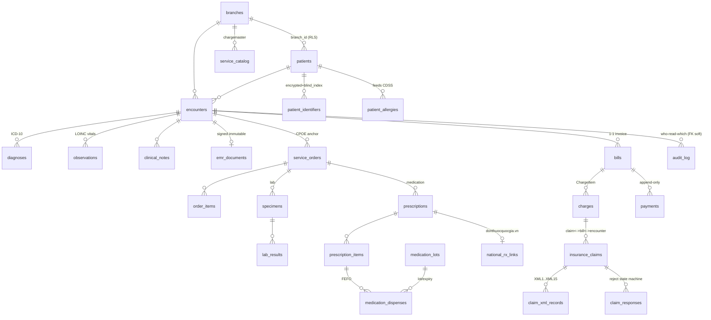

# 08 — Database Schema, Migrations, RLS & ERD

> Thiết kế schema PostgreSQL MỤC TIÊU cho HMS *(planned — repo chưa có code)*: tổ chức bảng theo bounded-context ownership, UUID v7 PK, `branch_id` + **FORCE ROW LEVEL SECURITY** keystone, Encounter anchor, coded triplet `(code,system,display)`, field-level envelope encryption + blind-index, audit/versioning, và migration Phase-0 `000001`.
>
> Liên quan: [02-backend-architecture.md](./02-backend-architecture.md) (BC map, outbox) · [03-clinical-encounter-emr.md](./03-clinical-encounter-emr.md) (Encounter/EMR) · [05-billing-insurance-bhyt.md](./05-billing-insurance-bhyt.md) (charge/claim) · [09-security.md](./09-security.md) (RLS, encryption) · [13-adr.md](./13-adr.md) (ADR đầy đủ). Neo chính: **ADR-003, ADR-005, ADR-014, ADR-024, ADR-009, ADR-011, ADR-021, ADR-004, ADR-015**.

---

## 1. Nguyên tắc thiết kế schema (chốt)

| # | Quy ước | ADR |
|---|---------|-----|
| 1 | PostgreSQL 16+ OLTP **shared-schema single cluster**, một logical DB cho cả monolith `hms-api`. | ADR-015 |
| 2 | **UUID v7** (time-ordered) làm PK mọi bảng nghiệp vụ — index-friendly, không lộ count, không hot-page như random UUIDv4. | ADR-024 |
| 3 | **BIGINT IDENTITY** (`GENERATED ALWAYS AS IDENTITY`) cho bảng append-only chuỗi: `audit_log`, `stock_ledger`, `outbox`, `processed_events` — cần thứ tự đơn điệu + hash-chain. | ADR-009, ADR-021 |
| 4 | `branch_id UUID NOT NULL` trên **mọi bảng PHI** + `ENABLE` & **`FORCE` ROW LEVEL SECURITY** + policy có CẢ `USING` VÀ `WITH CHECK`. | ADR-003, ADR-005 |
| 5 | Tiền tệ luôn **`NUMERIC(15,2)` + `currency CHAR(3)`** (mặc định `'VND'`) — KHÔNG dùng `float`/`money`. | ADR-011 |
| 6 | Mọi field lâm sàng coded dùng **triplet** `*_code TEXT`, `*_system TEXT`, `*_display TEXT` (ICD-10/LOINC/RxNorm/DMDC) — nền móng FHIR rẻ. | ADR-016 |
| 7 | Cột siêu nhạy → **app-side AES-256-GCM envelope** (BYTEA ciphertext) + **blind-index HMAC** (BYTEA) cho exact-match lookup. KHÔNG pgcrypto DB-side. | ADR-014 |
| 8 | Lâm sàng đã ký → **immutable**; sửa qua addendum/amendment + bảng `*_history` versioning. | ADR-004 |
| 9 | Audit & timestamp: mọi bảng có `created_at timestamptz NOT NULL DEFAULT now()`, `updated_at`; bảng có vòng đời có `version INT` (optimistic lock). | — |
| 10 | Migrations qua **golang-migrate** (`NNNNNN_name.up/down.sql`), `sqlc` đọc cùng schema; index lớn `CREATE INDEX CONCURRENTLY` tách tx. | ADR-024 |

---

## 2. Multi-tenancy & RLS keystone *(MVP — không retrofit được)*

`branch_id` **KHÔNG BAO GIỜ** lấy từ client — Go middleware trích từ JWT đã verify rồi `SET LOCAL app.current_branch` trong cùng `pgx.Tx` (ADR-005). Owner của bảng bypass RLS kể cả `NOBYPASSRLS`, nên tách **role-migration-owner** (chạy DDL) khỏi **app-role** (`NOSUPERUSER`, `NOBYPASSRLS`, không sở hữu bảng). Resource khác branch trả **404** (không 403) để không lộ tồn tại.

```sql
-- Migration 000001: role separation (ADR-003)
CREATE ROLE hms_migration_owner NOLOGIN;             -- sở hữu bảng, chạy migration
CREATE ROLE hms_app LOGIN NOSUPERUSER NOBYPASSRLS;   -- app runtime, KHÔNG owner

-- Pattern RLS áp cho MỌI bảng PHI (USING + WITH CHECK bắt buộc):
ALTER TABLE patients ENABLE ROW LEVEL SECURITY;
ALTER TABLE patients FORCE ROW LEVEL SECURITY;       -- FORCE: owner cũng bị chặn
CREATE POLICY branch_isolation ON patients
  USING      (branch_id = current_setting('app.current_branch')::uuid)
  WITH CHECK (branch_id = current_setting('app.current_branch')::uuid);
GRANT SELECT, INSERT, UPDATE, DELETE ON patients TO hms_app;
```

```go
// internal/shared/rls — invariant: MỌI PHI query chạy trong tx đã SET LOCAL (planned)
func WithBranch(ctx context.Context, pool *pgxpool.Pool, branchID uuid.UUID,
    fn func(pgx.Tx) error) error {
    return pgx.BeginTxFunc(ctx, pool, pgx.TxOptions{}, func(tx pgx.Tx) error {
        // SET LOCAL chỉ sống trong tx — bắt buộc, vì pgx pool reuse connection
        if _, err := tx.Exec(ctx, "SET LOCAL app.current_branch = $1", branchID); err != nil {
            return err
        }
        return fn(tx)
    })
}
```

> **CI gate merge-blocking** (ADR-003, ADR-025): integration test testcontainers chứng minh dữ liệu `branch-B` **vô hình** dưới `app.current_branch = A`, và `WITH CHECK` chặn ghi cross-branch. Bỏ sót = silent PHI leak, không sửa được sau khi có data.

**Ngoại lệ RLS có chủ đích:** `patients` (MPI) dùng chung xuyên chi nhánh — `branch_id` ghi nơi tạo nhưng vai trò liên-chi-nhánh (giám định/quản lý vùng) qua policy escalation `cross_branch_reader`. `audit_log` có FORCE RLS riêng nhưng INSERT-only (mục 7).

---

## 3. ERD tổng quan — Encounter anchor

Mỏ neo lâm sàng là **Encounter**: mọi sự kiện (diagnosis, observation, order, result, dispense, charge) FK tới `encounter_id`, **KHÔNG** FK trực tiếp `patient_id` (ADR-004).



---

## 4. Schema theo Bounded Context (DDL minh họa)

Bảng liệt kê **đúng** ownership ở canon §4. Cột `branch_id`, `created_at`, `updated_at` ngầm hiểu có mặt trên mọi bảng PHI (bỏ bớt cho gọn). Schema migrate **theo phase** — chỉ tạo khi BC được build (ADR-024).

### 4.1 `organization` *(MVP, clean)* — `branches, departments, rooms, beds, service_catalog, price_lists, facility_external_codes`

```sql
CREATE TABLE branches (              -- nguồn branch_id cho RLS toàn hệ thống
    id          UUID PRIMARY KEY,                       -- UUID v7 sinh ở app
    code        TEXT NOT NULL UNIQUE,                   -- mã cơ sở KCB
    name        TEXT NOT NULL,
    created_at  timestamptz NOT NULL DEFAULT now()
);  -- KHÔNG RLS (branches là root tenant registry)

CREATE TABLE service_catalog (       -- chargemaster: source-of-truth giá DVKT + mã/giá BHYT
    id            UUID PRIMARY KEY,
    branch_id     UUID NOT NULL REFERENCES branches(id),
    code          TEXT NOT NULL,                         -- mã DVKT nội bộ
    bhyt_code     TEXT,                                  -- mã BHYT (danh mục dùng chung BYT)
    name          TEXT NOT NULL,
    unit_price    NUMERIC(15,2) NOT NULL,
    currency      CHAR(3) NOT NULL DEFAULT 'VND',
    bhyt_price    NUMERIC(15,2),
    active        BOOLEAN NOT NULL DEFAULT true,
    UNIQUE (branch_id, code)
);  -- ENABLE+FORCE RLS
```

### 4.2 `patient` (MPI) *(MVP, clean)* — `patients, patient_identifiers, patient_allergies, consents, patient_merge_links, terminology_concepts`

```sql
CREATE TABLE patients (              -- MPI: một patient_id xuyên chi nhánh (ADR-005)
    id            UUID PRIMARY KEY,
    branch_id     UUID NOT NULL REFERENCES branches(id),  -- nơi tạo; cross-branch escalation
    full_name     TEXT NOT NULL,
    dob           DATE,
    gender        TEXT,
    created_at    timestamptz NOT NULL DEFAULT now()
);  -- ENABLE+FORCE RLS + cross_branch_reader escalation

-- Tách bảng giới hạn bề mặt giải mã (ADR-014): chỉ cột siêu nhạy ở đây
CREATE TABLE patient_identifiers (
    id              UUID PRIMARY KEY,
    patient_id      UUID NOT NULL REFERENCES patients(id),
    branch_id       UUID NOT NULL,
    id_type         TEXT NOT NULL,        -- 'CCCD' | 'BHYT' | 'MRN'
    value_ciphertext BYTEA NOT NULL,      -- AES-256-GCM, DEK wrapped bởi KMS
    value_bindex     BYTEA NOT NULL,      -- HMAC blind-index cho exact-match lookup tiếp đón
    dek_version      INT NOT NULL,        -- hỗ trợ DEK rotation qua KMS
    UNIQUE (branch_id, id_type, value_bindex)
);  -- ENABLE+FORCE RLS

CREATE TABLE patient_allergies (     -- feeds CDSS hard-stop (ADR-008)
    id            UUID PRIMARY KEY,
    patient_id    UUID NOT NULL REFERENCES patients(id),
    branch_id     UUID NOT NULL,
    substance_code TEXT, substance_system TEXT, substance_display TEXT,  -- coded triplet
    severity      TEXT,
    recorded_at   timestamptz NOT NULL DEFAULT now()
);  -- ENABLE+FORCE RLS

-- Terminology catalog dùng chung (ICD-10 QĐ4469 / LOINC / RxNorm / DMDC) — KHÔNG PHI, no RLS
CREATE TABLE terminology_concepts (
    id        UUID PRIMARY KEY,
    system    TEXT NOT NULL,   -- 'ICD-10' | 'LOINC' | 'RxNorm' | 'DMDC' | 'BHYT'
    code      TEXT NOT NULL,
    display   TEXT NOT NULL,
    UNIQUE (system, code)
);
```

> **Scope field-encryption (CHỐT tại đây, trước data — ADR-014):** chỉ `patient_identifiers.value_*` (CCCD, số thẻ BHYT, MRN) và cờ nhạy cảm đặc biệt **HIV/tâm thần/di truyền** (cột trong `diagnoses`/`clinical_notes` được mã hóa khi `sensitivity='restricted'`). KHÔNG mã hóa rộng — over-scope phá RLS-indexed query + reception lookup → team lưu plaintext tạm (leak). Blind-index chấp nhận lộ một phần tần suất, đổi lấy exact-match search.

### 4.3 `scheduling-reception` *(MVP, clean)* — `appointments, queue_tickets, check_ins, bhyt_eligibility_checks`

```sql
CREATE TABLE bhyt_eligibility_checks (  -- touch-1 LIVE card-check (ADR-006)
    id            UUID PRIMARY KEY,
    branch_id     UUID NOT NULL,
    patient_id    UUID REFERENCES patients(id),         -- nullable: walk-in chưa định danh
    card_bindex   BYTEA,                                -- tra cứu không lưu số thẻ plaintext
    verdict       TEXT NOT NULL,        -- 'eligible' | 'ineligible' | 'co_pay'
    copay_rate    NUMERIC(5,2),
    status        TEXT NOT NULL,        -- 'verified' | 'provisionally_unverified' (degraded)
    raw_response  JSONB,                -- giá trị thẻ + 6 lần khám gần nhất
    checked_at    timestamptz NOT NULL DEFAULT now()
);  -- ENABLE+FORCE RLS
```

### 4.4 `encounter` (EMR core) *(MVP, clean+ddd+cqrs)* — `encounters, admissions, bed_assignments, diagnoses, observations, clinical_notes, clinical_notes_history, emr_documents, emr_signatures`

```sql
CREATE TABLE encounters (            -- mỏ neo lâm sàng + state machine (ADR-004)
    id           UUID PRIMARY KEY,
    branch_id    UUID NOT NULL REFERENCES branches(id),
    patient_id   UUID REFERENCES patients(id),          -- nullable: ED register-first-identify-later
    type         TEXT NOT NULL,        -- 'OPD' | 'ED' | 'IPD'
    status       TEXT NOT NULL,        -- planned|arrived|triaged|in_progress|finished|billed|closed
    version      INT  NOT NULL DEFAULT 1,
    opened_at    timestamptz NOT NULL DEFAULT now(),
    closed_at    timestamptz
);  -- ENABLE+FORCE RLS

CREATE TABLE diagnoses (             -- coded triplet ICD-10 (QĐ 4469)
    id           UUID PRIMARY KEY,
    encounter_id UUID NOT NULL REFERENCES encounters(id),  -- anchor, KHÔNG patient_id trực tiếp
    branch_id    UUID NOT NULL,
    code         TEXT NOT NULL, system TEXT NOT NULL DEFAULT 'ICD-10', display TEXT NOT NULL,
    rank         TEXT          -- 'primary' | 'secondary'
);  -- ENABLE+FORCE RLS

CREATE TABLE observations (          -- vitals coded triplet LOINC
    id           UUID PRIMARY KEY,
    encounter_id UUID NOT NULL REFERENCES encounters(id),
    branch_id    UUID NOT NULL,
    code TEXT NOT NULL, system TEXT NOT NULL DEFAULT 'LOINC', display TEXT NOT NULL,
    value_num    NUMERIC, value_text TEXT, unit TEXT,
    observed_at  timestamptz NOT NULL DEFAULT now()
);  -- ENABLE+FORCE RLS

-- EMRDocument: kết tinh bất biến ký số PKI (TT 13/2025) — signed => amendment-only
CREATE TABLE emr_documents (
    id            UUID PRIMARY KEY,
    encounter_id  UUID NOT NULL REFERENCES encounters(id),
    branch_id     UUID NOT NULL,
    content_hash  BYTEA NOT NULL,        -- SHA-256 nội dung tại thời điểm ký
    status        TEXT NOT NULL,         -- 'draft' | 'signed' | 'amended'
    signed_at     timestamptz,
    UNIQUE (encounter_id)
);  -- ENABLE+FORCE RLS; signed row => trigger chặn UPDATE nội dung

CREATE TABLE emr_signatures (        -- chữ ký bác sĩ + tổ chức
    id            UUID PRIMARY KEY,
    emr_document_id UUID NOT NULL REFERENCES emr_documents(id),
    branch_id     UUID NOT NULL,
    signer_type   TEXT NOT NULL,         -- 'physician' | 'organization'
    signed_by     UUID NOT NULL,         -- staff_profile id
    signature_blob BYTEA NOT NULL,       -- PKI signature
    signed_at     timestamptz NOT NULL DEFAULT now()
);  -- INSERT-only (immutable)
```

> **Versioning lâm sàng:** `clinical_notes` mutable trước ký; mỗi lần sửa snapshot bản cũ vào `clinical_notes_history` (append-only, `version INT`). Sau khi `emr_documents.status='signed'` → chỉ thêm addendum/amendment, KHÔNG sửa. Signed-EMR write path cần **synchronous durability** — commit confirmed trước khi UI báo 'signed', hash-chain phải sống sót PITR (ADR-015).

### 4.5 `orders` (CPOE) *(MVP, clean+ddd+cqrs)* — `service_orders, order_items, order_status_history`

`service_orders(encounter_id, branch_id, category TEXT, status TEXT, placed_by, placed_at)` — ServiceRequest lifecycle `draft→active→completed/cancelled`, `category ∈ {lab, imaging, medication}`, FK `encounter_id` (anchor). `order_items` chi tiết, `order_status_history` append-only transition. ENABLE+FORCE RLS.

### 4.6 `lab` (LIS-lite) *(MVP, clean+ddd+cqrs)* — `specimens, lab_results, lab_reference_ranges`

`specimens(service_order_id, accession TEXT)` (barcode). `lab_results(specimen_id, branch_id, code/system/display LOINC, value_num/value_text/unit, is_critical BOOLEAN, released_at)` — nhập tay MVP, `is_critical` flag → CDSS, release về Encounter. `lab_reference_ranges` cho validation. ENABLE+FORCE RLS.

### 4.7 `pharmacy` *(MVP, clean+ddd+cqrs)* — `drugs, prescriptions, prescription_items, medication_dispenses, medication_lots, national_rx_links, interaction_overrides`

```sql
CREATE TABLE medication_lots (       -- lô/hạn cho FEFO (ADR-021)
    id          UUID PRIMARY KEY,
    branch_id   UUID NOT NULL,
    drug_id     UUID NOT NULL REFERENCES drugs(id),
    lot_no      TEXT NOT NULL,
    expiry_date DATE NOT NULL,
    qty_on_hand NUMERIC(15,3) NOT NULL,
    UNIQUE (branch_id, drug_id, lot_no)
);  -- ENABLE+FORCE RLS; index (drug_id, expiry_date) cho FEFO ORDER BY

CREATE TABLE medication_dispenses (  -- cấp phát FEFO FOR UPDATE SKIP LOCKED
    id              UUID PRIMARY KEY,
    prescription_item_id UUID NOT NULL REFERENCES prescription_items(id),
    branch_id       UUID NOT NULL,
    lot_id          UUID NOT NULL REFERENCES medication_lots(id),
    qty             NUMERIC(15,3) NOT NULL,
    dispensed_by    UUID NOT NULL,
    dispensed_at    timestamptz NOT NULL DEFAULT now()
);  -- ENABLE+FORCE RLS

CREATE TABLE national_rx_links (     -- mã đơn quốc gia donthuocquocgia.vn (TT 26/2025)
    id            UUID PRIMARY KEY,
    prescription_id UUID NOT NULL REFERENCES prescriptions(id),
    branch_id     UUID NOT NULL,
    national_code TEXT,                -- semantics C/N/H/Y
    submit_status TEXT NOT NULL,       -- 'pending' | 'submitted' | 'failed'
    UNIQUE (prescription_id)
);  -- ENABLE+FORCE RLS

-- stock_ledger append-only dùng chung pharmacy + inventory (ADR-021)
CREATE TABLE stock_ledger (
    id            BIGINT GENERATED ALWAYS AS IDENTITY PRIMARY KEY,
    branch_id     UUID NOT NULL,
    lot_id        UUID NOT NULL REFERENCES medication_lots(id),
    movement_type TEXT NOT NULL,       -- 'receipt' | 'dispense' | 'adjust'
    qty_delta     NUMERIC(15,3) NOT NULL,
    balance_after NUMERIC(15,3) NOT NULL,
    ref_id        UUID,                -- dispense/receipt liên quan
    created_at    timestamptz NOT NULL DEFAULT now()
);  -- ENABLE+FORCE RLS; INSERT-only policy
```

### 4.8 `billing` *(MVP, clean+ddd+cqrs)* — `charges, bills, payments, adjustments, advances, idempotency_keys`

```sql
CREATE TABLE bills (                 -- Invoice 1-1 với Encounter
    id           UUID PRIMARY KEY,
    encounter_id UUID NOT NULL REFERENCES encounters(id),
    branch_id    UUID NOT NULL,
    status       TEXT NOT NULL,        -- 'open' | 'finalized' | 'settled'
    total        NUMERIC(15,2) NOT NULL DEFAULT 0,
    bhyt_portion NUMERIC(15,2) NOT NULL DEFAULT 0,   -- tách BHYT chi trả
    self_portion NUMERIC(15,2) NOT NULL DEFAULT 0,   -- vs tự túc
    currency     CHAR(3) NOT NULL DEFAULT 'VND',
    UNIQUE (encounter_id)
);  -- ENABLE+FORCE RLS

CREATE TABLE charges (               -- ChargeItem: price snapshot tại thời điểm charge (ADR-011)
    id            UUID PRIMARY KEY,
    bill_id       UUID NOT NULL REFERENCES bills(id),
    branch_id     UUID NOT NULL,
    source_type   TEXT NOT NULL,       -- 'order' | 'dispense' | 'service'
    source_id     UUID NOT NULL,
    service_code  TEXT NOT NULL,       -- snapshot từ chargemaster
    unit_price    NUMERIC(15,2) NOT NULL,
    qty           NUMERIC(15,3) NOT NULL,
    currency      CHAR(3) NOT NULL DEFAULT 'VND'
);  -- ENABLE+FORCE RLS; append-only

-- Idempotency end-to-end: FE offline-key == backend charge/claim key (ADR-011, risk high)
CREATE TABLE idempotency_keys (
    key          TEXT PRIMARY KEY,
    branch_id    UUID NOT NULL,
    scope        TEXT NOT NULL,        -- 'charge' | 'claim_submit' | 'dispense'
    result_ref   UUID,
    created_at   timestamptz NOT NULL DEFAULT now()
);  -- UNIQUE chống double-post khi retry/replay
```

> `payments`, `adjustments`, `advances` **append-only** (không UPDATE/DELETE — đảo bằng adjustment ngược). Thanh toán qua cổng thứ ba (VNPay/Momo/napas) chỉ lưu **token + transaction_id**, KHÔNG số thẻ thật → HMS ngoài PCI-DSS scope (ADR-021).

### 4.9 `insurance` (BHYT) *(MVP, clean+ddd+cqrs)* — `insurance_claims, claim_xml_records, claim_responses, bhyt_submission_log`

```sql
CREATE TABLE insurance_claims (      -- sinh từ ChargeItem, FK claim<->bill<->encounter (ADR-011)
    id           UUID PRIMARY KEY,
    encounter_id UUID NOT NULL REFERENCES encounters(id),
    bill_id      UUID NOT NULL REFERENCES bills(id),
    branch_id    UUID NOT NULL,
    status       TEXT NOT NULL,        -- draft|signed|submitted|accepted|rejected|reconciled
    claim_ref    TEXT NOT NULL UNIQUE, -- dedupe external call (at-least-once River)
    UNIQUE (bill_id)
);  -- ENABLE+FORCE RLS

CREATE TABLE claim_xml_records (     -- bộ XML1..XML15 QĐ 4750 (sửa 3176, 01/01/2025)
    id           UUID PRIMARY KEY,
    claim_id     UUID NOT NULL REFERENCES insurance_claims(id),
    branch_id    UUID NOT NULL,
    xml_type     TEXT NOT NULL,        -- 'XML1' .. 'XML15'
    payload      XML NOT NULL,
    signed_blob  BYTEA,                -- ký số trước khi gửi
    UNIQUE (claim_id, xml_type)
);  -- ENABLE+FORCE RLS
```

> `claim_responses` mô hình **rejection-code state machine** first-class (ADR-006, ADR-023) — mỗi phản hồi/từ chối là một row có `reject_code`, `reject_reason`, `received_at`. BHXH sandbox + rejection-code mapping là Phase-0 blocker.

---

## 5. `audit-compliance` — audit_log append-only, hash-chain, WORM *(MVP)*

ADR-009: audit-of-reads commit **cùng/trước response** (fail-closed: không trả PHI nếu audit fail). Bảng INSERT-only, partition theo tháng, FORCE RLS, hash-chain.

```sql
CREATE TABLE audit_log (
    id            BIGINT GENERATED ALWAYS AS IDENTITY,
    branch_id     UUID NOT NULL,
    actor_id      UUID NOT NULL,
    action        TEXT NOT NULL,       -- read|create|update|delete|print|export
    resource_type TEXT NOT NULL,
    resource_id   UUID,
    patient_id    UUID,
    before_after  JSONB,
    ip            INET, session_id UUID,
    prev_hash     BYTEA,               -- hash record trước (chain)
    row_hash      BYTEA NOT NULL,      -- SHA-256(prev_hash || row payload)
    created_at    timestamptz NOT NULL DEFAULT now(),
    PRIMARY KEY (id, created_at)
) PARTITION BY RANGE (created_at);

ALTER TABLE audit_log ENABLE ROW LEVEL SECURITY;
ALTER TABLE audit_log FORCE ROW LEVEL SECURITY;
-- INSERT-only: chặn UPDATE/DELETE kể cả app-role (Postgres immutable không đủ → + WORM ngoài)
CREATE POLICY audit_no_mutate ON audit_log FOR UPDATE USING (false);
CREATE POLICY audit_no_delete ON audit_log FOR DELETE USING (false);
GRANT SELECT, INSERT ON audit_log TO hms_app;
```

> Postgres-policy "immutable" KHÔNG tamper-evident với DBA/superuser → **hash-chain + stream WORM sink ngoài Postgres (object-lock)** là bắt buộc, không optional (ADR-009). Hash-chain phải verify được sau PITR restore. `data_subject_requests`, `dpia_records`, `data_access_log` hỗ trợ NĐ 13/2023 + Luật Bảo vệ DLCN 2026 (ADR-020).

---

## 6. Indexing strategy *(MVP)*

| Loại | Quy ước | Lý do |
|------|---------|-------|
| **branch_id-leading** | Mọi composite index trên bảng PHI bắt đầu bằng `branch_id` | RLS filter `branch_id` mọi query → index dẫn đầu (ADR-003) |
| **Blind-index lookup** | `UNIQUE (branch_id, id_type, value_bindex)` | exact-match CCCD/thẻ BHYT tại tiếp đón không cần giải mã |
| **Trigram (pg_trgm)** | GIN trên `patients.full_name` | tìm tên gần đúng (fuzzy) khi không có CCCD |
| **FEFO** | `(drug_id, expiry_date ASC)` trên `medication_lots` | cấp phát `ORDER BY expiry_date ASC FOR UPDATE SKIP LOCKED` (ADR-021) |
| **BRIN** | BRIN trên `audit_log(created_at)`, `stock_ledger(created_at)` | bảng append-only time-ordered cực lớn, BRIN rẻ |
| **Encounter anchor** | `(encounter_id)` trên diagnoses/observations/orders/charges | join theo lượt khám là hot path |

> Index lớn tạo bằng `CREATE INDEX CONCURRENTLY` **tách tx** (zero-downtime, ADR-024). pgx pool reuse connection → mọi index-using query PHI vẫn phải nằm trong tx đã `SET LOCAL app.current_branch`.

---

## 7. Migration 000001 — Phase-0 compliance foundation *(MVP, blocker)*

`backend/migrations/000001_phase0_compliance.up.sql` *(planned)* — thiết lập nền **không-backfill-được** TRƯỚC bất kỳ PHI thật nào (ADR-024, ADR-003). Checklist bắt buộc:

```sql
-- 1. Extensions
CREATE EXTENSION IF NOT EXISTS pgcrypto;   -- gen_random_uuid fallback + hashing helpers
CREATE EXTENSION IF NOT EXISTS pg_trgm;    -- trigram fuzzy name search
-- (UUID v7 sinh ở app-side Go; pgcrypto cho digest/HMAC helper)

-- 2. Role separation (ADR-003) — migration-owner KHÁC app-role
CREATE ROLE hms_migration_owner NOLOGIN;
CREATE ROLE hms_app LOGIN NOSUPERUSER NOBYPASSRLS;

-- 3. Bảng nền: branches, accounts/roles/permissions, audit_log (partitioned)
--    (DDL như mục 1, 4.1, 5)

-- 4. ENABLE + FORCE RLS + USING&WITH-CHECK cho mọi bảng PHI tạo ở đây
--    (pattern mục 2) — TRƯỚC khi có bảng PHI nào khác

-- 5. audit_log partition tháng đầu + INSERT-only policy + hash-chain trigger
```

**Definition of Done migration 000001** (Phase-0 gate, ADR-024 + ADR-025):
- [ ] Extensions `pgcrypto`, `pg_trgm` tạo; UUID v7 sinh app-side xác nhận.
- [ ] `hms_migration_owner` (chạy DDL) **tách hẳn** `hms_app` (`NOBYPASSRLS`, không owner bảng).
- [ ] `branches`, `accounts`, `roles`, `permissions`, `role_permissions`, `user_roles`, `audit_log` tồn tại.
- [ ] Mọi bảng PHI có `ENABLE` + `FORCE` RLS + policy `USING` **và** `WITH CHECK`.
- [ ] `audit_log` partition theo tháng, INSERT-only policy, hash-chain `prev_hash`/`row_hash`.
- [ ] **CI integration test (testcontainers) chứng minh branch-B vô hình dưới `app.current_branch=A` và `WITH CHECK` chặn ghi cross-branch — merge-blocking** (ADR-003, ADR-025).
- [ ] `down.sql` rollback sạch trong môi trường dev/staging.

> Schema các BC còn lại migrate **theo phase** khi BC được build (ADR-024) — KHÔNG tạo trước. Mọi thay đổi sau dùng pattern zero-downtime: add nullable/DEFAULT → backfill → switch → drop, KHÔNG rename trực tiếp.
