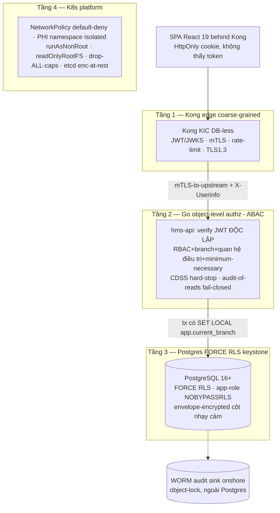

# 09 — Security: AuthN/Z, Defense-in-Depth, Encryption, RLS, OWASP, PHI Compliance

> Tài liệu source-of-truth về bảo mật HMS — đọc TRƯỚC khi code bất kỳ auth/PHI path nào. Mọi control ở đây là fail-closed có test, không phải khẩu hiệu. Repo CHƯA CÓ CODE: mọi tham chiếu code path đánh dấu *(planned)* theo layout repo ở `doc/01-kien-truc-tong-the.md` §9.
>
> Liên quan: `doc/01-kien-truc-tong-the.md` (4 tầng defense-in-depth), `doc/06-identity-rbac-audit.md` (RBAC/ABAC + audit + break-the-glass), `doc/08-database-schema.md` (RLS policy + scope cột mã hóa), `doc/10-deployment-operations.md` (KMS/ESO + degraded-mode runbook), `doc/15-devsecops-cicd.md` (security gates merge-blocking).

---

## 1. Triết lý: defense-in-depth fail-closed, không tin tầng nào tuyệt đối

Nguyên tắc bất biến: KHÔNG control đơn lẻ nào là điểm phòng thủ duy nhất, và mọi control liên quan PHI/an toàn người bệnh **fail-closed** — khi không chắc thì TỪ CHỐI, không cho qua. Đây là khác biệt sống còn so với một HMS "có auth": modal CDSS bị bypass được, gateway có CVE, audit async mất record khi crash — nên mỗi tầng phải đứng vững kể cả khi tầng trên thủng.



| Tầng | Thành phần | Trách nhiệm bảo mật | ADR |
|------|-----------|---------------------|-----|
| 1 — Edge | Kong KIC DB-less | Coarse-grained: verify JWT/JWKS (reject `alg=none`), TLS 1.3 terminate + mTLS-to-upstream, rate-limit (Redis), request-size, ip-restriction admin path, bot-detect. **KHÔNG quyết object-level authz** | ADR-013, ADR-019 |
| 2 — App | Go `hms-api` | Verify JWT **độc lập** (không mù tin header), object-level/ABAC, CDSS hard-stop, audit-of-reads fail-closed, set GUC `app.current_branch` từ claim | ADR-008, ADR-009, ADR-013 |
| 3 — Data | PostgreSQL RLS | FORCE RLS branch-isolation keystone, app-side envelope encryption cột siêu nhạy, audit_log INSERT-only hash-chain | ADR-003, ADR-005, ADR-014 |
| 4 — Platform | Kubernetes onshore | NetworkPolicy default-deny, PHI namespace isolated, pod hardening, etcd encryption-at-rest, secrets qua KMS/ESO | ADR-002, ADR-019 |

---

## 2. Tầng 1 — Kong edge: coarse-grained, KHÔNG bao giờ object-level *(MVP)*

Kong là **edge filter**, không phải authorizer lâm sàng — gateway không có context "bác sĩ này có đang điều trị bệnh nhân kia không". Phân vai tuyệt đối (ADR-013):

| Kong LÀM (edge) | Kong KHÔNG bao giờ làm |
|-----------------|------------------------|
| Verify JWT signature qua JWKS Keycloak, reject `alg=none` | Quyết "user X xem được record Y" (object-level → Go) |
| TLS 1.3 terminate + mTLS tới upstream | Lọc branch_id / RLS |
| Rate-limit (Redis), request-size-limit | CDSS / business rule |
| ip-restriction trên admin path, bot-detect | Tin tưởng làm source-of-truth identity |
| BFF cho SPA: auth-code+PKCE, token trong HttpOnly+Secure+SameSite=Strict cookie, inject `X-Userinfo` tới upstream | — |

Kong KIC DB-less/declarative (Gateway API + KongPlugin CRD), 2+ data-plane replica + PDB, **version-pinned + patch là CI/admission gate** vì CVE-2026-29413 (xem §7). Config GitOps-versioned, reconciled bởi Argo CD — `deploy/kong/` *(planned)*.

```yaml
# deploy/kong/plugins/jwt-jwks.yaml (planned) — verify JWT qua JWKS, reject alg=none
apiVersion: configuration.konghq.com/v1
kind: KongPlugin
metadata: { name: jwt-keycloak }
config:
  allowed_iss: ["https://keycloak.hms.internal/realms/hospital"]
  algorithm: RS256        # alg=none bị reject tường minh
  run_on_preflight: true
plugin: jwt
```

---

## 3. Tầng 2 — Go object-level / ABAC: nơi BOLA bị chặn *(MVP)*

BOLA (Broken Object Level Authorization, OWASP API #1) là lỗ hổng số một của hệ thống y tế. Vì Kong không có context lâm sàng, **mọi quyết định object-level enforce trong Go** ở tầng `app/` (ADR-013). Decision dựa trên 4 trục ABAC:

1. **role** (persona): `bac_si / dieu_duong / duoc_si / le_tan / thu_ngan / giam_dinh / quan_tri` — từ Keycloak group, cached roles (short-TTL 5–15m token, KHÔNG per-request DB lookup).
2. **branch**: `branch_id` từ JWT claim đã verify — KHÔNG bao giờ từ client (chống tenant spoofing, ADR-005).
3. **quan hệ điều trị** (treatment relationship): user có liên quan tới Encounter/Patient này không.
4. **minimum-necessary**: chỉ trả field cần cho vai trò (HIPAA §164.502(b) / NĐ13 nguyên tắc tối thiểu).

Quy ước **404 không 403** cho resource khác branch (ADR-003): trả 403 sẽ lộ "record tồn tại ở branch khác" — leak thông tin tồn tại. Resource ngoài phạm vi RLS đơn giản là *không tồn tại* với caller.

```go
// internal/shared/auth/authz.go (planned) — object-level guard, fail-closed
func (g *Guard) AuthorizePatientRead(ctx context.Context, sub Subject, patientID uuid.UUID) error {
    // sub.BranchID, sub.Roles trích từ JWT đã verify ĐỘC LẬP (không từ X-Userinfo mù)
    rel, err := g.repo.TreatmentRelationship(ctx, sub.StaffID, patientID)
    if err != nil {
        return ErrAuthzUnavailable // fail-closed: lỗi check => từ chối, KHÔNG cho qua
    }
    if !rel.Exists && !sub.HasBreakGlass(patientID) {
        return ErrNotFound // 404 không 403 — không lộ tồn tại cross-branch
    }
    return nil
}
```

`hms-api` **verify JWT signature/claims độc lập** — không mù tin `X-Userinfo` header từ Kong (ADR-013, defense-in-depth chống CVE-2026-29413, xem §7). Middleware trích `branch_id`+`roles` từ token đã verify rồi SET LOCAL GUC (§4).

---

## 4. Tầng 3 — FORCE RLS keystone: cách ly chi nhánh bất biến *(MVP, Phase-0)*

Đây là **keystone PHI** — không retrofit được sau khi có data multi-tenant (ADR-003, risk [critical] §8 canon). Lỗ hổng âm thầm: PostgreSQL table **OWNER bypass RLS kể cả với `NOBYPASSRLS`**. Nếu golang-migrate chạy DDL bằng app-role thì app-role thành owner → RLS thành no-op, mọi diagram nói "isolated" nhưng leak production.

Bốn điều kiện cứng (Migration `000001_phase0_compliance.up.sql` *(planned)*, ADR-024):

1. Mọi bảng PHI `ENABLE` **VÀ** `FORCE ROW LEVEL SECURITY`.
2. **Tách role**: `hms_migration_owner` (sở hữu bảng, chạy DDL) khác `hms_app` (`NOSUPERUSER, NOBYPASSRLS`, KHÔNG sở hữu bảng).
3. Mọi policy có **CẢ `USING` VÀ `WITH CHECK`** — chỉ `USING` cho phép write cross-tenant (poisoning vector).
4. **CI integration test (testcontainers)** chứng minh dữ liệu branch-B vô hình dưới `app.current_branch=A` — là **merge-blocking gate** (ADR-025).

```sql
-- migrations/000001 (planned) — RLS keystone, branch_id từ session GUC
CREATE ROLE hms_migration_owner NOLOGIN;
CREATE ROLE hms_app NOLOGIN NOSUPERUSER NOBYPASSRLS;   -- KHÔNG owner, KHÔNG bypass

ALTER TABLE encounters ENABLE ROW LEVEL SECURITY;
ALTER TABLE encounters FORCE ROW LEVEL SECURITY;       -- FORCE: owner cũng bị áp policy
CREATE POLICY branch_isolation ON encounters
  USING      (branch_id = current_setting('app.current_branch')::uuid)
  WITH CHECK (branch_id = current_setting('app.current_branch')::uuid);
```

### 4.1 Session-var contract — invariant có test, không phải prose

`SET LOCAL` chỉ sống trong transaction. Vì pgx pool reuse connection, **bất kỳ PHI query nào chạy ngoài tx (hoặc sau tx) sẽ revert về no-branch-filter → leak** (risk [critical] §8). Hợp đồng: MỌI PHI query chạy trong tx đã SET LOCAL GUC; có explicit test + lint check.

```go
// internal/shared/rls/tx.go (planned) — middleware-to-tx contract
func WithBranchTx(ctx context.Context, pool *pgxpool.Pool, branchID uuid.UUID, fn func(pgx.Tx) error) error {
    tx, err := pool.Begin(ctx)
    if err != nil { return err }
    defer tx.Rollback(ctx)
    // SET LOCAL: chỉ hiệu lực trong tx này, không leak sang query sau trên cùng conn
    if _, err = tx.Exec(ctx, "SET LOCAL app.current_branch = $1", branchID.String()); err != nil {
        return err
    }
    if err = fn(tx); err != nil { return err }
    return tx.Commit(ctx)
}
```

Vai trò liên-chi-nhánh (giám định/quản lý vùng) qua policy escalation `cross_branch_reader` — KHÔNG bằng cách bỏ RLS (ADR-005). MPI/Patient dùng chung xuyên chi nhánh, `patient_identifiers` xử lý cross-branch cẩn trọng.

---

## 5. Encryption: TLS 1.3 + AES-256-GCM envelope + KMS, MỘT cơ chế *(MVP)*

Ba lớp mã hóa, không chồng cơ chế (ADR-014, ADR-021):

| Lớp | Cơ chế | Phạm vi |
|-----|--------|---------|
| In transit | TLS 1.3 (Kong terminate) + **mTLS** Kong↔upstream và HMS↔BHYT gateway (client cert trong secret store) | Toàn bộ traffic |
| At rest (platform) | K8s **etcd encryption-at-rest** + Postgres volume encryption (managed/CNPG) | Toàn bộ data |
| At rest (field, siêu nhạy) | **App-side AES-256-GCM envelope** với KMS-wrapped DEK + **blind-index HMAC** cho cột tra cứu | CHỈ cột hẹp |

**Một cơ chế crypto app-side** — KHÔNG đồng thời pgcrypto DB-side + Vault Transit (ADR-014). Lý do: broken Vault = app không decrypt PHI (availability = patient-safety risk); over-scope mã hóa phá RLS-indexed query + reception lookup.

**Scope cột siêu nhạy (chốt trong `doc/08-database-schema.md` TRƯỚC khi có data):** CCCD, số thẻ BHYT, dữ liệu HIV/tâm thần/di truyền. Bảng `patient_identifiers` tách riêng để giới hạn bề mặt giải mã.

**Blind-index HMAC** giải bài toán "encrypted column không searchable": reception tra cứu CCCD/số thẻ bằng exact-match trên cột `blind_index` deterministic (HMAC) thay vì giải mã toàn bảng. Chấp nhận leak một số thông tin tần suất — đánh đổi cho exact-match lookup.

```go
// internal/shared/crypto/envelope.go (planned) — AES-256-GCM, DEK wrapped bởi KMS
func (e *Envelope) Encrypt(ctx context.Context, plaintext []byte) (Ciphertext, error) {
    dek, wrappedDEK, err := e.kms.GenerateDataKey(ctx)   // KMS sinh + wrap DEK (VNG/Viettel KMS)
    if err != nil { return Ciphertext{}, err }            // fail-closed
    nonce := randNonce(12)
    ct := aesgcm(dek).Seal(nil, nonce, plaintext, nil)    // AES-256-GCM, AEAD chống tamper
    zeroize(dek)                                          // xóa DEK plaintext khỏi memory
    return Ciphertext{Blob: ct, Nonce: nonce, WrappedDEK: wrappedDEK}, nil
}
```

**Thanh toán viện phí qua cổng thứ ba** (VNPay/Momo/napas) redirect/tokenization — HMS KHÔNG chạm/lưu số thẻ thật, chỉ lưu token + transaction id → giữ HMS **ngoài PCI-DSS scope** (ADR-021).

---

## 6. CDSS hard-stop fail-closed + audit-of-reads fail-closed *(MVP)*

Hai control patient-safety chuyển từ khẩu hiệu thành cơ chế có test.

### 6.1 CDSS dị ứng/tương tác — hard-stop ở backend aggregate (ADR-008)

React modal CHỈ là UX, KHÔNG phải control (bypassable qua devtools/API/network). Hard-stop enforce ở order/dispense aggregate (server-side):

- Command bị **reject** trừ khi có **override record** (reason + authorizer) ghi audit.
- CDSS error/timeout → **fail-closed**: KHÔNG confirm "no known interaction".
- Bệnh nhân không có allergy data → trạng thái **"allergy status unknown" tách bạch**, hiển thị rõ, **KHÔNG BAO GIỜ render là "safe"** ("unknown" ≠ "safe" là phân biệt sống còn).

```go
// internal/pharmacy/domain/dispense.go (planned) — hard-stop fail-closed
func (d *Dispense) Authorize(check CDSSResult, override *Override) error {
    switch check.Status {
    case CDSSClear:
        return nil
    case CDSSUnknown, CDSSError, CDSSTimeout:   // fail-closed: KHÔNG coi là safe
        if override == nil { return ErrCDSSUnavailableNoOverride }
    case CDSSInteraction, CDSSAllergy:
        if override == nil { return ErrHardStopNoOverride }
    }
    return d.recordOverride(override)  // override luôn ghi audit (ai/lý do)
}
```

### 6.2 Audit-of-reads — commit-with-response (ADR-009)

Đọc PHI **ghi audit commit cùng/trước response** (KHÔNG best-effort async): nếu audit write fail thì **KHÔNG trả PHI** (fail-closed). Lý do: rollback/crash mất audit = vi phạm HIPAA §164.312(b) / NĐ13 / TT13.

- `audit_log` **INSERT-only** (policy chặn UPDATE/DELETE `USING false` kể cả app-role), partition theo tháng, FORCE RLS.
- **hash-chain**: mỗi record chứa hash record trước → tamper-evident (Postgres-policy "immutable" KHÔNG chống DBA/superuser, nên hash-chain là bắt buộc).
- Stream **WORM sink ngoài Postgres** (object-lock onshore).
- Ghi: who / when / action(`read|create|update|delete|print|export`) / resource / patient_id / before-after / ip / session / branch.
- State-change audit qua outbox; chỉ READ-audit là commit-with-response.

Hash-chain phải **survive PITR restore** — có test restore + verify chain (risk [high] §8).

---

## 7. CVE-2026-29413 — Kong auth-bypass: Go là backstop *(MVP)*

CVE-2026-29413 (CISA-KEV, đã exploited trên healthcare gateways) là auth-bypass Kong. Kịch bản nguy hiểm: auth bypass nhưng mTLS vẫn cho Kong tới upstream → nếu app **mù tin** `X-Userinfo` header thì sẽ tin **forged identity**.

Phòng thủ nhiều lớp (ADR-013):

1. **Go verify JWT signature/claims độc lập** — không tin header mù. Identity source-of-truth là token đã verify trong app, không phải Kong header.
2. **Object-level/ABAC ở Go là backstop** chống BOLA kể cả khi edge thủng.
3. **Kong version-pin + patch là CI/admission gate** — image Kong ngoài version cho phép bị admission controller reject.
4. **mTLS-to-upstream** giới hạn ai gọi được upstream.

---

## 8. MFA / step-up / break-the-glass *(MVP)*

| Control | Cơ chế | ADR |
|---------|--------|-----|
| MFA | Bắt buộc (TOTP tối thiểu, WebAuthn/passkey ưu tiên) qua Keycloak 26 | ADR-013 |
| Step-up auth | Cho hành động nhạy cảm (ký EMR, dispense, break-the-glass) | ADR-013 |
| Token | Short-TTL 5–15m + cached roles, KHÔNG per-request DB lookup; role KHÔNG nhúng cứng | ADR-013 |
| PKI signing | Chữ ký số EMR/đơn thuốc (TT 13/2025) — Phase-0 chỉ field signedBy/At/blob/hash; full Vault PKI earn-in sau | ADR-004, ADR-014 |

**Break-the-glass** (ADR-010) — time-boxed + scoped + closed review loop, áp dụng cho CẢ access VÀ creation/ordering (ED register-first-identify-later):

- Nhân viên khai lý do → cấp quyền tạm **auto-expire N giờ**, **scoped** tới patient/encounter cụ thể.
- Sinh audit **cờ đỏ** + thông báo security officer.
- Có **named reviewer role + hard review SLA + consequence path** khi lạm dụng — không có closed loop thì auditor NĐ13 coi là finding.

---

## 9. OWASP API Top 10 — mapping control

| OWASP API | Rủi ro HMS | Control HMS | ADR |
|-----------|-----------|-------------|-----|
| API1 BOLA | Bác sĩ A xem bệnh nhân branch B | Object-level/ABAC ở Go + FORCE RLS + 404-not-403 | ADR-003, ADR-013 |
| API2 Broken Auth | Token giả, alg=none | Kong verify JWKS reject `alg=none` + Go verify độc lập + MFA | ADR-013 |
| API3 BOPLA | Over-fetch field nhạy cảm | minimum-necessary projection + field-level encryption | ADR-014 |
| API4 Resource Consumption | DoS cổng PHI | Kong rate-limit (Redis) + request-size-limit | ADR-019 |
| API5 BFLA | Le_tan gọi dispense API | RBAC persona + ABAC function-level guard ở Go | ADR-013 |
| API6 Sensitive Biz Flow | Replay dispense/charge double-post | Idempotency-key end-to-end (FE+BE một scheme) | ADR-011 |
| API7 SSRF | Adapter BHYT/donthuoc gọi nội bộ | Allowlist endpoint + NetworkPolicy default-deny | ADR-002 |
| API8 Misconfig | Kong CVE, pod privilege | Version-pin admission gate + pod hardening | ADR-013, ADR-019 |
| API9 Inventory | Endpoint không quản lý | OpenAPI source-of-truth + Kong route declarative | ADR-018 |
| API10 Unsafe Consumption | Tin mù external response | Validate XML 4750 / donthuoc response tại boundary | ADR-006 |

---

## 10. Data residency + DPIA + data-subject-rights *(MVP, Phase-0)*

- **PHI onshore Việt Nam** (NĐ 53/2022 + NĐ 13/2023): Keycloak self-hosted onshore, managed PG VN (VNG/Viettel/FPT), WORM sink onshore, KMS VN. KHÔNG IdP/RDS SaaS nước ngoài (ADR-013, ADR-015).
- **DPIA** (hồ sơ đánh giá tác động xử lý DLCN) là **Phase-0 legal deliverable có deadline** — NĐ13: nộp Bộ Công an/A05 trong **60 ngày kể từ go-live** (ADR-020). Xác nhận thêm nghĩa vụ theo **Luật Bảo vệ DLCN (hiệu lực 2026, đang superseding NĐ13)**.
- **Consent + data-subject-rights** (truy cập/xóa/rút đồng ý) là blocking legal artifact TRƯỚC production data; consent enforcement ở Go trước xử lý ngoài mục đích điều trị.

### Mapping control → khung pháp lý

| Control HMS | HIPAA | GDPR | NĐ 13/2023 | TT VN |
|-------------|-------|------|------------|-------|
| FORCE RLS branch-isolation | §164.312(a) Access Control | Art.32 | Đ.26 an toàn DLCN | — |
| Audit-of-reads + hash-chain + WORM | §164.312(b) Audit Controls | Art.30 | Đ.26 | TT13/2025 |
| AES-256-GCM envelope + TLS1.3 | §164.312(a)(2)(iv)/(e) | Art.32 | Đ.26 | — |
| MFA + step-up + RBAC/ABAC | §164.312(d) | Art.32 | Đ.26 | — |
| EMR ký số PKI | — | — | — | TT13/2025 (hạn 30/9/2025) |
| E-prescription liên thông | — | — | — | TT26/2025 + QĐ808 |
| Break-the-glass closed loop | §164.312(a)(2)(ii) | Art.32 | Đ.26 | — |
| DPIA + consent + DSR | — | Art.35/15-17 | Đ.24/26 (A05 60 ngày) | — |
| BHYT XML ký số + mTLS | — | — | — | QĐ4750 (sửa 3176) |

---

## 11. Go-live blockers (security gate — không go-live nếu thiếu)

| # | Blocker | Cơ chế xác minh | ADR / Risk |
|---|---------|-----------------|------------|
| 1 | FORCE RLS + role-separation + USING&WITH-CHECK ở Migration 000001 | CI testcontainers test branch-B invisible — **merge-blocking** | ADR-003, risk [critical] |
| 2 | Session-var SET LOCAL trong tx mọi PHI query | Explicit invariant test + lint check (pgx pool reuse) | ADR-005, risk [critical] |
| 3 | CDSS hard-stop fail-closed (allergy-unknown ≠ safe) | E2E test cho error/timeout/unknown mode | ADR-008, risk [critical] |
| 4 | Audit-of-reads commit-with-response + hash-chain + WORM | E2E test: audit fail → không trả PHI; verify chain survive PITR | ADR-009, risk [critical] |
| 5 | EMR ký số PKI hợp lệ (TT13) + e-prescription liên thông (TT26) | In phiếu có mã đơn quốc gia + chữ ký số hợp lệ | ADR-004/007, risk [critical] |
| 6 | Kong version-pin + patch CVE-2026-29413 + Go verify JWT độc lập | CI/admission gate reject image ngoài version | ADR-013, risk [high] |
| 7 | App-side envelope encryption + blind-index, scope chốt trước data | Scope cột chốt trong `doc/08-database-schema.md` | ADR-014, risk [high] |
| 8 | DPIA + consent + data-subject-rights (legal artifact) | Phase-0 deliverable có owner, deadline A05 60 ngày | ADR-020, risk [high] |
| 9 | Security gates merge-blocking: Gitleaks, govulncheck, golangci-lint, Trivy | CI pipeline xanh trước merge | ADR-019 |
| 10 | Degraded-mode BHYT/cashier không bao giờ chặn người bệnh | Runbook + E2E test cổng-lỗi path | ADR-006, risk [high] |

> **Secrets management:** static-but-rotated secrets qua **cloud KMS (VNG/Viettel) HOẶC External Secrets Operator** (ADR-014); client cert BHYT trong secret store (ADR-021); KHÔNG hardcode secret (Gitleaks gate). Full Vault (PKI signing thật / dynamic DB creds) là earn-in trigger sau MVP, KHÔNG ngày 1 (ADR-002). Chi tiết vận hành: `doc/10-deployment-operations.md`.
