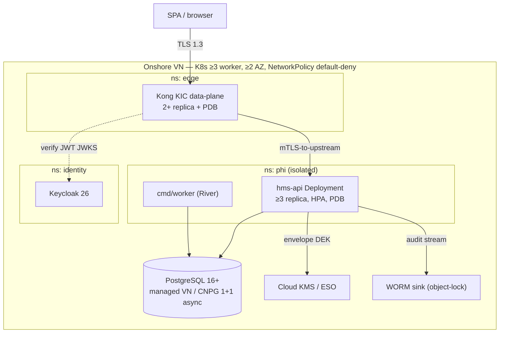
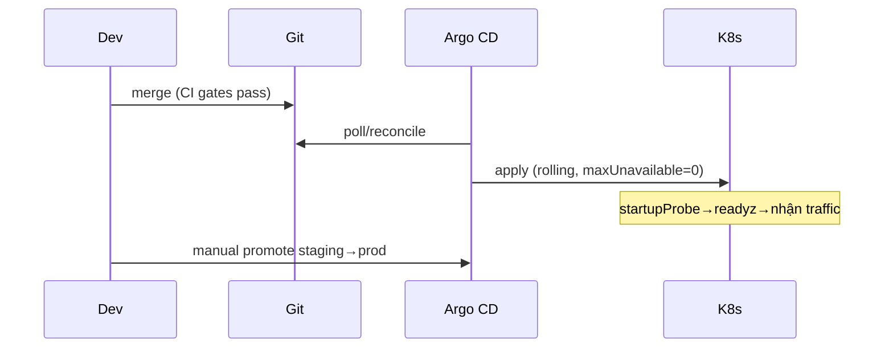

# 10 — Triển khai & Vận hành (Deployment & Operations)

> Hạ tầng K8s onshore VN, MVP component budget + earn-in triggers, Postgres managed/CNPG-async, Deployment/HPA/PDB/probes/securityContext, Argo CD rolling, backup/PITR + RTO/RPO, degraded-mode runbooks (BHYT/cashier), DR. Đây là nguồn sự thật về *cách chạy* HMS trong production. Repo **chưa có code** — mọi manifest/code path dưới đây là **thiết kế mục tiêu** *(planned)*, layout theo canon §9.
>
> Liên quan: [01-kien-truc-tong-the](./01-kien-truc-tong-the.md) (topology), [08-database-schema](./08-database-schema.md) (RLS/migration 000001), [09-security](./09-security.md) (secrets/encryption), [15-devsecops-cicd](./15-devsecops-cicd.md) (Argo CD/observability/gates), [16-iac-runbooks](./16-iac-runbooks.md) (OpenTofu/Helm/runbook chi tiết), [12-roadmap](./12-roadmap.md) (earn-in DoD).

---

## 1. Named operating model — AI VẬN HÀNH (ADR-002)

Quyết định nền tảng, đứng **TRƯỚC** cả lựa chọn stack: chốt *ai vận hành* rồi mới chốt *chạy cái gì*. Đây là binding theo **ADR-002**.

| Giai đoạn | Mô hình vận hành | Hệ quả lên budget |
|---|---|---|
| **MVP (Phase 0–1)** | **Dev team kiêm ops** — đội IT bệnh viện nhỏ vừa rời giấy, không có DBA/SRE chuyên trách | Chỉ được phép chạy các thành phần stateful trong "MVP component budget" (§2). Một Vault/HA-Postgres/Kafka vận hành kém **nguy hiểm cho PHI hơn** một managed đơn giản |
| **Mở rộng (Phase 2+)** | Dedicated SRE khi quy mô/đội tăng | Mở khóa các deferred system **chỉ khi** earn-in trigger đạt (§3) |

Nguyên tắc cưỡng chế: **operational risk = PHI risk**. Mọi đề xuất thêm một hệ thống stateful phải dẫn chứng trigger đã đạt; review pipeline kiểm budget (xem [15-devsecops-cicd](./15-devsecops-cicd.md)).

---

## 2. MVP component budget cứng (ADR-002)

MVP **chỉ** chạy đúng các thành phần stateful sau — và **không hệ thống stateful nào khác**:

| Thành phần | Lựa chọn pinned | ADR | Vai trò |
|---|---|---|---|
| Database OLTP | PostgreSQL 16+ — **VN-managed ưu tiên**, fallback **CNPG 1 primary + 1 async replica** | ADR-015 | System-of-record, outbox, audit, River jobs |
| Backend | **Go modular monolith** (`hms-api`, một deployable) | ADR-001 | Toàn bộ 14 BC trong một container |
| API Gateway | **Kong Ingress Controller (KIC) DB-less/declarative** | ADR-019 | Edge auth + BFF, no Kong Postgres |
| Secrets | **Cloud KMS (VNG/Viettel) HOẶC External Secrets Operator (ESO)** | ADR-014 | KMS-wrapped DEK + static-but-rotated secrets |
| GitOps deploy | **Argo CD app-of-apps ROLLING + manual promotion** | ADR-019 | Reconcile cluster state |
| Observability | **OTel Collector → Prometheus + Loki + Grafana + Alertmanager** | ADR-019 | Metrics + logs + multi-window burn-rate |

**KHÔNG ở MVP** (defer, có trigger): Vault-đầy-đủ, NATS/Kafka, Debezium/CDC, OIE HL7v2 sidecar, Orthanc/PACS, FHIR facade, service mesh, Argo Rollouts canary, Tempo/distributed-tracing, KGO (Kong Gateway Operator).

> Messaging MVP là **transactional outbox in-process** (cùng `pgx.Tx`, `SELECT FOR UPDATE SKIP LOCKED`) — **không broker ngoài** (ADR-012). Background jobs duy nhất qua **River** (Postgres-native): claim submit/retry, FEFO sweep, reminder, audit retention, outbox cleanup.

---

## 3. Earn-in trigger table — defer cái gì, mở khi nào

Mỗi hệ thống defer gắn với **một trigger viết sẵn**. Không "thêm cho chắc". Tổng hợp DoD ở [12-roadmap](./12-roadmap.md).

| Deferred system | Earn-in trigger | Phase | ADR |
|---|---|---|---|
| Kafka/NATS broker | Tách BC đầu tiên ra service riêng → swap outbox relay adapter, domain code không đổi | 3 | ADR-001, ADR-012 |
| Vault-đầy-đủ | Cần **PKI signing thật** / **dynamic DB creds** / service extraction | 3–4 | ADR-014 |
| Debezium/CDC + Kafka | Analytics volume justify (trước đó scheduled SQL→read-table) | 3 | ADR-012 |
| OIE HL7v2 sidecar | Lab interface máy / engine boundary cần (namespace `interop`, **KHÔNG sau Kong**) | 2 | ADR-016 |
| Orthanc DICOM/PACS | Triển khai CĐHA/RIS | 2 | ADR-016 |
| FHIR R4 facade | Phase 2 — **không lock samply/golang-fhir-models** (dead ~3.5y), đánh giá lại lúc đó | 2 | ADR-017 |
| Service mesh (Linkerd) | Khi BC tách thành nhiều service | 3 | ADR-019 |
| Argo Rollouts canary + SLO-auto-rollback | Multi-service maturity | 3 | ADR-019 |
| Tempo/distributed-tracing | Khi có nhiều service (một service → tracing vô nghĩa) | 3 | ADR-019 |
| SLSA/Cosign/ZAP | Sau khi pipeline ổn (giữ Gitleaks/govulncheck/golangci-lint/Trivy MVP) | 3 | ADR-019 |
| DB-per-branch | Branch cực lớn cần cô lập pháp lý/hiệu năng | 4 | ADR-005 |
| Device fleet (cart/tablet/HID scanner mỗi khoa) | **Hard adoption dependency** cho IPD/eMAR — nếu thiếu, điều dưỡng ghi giấy rồi back-enter (phá audit + CDSS realtime) | 2 | risk [medium] §8 |

---

## 4. Kubernetes topology onshore VN

Toàn bộ hạ tầng + PHI **onshore tại Việt Nam** (NĐ 53/2022 + NĐ 13/2023). Provider VN-managed (VNG/Viettel/FPT) hoặc cluster onshore tự quản.



- **Cluster:** dev/staging/prod là **namespace-per-env ngày 1**; **prod tách cluster riêng tại go-live**. ≥3 worker, ≥2 AZ.
- **NetworkPolicy default-deny:** mọi namespace; chỉ mở ingress/egress cần thiết. **PHI namespace isolated**.
- **TLS:** cert-manager phát chứng chỉ; Vault/VN-CA issuer cho internal mTLS. K8s **etcd encryption-at-rest** bật.
- **OIE sidecar (Phase 2):** đặt trong namespace `interop` riêng, **KHÔNG đặt sau Kong** (ADR-016).
- IaC: **OpenTofu** cho cloud/cluster/network; **Helm** cho operators (CNPG/Kong/ESO/kube-prometheus); **Kustomize overlays** per-env. Chi tiết ở [16-iac-runbooks](./16-iac-runbooks.md). *(planned)* `infra/` + `deploy/{helm,kustomize,kong,argocd}` (canon §9).

---

## 5. Deployment spec — hms-api (ADR-019)

Spec bắt buộc cho `hms-api` *(planned: `deploy/kustomize/base`)*:

```yaml
apiVersion: apps/v1
kind: Deployment
metadata: { name: hms-api, namespace: phi }
spec:
  replicas: 3                       # ≥3 replica
  strategy:
    type: RollingUpdate
    rollingUpdate: { maxUnavailable: 0, maxSurge: 1 }  # KHÔNG canary ở MVP
  template:
    spec:
      securityContext:
        runAsNonRoot: true
        seccompProfile: { type: RuntimeDefault }
      topologySpreadConstraints:     # rải replica qua AZ/node
        - maxSkew: 1
          topologyKey: topology.kubernetes.io/zone
          whenUnsatisfiable: DoNotSchedule
          labelSelector: { matchLabels: { app: hms-api } }
      containers:
        - name: hms-api
          image: registry.onshore.vn/hms-api@sha256:...   # digest-pinned
          securityContext:
            allowPrivilegeEscalation: false
            readOnlyRootFilesystem: true
            capabilities: { drop: ["ALL"] }
          livenessProbe:  { httpGet: { path: /livez,  port: 8080 } }
          readinessProbe: { httpGet: { path: /readyz, port: 8080 } }
          startupProbe:   { httpGet: { path: /readyz, port: 8080 }, failureThreshold: 30, periodSeconds: 2 }
          resources:
            requests: { cpu: 250m, memory: 256Mi }
            limits:   { memory: 512Mi }
```

| Control | Giá trị | Lý do |
|---|---|---|
| `replicas` | ≥3 | HA, rolling không gián đoạn |
| `maxUnavailable` | 0 | Không giảm capacity khi rollout (clinical-read SLO) |
| Probes | `/livez` + `/readyz` + `startupProbe` | `/readyz` fail khi DB/KMS unreachable → không nhận traffic |
| `securityContext` | runAsNonRoot + readOnlyRootFS + drop-ALL + seccomp RuntimeDefault | hardening, giảm bề mặt tấn công |
| HPA | scale theo CPU/mem (target ~70%) | co giãn tải tiếp đón cao điểm |
| PDB | `minAvailable: 2` | node drain/upgrade không hạ dưới ngưỡng |
| topologySpread | qua zone | sống sót mất 1 AZ |

```yaml
apiVersion: policy/v1
kind: PodDisruptionBudget
metadata: { name: hms-api-pdb, namespace: phi }
spec:
  minAvailable: 2
  selector: { matchLabels: { app: hms-api } }
```

> `cmd/worker` (River) chạy Deployment riêng (1–2 replica đủ, River dùng `SKIP LOCKED` để an toàn nhiều worker). Kong data-plane: **2+ replica + PDB**, version-pinned, patch là CI/admission gate (CVE-2026-29413, ADR-013/019).

**Readiness gating mở rộng:** `/readyz` phải phản ánh phụ thuộc hard — DB reachable + migration version khớp + KMS reachable (cần decrypt DEK). Pod **không** ready khi KMS down → tránh trả lỗi giải mã PHI giữa request.

---

## 6. PostgreSQL: managed-vs-CNPG + signed-EMR durability (ADR-015)

```mermaid
flowchart LR
  subgraph opt1["Ưu tiên 1: VN-managed PG"]
    M[("Managed PG<br/>VNG/Viettel/FPT")]
  end
  subgraph opt2["Fallback: CNPG"]
    P[("Primary")] -->|ASYNC<br/>(KHÔNG sync)| R[("Replica")]
    P --> WAL["WAL archive → onshore S3"]
    P --> BB["base backup"]
  end
```

- **Ưu tiên VN-managed PG** (đạt residency NĐ13/53) để bỏ gánh nặng vận hành DBA lớn nhất.
- Nếu không có managed onshore chấp nhận được → **CNPG 1 primary + 1 ASYNC replica** (Helm operator). **KHÔNG 2 sync replica**: sync gấp đôi write-latency trên charge/claim path + risk write-stall khi replica lag.
- WAL archive + base backup tới **onshore S3-compatible object storage**.

### Signed-EMR / MAR — synchronous durability riêng (ADR-004, ADR-015)
Platform PITR RPO≤5min **KHÔNG ĐỦ** cho record pháp lý/an toàn. Write path ký số EMR (TT 13/2025) và MAR (Phase 2) phải **commit confirmed trước khi UI báo 'signed'/'administered'**:

| Path | Durability | Vì sao |
|---|---|---|
| EMR ký số, MAR | **Synchronous durability** (`synchronous_commit=on` confirmed; trên CNPG cân nhắc remote_apply cho riêng path này) | Mất record ký số = mất chứng cứ pháp lý; không được "đã ký" nhưng rollback |
| Charge/claim path | Async replica đủ | 2 sync gấp đôi latency, không đáng đổi |

Hash-chain audit (ADR-009) **phải sống sót PITR restore** — restore xong verify chain liền mạch (xem §9).

---

## 7. Secrets & encryption operations (ADR-014)

**MỘT cơ chế crypto app-side** — KHÔNG đồng thời pgcrypto DB-side + Vault Transit.

| Hạng mục | Cơ chế | Vận hành |
|---|---|---|
| Static-but-rotated secrets (DB creds, JWKS, app keys) | Cloud KMS (VNG/Viettel) **hoặc** External Secrets Operator | ESO sync từ backend → K8s Secret; rotation theo lịch |
| Cột siêu nhạy (CCCD, số thẻ BHYT, HIV/tâm thần/di truyền) | **App-side AES-256-GCM envelope** với **KMS-wrapped DEK** | DEK rotation qua KMS; scope hẹp chốt ở [08-database-schema](./08-database-schema.md) |
| Cột tra cứu exact-match (CCCD/thẻ tại tiếp đón) | **Blind-index HMAC deterministic** | Cho phép reception lookup mà không giải mã |
| BHYT outbound client cert | mTLS + chữ ký số, **client cert trong secret store** | KHÔNG hard-code (ADR-021) |
| etcd | encryption-at-rest | cấu hình cluster |

> **Availability = safety:** nếu KMS không reachable, `hms-api` không decrypt được PHI → pod fail `/readyz` (§5). Đây là lý do KMS nằm trong readiness gate, không phải lazy-init im lặng.

---

## 8. Backup / PITR + RTO / RPO + restore drill (ADR-015)

| Chỉ tiêu | Mục tiêu MVP | Ghi chú |
|---|---|---|
| **RPO** (platform chung) | ≤ 5 phút | WAL archive liên tục |
| **RPO** (signed-EMR/MAR) | 0 (synchronous durability) | tách khỏi RPO chung — §6 |
| **RTO** | ≤ 1 giờ | đo thật bằng restore drill, không phải con số trên giấy |
| Base backup | hàng ngày + WAL liên tục → onshore S3 | residency onshore |
| **Restore drill** | **Quarterly** (giữ — DR practice thực sự quan trọng) | restore vào ephemeral namespace, đo RTO thực, verify hash-chain |

**Restore drill là gate vận hành** (không phải tùy chọn): mỗi quý restore một PITR snapshot vào namespace ephemeral, chạy CI branch-isolation test (RLS branch-B invisible — ADR-003) + verify audit hash-chain liền mạch (ADR-009), đo RTO thực. Kết quả ghi nhận như compliance artifact. Runbook chi tiết ở [16-iac-runbooks](./16-iac-runbooks.md).

---

## 9. Argo CD rolling deploy (ADR-019)

- **Argo CD app-of-apps** reconcile toàn bộ: `hms-api`, `cmd/worker`, Kong KIC config (Gateway API + KongPlugin CRD, DB-less), Keycloak, operators. *(planned)* `deploy/argocd/`.
- **ROLLING deploy + manual promotion** giữa env. **KHÔNG** Argo Rollouts canary / SLO-auto-rollback ở MVP (maturity-L4 cho team chưa ship v1).
- Kong config là **GitOps-versioned YAML** — mọi thay đổi gateway qua PR + Argo reconcile, không `kubectl` ad-hoc.
- Image **digest-pinned** (`@sha256:`), Kong **version-pinned + patch gate** (CVE-2026-29413).
- Rollback = revert Git → Argo reconcile về revision trước. Trước promote prod: chạy migration (`cmd/migrate`) zero-downtime (add nullable/DEFAULT, add→backfill→switch→drop, `CREATE INDEX CONCURRENTLY` tách tx — ADR-024).



---

## 10. Degraded-mode operational runbooks (ADR-006, ADR-008, ADR-009)

**"Cổng/mạng lỗi" là trigger #1 khiến staff quay về giấy** (risk [high] §8 canon). Degraded-mode là **first-class** — không bao giờ chặn người bệnh. Đây là runbook tóm tắt; chi tiết ở [16-iac-runbooks](./16-iac-runbooks.md).

### 10.1 BHYT cổng giám định / mạng down — tại TIẾP ĐÓN (ADR-006 touch 1)
| Bước | Hành động |
|---|---|
| Phát hiện | LIVE card-check timeout/error → Alertmanager `bhyt_gateway_down` |
| Degraded | **admit-and-flag**: thẻ `provisionally-unverified`, bệnh nhân vẫn check-in + lấy số thứ tự; **không chặn** |
| Queue | River job re-verify card-check theo backoff khi cổng phục hồi |
| UI | Hiển thị verdict `pending`, badge "chưa xác minh thẻ — sẽ kiểm lại" |
| Reconcile | Khi verify xong → cập nhật verdict eligible/ineligible/co-pay; nếu ineligible → cờ điều chỉnh viện phí |

### 10.2 BHYT cổng down — lúc QUYẾT TOÁN / submit XML 4750 (ADR-006 touch 2)
| Bước | Hành động |
|---|---|
| Degraded | Claim trạng thái `queued` (XML1–XML15 đã sinh + ký số, chờ gửi) |
| Submit | River + saga + idempotency (dedupe trên claim reference) retry khi cổng phục hồi |
| UI | "đã lưu, chờ gửi cổng" |
| Reject | Rejection-code là **state machine first-class** trong insurance BC (ADR-006/023) — không xử lý qua điện thoại |

### 10.3 CASHIER / mạng down (ADR-006, ADR-011)
| Bước | Hành động |
|---|---|
| Degraded | Cho phép **thu tiền + in biên lai**, charge-capture idempotent (Idempotency-Key) |
| Reconcile-later | Đối soát BHYT vs tự túc khi cổng phục hồi |
| UI | "đã lưu, chờ gửi cổng" — không chặn thanh toán |
| Chống double-post | **MỘT idempotency-key scheme end-to-end** (FE + backend), unique-constraint `idempotency_keys` (risk [high] §8) |

### 10.4 CDSS down — DISPENSE / ORDER (ADR-008, fail-CLOSED ≠ degraded-mở)
| Bước | Hành động |
|---|---|
| **Fail-closed** | CDSS error/timeout → command **bị reject**, KHÔNG confirm "no known interaction" |
| Allergy unknown | Trạng thái `allergy status unknown` tách bạch, **không bao giờ** render là "safe" |
| Override | Chỉ tiếp tục khi có override record (reason + authorizer) ghi audit |
| Dispense | **Hard-online gate** — không cho dispense khi CDSS không sẵn sàng |

> **Phân biệt sống còn:** BHYT/cashier degraded = *fail-open có kiểm soát* (đã lưu, queue-and-retry, không mất an toàn). CDSS/audit = **fail-closed** (audit-of-reads không ghi được → KHÔNG trả PHI, ADR-009). Đừng nhầm hai chế độ.

### 10.5 Break-the-glass review (ADR-010)
Emergency-access time-boxed (auto-expire N giờ) + scoped (patient/encounter) sinh audit cờ đỏ + thông báo security officer. **Named reviewer + hard review SLA + consequence path** — auditor NĐ13 coi unreviewed emergency-access là finding.

---

## 11. Disaster Recovery (DR)

| Tình huống | Phản ứng |
|---|---|
| Mất 1 AZ | topologySpread + ≥3 replica đa-AZ → service tiếp tục; CNPG promote replica nếu primary ở AZ mất |
| Mất primary DB (CNPG) | Promote async replica (chấp nhận RPO ≤5min cho path async; signed-EMR đã synchronous-durable) |
| Mất cluster prod | Restore từ onshore S3 base backup + WAL (PITR) vào cluster mới; RTO ≤1h (đo qua drill §8) |
| Tamper audit_log | Hash-chain phát hiện đứt + WORM sink external (object-lock) ngoài Postgres → bằng chứng độc lập với DBA/superuser (ADR-009) |
| Kong CVE / auth-bypass | Go verify JWT độc lập (không mù tin X-Userinfo) là backstop; version-pin + patch gate; rollback Kong qua Argo (ADR-013/019) |

DR test = restore drill quý (§8) đo RTO thật + verify RLS branch-isolation + hash-chain liền mạch. Prod tách cluster riêng tại go-live giảm blast radius.

---

## 12. Observability cho vận hành (ADR-019 — chi tiết ở 15)

| Tín hiệu | Stack MVP |
|---|---|
| Metrics | OTel Collector → **Prometheus** → Grafana |
| Logs | OTel → **Loki** → Grafana |
| Alert | **Alertmanager** multi-window burn-rate |
| Audit (compliance) | Ship **riêng** tới **WORM sink** — KHÔNG chỉ Loki (ADR-009) |

**SLO MVP:** API availability **99.9%**; **p95 < 300ms** clinical-read; claim-event-processing budget. **KHÔNG Tempo/distributed-tracing** ở MVP (một service → vô nghĩa; earn-in khi multi-service).

Alert vận hành tối thiểu: `hms-api` readiness < 2 replica, PDB violation, DB replica lag, WAL archive fail, `bhyt_gateway_down`, CDSS error-rate spike, audit-write fail (fail-closed → 5xx), KMS unreachable.

---

## 13. Checklist go-live (operations)

- [ ] Chốt VN provider managed PG/K8s/object-storage **đạt residency** (ADR-015, Phase-0)
- [ ] Migration 000001 áp dụng: extensions + branches + accounts/roles/permissions + audit_log + **migration-owner-vs-app-role** + **ENABLE+FORCE RLS** (ADR-003/024)
- [ ] CI branch-isolation test (branch-B invisible) **merge-blocking** xanh
- [ ] Restore drill chạy ≥1 lần, RTO ≤1h đo được, hash-chain verify liền mạch
- [ ] BHXH sandbox + 4750 XML/card-check + rejection-code mapping xác nhận (ADR-023, Phase-0 blocker)
- [ ] Degraded-mode runbook (BHYT reception/cashier) tested; CDSS fail-closed tested
- [ ] Secrets qua KMS/ESO; KMS trong readiness gate; etcd encryption-at-rest bật
- [ ] Kong version-pinned + patch gate (CVE-2026-29413); 2+ data-plane + PDB
- [ ] DPIA + consent + data-subject-rights là Phase-0 legal deliverable (nộp A05 ≤60 ngày từ go-live, ADR-020)
- [ ] Dual-run 2–4 tuần/khoa + print phiếu pháp lý + feature-flag tắt giấy có KPI owner (ADR-022)
