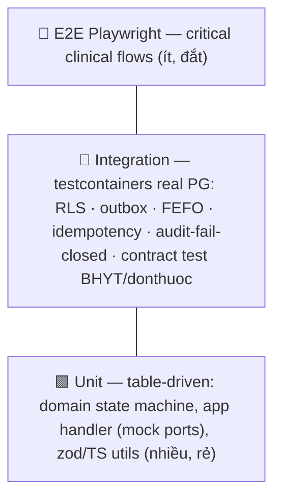

# 11 — Coding & Testing Standards

> Chuẩn viết code Go/TS và chiến lược test cho HMS *(thiết kế mục tiêu — repo chưa có code)*. Đây là delta cụ thể-hóa từ CLAUDE.md, neo vào ADR-001 (modular monolith + depguard), ADR-003 (RLS keystone test), ADR-012 (outbox + River), ADR-024 (migrations), ADR-025 (testing strategy). Đọc cùng: [02-backend-architecture.md](./02-backend-architecture.md) (layer rule + outbox), [08-database-schema.md](./08-database-schema.md) (RLS + migration 000001), [09-security.md](./09-security.md) (fail-closed controls), [15-devsecops-cicd.md](./15-devsecops-cicd.md) (CI gates merge-blocking).

Nguyên tắc tối thượng: **invariant an toàn bệnh nhân & cách ly PHI không được mock — phải test against real Postgres**. Coverage 80% là sàn, không phải đích; một test RLS branch-isolation duy nhất có giá trị hơn 100 test mock.

---

## 1. Go style — delta so với chuẩn cộng đồng

Tuân thủ [Effective Go] + [Google Go Style Guide] + [Uber Go Style Guide]. Các quy ước bắt buộc riêng cho HMS (vượt trên Effective Go), enforce bằng `golangci-lint` *(planned: `backend/.golangci.yml`)* + review:

| # | Quy ước | Lý do (neo HMS) |
|---|---------|-----------------|
| G1 | **Accept interfaces, return structs.** `app/` định nghĩa `ports` (interface) mà nó cần; `adapters/postgres` trả về struct cụ thể. | Layer rule ADR-001: dependency hướng vào trong; mock chỉ ở ranh giới `ports`. |
| G2 | **No pointer-to-interface.** `repo Repository` chứ không `repo *Repository`. | Interface đã là con trỏ ngầm; `*interface` là code smell, mất method set. |
| G3 | **Error wrapping bằng `fmt.Errorf("...: %w", err)`** — không nuốt lỗi, không `panic` trong domain/app. Sentinel error qua `errors.Is`, typed qua `errors.As`. | Coding-style: never silently swallow. Domain error map sang envelope ở `adapters/http`. |
| G4 | **`context.Context` là tham số đầu tiên** mọi hàm I/O; truyền `branch_id`/`actor` qua context value KIN (typed key, không string). | RLS session-var + audit actor lấy từ context, không từ client (ADR-005). |
| G5 | **Immutability ở domain:** method trả về copy/aggregate mới, không mutate receiver tại chỗ trên đường ghi nghiệp vụ. | Coding-style immutability; aggregate transition (Encounter state machine) sinh state mới + event. |
| G6 | **Không `interface{}`/`any` ở domain.** Type cụ thể (`Money{amount Numeric; currency string}`, `BranchID uuid.UUID`). | Tiền là `NUMERIC(15,2)+CHAR(3)` (ADR datastore); float cho tiền là cấm tuyệt đối. |
| G7 | **Early return, no deep nesting (>4 level cấm).** Guard clause cho validation boundary. | Coding-style code smell. |
| G8 | **No global mutable state.** Mọi dependency wiring ở `cmd/hms-api/main.go` *(planned)* — composition root DUY NHẤT. | ADR-001: một nơi DI. |

```go
// MẪU: accept interface, return struct, wrap error, context-first, immutable transition
// internal/encounter/app/command/close_encounter.go (planned)
type EncounterRepo interface {                 // G1: app định nghĩa port nó cần
    Load(ctx context.Context, id encounter.ID) (encounter.Encounter, error)
    Save(ctx context.Context, e encounter.Encounter, evt outbox.Event) error // outbox cùng tx (ADR-011/012)
}

func (h CloseHandler) Handle(ctx context.Context, cmd CloseCmd) (encounter.Encounter, error) {
    e, err := h.repo.Load(ctx, cmd.EncounterID)
    if err != nil {
        return encounter.Encounter{}, fmt.Errorf("load encounter %s: %w", cmd.EncounterID, err) // G3
    }
    closed, evt, err := e.Close(cmd.ClosedBy) // G5: trả aggregate MỚI + domain event, không mutate
    if err != nil {
        return encounter.Encounter{}, err     // domain error, map ở adapter
    }
    if err := h.repo.Save(ctx, closed, evt); err != nil {
        return encounter.Encounter{}, fmt.Errorf("save closed encounter: %w", err)
    }
    return closed, nil
}
```

---

## 2. Layout & layer enforcement (depguard)

Layout `internal/<bc>/{domain,app,ports,adapters}` + `internal/shared/` *(planned — section 9)*. Layer rule một chiều, bất khả xâm phạm:

```mermaid
flowchart LR
    A[adapters<br/>http, postgres, external] --> P[ports<br/>interfaces]
    APP[app<br/>command/query] --> P
    APP --> D[domain<br/>stdlib only]
    A -.wire tại main.go.-> APP
```

- `domain/` chỉ import Go **stdlib** (+ `uuid`, `decimal`). KHÔNG import `pgx`, `gin`, `app`, `adapters`.
- `app/` chỉ import `domain` + `ports`. KHÔNG import `adapters` hay BC khác.
- **Cross-BC chỉ qua domain event + transactional outbox in-process** — KHÔNG `import` chéo BC (ADR-001/012).

Enforce bằng `depguard` (golangci-lint) — merge-blocking *(planned `backend/.golangci.yml`)*:

```yaml
linters-settings:
  depguard:
    rules:
      domain-pure:
        files: ["**/internal/*/domain/**"]
        deny:
          - pkg: "github.com/jackc/pgx/v5"
            desc: "domain phải thuần — không chạm DB (ADR-001 layer rule)"
          - pkg: "github.com/gin-gonic/gin"
            desc: "domain không biết transport"
      no-cross-bc:                       # cấm import chéo BC — cross-BC chỉ qua outbox
        files: ["**/internal/encounter/**"]
        deny:
          - pkg: "hms/internal/pharmacy"
            desc: "cross-BC phải qua domain event + outbox (ADR-012), không import trực tiếp"
linters:
  enable: [depguard, errcheck, govet, staticcheck, gosec, sqlclosecheck, rowserrcheck, bodyclose, contextcheck, errorlint]
```

`gosec` + `errcheck` + `errorlint` enforce G3; `contextcheck` enforce G4. Một `.golangci.yml` org-wide, chạy trong CI và pre-commit.

---

## 3. Data access — sqlc + pgx/v5 (no ORM)

ADR datastore + ADR-024: `pgx/v5` + `sqlc` (generate type-safe Go từ SQL) + `golang-migrate`. **Không ORM** (no GORM/ent) — query tường minh, review được, không magic N+1.

- SQL nguồn trong `internal/<bc>/adapters/postgres/queries/*.sql`; `sqlc generate` đọc cùng schema migration *(planned `backend/sqlc.yaml`)*. SQL injection bị loại tại gốc: chỉ parameterized query (`$1,$2`), không string-concat.
- **RLS session-var contract (ADR-003/005 — critical):** mọi PHI query chạy TRONG một `pgx.Tx` đã `SET LOCAL app.current_branch = $1`. Vì pgx pool reuse connection, query PHI ngoài tx revert về no-filter → leak. Bọc qua helper `shared/rls`:

```go
// internal/shared/rls/tx.go (planned) — invariant CÓ TEST, không phải prose
func WithBranchTx(ctx context.Context, pool *pgxpool.Pool, branchID uuid.UUID,
    fn func(pgx.Tx) error) error {
    tx, err := pool.Begin(ctx)
    if err != nil { return fmt.Errorf("begin tx: %w", err) }
    defer tx.Rollback(ctx)
    // SET LOCAL chỉ sống trong tx này — đúng yêu cầu cách ly
    if _, err := tx.Exec(ctx, "SET LOCAL app.current_branch = $1", branchID); err != nil {
        return fmt.Errorf("set branch guc: %w", err)
    }
    if err := fn(tx); err != nil { return err }
    return tx.Commit(ctx)
}
```

- **Outbox cùng tx (ADR-011/012):** event INSERT vào bảng `outbox` trong CÙNG `pgx.Tx` với write nghiệp vụ — atomic, không two-phase. Relay đọc `SELECT ... FOR UPDATE SKIP LOCKED`. Subscriber idempotent qua `processed_events`.
- Lint `sqlclosecheck`/`rowserrcheck` chặn rò rỉ rows; review cấm query PHI ngoài `WithBranchTx`.

---

## 4. Testing strategy — test pyramid

Neo ADR-025. Pyramid không cân đối có chủ đích: invariant DB-layer đẩy nhiều test xuống tầng integration vì **không mock được**.



| Tầng | Phạm vi | Công cụ | Bắt buộc test gì |
|------|---------|---------|------------------|
| Unit | domain aggregate, app command/query (mock `ports`), pure utils | `go test` table-driven; FE Vitest+RTL+axe | Encounter state transition hợp lệ/không; Money math; CDSS rule logic; validation boundary |
| Integration | repo + RLS + outbox + River + external client | **testcontainers-go** (real PG 16), `httptest` | RLS branch-isolation; outbox relay; FEFO lot selection; idempotency unique-constraint; audit-of-reads fail-closed; contract test |
| E2E | luồng người dùng xuyên Kong BFF | **Playwright** | critical flow trọn vòng OPD-BHYT |

### 4.1 TDD red-green-refactor (bắt buộc — testing rule)
1. Viết test trước (RED) → 2. chạy thấy FAIL → 3. impl tối thiểu (GREEN) → 4. chạy PASS → 5. refactor → 6. verify coverage ≥80%. Dùng AAA (Arrange-Act-Assert), tên test mô tả hành vi: `test('returns 404 when patient belongs to other branch')`.

### 4.2 Integration test — testcontainers (real PG, KHÔNG mock)
ADR-025: RLS/outbox/FEFO/idempotency/audit là invariant ở DB layer → mock = test sai. CI cần Docker-in-CI.

**RLS branch-isolation — MERGE-BLOCKING GATE (ADR-003):** chứng minh dữ liệu branch-B vô hình dưới `app.current_branch = A`. Nếu thiếu hoặc fail → block merge.

```go
// internal/patient/adapters/postgres/rls_isolation_test.go (planned)
func TestRLS_BranchBInvisibleUnderBranchA(t *testing.T) {
    // Arrange: bootstrap PG qua testcontainers, chạy migration 000001 (FORCE RLS), seed 2 branch
    pg := testpg.Start(t)                  // testcontainers-go + golang-migrate up
    seedPatient(t, pg, branchA, "patA")
    seedPatient(t, pg, branchB, "patB")
    // Act: app-role (NOSUPERUSER, NOBYPASSRLS) đọc dưới branch A
    got := listPatientsAsAppRole(t, pg, branchA)
    // Assert: chỉ thấy branch A; branch-B record VÔ HÌNH (không 0 vì seed sai — assert nội dung)
    require.Len(t, got, 1)
    require.Equal(t, "patA", got[0].Name)
    // Cross-branch lookup phải trả NOT FOUND → API map 404 (không 403), không leak tồn tại
    _, err := getPatientAsAppRole(t, pg, branchA, idOf(branchB))
    require.ErrorIs(t, err, patient.ErrNotFound)
}
```

Bổ sung test bắt buộc: (a) **WITH CHECK** chặn write cross-tenant (INSERT branch-B dưới branch-A bị reject); (b) **owner-không-bypass** — xác nhận app-role tách migration-owner; (c) **query-ngoài-tx** revert no-filter (regression cho risk SET-LOCAL).

```go
func TestFEFO_SelectsEarliestExpiryUnderConcurrency(t *testing.T) {
    pg := testpg.Start(t)
    seedLots(t, pg, lot{no: "L1", exp: "2026-03-01", qty: 10}, lot{no: "L2", exp: "2026-09-01", qty: 10})
    // 2 dispense đồng thời: FOR UPDATE SKIP LOCKED → không double-pick cùng lot, ưu tiên expiry sớm (ADR-021)
    d1, d2 := dispenseConcurrent(t, pg, 6, 6)
    require.Equal(t, "L1", d1.LotNo)                       // FEFO: lô cận hạn trước
    require.NotEqual(t, d1.LedgerSeq, d2.LedgerSeq)        // stock_ledger append-only, không trùng
}

func TestIdempotency_SameKeyChargedOnce(t *testing.T) {
    // Replay cùng Idempotency-Key → một ChargeItem; unique-constraint chống double-post (ADR-011)
    r1 := postCharge(t, key, 100_000)
    r2 := postCharge(t, key, 100_000)
    require.Equal(t, r1.ChargeID, r2.ChargeID)
}

func TestAudit_FailClosed_NoPHIWhenAuditUnwritable(t *testing.T) {
    // ADR-009: nếu audit-of-reads không ghi được → KHÔNG trả PHI (fail-closed)
    body, status := readPHIWithBrokenAuditSink(t)
    require.Equal(t, http.StatusServiceUnavailable, status)
    require.NotContains(t, body, "patient") // không rò PHI
}
```

### 4.3 Contract test — external clients
ADR-006/007/023: BHYT (card-check JSON + XML 4750) và `donthuocquocgia.vn` test bằng contract/recorded fixtures + degraded-mode path (timeout → admit-and-flag / queue-retry). BHXH sandbox là Phase-0 blocker (ADR-023): contract test chạy với recorded response + sandbox khi có. Bắt buộc test reject-code mapping (state machine), không chỉ happy path.

### 4.4 E2E — Playwright (critical clinical flows)
ADR-025: E2E qua Kong BFF auth (auth-code+PKCE, HttpOnly cookie). Luồng critical bắt buộc:

```
check-in + BHYT card-check (+ degraded admit-and-flag)
  → OPD order + CDSS hard-stop (reject khi thiếu override, allergy-unknown ≠ safe)
  → dispense FEFO (hard-online gate)
  → cashier receipt + print phiếu pháp lý
  → claim submit XML 4750 + reject-code handling
```

### 4.5 Frontend test
Vitest + React Testing Library + `axe` (a11y gate mỗi PR — WCAG 2.2 AA). zod schema gen từ OpenAPI test parse/validate. Test clinical-safety UX: allergy-unknown render rõ ràng (KHÔNG hiển thị "safe"), CDSS modal chặn submit. E2E Playwright như 4.4.

---

## 5. Coverage gate & CI integration

- **Coverage ≥80% merge-blocking** (testing rule + ADR-025). `go test -cover ./...`; FE `vitest --coverage`. Đo trên domain/app (logic nghiệp vụ), không thổi số bằng generated code (`sqlc`, mocks) — loại trừ trong cấu hình coverage.
- **Merge-blocking gates** *(planned `.github/workflows/`)*: `golangci-lint` (depguard layer + gosec) → `go test` unit → `go test` integration (testcontainers, Docker-in-CI) → **RLS branch-isolation test (ADR-003)** → contract test → coverage 80% → FE Vitest+axe → Playwright E2E. Bất kỳ gate nào fail → block.
- Security gates rẻ đi kèm (ADR-019): Gitleaks (no hardcoded secret), govulncheck, Trivy. Xem [15-devsecops-cicd.md](./15-devsecops-cicd.md).

---

## 6. Migrations & test-data discipline

ADR-024: `golang-migrate` (`NNNNNN_name.up/down.sql` trong `backend/migrations/` *(planned)*), `sqlc` đọc cùng schema. Test integration chạy migration thật (gồm 000001: extensions + FORCE RLS + migration-owner-vs-app-role) trên testcontainers — KHÔNG seed schema thủ công, để test phản ánh production. Zero-downtime: add nullable/DEFAULT, add→backfill→switch→drop (không rename trực tiếp), `CREATE INDEX CONCURRENTLY` tách tx. Test phải seed qua app-role hợp lệ + branch_id, không bypass RLS.

---

## 7. Anti-patterns bị CẤM (review reject ngay)

| Anti-pattern | Vì sao cấm | Đúng |
|---|---|---|
| Query PHI ngoài `WithBranchTx` | pgx pool reuse → mất RLS filter → leak branch khác (risk critical) | Mọi PHI query trong tx đã SET LOCAL |
| Mock Postgres để test RLS/FEFO/idempotency | Invariant ở DB layer, mock = test giả an toàn | testcontainers real PG |
| `interface{}`/`float64` cho tiền | Sai số tiền BHYT/viện phí | `NUMERIC(15,2)` + decimal |
| CDSS/audit fail-open trong test "happy path" | Bỏ sót failure mode giết người/vi phạm pháp lý | Test cả timeout/error path fail-closed |
| Import chéo BC | Phá ADR-001, mất đường extraction | Domain event + outbox |
| Bỏ test để đạt deadline | Patient-safety + legal liability | TDD red-green, gate 80% |
| `panic` trong domain/app | Crash request path lâm sàng | Trả error wrap, map envelope |

## 8. Skill/agent ECC khi áp dụng chuẩn này

`ecc:go-review` (idiomatic + layer), `ecc:go-test` (TDD + 80% cover), `ecc:golang-testing`, `ecc:postgres-patterns` (RLS test), `ecc:security-review` (fail-closed/secrets), `ecc:react-test` + `ecc:react-review` (FE + axe), `ecc:test-coverage` (lấp gap tới ngưỡng).

---

**Tham chiếu:** Effective Go · Google/Uber Go Style Guide · `golangci-lint` depguard · `sqlc` docs · `pgx/v5` · `testcontainers-go` · `riverqueue/river` · Playwright · Vitest + Testing Library + axe-core. Mọi quyết định neo ADR-001/003/005/009/011/012/021/024/025.
