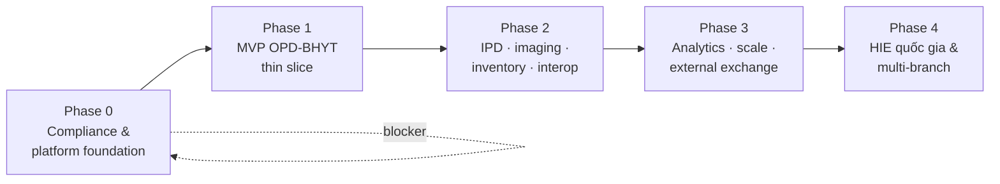
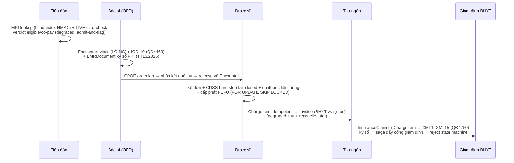

# 12 — Roadmap 5 phase

> Lộ trình triển khai HMS theo 5 phase, mỗi phase có goal · deliverables · Definition of Done (DoD) · earn-in trigger gates. Nguyên tắc bất biến: **MVP component budget cứng** (ADR-002) — mọi hệ thống stateful mới phải dẫn chứng trigger đã đạt mới được thêm. Phase 0 là **blocker không-backfill-được** trước bất kỳ PHI thật nào.
>
> Liên kết: [`doc/00-tong-quan.md`](./00-tong-quan.md) (vision, MVP scope) · [`doc/01-kien-truc-tong-the.md`](./01-kien-truc-tong-the.md) (tech stack pinned) · [`doc/10-deployment-operations.md`](./10-deployment-operations.md) (operating model, runbook degraded-mode) · [`doc/05-billing-insurance-bhyt.md`](./05-billing-insurance-bhyt.md) (BHYT two-touch). Code path tham chiếu là layout MỤC TIÊU *(planned)* — repo chưa có code.

---

## 0. Nguyên tắc đọc roadmap

- **Earn-in, không front-load** (ADR-002): mỗi hệ thống stateful defer (Vault-đầy-đủ, NATS/Kafka, Debezium, OIE, Orthanc, FHIR facade, service mesh, canary) gắn với **một trigger viết sẵn** trong bảng gate cuối tài liệu. Một Vault/HA-Postgres/Kafka vận hành kém còn nguy hiểm cho PHI hơn lựa chọn managed đơn giản → operational risk = PHI risk.
- **Phase không cố định lịch tuyệt đối** — tốc độ Phase 2+ phụ thuộc năng lực ops thực tế (dev team kiêm ops ở MVP → dedicated SRE khi mở rộng).
- **DoD là gate merge/go-live**, không phải gợi ý. Các DoD compliance (RLS branch-isolation test, audit fail-closed, DPIA) là **merge-blocking / go-live-blocking**.
- Quy ước trạng thái: *(MVP)* = Phase 1, *(Phase 2)*, *(Phase 3)*, *(Phase 4)*, *(planned)* cho code path chưa hiện thực.



---

## Phase 0 — Compliance & platform foundation

> **Goal**: Thiết lập nền **không-backfill-được** và artifact pháp lý **TRƯỚC khi có bất kỳ PHI thật nào**. Đây là phase blocker: không qua Phase 0 thì không được nạp dữ liệu production.

### Deliverables

| # | Deliverable | Neo ADR |
|---|-------------|---------|
| 1 | **Migration 000001** — extensions (pgcrypto, pg_trgm, uuid), `branches`, `accounts`/`roles`/`permissions`, `audit_log`, **migration-owner-vs-app-role separation**, BẬT `ENABLE`+`FORCE ROW LEVEL SECURITY` TRƯỚC bất kỳ bảng PHI nào | ADR-003, ADR-024 |
| 2 | **CI branch-isolation test** (testcontainers) chứng minh dữ liệu branch-B **vô hình** dưới `app.current_branch=A` — merge-blocking gate | ADR-003, ADR-025 |
| 3 | **DPIA** + consent-records design + data-subject-rights (truy cập/xóa/rút đồng ý) — legal artifact trước production data | ADR-020 |
| 4 | **BHXH sandbox** + spec 4750 XML (XML1–XML15) + card-check API + rejection-code mapping — xác nhận chống thật/sandbox endpoint | ADR-023, ADR-006 |
| 5 | Chốt **VN provider** onshore (managed PG VNG/Viettel/FPT, K8s, object-storage WORM) đạt residency NĐ13/53 | ADR-015 |
| 6 | **Named operating model + MVP component budget** ADR (dev kiêm ops) ký duyệt | ADR-002 |
| 7 | Chốt **scope cột field-level encryption** (CCCD, số thẻ BHYT, HIV/tâm thần/di truyền) trong `doc/08` trước data | ADR-014 |
| 8 | **Keycloak 26 realm 'hospital'** + RBAC personas (bac_si/dieu_duong/duoc_si/le_tan/thu_ngan/giam_dinh/quan_tri) | ADR-013 |
| 9 | **Kong KIC DB-less** + Argo CD app-of-apps skeleton (rolling deploy) | ADR-019 |
| 10 | **Security gates merge-blocking**: Gitleaks, govulncheck, golangci-lint (depguard cross-BC), Trivy | ADR-019, ADR-025 |

### Migration 000001 — RLS keystone *(planned: `backend/migrations/000001_phase0_compliance.up.sql`)*

```sql
-- Tách role: migration-owner sở hữu bảng & chạy DDL; app-role KHÔNG bypass RLS
CREATE ROLE hms_migration_owner NOLOGIN;
CREATE ROLE hms_app LOGIN NOSUPERUSER NOBYPASSRLS;  -- owner vẫn bypass RLS → app KHÔNG được là owner

ALTER TABLE patients ENABLE ROW LEVEL SECURITY;
ALTER TABLE patients FORCE ROW LEVEL SECURITY;       -- FORCE: kể cả owner cũng chịu policy
CREATE POLICY branch_isolation ON patients
  USING      (branch_id = current_setting('app.current_branch')::uuid)   -- chặn READ cross-branch
  WITH CHECK (branch_id = current_setting('app.current_branch')::uuid);  -- chặn WRITE cross-branch (poisoning)
```

> **Vì sao keystone**: PostgreSQL table OWNER **bypass RLS kể cả NOBYPASSRLS**. Nếu golang-migrate làm app-role thành owner → RLS thành no-op âm thầm: mọi diagram nói "isolated" nhưng leak production. `USING`-only (thiếu `WITH CHECK`) cho phép write cross-tenant. Không retrofit được sau khi có data multi-tenant (ADR-003, risk [critical]).

### Definition of Done (Phase 0)

- [ ] Migration 000001 chạy được up/down trên CNPG/managed PG; app-role xác nhận `NOBYPASSRLS` và **không sở hữu bảng PHI**.
- [ ] CI integration test (testcontainers-go) chứng minh: dưới `SET LOCAL app.current_branch = A`, query bảng PHI trả về **0 row của branch-B**; test này **merge-blocking** trên mọi PR đụng schema/query PHI.
- [ ] Invariant test: PHI query chạy **ngoài tx đã SET LOCAL GUC** bị phát hiện (pgx pool reuse connection → mất filter) — risk [critical] SET LOCAL.
- [ ] DPIA draft + consent design + data-subject-rights flow được legal/compliance owner ký; xác nhận nghĩa vụ theo **Luật Bảo vệ DLCN 2026** (đang superseding NĐ13).
- [ ] Contract test BHYT card-check + claim-submit + reject-code chạy xanh chống **sandbox BHXH thật**.
- [ ] VN provider managed PG/object-storage onshore được xác nhận đạt residency; WORM object-lock khả dụng cho audit sink.
- [ ] Keycloak realm import + 7 persona groups; Kong verify JWT qua JWKS (reject `alg=none`); Argo CD reconcile skeleton xanh.
- [ ] 4 security gate (Gitleaks/govulncheck/golangci-lint/Trivy) bật và đỏ-thì-block.

### Earn-in gates mở khoá phase này → Phase 1

Phase 0 **không có earn-in** — đây là blocker bắt buộc. Chỉ khi **toàn bộ DoD xanh** mới được nạp PHI thật và bắt đầu Phase 1.

---

## Phase 1 — MVP: OPD-BHYT thin slice trọn vòng

> **Goal**: MỘT phòng khám OPD-BHYT số hóa **hoàn toàn**, bỏ giấy cho đúng khoa đó, **hợp lệ pháp lý** (EMR ký số TT13/2025 + e-prescription TT26/2025 + XML 4750). Vertical slice mỏng nhưng trọn vòng: tiếp đón → khám → CLS → kê đơn → viện phí → XML giám định → ký số EMR.

### Deliverables

| Nhóm | Deliverable | Neo ADR |
|------|-------------|---------|
| **BC** | identity, organization, patient/MPI, scheduling-reception (**LIVE BHYT check + degraded**), encounter (**EMR ký số**), orders (CPOE), lab (nhập tay), pharmacy (**CDSS hard-stop + donthuoc liên thông + FEFO**), billing (**charge-capture idempotent + degraded cashier**), insurance (**XML 4750 + saga**), audit-compliance (**read-audit fail-closed + hash-chain + WORM**) | ADR-004, 006, 007, 008, 009, 011, 021 |
| **FE** | SPA per-persona (tiếp đón/bác sĩ/dược/thu ngân/giám định) qua **Kong BFF**; Vite 6 + React 19 + AntD v6 (vi_VN); read-only cached reference data + **hard-online gate** cho dispense/cashier/BHYT (KHÔNG PWA write-outbox) | ADR-018 |
| **Adoption** | Dual-run 2–4 tuần/khoa + super-user + **print phiếu pháp lý** (đơn thuốc QR/mã đơn quốc gia + chữ ký số, phiếu thanh toán bảng 4750, giấy ra viện) + feature-flag **tắt giấy theo KPI** | ADR-022 |
| **Test** | E2E critical flow + testcontainers RLS/outbox/FEFO/idempotency; ≥80% coverage; Vitest+RTL+axe + Playwright | ADR-025 |

### Critical flow trọn vòng *(MVP)*



### Definition of Done (Phase 1 / go-live MVP)

- [ ] Một khoa OPD chạy trọn vòng end-to-end trên production với PHI thật, **không sổ/phiếu giấy song song bắt buộc**.
- [ ] **EMR ký số PKI** hợp lệ (TT13/2025) — signed→amendment-only, `*_history` versioning, signed-write **synchronous durability** (commit confirmed trước khi UI báo "signed", survive PITR) — risk [high] signed-EMR.
- [ ] **E-prescription** đẩy donthuocquocgia.vn lấy mã đơn quốc gia (TT26/2025, QĐ808); đơn in có QR/mã đơn + block chữ ký số.
- [ ] **XML 4750** (XML1–XML15) sinh từ chính ChargeItem; claim↔bill↔encounter FK nhất quán; submission qua saga + idempotency + retry; rejection-code là state machine.
- [ ] **Degraded-mode** test xanh cho cả 2 chạm BHYT (admit-and-flag tiếp đón; thu + reconcile-later cashier) — never block patient (risk [high]).
- [ ] **CDSS hard-stop fail-closed** (server-side aggregate): reject command khi không có override-with-audit; khi CDSS error/timeout KHÔNG confirm "no interaction"; "allergy unknown" ≠ "safe" — E2E test cả failure mode (risk [critical]).
- [ ] **Audit-of-reads commit-with-response**: không trả PHI nếu audit write fail; hash-chain + WORM sink ngoài Postgres; E2E test audit-fail-closed (risk [critical]).
- [ ] **Idempotency-Key end-to-end** một scheme FE↔backend (chống double-post dispense/charge khi replay) (risk [high]).
- [ ] RLS branch-isolation test vẫn xanh; coverage ≥80%; Playwright E2E qua Kong BFF auth xanh.
- [ ] Dual-run hoàn tất, KPI adoption đạt ngưỡng do **named owner** định nghĩa → feature-flag tắt giấy bật.
- [ ] **MVP component budget tôn trọng**: chỉ managed/CNPG-async PG + Go monolith + Kong KIC DB-less + KMS/ESO + Argo CD rolling + Prometheus+Loki — **không stateful system nào khác** (ADR-002).

### Earn-in gates Phase 1 → Phase 2

| Mở khoá | Trigger (phải proven) |
|---------|------------------------|
| Bắt đầu Phase 2 | MVP go-live ổn định ≥ 1 chu kỳ quyết toán BHYT; SLO API availability 99.9% & p95<300ms clinical-read đạt; degraded-mode runbook đã chạy thật ít nhất 1 lần |
| IPD/eMAR | **Device fleet provisioning** (cart/tablet/HID scanner mỗi khoa) cam kết ngân sách — hard adoption dependency, không thì ghi giấy back-enter phá audit+CDSS (risk [medium]) |

---

## Phase 2 — Mở rộng lâm sàng + interop nội bộ

> **Goal**: Thêm IPD/giường, CĐHA/PACS, kho/vật tư, và **bật interop khi có nhu cầu/thiết bị** — không trước. Foundations rẻ đã bake-in ở MVP (coded columns, Encounter anchor, outbox) làm Phase 2 rẻ.

### Deliverables

| Deliverable | Ghi chú & ADR |
|-------------|---------------|
| **IPD**: ADT + bed board + y lệnh hàng ngày + **MAR** (medication administration record) thay sổ giao nhận thuốc | encounter BC có Admission con; MAR synchronous durability (ADR-004, ADR-015) |
| **Imaging/RIS + Orthanc DICOM** (namespace interop riêng, KHÔNG sau Kong) | ADR-016, ADR-019 |
| **Inventory** đa kho (kho chính + tủ trực khoa); `stock_ledger` append-only dùng chung pharmacy | ADR-021 |
| **Lab interface máy** + **OIE HL7v2 sidecar** feeding event bus | chỉ khi bus tồn tại (ADR-016) |
| **FHIR R4 facade read-only** — đánh giá lại thư viện (KHÔNG lock samply/golang-fhir-models đã chết) | ADR-016, ADR-017 |
| **Terminology** `$lookup`/`$validate-code`/`$expand` (danh mục dùng chung BYT trước, LOINC/RxNorm sau) | ADR-016 |
| **HR/payroll** khởi đầu | post-MVP |

### Definition of Done (Phase 2)

- [ ] IPD ADT + bed board live cho ≥1 khoa nội trú; MAR ghi bedside (device fleet đã provision — risk [medium]).
- [ ] Orthanc DICOM ở **namespace interop riêng**, NetworkPolicy isolated, KHÔNG đặt sau Kong edge.
- [ ] Inventory đa kho dùng chung `stock_ledger` với pharmacy; FEFO + cảnh báo cận-hạn/min-stock qua River sweep.
- [ ] FHIR R4 facade read-only map từ OLTP (single source of truth); **thư viện FHIR được chọn lại** (active fork hoặc generate in-house) — KHÔNG dùng dependency chết (risk [low]).
- [ ] OIE HL7v2 sidecar chỉ bật **sau khi event bus tồn tại** (xem earn-in messaging) — không trước.
- [ ] Coverage ≥80% cho BC mới; RLS branch-isolation vẫn xanh.

### Earn-in gates kích hoạt trong Phase 2

| Hệ thống defer | Trigger mở khoá | Neo ADR |
|----------------|-----------------|---------|
| **OIE HL7v2 sidecar / Orthanc bus feed** | Có máy phân tích lab/máy CĐHA cần interface tự động + event bus tồn tại | ADR-016 |
| **FHIR library commit** | Phase 2 research chọn active fork/in-house gen (không trước) | ADR-017 |
| **Device fleet (ward)** | Trước go-live IPD — hard adoption dependency | risk [medium] |

---

## Phase 3 — Analytics, scale, external exchange

> **Goal**: Báo cáo BYT + dashboard quản lý + **tách service đầu tiên theo trigger** + interop hai chiều. Đây là điểm "earn-in" cho Kafka/service-mesh/canary — chỉ khi proven.

### Deliverables

| Deliverable | Ghi chú & ADR |
|-------------|---------------|
| **analytics-reporting CQRS read-side** — scheduled SQL→read-table cho tới khi volume justify CDC/Kafka | KHÔNG query trực tiếp bảng giao dịch (ADR-012) |
| **Báo cáo thống kê BYT** định kỳ Sở Y tế | analytics-reporting BC |
| **Tách BC đầu tiên ra service** (Pharmacy hoặc FHIR/integration engine) khi proven trigger → **swap outbox relay sang Kafka**, domain code không đổi | ADR-001, ADR-012 |
| **Bidirectional FHIR + SMART-on-FHIR** | ADR-016 |
| **Service mesh Linkerd** khi BC tách | ADR-019 |
| **Argo Rollouts canary + Tempo (tracing) + SLSA/Cosign/ZAP** earn-in | ADR-019 |

### Definition of Done (Phase 3)

- [ ] analytics-reporting đọc qua scheduled job/read-replica — **không** chạm bảng OLTP giao dịch trực tiếp; báo cáo BYT xuất đúng định dạng Sở Y tế.
- [ ] Nếu tách service: outbox relay adapter swap sang Kafka, **domain code không thay đổi** (chứng minh ADR-001 evolution path); cross-process consumer idempotent.
- [ ] Bidirectional FHIR + SMART app launch hoạt động; terminology $expand đầy đủ.
- [ ] Nếu bật canary: Argo Rollouts + Tempo tracing + SLO-burn-rate auto-rollback test; SLSA provenance + Cosign sign image + ZAP DAST trong pipeline.

### Earn-in gates kích hoạt trong Phase 3

| Hệ thống defer | Trigger mở khoá (phải proven) | Neo ADR |
|----------------|-------------------------------|---------|
| **Kafka / NATS broker** | Tách BC ra service riêng (proven scaling/compliance isolation) — có cross-process consumer thật | ADR-012, ADR-001 |
| **CDC / Debezium** | Analytics volume vượt scheduled SQL→read-table; có Kafka | ADR-012 |
| **Service mesh Linkerd** | ≥2 service tách ra (mTLS service-to-service, traffic management) | ADR-019 |
| **Argo Rollouts canary + Tempo** | Multi-service + team có năng lực ops L4 (maturity) | ADR-019 |
| **SLSA/Cosign/ZAP** | Sau khi pipeline cơ bản ổn định | ADR-019 |

---

## Phase 4 — HIE & national health record

> **Goal**: Liên thông **hồ sơ sức khỏe điện tử quốc gia** + multi-branch full rollout. Đây là tầm nhìn cuối: HMS trở thành node trong hệ sinh thái y tế quốc gia.

### Deliverables

| Deliverable | Ghi chú & ADR |
|-------------|---------------|
| **Kết nối hồ sơ sức khỏe điện tử quốc gia** (khung TT 54/2017) | interoperability BC |
| **SNOMED CT** (sau danh mục BYT + LOINC/RxNorm) | terminology |
| **Multi-branch full rollout** + cross-branch reporting | patient/MPI dùng chung xuyên chi nhánh (ADR-005) |
| **DB-per-branch escalation** cho branch cần cô lập pháp lý/hiệu năng | defer từ ADR-005 |
| **Full Vault earn-in** nếu PKI signing thật / dynamic DB creds proven | ADR-014 |

### Definition of Done (Phase 4)

- [ ] Trao đổi hồ sơ với hệ thống quốc gia đạt contract test; consent + data-subject-rights áp dụng cho data exchange ngoài mục đích điều trị.
- [ ] Multi-branch rollout: cross-branch reporting qua policy escalation `cross_branch_reader`; RLS branch-isolation vẫn xanh per branch.
- [ ] Nếu DB-per-branch: chỉ cho branch có nhu cầu cô lập pháp lý/hiệu năng đặc biệt (không mặc định).

### Earn-in gates kích hoạt trong Phase 4

| Hệ thống defer | Trigger mở khoá | Neo ADR |
|----------------|-----------------|---------|
| **Full Vault** (HashiCorp) | Cần **PKI signing thật** / dynamic DB creds / service extraction đòi hỏi | ADR-014, ADR-002 |
| **DB-per-branch** | Branch cực lớn cần cô lập pháp lý/hiệu năng (không retrofit nhẹ) | ADR-005 |
| **KGO (Kong Gateway Operator)** | Sau Phase 3 khi cần advanced gateway lifecycle | ADR-019 |

---

## Bảng tổng hợp earn-in trigger gates

> Mọi đề xuất thêm stateful system phải **dẫn chứng trigger đã đạt** (review pipeline kiểm MVP component budget — ADR-002).

| Hệ thống defer | Trigger viết sẵn | Phase dự kiến | ADR |
|----------------|------------------|---------------|-----|
| Vault-đầy-đủ | PKI signing thật / dynamic DB creds / service extraction | Phase 4 | ADR-014, ADR-002 |
| NATS/Kafka broker | Tách BC ra service (cross-process consumer thật) → swap relay adapter | Phase 3 | ADR-012, ADR-001 |
| Debezium/CDC | Analytics volume vượt scheduled SQL→read-table | Phase 3 | ADR-012 |
| OIE HL7v2 sidecar | Máy phân tích cần interface + event bus tồn tại | Phase 2 | ADR-016 |
| Orthanc/PACS | Khoa CĐHA cần lưu/đọc DICOM | Phase 2 | ADR-016 |
| FHIR R4 facade | Nhu cầu interop nội bộ; chọn lại thư viện (không lock samply) | Phase 2 | ADR-016, ADR-017 |
| Service mesh (Linkerd) | ≥2 service tách ra | Phase 3 | ADR-019 |
| Argo Rollouts canary + Tempo | Multi-service + team đạt maturity L4 | Phase 3 | ADR-019 |
| SLSA/Cosign/ZAP | Pipeline cơ bản ổn định | Phase 3 | ADR-019 |
| DB-per-branch | Branch cần cô lập pháp lý/hiệu năng | Phase 4 | ADR-005 |

---

## Phụ lục — Compliance deadline đã lapsed (đều remediation, không deferrable)

| Văn bản | Nội dung | Đưa vào | Lý do không deferrable |
|---------|----------|---------|------------------------|
| **TT 13/2025/TT-BYT** (hạn 30/9/2025) | Bệnh án điện tử ký số | Phase 1 | Bệnh viện đã cấp phép → remediation-of-non-compliance (ADR-004, risk [critical]) |
| **TT 26/2025 + QĐ 808** (hạn 1/10/2025) | Đơn thuốc điện tử liên thông donthuocquocgia.vn | Phase 1 | MVP IS khoa OPD-kê-đơn → legally MVP-mandatory (ADR-007) |
| **QĐ 4750** (sửa QĐ 3176, hiệu lực 1/1/2025) | Bộ XML giám định BHYT 1–15 | Phase 1 | Quyết toán BHYT bắt buộc đúng format (ADR-006) |
| **NĐ 13/2023** + Luật Bảo vệ DLCN 2026 | DPIA nộp A05 trong 60 ngày từ go-live | Phase 0 | Clock chạy từ go-live (ADR-020, risk [high]) |
