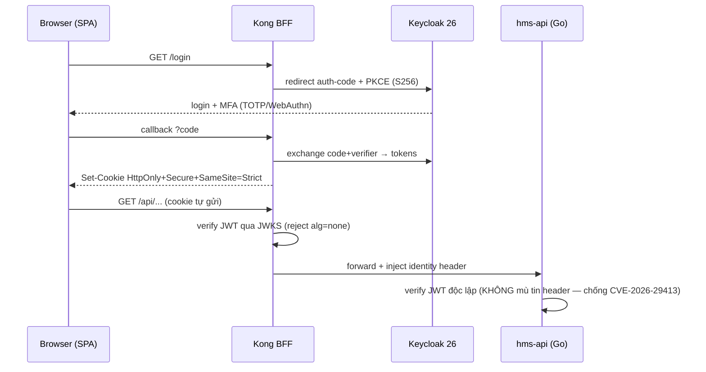

# 14 — Frontend Architecture (Vite SPA + Ant Design v6 + Kong BFF)

> Thiết kế MỤC TIÊU cho frontend HMS *(repo CHƯA CÓ CODE — mọi code path đánh dấu `(planned)`)*. Một single-page application (SPA) tĩnh, server-render-less, nằm sau Kong BFF, phục vụ năm persona lâm sàng/hành chính của phòng khám OPD-BHYT. Mọi quyết định lớn neo vào **ADR-018** (Vite SPA + AntD v6 + Kong BFF, KHÔNG PWA write-outbox) và **ADR-013** (Kong edge-auth, object-level authz ở Go).
>
> Liên quan: [01-kien-truc-tong-the.md](./01-kien-truc-tong-the.md) (4 tầng defense-in-depth) · [02-backend-architecture.md](./02-backend-architecture.md) (OpenAPI là contract) · [04-orders-lab-pharmacy.md](./04-orders-lab-pharmacy.md) (CDSS hard-stop) · [06-identity-rbac-audit.md](./06-identity-rbac-audit.md) (RBAC personas) · [13-adr.md](./13-adr.md) (ADR-018/013/008/011).

---

## 1. Nguyên tắc bất biến của FE (neo ADR-018)

| Nguyên tắc | Quyết định | Lý do (ADR) |
|---|---|---|
| **SPA tĩnh, KHÔNG Next.js** | Vite 6 build ra static assets, serve sau Kong; không SSR, không use-client/use-server boundary | ADR-018: nội bộ bệnh viện không cần SEO; SSR chỉ là cost thuần |
| **SPA KHÔNG bao giờ thấy token** | Auth-code + PKCE chạy qua Kong BFF; access/refresh token nằm trong cookie `HttpOnly + Secure + SameSite=Strict`; JS không đọc được | ADR-013/018: chống token-theft qua XSS |
| **FE KHÔNG phải security boundary** | CDSS modal, RBAC-nav, validation chỉ là UX; mọi control thật enforce ở Go aggregate | ADR-008: modal bypassable qua devtools/API |
| **KHÔNG PWA write-outbox MVP** | Read-only cached reference data + hard-online gate cho dispense/cashier/BHYT | ADR-018: offline write-queue + conflict-replay là patient-safety hazard, YAGNI cho 1 khoa OPD trên LAN |
| **OpenAPI là single source of truth** | Type + Zod schema + TanStack Query hooks sinh từ OpenAPI qua orval | ADR-018/025: chống FE↔BE drift |
| **`allergy-unknown` ≠ `safe`** | Trạng thái dị ứng chưa biết là first-class UI state, KHÔNG BAO GIỜ render là an toàn | ADR-008 |

---

## 2. Tech stack pinned (dùng nguyên văn)

| Lớp | Lựa chọn (pinned) | Vai trò |
|---|---|---|
| Build/runtime | **Vite 6 + React 19 + TypeScript strict** | SPA tĩnh, HMR, ESM bundling |
| Component lib | **Ant Design v6** + **ProTable/ProForm** | UI lâm sàng dày (form/table dữ liệu nặng) |
| i18n | **AntD `ConfigProvider` locale `vi_VN`** | toàn bộ UI tiếng Việt |
| Styling | **thin Tailwind layer** | layout lâm sàng đặc thù, KHÔNG thay AntD |
| Routing | **TanStack Router** (typed routes + URL search-params) | route an toàn kiểu, deep-link filter |
| Server state | **TanStack Query v5** | cache, invalidation, retry, staleness |
| Client state | **Zustand** (global ephemeral ONLY) | UI state tạm (modal, queue ticker) — KHÔNG cache server data |
| Form + validation | **react-hook-form + zod** (1 schema = form + API type) | validation boundary phía client |
| Codegen | **orval** (hoặc openapi-typescript) từ OpenAPI | sinh type + zod + query hooks |
| Barcode/QR | **HID scanner (keyboard-wedge) + html5-qrcode** | specimen accession, mã đơn quốc gia, định danh bệnh nhân |

> *(planned)* mã nguồn FE nằm tại `frontend/src/{app,features/<persona>,shared,api(orval-gen)}` — xem canon §9.

---

## 3. Layout thư mục FE *(planned)*

```text
frontend/
├── vite.config.ts            # static build, base path sau Kong
├── orval.config.ts           # codegen từ ../backend openapi.yaml
├── src/
│   ├── app/                  # bootstrap: ConfigProvider vi_VN, QueryClient, RouterProvider
│   │   ├── router.tsx        # TanStack Router tree + route guards (RBAC nav)
│   │   ├── providers.tsx     # AntD + Query + i18n + ErrorBoundary
│   │   └── auth.ts           # gọi /auth/me (KHÔNG đọc token)
│   ├── features/             # tổ chức theo PERSONA, không theo type
│   │   ├── reception/        # lễ tân: MPI lookup, BHYT card-check, queue
│   │   ├── doctor/           # bác sĩ: Encounter, vitals, ICD-10, đơn thuốc
│   │   ├── pharmacist/       # dược sĩ: CDSS, FEFO dispense
│   │   ├── cashier/          # thu ngân: charge, payment, biên lai
│   │   └── claims/           # giám định: XML 4750, rejection-code
│   ├── shared/
│   │   ├── components/       # house layer: AllergyBanner, VitalsGrid, CdssBlockingModal, BarcodeInput, PrintFrame
│   │   ├── hooks/            # useScanner, useDegradedMode, useStepUp
│   │   ├── safety/           # clinical-safety primitives (allergy-unknown rendering)
│   │   └── print/            # legal print templates (đơn thuốc, biên lai, giấy ra viện)
│   └── api/                  # orval-gen: KHÔNG sửa tay (type + zod + query hooks)
```

---

## 4. Auth: Kong BFF + Auth-code + PKCE (neo ADR-013)

SPA KHÔNG bao giờ giữ token. Kong terminate auth, đổi mã + PKCE với Keycloak, set cookie HttpOnly. FE chỉ biết "đã đăng nhập / chưa" qua `GET /auth/me`.



- `GET /auth/me` trả persona + branch + danh sách permission cached (TTL ngắn 5–15m, ADR-013) → FE dựng RBAC-nav.
- Step-up: hành động nhạy cảm (ký EMR, break-the-glass, override CDSS) → API trả `401 step_up_required`; FE chuyển flow re-auth qua Kong rồi retry idempotent (ADR-011 cùng idempotency-key scheme).
- **FE không tự quyết "bác sĩ này xem bệnh nhân kia"** — object-level authz luôn ở Go (ADR-013). Cross-branch resource → API trả 404 (ADR-003), FE hiển thị "không tìm thấy", KHÔNG lộ tồn tại.

---

## 5. Per-persona surfaces + RBAC nav

Năm surface MVP, mỗi surface là một `features/<persona>` (canon §4 personas: `le_tan/bac_si/duoc_si/thu_ngan/giam_dinh`). Navigation render theo permission từ `/auth/me`; route guard chỉ là UX (backstop thật ở Go).

| Persona | Surface chính | Tương tác load-bearing |
|---|---|---|
| `le_tan` (lễ tân) | MPI lookup, check-in, queue số thứ tự | BHYT card-check verdict; degraded admit-and-flag |
| `bac_si` (bác sĩ) | Encounter, vitals, ICD-10, CPOE order, kê đơn | CDSS hard-stop modal; ký số EMR (step-up) |
| `duoc_si` (dược sĩ) | Hàng đợi đơn, FEFO dispense | allergy/interaction recheck; hard-online gate |
| `thu_ngan` (thu ngân) | Invoice, payment, biên lai | charge-capture; degraded thu + reconcile-later |
| `giam_dinh` (giám định) | Claim, XML 4750, rejection-code | state machine từ chối; ký số claim |

```tsx
// app/router.tsx (planned) — guard chỉ là UX, KHÔNG security
const reception = createRoute({
  path: '/reception',
  beforeLoad: ({ context }) => {
    if (!context.permissions.has('reception:read')) {
      throw redirect({ to: '/forbidden' }) // backstop thật ở Go
    }
  },
})
```

---

## 6. OpenAPI codegen: 1 schema = form + API type (neo ADR-018/025)

orval đọc `backend/openapi.yaml` *(planned)* sinh ra: TypeScript types, Zod schema (validation), và TanStack Query hooks — KHÔNG sửa tay file trong `src/api/`. RHF dùng chính Zod schema đó làm resolver → form-validation và API-contract không thể drift.

```ts
// orval.config.ts (planned)
export default {
  hms: {
    input: '../backend/openapi.yaml',
    output: {
      target: 'src/api/endpoints.ts',
      client: 'react-query',
      schemas: 'src/api/model',
      override: { zod: { generate: true } }, // 1 schema dùng cho form + API
    },
  },
}
```

```tsx
// features/doctor/PrescriptionForm.tsx (planned)
const form = useForm<CreatePrescription>({
  resolver: zodResolver(createPrescriptionSchema), // orval-gen, = API contract
})
const mutate = useCreatePrescription() // orval-gen query hook
```

> Idempotency: mọi POST tạo charge/dispense/claim gửi `Idempotency-Key` (UUID v7 sinh client, persist qua retry) — MỘT scheme end-to-end với backend (ADR-011), chống double-post khi TanStack Query retry.

---

## 7. Clinical safety UX (neo ADR-008)

FE phải render an toàn lâm sàng đúng, nhưng **không phải control** — backend aggregate là nơi enforce hard-stop. Ba primitive bắt buộc trong `shared/safety/`:

**(a) CDSS blocking modal.** Khi kê đơn/cấp phát, API trả phán quyết CDSS. Nếu `block`, modal chặn submit; override chỉ khi nhập lý do + (step-up) → gửi override record (reason + authorizer) cho backend ghi audit. Modal KHÔNG tự cho qua ở client.

**(b) Allergy banner + allergy-unknown.** Hiển thị ba trạng thái tách bạch — KHÔNG gộp:

```tsx
// shared/safety/AllergyBanner.tsx (planned)
switch (allergy.status) {
  case 'has_allergies': return <Banner level="danger" items={allergy.list} />
  case 'no_known_allergies': return <Banner level="ok" text="Không dị ứng đã biết" />
  case 'unknown': // ADR-008: KHÔNG BAO GIỜ render là 'safe'
    return <Banner level="warning" text="CHƯA RÕ tiền sử dị ứng — cần khai thác" />
}
```

**(c) Fail-closed khi CDSS lỗi.** Nếu API trả `cdss_unavailable`/timeout, FE hiển thị "không xác minh được tương tác — không được coi là an toàn" và **không** hiện "no known interaction". Quyết định cho qua vẫn thuộc backend (fail-closed).

**(d) Barcode/QR.** `BarcodeInput` dùng HID keyboard-wedge (focus-trap) hoặc html5-qrcode (camera) cho: accession specimen (lab), quét mã đơn quốc gia donthuocquocgia.vn (ADR-007), định danh bệnh nhân. Mọi quét đi qua validation Zod trước khi gửi.

---

## 8. Degraded-mode UI & hard-online gate (neo ADR-006/018)

KHÔNG có write-outbox phía client (ADR-018). Reference data (chargemaster, ICD-10, drug catalog, terminology) được cache read-only qua TanStack Query (`staleTime` dài) để vẫn tra cứu khi mạng chậm — nhưng **mọi write nhạy cảm có hard-online gate**.

| Tình huống | Hành vi FE | Neo |
|---|---|---|
| BHYT card-check timeout/lỗi cổng | Hiện verdict "chưa xác minh", cho admit-and-flag, KHÔNG chặn bệnh nhân | ADR-006 |
| Cashier mất kết nối cổng thanh toán/BHYT | Cho thu, hiển thị "đã lưu, chờ gửi cổng" (reconcile-later) | ADR-006 |
| Dispense khi offline | **Block** — banner "cần kết nối để cấp phát thuốc" (CDSS + FEFO cần online) | ADR-008/018 |
| Mạng chập chờn lúc đọc | Phục vụ reference data cached read-only | ADR-018 |

```ts
// shared/hooks/useDegradedMode.ts (planned)
// dispense/cashier-submit cần online; reference read được phép cached
const blockedOffline = ['dispense', 'sign-emr', 'submit-claim'] as const
```

---

## 9. i18n, accessibility, in phiếu pháp lý

- **i18n:** AntD `ConfigProvider locale={vi_VN}` toàn cục; chuỗi UI tập trung; date/number/currency format VN (NUMERIC tiền hiển thị `15.000 ₫`). Thuật ngữ kỹ thuật giữ tiếng Anh trong code, nhãn UI tiếng Việt.
- **Accessibility (WCAG 2.2 AA):** semantic landmark, focus-trap modal, keyboard-navigable form (bác sĩ nhập nhanh không chuột), contrast AA cho allergy banner; `axe` gate mỗi PR (ADR-025).
- **In phiếu pháp lý (neo ADR-022):** print thật là **server-side PDF ký số** (đơn thuốc TT 27/26-2025 có QR + mã đơn quốc gia + block chữ ký số, biên lai theo bảng 4750, giấy ra viện). FE chỉ trigger tải/in PDF đã ký từ backend qua `PrintFrame`; KHÔNG render lại nội dung pháp lý bằng `window.print()` của trình duyệt (không substitutable pháp lý). Dual-run: FE hỗ trợ in song song giấy↔số trong 2–4 tuần đầu mỗi khoa.

---

## 10. Testing FE (neo ADR-025)

| Loại | Công cụ | Phạm vi |
|---|---|---|
| Unit/component | **Vitest + React Testing Library** | safety component (AllergyBanner unknown-state), form Zod boundary, RBAC-nav render |
| Accessibility | **axe** (gate mỗi PR, merge-blocking) | landmark, contrast, focus |
| E2E critical flow | **Playwright** qua Kong BFF auth | check-in (BHYT) → OPD order (CDSS hard-stop) → dispense FEFO → cashier biên lai/print → claim submit + reject |

Test bắt buộc cho safety-state: `allergy-unknown KHÔNG render 'safe'`, `CDSS block không bypass được ở client`, `dispense offline bị gate`. Coverage ≥80% theo testing rule (merge-blocking).

---

## 11. Tóm tắt quyết định → ADR

| Quyết định FE | ADR |
|---|---|
| Vite SPA tĩnh, KHÔNG Next.js; AntD v6 vi_VN + Tailwind thin | ADR-018 |
| Token trong HttpOnly cookie, Kong BFF, SPA không thấy token; FE không là authz boundary | ADR-013, ADR-018 |
| KHÔNG PWA write-outbox; read-only cached reference + hard-online gate | ADR-018, ADR-006 |
| CDSS modal/allergy-unknown là UX, enforce ở backend; fail-closed | ADR-008 |
| OpenAPI → orval codegen (type + zod + query) chống drift; idempotency-key end-to-end | ADR-018, ADR-011, ADR-025 |
| Degraded-mode "đã lưu, chờ gửi cổng" + admit-and-flag | ADR-006 |
| In phiếu pháp lý = server-side PDF ký số (QR/mã đơn/chữ ký) + dual-run | ADR-022 |
| Vitest+RTL+axe gate + Playwright E2E qua Kong | ADR-025 |
