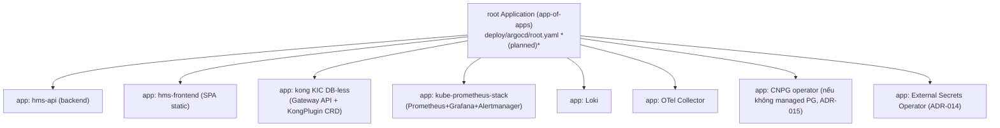
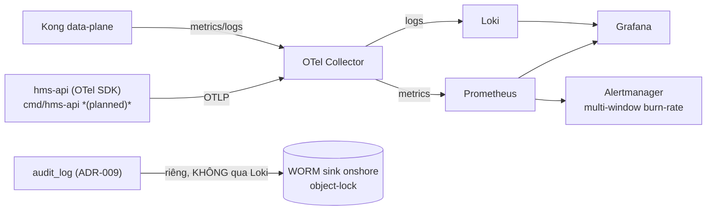

# 15 — DevSecOps & CI/CD

> Pipeline bảo mật (security gates merge-blocking), GitOps Argo CD app-of-apps, supply-chain (SBOM + signing + provenance), và observability MVP cho HMS. Mọi quyết định neo vào **ADR-019** (Kong KIC DB-less + Argo CD rolling, KHÔNG canary/Tempo MVP), **ADR-002** (MVP component budget), **ADR-024** (golang-migrate), **ADR-025** (testing), **ADR-009** (audit→WORM).
> Liên quan: [10-deployment-operations.md](./10-deployment-operations.md) · [16-iac-runbooks.md](./16-iac-runbooks.md) · [11-coding-testing-standards.md](./11-coding-testing-standards.md) · [01-kien-truc-tong-the.md](./01-kien-truc-tong-the.md) · [13-adr.md](./13-adr.md)

Repo **CHƯA CÓ CODE** — đây là thiết kế MỤC TIÊU. Code path tham chiếu theo layout *(planned)* ở canon §9; file workflow đặt tại `.github/workflows/` *(planned)*.

---

## 1. Triết lý: shift-left, fail-closed, budget-aware

Ba nguyên tắc bất biến của pipeline HMS:

1. **Shift-left, merge-blocking rẻ trước (ADR-019)** — MVP giữ một bộ security gate **rẻ + high-value** chặn merge: Gitleaks (secret), govulncheck + Trivy fs (SCA), golangci-lint (gồm `depguard` cho layer rule ADR-001), CodeQL/Semgrep (SAST). Supply-chain nặng (SBOM Syft + Cosign sign, SLSA provenance, DAST ZAP) **earn-in sau khi pipeline ổn** — KHÔNG front-load (ADR-002: mỗi thành phần thêm phải dẫn chứng trigger).
2. **Fail-closed cho compliance gate** — gate liên quan PHI/patient-safety (RLS branch-isolation test ADR-003, audit-fail-closed ADR-009, CDSS hard-stop ADR-008) là **hard fail**, không `continue-on-error`. Gate chất lượng (lint cảnh báo) có thể soft ở giai đoạn đầu nhưng RLS/audit/coverage thì KHÔNG.
3. **GitOps là source-of-truth duy nhất cho cluster** — không `kubectl apply` tay vào prod; mọi thay đổi runtime đi qua Git → Argo CD reconcile (ADR-019). Pipeline CI **build + sign + push image**; CD (Argo CD) **deploy**. Tách bạch CI ≠ CD.

> **Phạm vi DevSecOps theo budget (ADR-002):** MVP chỉ vận hành Argo CD rolling + Prometheus + Loki + Grafana + Alertmanager. KHÔNG Tempo, KHÔNG Argo Rollouts canary, KHÔNG service mesh. Các thứ này có earn-in trigger ở §9.

---

## 2. Pipeline tổng thể (CI → registry → CD)

```mermaid
flowchart LR
  subgraph CI["GitHub Actions (CI) — .github/workflows *(planned)*"]
    A[push / PR] --> B[secret scan: Gitleaks]
    B --> C[SAST: CodeQL + Semgrep]
    C --> D[SCA: govulncheck + Trivy fs]
    D --> E[lint: golangci-lint + depguard]
    E --> F[unit + integration<br/>testcontainers: RLS/outbox/FEFO/idempotency]
    F --> G[coverage gate ≥80%]
    G --> H[build image distroless]
    H --> I[scan image: Trivy image]
    I --> J[IaC scan: Trivy config / Checkov]
    J --> K[SBOM: Syft → SPDX]
    K --> L[sign + attest: Cosign + SLSA provenance]
    L --> M[push to registry onshore VN]
  end
  M --> N[bump image tag in deploy/ overlay<br/>commit to GitOps repo]
  subgraph CD["Argo CD app-of-apps (CD) — deploy/argocd *(planned)*"]
    N --> O[Argo CD detect drift]
    O --> P{env}
    P -->|dev/staging auto-sync| Q[rolling deploy maxUnavailable=0]
    P -->|prod manual promotion| R[approve → sync]
  end
  Q --> S[K8s onshore VN]
  R --> S
```



**Ranh giới CI/CD:** CI kết thúc khi image đã sign + push + image tag được bump trong GitOps overlay (`deploy/kustomize/overlays/<env>` *(planned)*). CD do Argo CD đảm nhận hoàn toàn — KHÔNG có step `kubectl` trong GitHub Actions chạm prod (ADR-019).

---

## 3. Security gates merge-blocking *(MVP)*

Bảng gate, công cụ pinned, hành vi fail, và ADR neo. Tất cả chạy trên PR → `main`/`release/*` và là **required status check** (branch protection).

| # | Gate | Công cụ (pinned) | Fail behavior | Neo ADR |
|---|------|------------------|---------------|---------|
| 1 | **Secret scan** | Gitleaks (`gitleaks/gitleaks-action`) — scan diff + full history trên main | hard fail, block | security.md |
| 2 | **SAST** | CodeQL (`github/codeql-action`, go+javascript) + Semgrep (`returntocorp/semgrep`, ruleset `p/golang`, `p/owasp-top-ten`) | hard fail trên HIGH/CRITICAL | code-review.md |
| 3 | **SCA (deps)** | `govulncheck ./...` (Go stdlib+mod CVE) + Trivy fs (npm `frontend/`) | hard fail trên fixable HIGH/CRITICAL | ADR-019 |
| 4 | **Lint + layer rule** | golangci-lint (gồm `depguard` cấm cross-BC import, ADR-001) | hard fail | ADR-001 |
| 5 | **Unit + integration** | `go test -race` + **testcontainers-go** real Postgres | hard fail | ADR-025 |
| 6 | **RLS branch-isolation** | integration test: branch-B vô hình dưới `app.current_branch=A` (ADR-003) | **hard fail (keystone)** | ADR-003 |
| 7 | **Coverage** | `go test -coverprofile`, gate ≥80% domain/app | hard fail | ADR-025 |
| 8 | **Container scan** | Trivy image (distroless base) | hard fail HIGH/CRITICAL | ADR-019 |
| 9 | **IaC scan** | Trivy config + Checkov (Kustomize/Helm/OpenTofu trong `deploy/`,`infra/`) | hard fail | §6 |
| 10 | **FE quality** | Vitest + RTL + `vitest-axe` (a11y), Playwright E2E smoke | hard fail | ADR-018, ADR-025 |
| 11 | **SBOM + sign** *(earn-in→MVP-late)* | Syft (SPDX) + Cosign sign image & attest | hard fail nếu sign lỗi | §5 |
| 12 | **DAST** *(Phase 2/3)* | OWASP ZAP baseline scan staging | warn→block dần | §9 |

> **Gate keystone (ADR-003):** Gate #6 là **không-thể-bỏ-qua**. Test chứng minh dữ liệu chi nhánh B vô hình khi `SET LOCAL app.current_branch = '<A>'`, và resource khác branch trả **404 (không 403)**. Đây là invariant không retrofit được sau khi có PHI thật (open risk [critical] §8 canon). Test sống tại `backend/internal/shared/rls/*_test.go` *(planned)*.

### 3.1 Snippet workflow CI (rút gọn) *(planned)*

```yaml
# .github/workflows/ci.yml  (planned — phác thảo, chưa hiện thực)
name: ci
on:
  pull_request: { branches: [main, "release/*"] }
  push: { branches: [main] }
permissions:
  contents: read
  security-events: write   # CodeQL/Trivy SARIF upload
  id-token: write          # OIDC keyless cho Cosign (§5)
jobs:
  secret-scan:
    runs-on: ubuntu-latest
    steps:
      - uses: actions/checkout@v4 # { with: fetch-depth: 0 } để scan history
      - uses: gitleaks/gitleaks-action@v2
  static-analysis:
    runs-on: ubuntu-latest
    steps:
      - uses: actions/checkout@v4
      - uses: github/codeql-action/init@v3 # { with: languages: go, javascript-typescript }
      - run: make build
      - uses: github/codeql-action/analyze@v3
      - uses: returntocorp/semgrep-action@v1 # { with: config: p/golang p/owasp-top-ten }
  test:
    runs-on: ubuntu-latest   # Docker-in-CI cho testcontainers (ADR-025)
    steps:
      - uses: actions/checkout@v4
      - run: go install golang.org/x/vuln/cmd/govulncheck@latest && govulncheck ./...
      - run: golangci-lint run        # depguard enforce layer rule (ADR-001)
      - run: go test -race -coverprofile=cover.out ./...   # gồm RLS/outbox/FEFO/idempotency
      - run: ./scripts/check-coverage.sh 80   # gate merge-blocking (planned)
```

**Lưu ý OIDC keyless (§5):** `id-token: write` cho phép Cosign ký bằng OIDC ephemeral identity (Fulcio/Sigstore) — KHÔNG lưu private key trong CI secret. Nếu deploy onshore air-gapped không tới Sigstore public, dùng Cosign key-based với KMS-backed key (VNG/Viettel KMS, ADR-014) thay vì keyless.

---

## 4. GitOps — Argo CD app-of-apps *(MVP, ADR-019)*

Argo CD ROLLING deploy + **manual promotion cho prod** (KHÔNG Argo Rollouts canary, KHÔNG SLO-auto-rollback ở MVP — earn-in §9). Cấu trúc app-of-apps tại `deploy/argocd/` *(planned)*:



**Sync policy theo môi trường** (namespace-per-env dev/staging/prod ngày 1, ADR-019/§deploy canon):

| Env | Sync | Promotion | maxUnavailable | Ghi chú |
|-----|------|-----------|----------------|---------|
| dev | automated + selfHeal + prune | auto | 0 (rolling) | feature branch test |
| staging | automated + selfHeal | auto | 0 | DAST ZAP target (Phase 2) |
| **prod** | **manual** | **manual approval** | **0** | PHI namespace isolated, NetworkPolicy default-deny |

- **Kong config là GitOps-versioned YAML (ADR-019):** Gateway API + KongPlugin CRD reconciled bởi Argo CD, **no Kong Postgres** (DB-less/declarative). Version Kong **pin + patch là CI/admission gate** vì **CVE-2026-29413** (auth-bypass, CISA-KEV, exploited healthcare gateways — open risk [high] §8). Image tag Kong nằm trong Git; bump = PR + review.
- **Image promotion:** CI bump image digest (KHÔNG dùng tag `latest` — pin digest `@sha256:`) trong overlay → commit → Argo CD sync. Prod cần người approve.
- **Drift detection:** Argo CD `selfHeal` ở dev/staging tự revert thay đổi tay; prod phát hiện drift → cảnh báo (không auto-revert để tránh chống lại break-the-glass hotfix có chủ đích).
- **Rollback:** `argocd app rollback` về revision trước (Git history) — vì rolling deploy nên rollback là re-sync manifest cũ. KHÔNG có auto-rollback theo SLO (ADR-019, earn-in §9).

---

## 5. Supply-chain security — SBOM, signing, provenance

Bake-in nền tảng supply-chain (giai đoạn MVP-late, earn-in §9). Mục tiêu: chống image bị tamper trước khi tới cluster PHI.

| Artifact | Công cụ | Output | Verify ở đâu |
|----------|---------|--------|--------------|
| **SBOM** | Syft | SPDX JSON, attach OCI registry | audit + Trivy scan SBOM định kỳ |
| **Image signature** | Cosign (keyless OIDC hoặc KMS key) | cosign signature | **Kyverno/admission controller** ở cluster verify trước khi admit |
| **SLSA provenance** | SLSA GitHub generator (`slsa-framework/slsa-github-generator`) | provenance attestation (build L3) | Cosign verify-attestation |
| **Vuln re-scan** | Trivy scan registry image định kỳ (River cron hoặc GH schedule) | SARIF | alert khi CVE mới trên image đã deploy |

**Admission gate (earn-in):** Kyverno policy `verifyImages` từ chối Pod nếu image chưa được Cosign-sign bởi identity tin cậy của CI HMS. Kết hợp với `runAsNonRoot + readOnlyRootFS + drop-ALL-caps + seccompRuntimeDefault` (canon §deploy) — image gốc **distroless** (không shell, giảm bề mặt tấn công).

```bash
# Verify trước khi admit (admission webhook hoặc bước kiểm tra thủ công) (planned)
cosign verify --certificate-identity-regexp '.*hms.*' \
  --certificate-oidc-issuer https://token.actions.githubusercontent.com \
  registry.onshore.vn/hms/hms-api@sha256:<digest>
cosign verify-attestation --type slsaprovenance registry.onshore.vn/hms/hms-api@sha256:<digest>
```

> **Residency (NĐ 53/2022 + NĐ 13/2023):** Container registry đặt **onshore VN**. Nếu Sigstore public (Fulcio/Rekor) không tiếp cận được trong môi trường onshore, chuyển sang Cosign key-based với key trong cloud KMS onshore (ADR-014) — giữ một cơ chế crypto, không thêm Vault (ADR-002/014).

---

## 6. IaC scan *(MVP)*

Mọi manifest hạ tầng (OpenTofu `infra/`, Helm/Kustomize `deploy/`, Kong, Argo CD) qua scan trước merge — chống misconfiguration làm rò PHI hoặc mở rộng quyền.

- **Trivy config** + **Checkov**: phát hiện container privileged, missing `securityContext`, NetworkPolicy thiếu, secret hardcode trong manifest, `hostPath` mount, public service.
- **Kiểm tra bắt buộc HMS-specific** (custom policy / OPA Conftest *(planned)*):
  - Mọi Deployment PHI namespace có `runAsNonRoot: true`, `readOnlyRootFilesystem: true`, `drop: [ALL]`, `seccompProfile: RuntimeDefault` (canon §deploy).
  - NetworkPolicy **default-deny** tồn tại trong namespace PHI; PHI namespace isolated.
  - Không có `image: *:latest` (phải pin digest — supply-chain).
  - K8s **etcd encryption-at-rest** được cấu hình (ADR-014).
  - PDB `minAvailable: 2`, Deployment `replicas ≥ 3` (canon §deploy availability).

---

## 7. Observability MVP — OTel → Prometheus + Loki + Grafana + Alertmanager *(ADR-019)*

KHÔNG Tempo / distributed-tracing ở MVP (vô nghĩa với một service — ADR-019). Tracing earn-in khi multi-service (§9).



> **Audit ≠ logs (ADR-009/ADR-019):** Audit log (compliance, who-read-which-PHI) ship **riêng** tới WORM sink object-lock onshore — **KHÔNG** chỉ vào Loki. Loki cho operational logs; mất Loki log = phiền, mất audit = vi phạm HIPAA §164.312(b)/NĐ13/TT13. Hash-chain audit phải sống sót PITR restore (open risk [high] §8).

### 7.1 SLO + multi-window burn-rate alert *(MVP)*

SLO chốt (canon §observability):

| SLO | Target | Đo bằng |
|-----|--------|---------|
| API availability | **99.9%** | tỉ lệ 5xx Kong/hms-api |
| Clinical-read latency | **p95 < 300ms** | histogram OTel theo route lâm sàng |
| Claim-event-processing | trong budget (outbox/River lag) | độ trễ xử lý event outbox→processed |

Cảnh báo dùng **multi-window multi-burn-rate** (Google SRE workbook): cửa sổ nhanh (5m) + chậm (1h) cùng vượt ngưỡng → page; chỉ cửa sổ chậm → ticket. Tránh alert flapping.

```yaml
# Alertmanager / Prometheus rule (planned) — ví dụ availability SLO 99.9%
- alert: HMSApiErrorBudgetFastBurn
  expr: |
    (sum(rate(http_requests_total{job="hms-api",code=~"5.."}[5m]))
      / sum(rate(http_requests_total{job="hms-api"}[5m]))) > (14.4 * 0.001)
    and
    (sum(rate(http_requests_total{job="hms-api",code=~"5.."}[1h]))
      / sum(rate(http_requests_total{job="hms-api"}[1h]))) > (14.4 * 0.001)
  for: 2m
  labels: { severity: page }
  annotations: { summary: "Đốt error budget nhanh — API availability < 99.9%" }
```

**Dashboard MVP cần có:** API availability/latency theo persona-route; outbox lag + River job backlog (claim submit/retry — ADR-011/012); BHYT gateway degraded-mode counters (admit-and-flag, queue-and-retry — ADR-006); CDSS fail-closed rate (ADR-008); RLS-related deny; audit-write-fail (phải = 0, ADR-009).

---

## 8. Migrations trong pipeline *(ADR-024)*

- golang-migrate (`backend/migrations/NNNNNN_name.up/down.sql` *(planned)*), `cmd/migrate/` runner; sqlc đọc cùng schema.
- **Migration chạy như Argo CD PreSync hook hoặc K8s Job**, KHÔNG nhúng vào app startup (tránh race nhiều replica). Migration-owner role tách app-role (ADR-003) — Job dùng credential migration-owner; app Pod dùng app-role (NOSUPERUSER, NOBYPASSRLS).
- Zero-downtime: add nullable/DEFAULT, add→backfill→switch→drop (không rename trực tiếp), `CREATE INDEX CONCURRENTLY` **tách tx** (ADR-024) — CONCURRENTLY không chạy trong migration transaction, cần job riêng.
- **Migration 000001** thiết lập extensions + branches + accounts/roles/permissions + audit_log + migration-owner-vs-app-role + ENABLE+FORCE RLS **trước bất kỳ bảng PHI nào** (keystone, ADR-003/024). CI verify migration up→down→up sạch trên testcontainers.

---

## 9. Earn-in triggers — defer có điều kiện *(ADR-002/ADR-019)*

Theo MVP component budget (ADR-002), mỗi thành phần DevSecOps nặng chỉ thêm khi trigger viết sẵn đạt:

| Thành phần (deferred) | Phase | Earn-in trigger |
|-----------------------|-------|-----------------|
| **Argo Rollouts canary + SLO-auto-rollback** | Phase 3 | multi-service + team có SRE riêng + đã ship v1 ổn định (ADR-019) |
| **Tempo / distributed tracing** | Phase 3 | tách BC ra ≥2 service (cross-service trace có nghĩa) (ADR-019) |
| **SLSA provenance L3 đầy đủ + admission verify** | MVP-late→Phase 2 | sau khi pipeline ổn, trước multi-tenant rollout |
| **Cosign sign + Kyverno verifyImages** | MVP-late | sau khi registry onshore + KMS key sẵn sàng |
| **DAST OWASP ZAP merge-blocking** | Phase 2 | staging env ổn định + external surface mở rộng |
| **Service mesh (Linkerd) mTLS pod-to-pod** | Phase 3 | khi BC tách service (ADR-016/roadmap Phase 3) |
| **CDC/Kafka analytics pipeline** | Phase 3 | volume justify (trước đó scheduled SQL→read-table, ADR-012) |
| **Full Vault (PKI/dynamic creds)** | Phase 4 | cần PKI signing thật / dynamic DB creds / service extraction (ADR-014) |

> Quy tắc review (ADR-002): mọi PR thêm stateful system / pipeline component phải **dẫn chứng trigger đã đạt**; review pipeline kiểm budget. Một Vault/Kafka/canary vận hành kém còn nguy hiểm cho PHI hơn lựa chọn managed đơn giản.

---

## 10. Branch protection & quy trình *(MVP)*

- Required status checks = toàn bộ gate hard-fail §3 (#1–#10) + gate #6 RLS keystone.
- Yêu cầu ≥1 review (code-review.md); security-sensitive (auth/PHI/migration) → thêm security-reviewer (security.md).
- Commit theo conventional commits (git-workflow.md); PR template gồm **test plan** + checklist security.
- Pre-merge: CI xanh, không merge conflict, branch up-to-date với target.
- Secret: KHÔNG hardcode trong source/manifest (Gitleaks gate); secret runtime qua KMS/External Secrets Operator (ADR-014), inject vào Pod, KHÔNG vào image.

---

## 11. Checklist DevSecOps trước go-live

- [ ] Toàn bộ gate §3 merge-blocking, RLS branch-isolation test (#6) xanh và không bypass-able (ADR-003)
- [ ] Coverage ≥80% domain/app (ADR-025); E2E critical flow (check-in BHYT → OPD/CDSS → FEFO → cashier → claim) xanh
- [ ] Kong version pinned + patch CVE-2026-29413, là CI/admission gate (ADR-019)
- [ ] Image distroless, scan Trivy sạch HIGH/CRITICAL, pin digest (không `latest`)
- [ ] Cosign sign + SBOM Syft + (SLSA provenance khi earn-in); admission verify nếu đã bật
- [ ] Argo CD app-of-apps reconcile sạch; prod = manual promotion; rollback tested
- [ ] Observability: Prometheus+Loki+Grafana+Alertmanager up; SLO burn-rate alert wired; audit→WORM riêng (ADR-009)
- [ ] IaC scan sạch; securityContext + NetworkPolicy default-deny + etcd encryption verify (§6)
- [ ] Migration 000001 (FORCE RLS keystone) chạy như Job với migration-owner role, up/down/up sạch (ADR-024)
- [ ] Không Tempo/canary/Vault/Kafka ở MVP — chỉ thêm khi earn-in trigger đạt (ADR-002)
