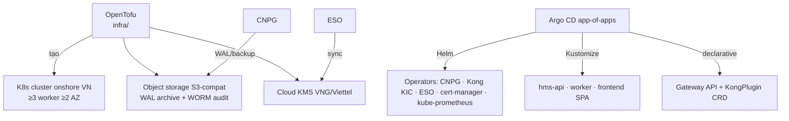
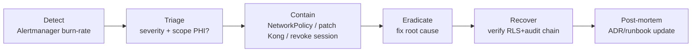

# 16 — IaC & Runbooks vận hành

> Mã hóa hạ tầng (Infrastructure-as-Code) và sổ tay vận hành (runbook) của HMS: **OpenTofu** dựng cloud/cluster/network onshore, **Helm** cài operators (CNPG/Kong/ESO/cert-manager/kube-prometheus), **Kustomize** overlay per-env, **Kong** declarative DB-less, và các runbook xử lý sự cố production (cổng BHYT down → degraded-mode, cashier offline, restore PITR, break-the-glass review, rotate keys, incident response). Mọi quyết định neo vào ADR trong [13-adr.md](./13-adr.md); chi tiết deployment/budget xem [10-deployment-operations.md](./10-deployment-operations.md); CI/CD & GitOps xem [15-devsecops-cicd.md](./15-devsecops-cicd.md). Repo CHƯA CÓ CODE — mọi path đánh dấu *(planned)*.

---

## 1. Phân tầng IaC — ai dựng cái gì

Quy tắc nền tảng (ADR-002, ADR-019): MVP chỉ vận hành đúng **component budget** đã chốt (managed/CNPG-async Postgres + Go monolith + Kong KIC DB-less + KMS/ESO + Argo CD rolling + Prometheus+Loki). IaC phản ánh đúng budget này — KHÔNG provision Vault-đầy-đủ/NATS/Kafka/Debezium/OIE/Orthanc ở MVP.

| Tầng | Công cụ | Sở hữu | Quản lý drift bởi |
|------|---------|--------|-------------------|
| Cloud account, VPC/subnet/NAT, K8s cluster, node pool, object storage (S3-compat onshore), managed PG (nếu chọn) | **OpenTofu** | infra/ *(planned)* | `tofu plan` trong CI, state remote backend |
| Cluster-wide operators: CNPG, Kong Ingress Controller, External-Secrets Operator, cert-manager, kube-prometheus-stack | **Helm** (qua Argo CD Application) | deploy/helm/ *(planned)* | Argo CD self-heal |
| App workload per-env (hms-api, worker, frontend, NetworkPolicy, HPA, PDB) | **Kustomize** base + overlays | deploy/kustomize/{base,overlays/{dev,staging,prod}} *(planned)* | Argo CD self-heal |
| Edge config: Gateway API + KongPlugin CRD (JWT/JWKS, rate-limit, TLS, mTLS-upstream) | **Kong declarative** YAML | deploy/kong/ *(planned)* | Argo CD reconcile |
| App-of-apps roots | Argo CD | deploy/argocd/ *(planned)* | manual promotion |

**Ranh giới có chủ đích**: OpenTofu KHÔNG cài app — chỉ tài nguyên cloud/cluster bất biến. Helm chỉ operators (stateful controllers). Kustomize chỉ workload app HMS. Edge config tách riêng để patch Kong CVE nhanh không đụng app (ADR-019: version-pin Kong + patch là CI/admission gate, CVE-2026-29413).



---

## 2. OpenTofu — cloud / cluster / network *(planned)*

Backend state remote (object storage onshore + lock), workspace per-env. Module hóa theo cohesion (ADR coding-style: many small files). Không hardcode secret — output qua ESO.

```hcl
# infra/modules/cluster/main.tf  (planned)
module "k8s" {
  source       = "../modules/k8s-cluster"
  region       = "vn-hanoi"          # onshore — NĐ53/2022 + NĐ13/2023
  worker_count = 3                    # ≥3 worker ≥2 AZ (ADR-019)
  azs          = ["az-a", "az-b"]
  network_policy_provider = "cilium"  # default-deny NetworkPolicy
}

# infra/modules/storage/main.tf  (planned)
resource "objstore_bucket" "audit_worm" {
  name        = "hms-audit-worm"
  object_lock = "COMPLIANCE"          # WORM cho audit_log sink (ADR-009)
  versioning  = true
}
resource "objstore_bucket" "pg_backup" {
  name = "hms-pg-wal-backup"          # WAL archive + base backup (ADR-015)
}
```

Invariant IaC (review-gated):
- `region` ∈ {onshore VN} — guard chống chọn region nước ngoài (data residency NĐ13/53, ADR-005/ADR-020).
- Object-lock COMPLIANCE bật cho bucket audit (audit immutable không retrofit được — ADR-009).
- `tofu plan` chạy trong CI, KHÔNG `apply` tự động lên prod (manual promotion — ADR-019).

---

## 3. Helm operators + Kustomize overlays *(planned)*

Helm chart cài qua Argo CD `Application` (không `helm install` thủ công). Pin chart version + image digest. Postgres: ưu tiên VN-managed PG (VNG/Viettel/FPT); fallback CNPG **1 primary + 1 ASYNC replica** (KHÔNG 2 sync — ADR-015).

```yaml
# deploy/helm/cnpg-cluster.yaml  (planned) — chỉ khi không có managed onshore
apiVersion: postgresql.cnpg.io/v1
kind: Cluster
metadata: { name: hms-pg, namespace: hms-prod }
spec:
  instances: 2                        # 1 primary + 1 ASYNC replica (ADR-015)
  postgresql:
    parameters:
      synchronous_commit: "remote_write"   # async — KHÔNG sync (write-latency charge/claim)
  backup:
    barmanObjectStore:
      destinationPath: s3://hms-pg-wal-backup
      wal: { compression: gzip }
    retentionPolicy: "30d"            # PITR RPO≤5min platform, RTO≤1h (ADR-015)
```

Kustomize overlay khác nhau per-env ở: replica count, resource request/limit, HPA bound, hostname Gateway, log level. Base cố định securityContext (ADR deploy): `runAsNonRoot + readOnlyRootFS + drop ALL caps + seccomp RuntimeDefault`, probes `/livez+/readyz+startupProbe`, `PDB minAvailable=2`, rolling `maxUnavailable=0`, topologySpread.

```yaml
# deploy/kustomize/base/hms-api-deployment.yaml  (planned)
spec:
  strategy: { rollingUpdate: { maxUnavailable: 0 } }   # zero-downtime (ADR deploy)
  template:
    spec:
      securityContext: { runAsNonRoot: true, seccompProfile: { type: RuntimeDefault } }
      containers:
        - name: hms-api
          securityContext: { readOnlyRootFilesystem: true, capabilities: { drop: ["ALL"] } }
          readinessProbe: { httpGet: { path: /readyz, port: 8080 } }
```

External-Secrets sync từ cloud KMS (ADR-014: MỘT cơ chế app-side envelope encryption, KMS-wrapped DEK). cert-manager cấp TLS internal (Vault/VN-CA issuer); Kong terminate TLS 1.3 + mTLS-to-upstream (ADR-013/ADR-019).

---

## 4. Kong declarative DB-less *(planned)*

Kong CHỈ coarse-grained edge (ADR-013): verify JWT qua JWKS Keycloak (reject `alg=none`), TLS 1.3 terminate + mTLS-upstream, rate-limit (Redis), request-size, ip-restriction admin path, bot-detect. Kong **KHÔNG bao giờ** quyết object-level authz — Go làm việc đó. Version-pin + patch là gate (CVE-2026-29413).

```yaml
# deploy/kong/kongplugin-jwt.yaml  (planned)
apiVersion: configuration.konghq.com/v1
kind: KongPlugin
metadata: { name: jwt-jwks }
plugin: jwt
config: { claims_to_verify: ["exp"], key_claim_name: iss, run_on_preflight: true }
# alg=none reject + JWKS từ Keycloak realm 'hospital' (ADR-013)
```

---

## 5. RUNBOOK — Cổng giám định BHYT down → degraded reception

> **Trigger #1 staff bỏ hệ thống quay về giấy** (open-risk [high]). Degraded-mode là first-class, KHÔNG được chặn người bệnh. Neo: ADR-006 (BHYT two-touch + degraded bắt buộc), ADR-023 (rejection-code state machine).

**Triệu chứng**: tiếp đón báo card-check timeout/5xx; alert `bhyt_cardcheck_error_rate` > ngưỡng (xem [15-devsecops-cicd.md](./15-devsecops-cicd.md) burn-rate).

**Hành động vận hành**:
1. **KHÔNG tắt tính năng tiếp đón.** Hệ thống tự chuyển **admit-and-flag**: thẻ đánh dấu `provisionally-unverified`, tạo `bhyt_eligibility_checks` với trạng thái `pending`, người bệnh vẫn lấy số thứ tự & vào khám. UI hiển thị "đã lưu, chờ gửi cổng".
2. Xác nhận River job retry đang chạy: kiểm `cmd/worker` *(planned)* job `bhyt-cardcheck-retry` đang back-off, KHÔNG dừng.
3. Phân biệt **mạng nội bộ** (egress NetworkPolicy/DNS) vs **cổng BHXH** (5xx/timeout phía họ):
   ```bash
   kubectl -n hms-prod logs deploy/hms-worker | grep bhyt-cardcheck   # error class
   kubectl -n hms-prod exec deploy/hms-api -- wget -qO- https://<bhxh-gateway>/health
   ```
4. Nếu cổng BHXH down kéo dài: thông báo super-user khoa rằng đang degraded; tiếp đón tiếp tục bình thường.

**Khôi phục**: khi cổng sống lại, River retry tự reconcile các `pending` → ghi verdict eligible/ineligible/co-pay vào `bhyt_eligibility_checks`. Nhân viên xử lý các thẻ trở thành `ineligible` theo quy trình (không phải lúc người bệnh ở quầy). **Không thao tác tay vào DB.**

**Anti-pattern (cấm)**: tắt reception khi cổng down; sửa verdict trực tiếp trong Postgres (bypass audit ADR-009); để staff ghi giấy (phá vết audit + claim linkage).

---

## 6. RUNBOOK — Cashier offline / thu tiền khi cổng lỗi

> Neo: ADR-006 (cashier thu + reconcile-later), ADR-011 (charge-capture idempotent + idempotency-key end-to-end).

**Triệu chứng**: payment gateway (VNPay/Momo/napas) redirect lỗi, hoặc cổng BHYT chưa trả verdict lúc quyết toán.

**Hành động**:
1. Cashier vẫn lập biên lai & **thu phần tự túc**; phần BHYT để `pending-reconcile`. Charge-capture đã idempotent vào Invoice qua outbox (ADR-011), nên thu lại/replay KHÔNG double-post — bảo đảm bởi `idempotency_keys` unique-constraint.
2. Thanh toán điện tử: HMS KHÔNG lưu số thẻ thật (ngoài PCI scope — ADR-021), chỉ token + transaction id. Nếu redirect lỗi, dùng transaction id để reconcile sau, KHÔNG nhập số thẻ tay.
3. UI hiển thị "đã lưu, chờ gửi cổng" cho phần BHYT.

**Khôi phục**: khi cổng/gateway sống, saga quyết toán (ADR-011) chốt phần BHYT; River job reconcile transaction id ↔ payment. Đối soát cuối ngày: KHÔNG dùng Excel tay (mục tiêu bỏ Excel đối soát — section 2 canon).

**Kiểm idempotency end-to-end** (open-risk [high]): FE idempotency-key và backend charge/claim key PHẢI là MỘT scheme — test E2E xác nhận queued-then-replayed dispense/charge không double-post (ADR-025).

---

## 7. RUNBOOK — CDSS down → fail-closed (KHÔNG fail-open)

> **Patient-safety critical** (open-risk [critical]). Neo: ADR-008 (CDSS hard-stop enforce backend, fail-closed).

**Nguyên tắc cứng**: CDSS error/timeout → command order/dispense bị **reject**, KHÔNG BAO GIỜ confirm "no known interaction". Trạng thái `allergy status unknown` hiển thị rõ, KHÔNG render là "safe". React modal chỉ là UX — control thật ở backend aggregate.

**Hành động**:
1. Xác nhận hành vi fail-closed đang đúng: dispense bị chặn là HÀNH VI ĐÚNG khi CDSS down, KHÔNG phải bug cần "tắt CDSS để thông".
2. Điều tra nguyên nhân (dữ liệu tương tác/dị ứng không load, DB lag). KHÔNG có công tắc fail-open trong production.
3. Override hợp lệ chỉ qua `interaction_overrides` (reason + authorizer, ghi audit) — không phải bypass code.

**Anti-pattern (cấm tuyệt đối)**: feature-flag fail-open "để giải phóng hàng đợi"; bỏ qua allergy-unknown như safe.

---

## 8. RUNBOOK — Restore PITR & DR drill

> Neo: ADR-015 (PITR RPO≤5min, RTO≤1h, quarterly restore drill), ADR-004/ADR-009 (signed-EMR + hash-chain phải survive PITR restore).

**Drill định kỳ (quý)** — restore vào **ephemeral namespace**, đo RTO thực:
1. Tạo namespace `hms-dr-drill`; restore CNPG/managed PG từ base backup + WAL replay tới recovery target time.
2. Verify durability signed-EMR: record ký số trước thời điểm restore PHẢI còn (synchronous durability path — ADR-004/ADR-015), KHÔNG mất do RPO≤5min chung.
3. **Verify hash-chain audit còn nguyên** sau restore (ADR-009): chạy verify chain — mỗi record chứa hash record trước; chain gãy = finding.
   ```bash
   # ephemeral verify (planned)
   kubectl -n hms-dr-drill exec deploy/hms-api -- /hms verify-audit-chain --from <ts>
   ```
4. Verify RLS còn FORCE sau restore: chạy CI branch-isolation test (ADR-003) trên DB đã restore — branch-B phải invisible dưới `app.current_branch=A`.
5. Ghi RTO đo được vào DR log; teardown namespace.

**Sự cố thật (restore production)**: chỉ thực hiện với approval; recover tới recovery target gần nhất; sau restore PHẢI verify hash-chain + RLS trước khi mở traffic.

---

## 9. RUNBOOK — Break-the-glass review (SLA hậu kiểm)

> Neo: ADR-010 (break-the-glass time-boxed + scoped + closed review loop), ADR-020 (NĐ13 audit obligation).

Break-the-glass: nhân viên khai lý do → cấp quyền tạm **time-boxed (auto-expire N giờ)** + **scoped** tới patient/encounter cụ thể → sinh audit cờ đỏ + thông báo security officer. Áp dụng cả ACCESS và CREATION/ordering (ED register-first-identify-later).

**Quy trình review (named reviewer + hard SLA)**:
1. Mỗi `break_glass_grants` cờ đỏ vào hàng đợi review của security officer.
2. Reviewer kiểm trong SLA (vd ≤72h): lý do hợp lệ? scope đúng? — ghi quyết định.
3. Grant auto-expire đúng hạn (không cần thu hồi tay); KHÔNG có grant over-broad/vĩnh viễn.
4. Lạm dụng → consequence path (kỷ luật/đào tạo lại). Unreviewed emergency-access = finding NĐ13 (open-risk [medium]).

**Audit query** *(planned)*: liệt kê grant chưa review quá SLA từ `break_glass_grants` + `audit_log`.

---

## 10. RUNBOOK — Rotate keys & secrets

> Neo: ADR-014 (app-side envelope encryption, KMS-wrapped DEK, blind-index HMAC), ADR-021 (BHYT client cert trong secret store).

| Secret | Cơ chế | Quy trình rotate |
|--------|--------|------------------|
| DEK (data encryption key) mã hóa cột nhạy (CCCD/thẻ BHYT/HIV/tâm thần/di truyền) | KMS-wrapped, app-side AES-256-GCM | Rotate KMS key → re-wrap DEK; envelope cho phép rotate KEK không re-encrypt toàn bộ data |
| Blind-index HMAC key | Static-but-rotated qua ESO | Rotate = re-index cột blind_index (downtime-aware, backfill) — **chốt trước, không thường xuyên** |
| BHYT client cert (mTLS outbound) | Secret store, sync ESO | Renew trước hết hạn; cập nhật cổng giám định nếu cần |
| TLS cert internal | cert-manager auto-renew | Tự động (Vault/VN-CA issuer) |
| Keycloak client secret / JWKS | Keycloak realm | JWKS rotate → Kong tự refresh từ endpoint |

**Nguyên tắc**: KHÔNG hardcode secret trong code/manifest (security checklist); MỘT cơ chế crypto app-side (KHÔNG đồng thời pgcrypto DB-side + Vault Transit — ADR-014). Nếu secret nghi lộ: STOP, rotate ngay, review codebase (security response protocol). Full Vault earn-in chỉ khi cần PKI signing thật / dynamic DB creds (ADR-014 trigger).

---

## 11. RUNBOOK — Incident response (template)

Các tầng defense-in-depth (Kong / Go object-level / Postgres-RLS / K8s) — xem [09-security.md](./09-security.md). Incident loop:



| Severity | Ví dụ | Hành động đầu tiên |
|----------|-------|--------------------|
| CRITICAL | RLS leak nghi ngờ; CDSS fail-open; PHI exposure; Kong auth-bypass (CVE-2026-29413) | STOP; cô lập; xác nhận Go verify JWT độc lập (không mù tin `X-Userinfo`); chạy branch-isolation test |
| HIGH | Cổng BHYT down kéo dài; payment reconcile gap; signed-EMR durability nghi ngờ | Vào degraded runbook tương ứng (§5/§6/§8) |
| MEDIUM | HPA flap; certificate sắp hết hạn | Theo dõi; rotate/scale |

**Bắt buộc khi đụng PHI**: mọi truy cập điều tra vẫn qua audit-of-reads (ADR-009 — không trả PHI nếu không audit được); KHÔNG `kubectl exec` query Postgres bypass RLS để "xem nhanh" (phá keystone ADR-003 + bỏ audit). Patch Kong là CI/admission gate, không hotfix tay ngoài GitOps (ADR-019).

---

## 12. Earn-in triggers (IaC mở rộng sau MVP)

Mỗi hệ thống stateful defer gắn trigger viết sẵn (ADR-002). KHÔNG provision sớm.

| Hệ thống | Trigger earn-in | Phase |
|----------|-----------------|-------|
| Kafka/NATS (swap outbox relay adapter) | Tách BC ra service riêng (proven scaling/compliance isolation — ADR-012) | Phase 3 |
| Full Vault (PKI/dynamic creds) | Cần PKI signing thật / dynamic DB creds / service extraction (ADR-014) | Phase 3/4 |
| Argo Rollouts canary + Tempo + SLSA/Cosign/ZAP | Multi-service (ADR-019) | Phase 3 |
| OIE HL7v2 sidecar + Orthanc DICOM | Phase 2 interop (ADR-016) — namespace interop, KHÔNG sau Kong | Phase 2 |
| DB-per-branch | Branch cần cô lập pháp lý/hiệu năng (ADR-005) | Phase 4 |
| Device fleet (cart/tablet/HID scanner) | IPD/eMAR go-live — hard adoption dependency (open-risk [medium]) | Phase 2 |

---

## 13. Liên kết

- [10-deployment-operations.md](./10-deployment-operations.md) — MVP component budget, K8s topology, backup/DR chi tiết
- [15-devsecops-cicd.md](./15-devsecops-cicd.md) — security gates, Argo CD GitOps, observability/SLO burn-rate
- [09-security.md](./09-security.md) — defense-in-depth, RLS keystone, CVE-2026-29413
- [05-billing-insurance-bhyt.md](./05-billing-insurance-bhyt.md) — BHYT two-touch, degraded-mode, saga
- [13-adr.md](./13-adr.md) — ADR-002/006/008/009/010/011/012/014/015/019/021/023
