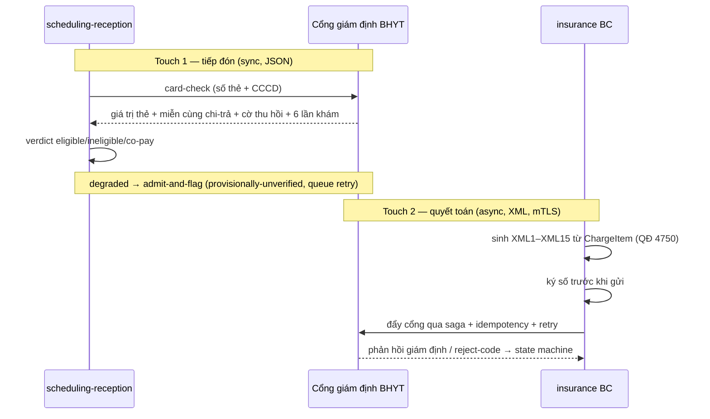
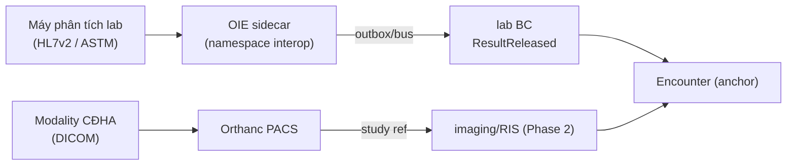

# 17 — Interoperability (liên thông & trao đổi dữ liệu)

> Chiến lược interop phân pha: MVP chỉ bake-in nền móng rẻ + hai external **regulatory** bắt buộc (BHYT 4750, e-prescription); FHIR R4 facade / OIE HL7v2 / Orthanc DICOM defer Phase 2; SMART-on-FHIR + bidirectional FHIR Phase 3. Mọi quyết định neo vào **ADR-016** (phasing) và **ADR-017** (KHÔNG lock thư viện FHIR chết).
>
> Liên quan: [`01-kien-truc-tong-the.md`](01-kien-truc-tong-the.md) · [`03-clinical-encounter-emr.md`](03-clinical-encounter-emr.md) (Encounter anchor) · [`05-billing-insurance-bhyt.md`](05-billing-insurance-bhyt.md) (XML 4750 + card-check) · [`04-orders-lab-pharmacy.md`](04-orders-lab-pharmacy.md) (donthuoc liên thông) · [`08-database-schema.md`](08-database-schema.md) (coded triplets + terminology) · [`13-adr.md`](13-adr.md) (ADR-004/006/007/016/017).

---

## 1. Nguyên tắc & phạm vi

Interop trong HMS KHÔNG phải "mở FHIR server ngày một". Triết lý (ADR-016): **MVP ships ZERO external FHIR/HL7/PACS**, nhưng bake-in những nền móng *không-backfill-được* để Phase 2 rẻ — và CHỈ build hai external bắt buộc về pháp lý. Lý do: bệnh viện một khoa OPD vừa rời giấy không gánh nổi OIE + Orthanc + FHIR facade vận hành cùng lúc; nhập kết quả lab tay là chấp nhận được (domain lead xác nhận). Mọi external khác gắn earn-in trigger viết sẵn (xem `12-roadmap.md`).

| Loại liên thông | Phase | Hướng | Bắt buộc? |
|---|---|---|---|
| Coded triplet + Encounter anchor + terminology catalog | **MVP** | nội bộ (foundation) | Hard requirement (ADR-016) |
| BHYT card-check (JSON, LIVE tại tiếp đón) | **MVP** | outbound sync | Regulatory (ADR-006) |
| BHYT XML1–XML15 đẩy cổng giám định (QĐ 4750) | **MVP** | outbound async | Regulatory (ADR-006) |
| E-prescription donthuocquocgia.vn (QĐ 808 + TT 26/2025) | **MVP** | outbound async | Regulatory (ADR-007) |
| FHIR R4 facade read-only | *(Phase 2)* | outbound read | Khi có nhu cầu trao đổi |
| OIE HL7v2/ASTM sidecar (lab analyzer interface) | *(Phase 2)* | inbound async | Khi có máy phân tích |
| Orthanc / PACS DICOM | *(Phase 2)* | bidirectional | Khi có CĐHA |
| Terminology service `$lookup`/`$validate-code`/`$expand` | *(Phase 2)* | nội bộ + outbound | Đi cùng FHIR facade |
| SMART-on-FHIR apps + bidirectional FHIR + SNOMED CT | *(Phase 3)* | bidirectional | App ecosystem |
| HIE / hồ sơ sức khỏe điện tử quốc gia (TT 54/2017) | *(Phase 4)* | bidirectional | National rollout |

```mermaid
flowchart LR
  subgraph MVP["MVP — foundations + 2 regulatory externals"]
    F1["coded triplet (code,system,display)"]
    F2["Encounter anchor"]
    F3["terminology catalog<br/>(danh mục dùng chung BYT)"]
    F4["transactional outbox in-process"]
    EX1["BHYT card-check JSON (sync)"]
    EX2["BHYT XML 4750 cổng giám định (async)"]
    EX3["donthuocquocgia.vn e-prescription (async)"]
  end
  subgraph P2["Phase 2 — interop nội bộ"]
    FHIR["FHIR R4 facade (read-only)"]
    OIE["OIE HL7v2 sidecar"]
    DICOM["Orthanc / PACS DICOM"]
    TS["terminology $lookup/$validate/$expand"]
  end
  subgraph P3["Phase 3 — external exchange"]
    SMART["SMART-on-FHIR apps"]
    BIDIR["bidirectional FHIR + SNOMED"]
  end
  MVP --> P2 --> P3
```



---

## 2. MVP foundations — nền móng rẻ bake-in *(MVP)*

Ba thứ phải đúng từ migration đầu vì retrofit cực đắt sau khi có data thật (ADR-016, ADR-004).

### 2.1 Coded triplet `(code, system, display)`
Mọi field lâm sàng mã hóa được — chẩn đoán, vitals/observation, thuốc, dịch vụ — lưu **triplet** thay vì free-text: giá trị `code`, `system` (URI/OID của code system), `display` (label hiển thị, snapshot tại thời điểm ghi). Đây là contract để Phase 2 dịch sang FHIR `CodeableConcept` mà không phải đoán lại system.

```sql
-- minh họa cột triplet trên diagnoses (sở hữu bởi encounter BC) — (planned)
diagnosis_code     TEXT      NOT NULL,            -- ví dụ 'J18.9'
diagnosis_system   TEXT      NOT NULL,            -- 'http://hl7.org/fhir/sid/icd-10' (QĐ 4469)
diagnosis_display  TEXT      NOT NULL,            -- 'Viêm phổi, không xác định' (snapshot)
```

| Field lâm sàng | system MVP | Ánh xạ FHIR Phase 2 |
|---|---|---|
| Chẩn đoán | ICD-10 (QĐ 4469) | `Condition.code` |
| Vitals / observation | LOINC | `Observation.code` |
| Thuốc | DMDC / danh mục thuốc BYT (RxNorm sau) | `MedicationRequest.medication` |
| Dịch vụ / DVKT | chargemaster + mã BHYT | `ChargeItem` / `ServiceRequest.code` |

### 2.2 Encounter anchor *(MVP, ADR-004)*
Mọi sự kiện lâm sàng FK tới `encounter_id` (KHÔNG `patient_id` trực tiếp). Encounter là seam ánh xạ FHIR `Encounter` — Phase 2 facade chỉ cần join theo `encounter_id`. Chi tiết state machine xem [`03-clinical-encounter-emr.md`](03-clinical-encounter-emr.md).

### 2.3 Terminology catalog *(MVP)*
Catalog `terminology_concepts` **thuộc patient BC** trong MVP (canon §4: `terminology_concepts (catalog ICD-10/LOINC/RxNorm/DMDC dùng chung)`), seeded từ **danh mục dùng chung BYT TRƯỚC**, LOINC/RxNorm/SNOMED sau. Phase 2, ownership terminology chuyển sang interoperability BC (`code_systems`, `value_sets`, `concept_maps`) — bảng catalog là điểm chuyển giao đã thiết kế sẵn.

### 2.4 Transactional outbox
Mọi state-change emit qua outbox in-process (ADR-012). Phase 2, OIE feed vào bus chỉ khi bus tồn tại — relay adapter swap sang Kafka, domain code không đổi. *Hệ quả ADR-016: OIE feed bus chỉ khi bus tồn tại (Phase 2+).*

---

## 3. Regulatory external #1 — BHYT *(MVP, ADR-006)*

BHYT là phụ thuộc **LIVE hai chạm** (ADR-006), KHÔNG chỉ batch XML cuối encounter. Chi tiết domain ở [`05-billing-insurance-bhyt.md`](05-billing-insurance-bhyt.md); ở đây mô tả góc *interop boundary*.



- **Touch 1 — card-check (sync, JSON):** scheduling-reception gọi LIVE web service cổng giám định, timeout + fallback. Trả thẻ + miễn cùng chi-trả + cờ thu hồi/tạm khóa + 6 lần khám gần nhất → verdict. Degraded-mode: cổng/mạng lỗi → **admit-and-flag** (thẻ provisionally-unverified, queue retry), KHÔNG bao giờ chặn người bệnh.
- **Touch 2 — XML1–XML15 (async, mTLS):** insurance BC sinh bộ XML theo **QĐ 4750 (sửa QĐ 3176, hiệu lực 01/01/2025)** từ chính `ChargeItem` (claim↔bill nhất quán), ký số trước khi gửi, đẩy cổng qua **saga + idempotency + retry** (River job). Phản hồi giám định / reject-code là **state machine first-class** (ADR-023).
- Client cert mTLS quản lý trong secret store (ADR-021). BHXH sandbox + reject-code spec là **Phase-0 blocker** (ADR-023) — contract test cho BHYT client (ADR-025).

---

## 4. Regulatory external #2 — E-prescription donthuocquocgia.vn *(MVP, ADR-007)*

Liên thông đơn thuốc quốc gia bị kéo VÀO MVP vì **TT 26/2025 + QĐ 808** (hạn bệnh viện 1/10/2025, đã lapsed) bắt buộc gửi national system ngay sau khám cho đúng khoa OPD-kê-đơn của MVP. In đơn giấy không có mã quốc gia = digitization giả.

- Adapter `donthuoc-quocgia` trong **pharmacy BC** *(planned: `internal/pharmacy/adapters`)*. Auth: app-name/app-key + mã liên-thông cơ sở + mã liên-thông bác sĩ.
- Lưu **mã đơn quốc gia** (semantics C/N/H/Y) trên `prescriptions` / `national_rx_links`. Đẩy qua **outbox + River retry idempotent**; national system down → retry, KHÔNG block kê đơn.
- Mã liên-thông cơ sở/bác sĩ lấy từ `facility_external_codes` (organization BC). Đơn in phải có **QR/mã đơn + block chữ ký số** (TT 27/26-2025, ADR-022).

```go
// port liên thông đơn quốc gia — pharmacy BC (planned)
type NationalRxGateway interface {
    // idempotent theo prescription reference; gọi từ River retry job
    Submit(ctx context.Context, rx PrescriptionPayload) (NationalRxCode, error)
}
```

---

## 5. FHIR R4 facade *(Phase 2)* — read-only, KHÔNG lock thư viện

**ADR-017:** giữ quyết định **FACADE-over-embedded-server** (OLTP là single source of truth, KHÔNG persist FHIR người khác) nhưng **GỠ cam kết thư viện `samply/golang-fhir-models` + Google FhirProto** khỏi accepted plan. Lý do: `samply/golang-fhir-models` last release v0.3.2 (Dec 2022, ~3.5 năm chết, R4-only, 4 open issue) — pin interop y tế regulated vào dependency chết là maintainability/security hazard. **Đánh giá lại tại Phase 2**: active forks (`fastenhealth/gofhir-models`) HOẶC generate R4 structs in-house. Không go-live blocker (FHIR là Phase 2).

- Facade map read-mostly từ OLTP; KHÔNG embedded HAPI/full FHIR server (bị từ chối: second source of truth).
- Placement *(planned)*: `internal/shared/interop` (FhirResourceView projection). KHÔNG sở hữu dữ liệu lâm sàng — chỉ dịch.
- Coded triplet bake-in MVP làm việc dịch sang `CodeableConcept` thành trivial.

### Map Bounded Context → FHIR resource *(Phase 2)*

| Bounded Context | Bảng nguồn (OLTP) | FHIR R4 resource |
|---|---|---|
| patient (MPI) | `patients`, `patient_identifiers` | `Patient` |
| organization | `branches`, `departments` | `Organization`, `Location` |
| identity-access | `staff_profiles` | `Practitioner`, `PractitionerRole` |
| encounter | `encounters`, `admissions` | `Encounter` |
| encounter | `diagnoses` | `Condition` |
| encounter | `observations` (vitals LOINC) | `Observation` |
| encounter | `emr_documents` (signed) | `Composition` / `DocumentReference` |
| orders (CPOE) | `service_orders` | `ServiceRequest` |
| lab | `lab_results` | `DiagnosticReport`, `Observation` |
| pharmacy | `prescriptions` | `MedicationRequest` |
| pharmacy | `medication_dispenses` | `MedicationDispense` |
| patient | `patient_allergies` | `AllergyIntolerance` |
| billing | `charges` | `ChargeItem` |
| insurance | `insurance_claims` | `Claim`, `Coverage` |

---

## 6. Integration engine *(Phase 2)* — OIE HL7v2 + Orthanc DICOM



- **OIE (Open Integration Engine) sidecar** *(Phase 2)*: HL7v2/ASTM cho interface máy phân tích lab. Placement: **namespace interop riêng, KHÔNG đặt sau Kong** (ADR-016) — engine boundary feed event bus, chỉ khi bus tồn tại. Trước khi có OIE, MVP nhập kết quả lab tay (chấp nhận được).
- **Orthanc / PACS DICOM** *(Phase 2)*: lưu study CĐHA; HMS giữ study reference, không nhúng pixel data vào OLTP. Đi cùng imaging/RIS + provision device fleet ward (Phase 2).
- Cả hai earn-in khi có thiết bị thật (xem `12-roadmap.md` Phase 2 deliverables).

---

## 7. Terminology service *(Phase 2)*

Khi FHIR facade lên, terminology catalog MVP nâng cấp thành service với operation FHIR:

| Operation | Mục đích |
|---|---|
| `$lookup` | tra display/property của một concept theo code+system |
| `$validate-code` | kiểm code hợp lệ trong CodeSystem/ValueSet |
| `$expand` | bung ValueSet (ví dụ danh mục ICD-10 cho autocomplete) |

Ownership chuyển từ patient BC catalog (MVP) sang interoperability BC: `code_systems`, `value_sets`, `concept_maps`. Thứ tự seed: **danh mục dùng chung BYT trước**, LOINC/RxNorm sau, SNOMED CT Phase 3+.

---

## 8. SMART-on-FHIR & bidirectional *(Phase 3)*

- **SMART-on-FHIR apps:** launch context + scoped OAuth2 qua Keycloak (đã là OIDC issuer, ADR-013) — third-party clinical apps đọc FHIR resource theo scope.
- **Bidirectional FHIR + SNOMED CT:** ghi từ ngoài vào (cần xử lý reconciliation với OLTP single-source-of-truth), CDC/Kafka khi volume justify.
- **HIE / hồ sơ sức khỏe điện tử quốc gia (TT 54/2017)** ở Phase 4.

---

## 9. Earn-in triggers & ràng buộc

| Capability | Trigger earn-in (ADR-002 budget) |
|---|---|
| FHIR R4 facade | Có nhu cầu trao đổi hồ sơ ra ngoài; chốt thư viện R4 (ADR-017 — không trước Phase 2) |
| OIE HL7v2 sidecar | Có máy phân tích lab cần interface (thay nhập tay) |
| Orthanc / PACS | Có khoa CĐHA + device fleet ward |
| Bus (Kafka) feed OIE | BC tách ra service (proven trigger ADR-012) → swap outbox relay |
| SMART apps / bidirectional | App ecosystem + governance (Phase 3) |

**Bất biến:** OLTP là single source of truth; interop layer KHÔNG sở hữu dữ liệu lâm sàng — chỉ dịch (ADR-017). Coded triplet + Encounter anchor + terminology catalog là **hard requirement MVP** (ADR-016) — bỏ sót = Phase 2 đắt và không-backfill-được.
