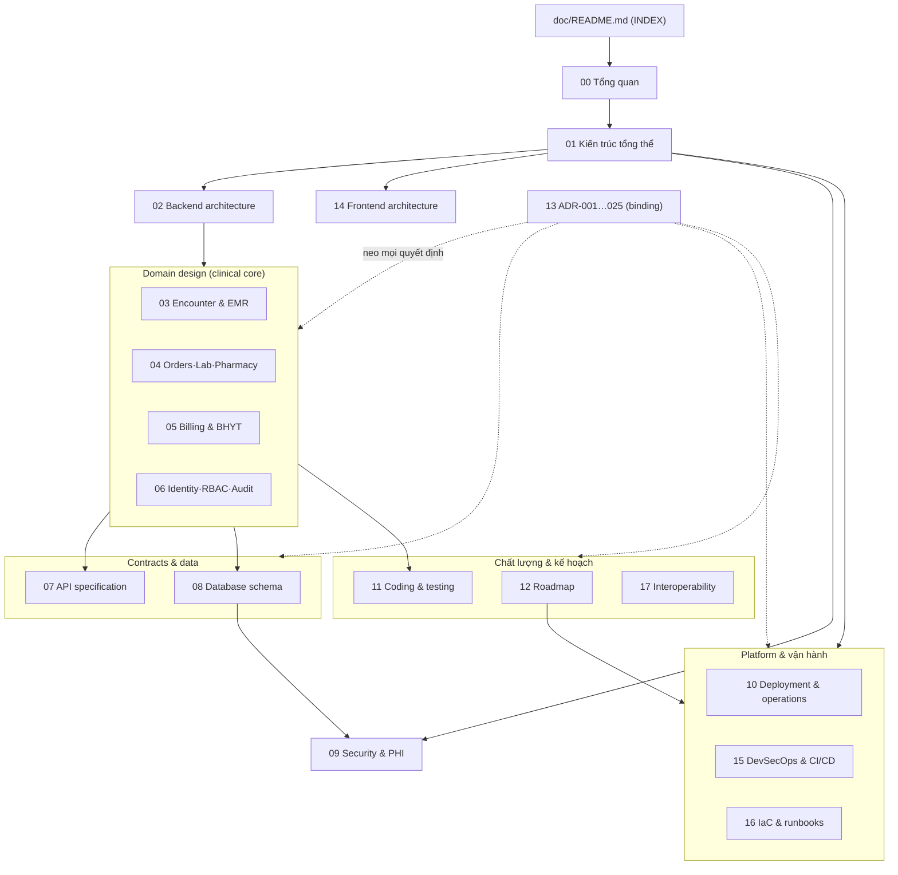

# `doc/` — Bộ tài liệu thiết kế source-of-truth (HMS)

> INDEX của bộ tài liệu thiết kế tiếng Việt cho **Hospital Management System** số hóa bệnh viện Việt Nam (stack cố định Go + ReactJS + Kong + Kubernetes + DevSecOps). Đây là điểm vào (entry point) cho toàn bộ `doc/` — 18 file source-of-truth (00–17). Tài liệu kỹ thuật learn-by-doing nằm ở [`../doc_tech/`](../doc_tech/) (27 module).
>
> **Liên kết nền tảng**: bắt đầu ở [00-tong-quan.md](./00-tong-quan.md) → [01-kien-truc-tong-the.md](./01-kien-truc-tong-the.md) → [13-adr.md](./13-adr.md). Mọi quyết định lớn neo vào **ADR-001…025**.

---

## Mục đích & nguyên tắc nguồn sự thật

- **Nguồn sự thật duy nhất**: `doc/` là bản chốt quyết định của hội đồng kiến trúc. Mọi file PHẢI nhất quán tuyệt đối: cùng tên bounded context (14 BC), cùng lựa chọn công nghệ pinned, cùng số hiệu **ADR-XXX**, cùng tên bảng. Khi mâu thuẫn giữa code và `doc/`, `doc/` thắng cho tới khi ADR được sửa.
- **Design target, chưa có code**: repo HIỆN CHƯA CÓ CODE. Tài liệu mô tả THIẾT KẾ MỤC TIÊU; mọi tham chiếu code path đánh dấu *(planned)* và bám layout repo mục tiêu (xem `01`/`02`).
- **Mirror logmon doc_v2**: cấu trúc `doc/` (tiếng Việt, source-of-truth) đối chiếu logmon `doc_v2/README` — index + bảng file + sơ đồ quan hệ + cách dùng; `doc_tech/` là lớp giáo trình bổ sung 10 mục cố định/module.
- **Quy ước viết**: tiếng Việt, thuật ngữ kỹ thuật giữ tiếng Anh; dùng bảng, `mermaid`, code block (Go/SQL/YAML/TS); luôn neo ADR; đánh dấu trạng thái *(MVP)* / *(Phase 2)* / *(planned)*; 150–360 dòng/file.

---

## Bảng 18 file source-of-truth (00–17)

| # | File | Tựa đề | Mô tả 1 dòng |
|---|------|--------|--------------|
| 00 | [00-tong-quan.md](./00-tong-quan.md) | Tổng quan | Vision chuyển đổi số bỏ giấy, transformation thesis theo khoa, personas, phạm vi MVP & non-goals, MVP component budget |
| 01 | [01-kien-truc-tong-the.md](./01-kien-truc-tong-the.md) | Kiến trúc tổng thể | Modular monolith + Kong + K8s onshore, tech stack pinned, 4 tầng defense-in-depth, luồng OPD-BHYT trọn vòng, BHYT two-touch |
| 02 | [02-backend-architecture.md](./02-backend-architecture.md) | Backend architecture | BC map + arch-style split (clean vs clean+ddd+cqrs), layer rule + depguard, transactional outbox in-process, River, composition root |
| 03 | [03-clinical-encounter-emr.md](./03-clinical-encounter-emr.md) | Clinical Encounter & EMR | Encounter anchor + state machine, ED register-first, EMRDocument ký số PKI (TT13/2025), signed→addendum, synchronous durability |
| 04 | [04-orders-lab-pharmacy.md](./04-orders-lab-pharmacy.md) | Orders · Lab · Pharmacy | CPOE lifecycle, lab result + critical-value, CDSS hard-stop fail-closed, FEFO + stock_ledger, liên thông donthuocquocgia.vn |
| 05 | [05-billing-insurance-bhyt.md](./05-billing-insurance-bhyt.md) | Billing & BHYT | Charge-capture idempotent, claim↔bill↔encounter FK, XML1–XML15 QĐ4750, BHYT two-touch + degraded-mode, saga quyết toán |
| 06 | [06-identity-rbac-audit.md](./06-identity-rbac-audit.md) | Identity · RBAC · Audit | Keycloak OIDC, RBAC personas + ABAC object-level, MFA/step-up, break-the-glass time-boxed, audit-of-reads fail-closed |
| 07 | [07-api-specification.md](./07-api-specification.md) | API specification | Conventions + response envelope, Idempotency-Key contract, endpoint catalog per BC (per phase), OpenAPI nguồn FE codegen |
| 08 | [08-database-schema.md](./08-database-schema.md) | Database schema | Schema + ERD, UUID v7, branch_id + FORCE RLS + USING&WITH-CHECK, encounter anchor, terminology triplets, field-encryption scope, migration 000001 |
| 09 | [09-security.md](./09-security.md) | Security & PHI compliance | 4 tầng defense-in-depth, Kong edge vs Go object-level authz, envelope encryption + blind-index, RLS keystone, CVE-2026-29413, fail-closed |
| 10 | [10-deployment-operations.md](./10-deployment-operations.md) | Deployment & operations | K8s onshore VN, MVP component budget + earn-in triggers, Postgres managed/CNPG, secrets, backup/DR RTO/RPO, runbooks |
| 11 | [11-coding-testing-standards.md](./11-coding-testing-standards.md) | Coding & testing standards | Go style + immutability, TDD red-green-refactor, testcontainers (RLS/outbox/FEFO/idempotency), contract test, coverage 80% gate |
| 12 | [12-roadmap.md](./12-roadmap.md) | Roadmap 5 phase | Phase 0–4 với Definition of Done, earn-in trigger table cho mỗi deferred system, KPI adoption tắt giấy |
| 13 | [13-adr.md](./13-adr.md) | Architecture Decision Records | Toàn bộ ADR-001…025 binding (decision/rationale/alternatives/consequences/status), nguồn research kiểm chứng 2026 |
| 14 | [14-frontend-architecture.md](./14-frontend-architecture.md) | Frontend architecture | Vite SPA + AntD v6 vi_VN, Kong BFF auth, TanStack, RHF+zod + OpenAPI codegen, per-persona surfaces, clinical safety UX, print phiếu |
| 15 | [15-devsecops-cicd.md](./15-devsecops-cicd.md) | DevSecOps & CI/CD | GitHub Actions security gates merge-blocking, Argo CD rolling + manual promotion, supply-chain, observability MVP (Prometheus+Loki) |
| 16 | [16-iac-runbooks.md](./16-iac-runbooks.md) | IaC & runbooks | OpenTofu/Helm/Kustomize, runbook degraded-mode (BHYT cổng down, CDSS down), DR restore drill, break-the-glass review SLA |
| 17 | [17-interoperability.md](./17-interoperability.md) | Interoperability | Interop phasing, coded-columns foundation, BHYT 4750 + donthuoc (MVP regulatory), FHIR R4 facade/OIE/Orthanc Phase 2, terminology service |

---

## Sơ đồ quan hệ tài liệu

---

## Cách dùng (reading paths theo vai trò)

| Vai trò | Đọc theo thứ tự |
|---------|-----------------|
| **Mọi người (bắt đầu)** | 00 → 01 → 13 (ADR) |
| **Backend engineer** | 02 → 08 → 07 → 03/04/05/06 → 11 |
| **Frontend engineer** | 00 → 01 → 14 → 07 (OpenAPI) → 09 (clinical safety/BFF) |
| **Data/DBA** | 08 → 09 (RLS keystone) → 03 (encounter anchor) → 11 (testcontainers) |
| **DevOps/SRE** | 10 → 15 → 16 → 01 (topology) |
| **Security/Compliance** | 09 → 06 → 08 → 13 (ADR-003/008/009/010/014/020) |
| **Architect/PM** | 01 → 02 → 12 → 13 + 17 |

- Mỗi file mở đầu bằng tiêu đề + 1 dòng mục đích + liên kết tới file liên quan — đọc phần đầu để định hướng trước khi đi sâu.
- Khi tài liệu nói về code, tìm dấu *(planned)* và đối chiếu layout repo mục tiêu ở `01`/`02` (cây `backend/internal/<bc>/{domain,app,ports,adapters}` + `shared/`). KHÔNG coi code path là đã tồn tại.
- Tài liệu kỹ thuật chiều sâu (cách HỌC từng kỹ năng) ở [`../doc_tech/`](../doc_tech/); bắt đầu tại `capstone/00-reading-paths.md`.

---

## Ghi chú nguồn sự thật & trạng thái MVP/Phase

- **14 bounded contexts**: identity-access, organization, patient (MPI), scheduling-reception, encounter, orders, lab, pharmacy, inventory *(post-MVP)*, billing, insurance, audit-compliance, analytics-reporting *(post-MVP)*, interoperability *(post-MVP)*. Dùng đúng tên này xuyên suốt.
- **MVP** *(Phase 1)*: MỘT phòng khám OPD-BHYT trọn vòng — tiếp đón → khám → CLS → kê đơn → viện phí → XML giám định 4750 → ký số EMR. Component budget cứng: managed/CNPG-async Postgres + Go monolith + Kong KIC DB-less + KMS/ESO + Argo CD rolling + Prometheus+Loki; không stateful system nào khác (ADR-002).
- **Keystone Phase-0** (không retrofit được): FORCE ROW LEVEL SECURITY + migration-owner-vs-app-role + CI branch-isolation test (ADR-003/024); audit-of-reads commit-with-response + hash-chain + WORM (ADR-009); CDSS hard-stop fail-closed (ADR-008); DPIA + consent + data-subject-rights (ADR-020); BHXH sandbox + rejection-code (ADR-023).
- **Pháp lý VN day-1** (deadline đã lapsed → remediation, không deferrable): TT 13/2025 (EMR ký số), TT 26/2025 + QĐ 808 (đơn thuốc liên thông donthuocquocgia.vn), QĐ 4750 sửa QĐ 3176 (XML1–XML15 giám định BHYT, hiệu lực 01/01/2025), QĐ 4469 (ICD-10), NĐ 13/2023 + NĐ 53/2022 (PHI onshore).
- **Defer sau MVP** (mỗi system gắn earn-in trigger viết sẵn ở `10` + `12`): Vault-đầy-đủ, NATS/Kafka/Debezium, OIE HL7v2 sidecar, Orthanc DICOM, FHIR R4 facade, service mesh, Argo Rollouts canary, Tempo distributed-tracing, SLSA/Cosign/ZAP. **Không lock** thư viện FHIR cụ thể (samply/golang-fhir-models đã chết) — đánh giá lại Phase 2 (ADR-017).
- **Trạng thái ADR**: 25 ADR đều `accepted`. Khi cần thay đổi thiết kế, sửa ADR trong `13-adr.md` TRƯỚC rồi mới cập nhật các file phụ thuộc — không sửa file con mà bỏ qua ADR.

---

_File này là INDEX, không chứa quyết định mới. Mọi quyết định binding nằm trong các file 00–17 và đặc biệt là [13-adr.md](./13-adr.md). Repo chưa có code — toàn bộ là thiết kế mục tiêu._
