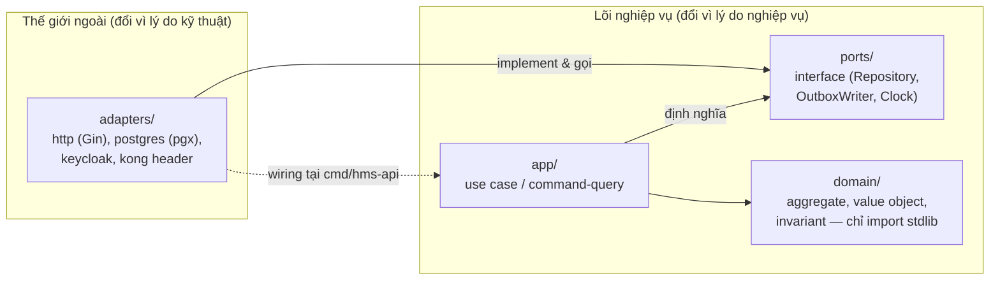

# ARCH-1 · Clean Architecture trong HMS

> Module **ARCH-1** · Cách phân tầng `adapters → ports ← app → domain` trong Go modular monolith, lấy BC `identity-access` làm ví dụ chạy được · Độ khó: 🥉→🥈 · Prereqs: **BE-1** (Go production-grade)

Tham chiếu: [doc/02-backend-architecture.md], [ARCH-2 DDD & Bounded Contexts], [ARCH-3 CQRS & Outbox]. Quyết định nền: **ADR-001** (Go modular monolith), **ADR-024** (migrations), **ADR-012** (cross-BC qua outbox).

---

## 1. Vì sao kỹ năng này quan trọng trong HMS

HMS là **một Go modular monolith** (`hms-api`, một deployable — ADR-001). Bên trong nó sống 14 bounded context (identity-access, organization, patient, scheduling-reception, encounter, orders, lab, pharmacy, inventory, billing, insurance, audit-compliance, analytics-reporting, interoperability). Nếu code 14 BC này trộn vào nhau theo kiểu controller-gọi-thẳng-SQL, thì:

- Một thay đổi ở `pharmacy` (đổi cách check tương tác thuốc) sẽ ngấm ngầm phá `billing` (charge-capture) vì chúng dùng chung struct/global state — đúng loại bug giết người trong môi trường lâm sàng.
- Không thể test **invariant sống còn** một cách độc lập: CDSS hard-stop fail-closed (ADR-008), FEFO (ADR-021), idempotent charge (ADR-011). Logic nghiệp vụ trộn với `*sql.Rows` thì chỉ test được khi có DB thật, mọi nơi.
- Không thực hiện được đường tiến hóa ADR-001 đã hứa: "tách BC ra service riêng chỉ là swap relay adapter sang Kafka, **domain code không đổi**". Điều đó chỉ đúng nếu domain code chưa bao giờ biết gì về HTTP, Postgres hay Kong.

Clean Architecture là cơ chế bắt buộc để **một deployable nhưng nhiều module độc lập-về-phụ-thuộc** trở thành hiện thực kiểm chứng được (depguard lint), không phải khẩu hiệu. Đây là module nền: mọi BC trong `internal/` đều theo đúng khuôn này.

---

## 2. Mô hình tư duy (first principles) — từ con số 0

Bắt đầu từ một câu hỏi: *thứ gì trong HMS thay đổi vì lý do nghiệp vụ, và thứ gì thay đổi vì lý do kỹ thuật?*

- "Đơn thuốc phải bị chặn nếu bệnh nhân dị ứng" — **luật nghiệp vụ**, đúng dù ta dùng Postgres hay Gin hay gRPC.
- "Lưu đơn thuốc bằng `INSERT ... RETURNING` qua pgx" — **chi tiết kỹ thuật**, có thể đổi.

First principle của Clean Architecture: **luật nghiệp vụ KHÔNG được phụ thuộc vào chi tiết kỹ thuật; chi tiết kỹ thuật phụ thuộc vào luật nghiệp vụ.** Mũi tên phụ thuộc luôn chỉ vào trong, về phía `domain`.

Hệ quả thực tế: ta dùng **Dependency Inversion**. `app` (use case) cần đọc/ghi dữ liệu → nó định nghĩa một **interface** (port) mô tả *cái nó cần* ("lưu Account", "tìm Account theo id"). Tầng `adapters` (Postgres, Kong, Keycloak) *hiện thực* interface đó. Vì interface được định nghĩa ở tầng trong và implement ở tầng ngoài, mũi tên phụ thuộc bị "đảo": code Postgres phụ thuộc vào port của `app`, không ngược lại.



---

## 3. Khái niệm cốt lõi (tăng dần độ khó)

**(a) Bốn tầng và quy tắc một chiều.** Luật bất khả xâm phạm (canon §9):

```
adapters  ->  ports  <-  app  ->  domain
```

| Tầng | Trách nhiệm trong HMS | Được import gì | Ví dụ trong `identity-access` |
|------|----------------------|----------------|-------------------------------|
| `domain` | Aggregate, value object, invariant thuần | **CHỈ Go stdlib** | `Account`, `BreakGlassGrant`, quy tắc "grant tự hết hạn sau N giờ" (ADR-010) |
| `app` | Điều phối use case, mở/đóng tx, phát domain event | `domain` + `ports` | `ActivateBreakGlass`, `SyncRoleFromKeycloak` |
| `ports` | Interface mô tả *nhu cầu* của `app` | `domain` (cho kiểu dữ liệu) | `AccountRepository`, `OutboxWriter`, `Clock` |
| `adapters` | Hiện thực kỹ thuật (HTTP, DB, IdP) | tất cả tầng trên | Gin handler, pgx repo, Keycloak client |

**(b) Port vs Adapter (hexagonal vocabulary).** *Driving port* (inbound): use case mà thế giới ngoài gọi vào — ở HMS thường là interface service mà Gin handler gọi. *Driven port* (outbound): interface mà use case cần — `AccountRepository`, `OutboxWriter`. Adapter là cái nối port với công nghệ thật.

**(c) Composition root.** Tất cả việc "ai-implement-cái-gì" (wiring/DI) xảy ra ở **một nơi DUY NHẤT**: `cmd/hms-api/main.go` *(planned)*. Không dùng DI framework "ma thuật" — wiring tường minh bằng tay, dễ đọc, dễ test.

**(d) Cross-BC qua outbox, không import chéo.** `pharmacy` KHÔNG được `import internal/billing`. Khi cấp phát thuốc sinh charge, `pharmacy` ghi một **domain event vào outbox table trong cùng tx** (ADR-012); `billing` là subscriber idempotent. Đây là điều giữ cho ADR-001 (tách service về sau chỉ swap relay) thành hiện thực.

**(e) Immutability ở domain.** Theo coding-style: method nghiệp vụ trả về **bản sao mới** thay vì mutate in-place. `account.Deactivate()` trả `Account` mới, không sửa receiver.

---

## 4. HMS dùng nó thế nào (bám code path — *(planned)*, code chưa viết)

Lấy BC đơn giản nhất, `identity-access` (style `clean`, canon §4), làm khuôn mẫu. Layout *(planned)*:

```
backend/internal/identity/
├── domain/            # Account, Role, BreakGlassGrant — chỉ stdlib
├── app/               # use case: ActivateBreakGlass, SyncRole...
├── ports/             # AccountRepository, OutboxWriter, Clock (interface)
└── adapters/
    ├── http/          # Gin handler (BE-2) — trust-but-verify Kong header
    ├── postgres/      # pgx/v5 + sqlc repo, outbox INSERT cùng tx
    └── keycloak/      # OIDC sync client (ADR-013)
```

**`domain/break_glass.go`** *(planned)* — invariant thuần, không biết DB:

```go
package domain

import "time"

// BreakGlassGrant: cấp quyền cấp cứu time-boxed + scoped (ADR-010).
type BreakGlassGrant struct {
    ID         string
    BranchID   string
    AccountID  string
    PatientID  string    // scoped tới một bệnh nhân cụ thể
    Reason     string
    GrantedAt  time.Time
    ExpiresAt  time.Time
    ReviewedBy *string   // closed review loop
}

// IsActive: hết hạn là quy tắc nghiệp vụ, KHÔNG phải cron job.
func (g BreakGlassGrant) IsActive(now time.Time) bool {
    return now.Before(g.ExpiresAt) && g.ReviewedBy == nil
}
```

**`ports/repository.go`** *(planned)* — `app` định nghĩa cái nó cần:

```go
package ports

import (
    "context"
    "github.com/hospital/hms/internal/identity/domain"
)

type AccountRepository interface {
    FindByID(ctx context.Context, id string) (domain.Account, error)
    Save(ctx context.Context, a domain.Account) error
}

// OutboxWriter: ghi domain event trong CÙNG tx (ADR-012).
type OutboxWriter interface {
    Append(ctx context.Context, event domain.Event) error
}
```

**`app/activate_break_glass.go`** *(planned)* — use case điều phối, KHÔNG chạm pgx/Gin:

```go
func (uc *ActivateBreakGlass) Handle(ctx context.Context, cmd Cmd) error {
    acc, err := uc.repo.FindByID(ctx, cmd.AccountID) // qua port
    if err != nil { return err }
    grant := domain.NewBreakGlassGrant(acc, cmd.PatientID, cmd.Reason, uc.clock.Now())
    if err := uc.repo.Save(ctx, acc.WithGrant(grant)); err != nil { return err }
    return uc.outbox.Append(ctx, domain.BreakGlassActivated{GrantID: grant.ID})
}
```

**`adapters/postgres/account_repo.go`** *(planned)* — implement port, đây là nơi DUY NHẤT có pgx/sqlc + `SET LOCAL app.current_branch` cho RLS (ADR-003, học kỹ ở DATA-1).

**`internal/shared/`** *(planned)* — kernel dùng chung (canon §9): `{auth, outbox, middleware, metrics, errors, httpx, crypto, rls, config}`. Đây là phụ thuộc *kỹ thuật* được phép dùng chung, KHÔNG phải nơi chứa logic nghiệp vụ của BC.

**Cưỡng chế bằng depguard** *(planned, `.golangci.yml`)* — ADR-001 biến "đừng import chéo" thành lỗi CI:

```yaml
linters-settings:
  depguard:
    rules:
      domain-pure:
        files: ["**/internal/*/domain/**"]
        deny:
          - pkg: "github.com/jackc/pgx"   # domain chỉ stdlib
          - pkg: "github.com/gin-gonic/gin"
      no-cross-bc:
        files: ["**/internal/pharmacy/**"]
        deny:
          - pkg: "github.com/hospital/hms/internal/billing" # cross-BC chỉ qua outbox
```

---

## 5. Best practices (mỗi mục một nguồn đã research)

1. **Mũi tên phụ thuộc luôn chỉ vào trong; tầng trong không biết tầng ngoài.** Định nghĩa gốc của Dependency Rule. — Robert C. Martin, *The Clean Architecture* (blog.cleancoder.com, 2012): <https://blog.cleancoder.com/uncle-bob/2012/08/13/the-clean-architecture.html>
2. **Định nghĩa interface (port) ở phía consumer (`app`), không ở phía implement.** Go idiom "accept interfaces, return structs" + interface thuộc về package dùng nó. — Go Wiki, Code Review Comments / *Effective Go*: <https://go.dev/wiki/CodeReviewComments#interfaces>
3. **Wiring tường minh tại một composition root, tránh DI framework ma thuật.** — Mat Ryer, *How I write HTTP services in Go* (2024 update): <https://grafana.com/blog/2024/02/09/how-i-write-http-services-in-go-after-13-years/>
4. **Hexagonal/ports-and-adapters: tách application core khỏi infrastructure để test core không cần I/O.** — Alistair Cockburn, *Hexagonal Architecture*: <https://alistair.cockburn.us/hexagonal-architecture/>
5. **Cấu trúc package theo domain/feature, không theo loại kỹ thuật (controllers/models).** — Three Dots Labs, *Clean Architecture in Go* (wild-workouts, 2023+): <https://threedots.tech/post/introducing-clean-architecture/>

---

## 6. Lỗi thường gặp & anti-patterns

- **Domain "nhiễm" công nghệ:** đặt struct tag `db:"..."` hoặc `json:"..."` lên aggregate `domain`, hoặc import `pgx`. → Domain hết thuần, không tái dùng khi tách service. *Fix:* dùng struct riêng ở `adapters/postgres` và map qua lại; depguard rule `domain-pure` chặn ở CI.
- **Anemic domain model:** mọi logic nằm trong `app`/service, `domain` chỉ là túi getter/setter. → CDSS hard-stop, hết-hạn break-glass lẽ ra là invariant của aggregate lại rải rác trong handler, không test được độc lập.
- **Import chéo BC:** `pharmacy` gọi thẳng `billing.CreateCharge()`. → Phá ADR-001, vĩnh viễn không tách được service. *Fix:* outbox event (ADR-012); depguard `no-cross-bc`.
- **Repository rò rỉ chi tiết DB lên port:** port trả `pgx.Rows` hoặc nhận `*sql.Tx`. → `app` lại phụ thuộc Postgres. Port chỉ nói bằng kiểu `domain`.
- **Wiring rải rác:** mỗi package tự `init()` tạo connection. → Không còn một composition root; test khó vì phụ thuộc ẩn. Wiring chỉ ở `cmd/hms-api/main.go`.
- **Bỏ `SET LOCAL app.current_branch` ngoài tx:** adapter Postgres query PHI ngoài tx đã set GUC → RLS revert no-filter, leak chi nhánh (open risk [critical], canon §8). Đây là lý do mọi PHI repo phải nhận tx đã set branch.

---

## 7. Lộ trình luyện tập NGAY trong repo

> Repo CHƯA có code — bài tập là *dựng khung* đúng theo layout *(planned)* canon §9.

- 🥉 **Cơ bản:** Tạo cây thư mục `backend/internal/identity/{domain,app,ports,adapters}` và `internal/shared/`. Viết `domain/break_glass.go` với struct `BreakGlassGrant` + method `IsActive(now)` thuần stdlib (như mục 4). Vẽ lại mermaid bốn tầng cho riêng BC `identity-access`.
- 🥈 **Trung cấp:** Định nghĩa `ports/AccountRepository` + `ports/OutboxWriter`; viết use case `app/ActivateBreakGlass` chỉ phụ thuộc port + `domain`. Viết một fake in-memory implement port và unit test use case **không cần Postgres** (chứng minh core test được không I/O). Thêm `internal/shared/clock` (interface `Clock`) để test hết-hạn deterministic.
- 🥇 **Nâng cao:** Soạn `.golangci.yml` với depguard 2 rule (`domain-pure` cấm pgx/gin trong `domain`; `no-cross-bc` cấm `pharmacy → billing`). Cố tình thêm một dòng `import "github.com/jackc/pgx/v5"` vào `domain/` và chạy `golangci-lint run` để thấy CI **đỏ** — đó là cơ chế cưỡng chế ADR-001 thành sự thật. Phác `cmd/hms-api/main.go` wiring tường minh repo→use case→handler.

---

## 8. Skill/agent ECC nên dùng khi luyện

- **`ecc:hexagonal-architecture`** — kiểm tra phân tầng ports/adapters, phát hiện rò rỉ phụ thuộc.
- **`ecc:golang-patterns`** + **`ecc:go-review`** (agent `go-reviewer`) — review idiom Go: interface ở consumer, accept-interfaces-return-structs, không global state.
- **`ecc:go-build`** — sửa lỗi build/`go vet`/golangci-lint khi dựng depguard.
- **`ecc:go-test`** — TDD: viết test fake-port trước (RED → GREEN), nhắm coverage ≥80% (testing rule).
- **`ecc:code-tour`** / **`ecc:codebase-onboarding`** — khi đọc các BC `clean+ddd+cqrs` phức tạp hơn ở ARCH-2/ARCH-3.

---

## 9. Tài nguyên học thêm (2024–2026)

- Robert C. Martin — *The Clean Architecture* (Dependency Rule gốc): <https://blog.cleancoder.com/uncle-bob/2012/08/13/the-clean-architecture.html>
- Alistair Cockburn — *Hexagonal (Ports & Adapters) Architecture*: <https://alistair.cockburn.us/hexagonal-architecture/>
- Three Dots Labs — *Clean Architecture in Go* + repo `wild-workouts-go-ddd-example`: <https://github.com/ThreeDotsLabs/wild-workouts-go-ddd-example>
- Mat Ryer — *How I write HTTP services in Go after 13 years* (2024): <https://grafana.com/blog/2024/02/09/how-i-write-http-services-in-go-after-13-years/>
- Go Team — *Effective Go* & *Code Review Comments* (interface design): <https://go.dev/doc/effective_go>
- golangci-lint — depguard docs (cưỡng chế phụ thuộc): <https://golangci-lint.run/usage/linters/#depguard>

---

## 10. Checklist "đã hiểu"

- [ ] Giải thích được Dependency Rule và vì sao mũi tên luôn chỉ vào `domain`.
- [ ] Phân biệt được `domain` (chỉ stdlib) vs `app` vs `ports` vs `adapters`, và tầng nào import được tầng nào.
- [ ] Hiểu vì sao interface (port) định nghĩa ở `app`/`ports`, không ở `adapters` — và Dependency Inversion đảo mũi tên thế nào.
- [ ] Chỉ ra được composition root duy nhất (`cmd/hms-api/main.go`) và vì sao không dùng DI framework ma thuật.
- [ ] Biết vì sao `pharmacy` không được `import internal/billing` và cross-BC phải qua outbox (ADR-012, ADR-001).
- [ ] Viết được depguard rule chặn `pgx`/`gin` trong `domain` và import chéo BC; thấy được CI đỏ khi vi phạm.
- [ ] Viết được unit test cho use case bằng fake-port, không cần Postgres thật.
- [ ] Liên hệ được vì sao Clean Architecture là điều kiện để ADR-001 "tách service = swap relay, domain không đổi" thành hiện thực.
