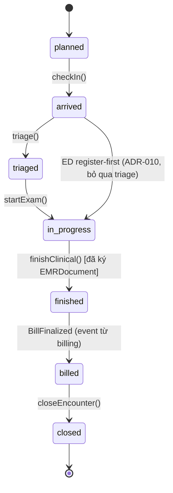

# [ARCH-2] DDD & Bounded Contexts — Encounter là mỏ neo lâm sàng

> Module ARCH-2 · DDD chiến lược + chiến thuật cho HMS, lấy Encounter làm anchor và 14 bounded context làm bản đồ · Độ khó: 🥉→🥇 · Prereqs: ARCH-1 (Clean Architecture)

Tài liệu liên quan: `doc/02-backend-architecture.md` (BC map nguồn), `doc/03-clinical-encounter-emr.md` (Encounter domain), `doc_tech/architecture/01-clean-architecture.md` (layer rule), `doc_tech/architecture/03-cqrs-event-driven.md` (outbox). Mọi quyết định trong module này neo vào canon (DESIGN_CANON section 4) và ADR-001/004/005/012/016.

---

## 1. Vì sao kỹ năng này quan trọng trong HMS

Một bệnh viện KHÔNG phải "10 module CRUD" (bệnh nhân, lịch hẹn, thuốc, hóa đơn…). Nếu mô hình hóa kiểu đó, bạn sẽ có một bảng `patients` khổng lồ mà mọi thứ FK thẳng vào `patient_id`, và rồi không ai trả lời được câu hỏi pháp lý cốt lõi: "lần khám này gồm những gì, ai ký, ai chịu trách nhiệm". DDD (Domain-Driven Design) cho ta hai thứ HMS sống nhờ nó:

- **Strategic DDD (bounded context)**: chia hệ thống theo *ngôn ngữ nghiệp vụ* (ubiquitous language) chứ không theo bảng dữ liệu. "Đơn thuốc" ở context `pharmacy` (lô/hạn/FEFO/CDSS) khác hẳn "đơn thuốc" ở `insurance` (một dòng ChargeItem để sinh XML). Cùng một từ, hai mô hình — bounded context là ranh giới giữ chúng không trộn vào nhau.
- **Tactical DDD (aggregate)**: gom các invariant nghiệp vụ vào *một* đơn vị nhất quán giao dịch. `Encounter` là aggregate root: state machine của nó (`planned→…→closed`) và quy tắc "đã ký thì bất biến" (ADR-004) phải được enforce ở một chỗ, không rải rác qua service layer.

Quyết định nền tảng của HMS (ADR-004): **mỏ neo lâm sàng là Encounter, không phải Patient**. Mọi vitals, chẩn đoán ICD-10, order CLS, kết quả, đơn thuốc, charge đều FK tới `encounter_id`, KHÔNG FK trực tiếp `patient_id`. Đây phản ánh đúng nghiệp vụ "một lượt khám / một đợt điều trị" và là seam để claim BHYT (claim↔bill↔encounter, ADR-011) và FHIR (`Encounter` resource, ADR-016) ánh xạ được. Hiểu sai chỗ này là sai từ gốc — không retrofit được sau khi có data thật.

## 2. Mô hình tư duy (first principles) — từ con số 0

Bắt đầu từ thực tế giấy tờ: một người bệnh đến viện → mở một *tờ bệnh án* cho lượt này → bác sĩ ghi vào tờ đó → cuối lượt tờ đó được ký và đóng lại bất biến. Tờ bệnh án ấy chính là **Encounter**. DDD chỉ là việc đặt tên trung thực cho thứ vốn đã tồn tại.

Ba câu hỏi first-principles dẫn tới mọi quyết định:

1. **Cái gì là một transaction nhất quán?** → đó là một **aggregate**. Khi đóng Encounter và kết tinh EMRDocument ký số, hash + state + chữ ký phải đúng *cùng lúc* hoặc rollback hết. Vậy `Encounter` (+ con của nó: Diagnosis, Observation, EMRDocument) là một aggregate.
2. **Cái gì nói cùng một ngôn ngữ?** → đó là một **bounded context**. Đội tiếp đón, đội khám, đội dược, đội giám định nói các "phương ngữ" khác nhau về cùng người bệnh. Mỗi phương ngữ = một BC với model riêng.
3. **Hai context nói chuyện với nhau thế nào?** → qua **domain event**, không qua shared table, không qua import chéo (ADR-001). Khi `EncounterClosed` xảy ra, `billing` lắng nghe để charge-capture, `insurance` để sinh claim. Người gửi không biết ai nghe.

Nguyên tắc bất khả xâm phạm: **một bảng có đúng một BC sở hữu** (owner). BC khác muốn dữ liệu đó thì nhận qua event hoặc gọi query API của owner, KHÔNG `JOIN` thẳng vào bảng của BC khác. Đây là cái cho phép ADR-001 (tách BC ra microservice sau này chỉ bằng swap outbox relay) khả thi.

## 3. Khái niệm cốt lõi (tăng dần độ khó)

🥉 **Ubiquitous language**: từ vựng dùng chung giữa code và bác sĩ. Code viết `Encounter`, `Diagnosis`, `ServiceOrder`, `MedicationDispense` — đúng từ nghiệp vụ, không phải `Record`, `Item`, `Data`.

🥉 **Entity vs Value Object**: Entity có định danh sống qua thời gian (`Encounter` có `encounter_id` UUID v7). Value Object bất biến, so sánh bằng giá trị (ví dụ `CodedConcept{code, system, display}` — triplet ICD-10/LOINC, ADR-016; hay `Money{amount NUMERIC(15,2), currency CHAR(3)}`).

🥈 **Aggregate & Aggregate Root**: cụm entity/VO được sửa qua *một* root duy nhất, root enforce mọi invariant. `Encounter` là root; bạn KHÔNG sửa `Diagnosis` trực tiếp mà gọi `encounter.AddDiagnosis(...)` để root kiểm trạng thái ("chỉ thêm chẩn đoán khi `in-progress`").

🥈 **Bounded Context & Context Map**: ranh giới model + quan hệ giữa các ranh giới. HMS dùng quan hệ **Customer/Supplier qua Published Language**: `encounter` (upstream) publish event `EncounterClosed`/`EMRSigned`; `billing`/`insurance` (downstream) là consumer. Không có shared kernel dữ liệu — chỉ shared kernel *kỹ thuật* (`internal/shared/`: outbox, auth, rls, errors).

🥇 **Domain Event & Eventual Consistency**: trong-aggregate thì *strong consistency* (cùng tx); cross-aggregate/cross-BC thì *eventual consistency* qua transactional outbox in-process (ADR-012). Charge-capture từ `EncounterClosed` xảy ra sau, idempotent (ADR-011) — không cùng tx với việc đóng encounter.

🥇 **Anti-Corruption Layer (ACL)**: khi gọi hệ thống ngoài bẩn (cổng BHYT JSON, donthuocquocgia.vn), KHÔNG để model ngoài rò vào domain. ACL nằm ở `adapters/` dịch DTO ngoài ↔ domain VO. Cổng BHYT trả "6 lần khám gần nhất" thì ACL biến thành `BhytEligibilityVerdict` sạch.

## 4. HMS dùng nó thế nào (bám code path — *(planned)*, code chưa viết)

### 4.1 Bản đồ 14 bounded context (canon §4)

| BC | Arch style | Bảng sở hữu (rút gọn) |
|---|---|---|
| `identity` | clean | accounts, roles, branch_memberships, break_glass_grants |
| `organization` | clean | branches, departments, service_catalog, facility_external_codes |
| `patient` (MPI) | clean | patients, patient_identifiers (encrypted+blind_index), patient_allergies, terminology_concepts |
| `scheduling` (reception) | clean | appointments, queue_tickets, check_ins, bhyt_eligibility_checks |
| `encounter` (EMR core) | clean+ddd+cqrs | encounters, diagnoses, observations, clinical_notes(+_history), emr_documents, emr_signatures |
| `orders` (CPOE) | clean+ddd+cqrs | service_orders, order_items, order_status_history |
| `lab` (LIS-lite) | clean+ddd+cqrs | specimens, lab_results, lab_reference_ranges |
| `pharmacy` | clean+ddd+cqrs | prescriptions, medication_dispenses, medication_lots, national_rx_links |
| `inventory` *(Phase 2)* | clean | warehouses, stock_ledger, goods_receipts, suppliers |
| `billing` | clean+ddd+cqrs | charges, bills, payments, adjustments, advances, idempotency_keys |
| `insurance` (BHYT) | clean+ddd+cqrs | insurance_claims, claim_xml_records, claim_responses |
| `audit` (compliance) | clean+ddd+cqrs | audit_log, data_subject_requests, dpia_records, data_access_log |
| `analytics` *(Phase 3)* | clean+ddd+cqrs | none (read projections) |
| `interoperability` *(Phase 2)* | clean+ddd+cqrs | code_systems, value_sets, concept_maps |

Quy ước phân style (ADR-001): BC có *vòng đời nghiệp vụ thật* (state machine, invariant phức tạp, cần CQRS) dùng `clean+ddd+cqrs`; BC chủ yếu registry/CRUD dùng `clean`. Đừng "ddd hóa" `organization` chỉ vì đẹp — đó là over-engineering.

### 4.2 Layout BC trong repo *(planned — canon §9)*

```
backend/internal/
├── encounter/                 # clean+ddd+cqrs
│   ├── domain/                # Encounter aggregate, state machine, VO — chỉ import stdlib
│   ├── app/{command,query}/   # use-case; command mutate, query đọc
│   ├── ports/                 # interface: EncounterRepo, OutboxPublisher
│   └── adapters/{postgres,http}/
├── shared/{auth,outbox,middleware,rls,errors,crypto,config}/
```

Layer rule một chiều (ARCH-1): `adapters → ports ← app → domain`. `domain/` chỉ import Go stdlib. **depguard** (golangci-lint) cấm import chéo BC: `internal/billing` KHÔNG được import `internal/encounter/domain`. Vi phạm = CI fail (merge-blocking).

### 4.3 Encounter aggregate + state machine *(planned: `internal/encounter/domain/encounter.go`)*



```go
// internal/encounter/domain/encounter.go  (planned)
package domain

type State string

const (
    StatePlanned    State = "planned"
    StateArrived    State = "arrived"
    StateTriaged    State = "triaged"
    StateInProgress State = "in_progress"
    StateFinished   State = "finished"
    StateBilled     State = "billed"
    StateClosed     State = "closed"
)

// Encounter là aggregate root — mọi mutate đi qua method của nó.
type Encounter struct {
    id         EncounterID   // UUID v7
    branchID   BranchID      // RLS tenant key (ADR-005), KHÔNG lấy từ client
    patientID  PatientID     // tham chiếu MPI, KHÔNG sở hữu Patient
    kind       Kind          // OPD | ED | IPD
    state      State
    diagnoses  []Diagnosis   // ICD-10 (QĐ 4469) — CodedConcept VO
    signedDoc  *EMRDocument  // nil tới khi finishClinical(); ký rồi → bất biến (ADR-004)
    events     []DomainEvent // pending → outbox trong cùng tx
}

// AddDiagnosis enforce invariant tại root, không cho gọi tùy tiện.
func (e *Encounter) AddDiagnosis(d Diagnosis) error {
    if e.state != StateInProgress {
        return ErrInvalidTransition // chỉ thêm chẩn đoán khi đang khám
    }
    e.diagnoses = append(e.diagnoses, d)
    return nil
}

// FinishClinical kết tinh EMRDocument bất biến ký số PKI (TT 13/2025).
func (e *Encounter) FinishClinical(sig Signature) error {
    if e.state != StateInProgress {
        return ErrInvalidTransition
    }
    if len(e.diagnoses) == 0 {
        return ErrNoDiagnosis // invariant nghiệp vụ
    }
    e.signedDoc = NewSignedEMRDocument(e, sig) // hash + signedBy/At + signatureBlob
    e.state = StateFinished
    e.events = append(e.events, EMRSigned{EncounterID: e.id, Hash: e.signedDoc.Hash})
    return nil
}
```

Lưu ý ADR-004: signed-EMR write path cần **synchronous durability** (commit confirmed trước khi UI báo "đã ký"). Hash-chain phải sống sót PITR restore.

### 4.4 Cross-BC chỉ qua outbox (ADR-012) — *(planned)*

`encounter` đóng → emit `EMRSigned` vào bảng `outbox` *trong cùng pgx.Tx* với việc cập nhật state. Relay in-process (`SELECT FOR UPDATE SKIP LOCKED`) phát tới subscriber idempotent: `billing` charge-capture, `insurance` sinh claim. **Không** có `billing` gọi hàm Go của `encounter`, **không** JOIN bảng `encounters` từ `billing`. Chi tiết outbox ở ARCH-3.

## 5. Best practices (mỗi mục kèm nguồn)

1. **Aggregate nhỏ, chỉ giữ invariant thực sự cần consistency tức thì** — đừng nhét cả lịch sử payment vào Encounter. Tham chiếu aggregate khác bằng *id*, không bằng object. Nguồn: Vaughn Vernon, "Effective Aggregate Design" — https://www.dddcommunity.org/library/vernon_2011/
2. **Một bảng một owner BC; cross-BC qua event/contract, không shared DB** (Database-per-service mindset dù chung physical Postgres). Nguồn: Microsoft .NET microservices — DDD-oriented design — https://learn.microsoft.com/en-us/dotnet/architecture/microservices/microservice-ddd-cqrs-patterns/
3. **Domain event đặt tên thì quá khứ + bất biến** (`EMRSigned`, `EncounterClosed`), publish qua transactional outbox để atomic với state change. Nguồn: microservices.io — Transactional Outbox — https://microservices.io/patterns/data/transactional-outbox.html
4. **Anti-Corruption Layer cho mọi tích hợp ngoài** (BHYT, donthuocquocgia.vn) để model bẩn không rò vào domain. Nguồn: Eric Evans DDD Reference (ACL) — https://www.domainlanguage.com/ddd/reference/
5. **Context map rõ ràng + ubiquitous language giữ trong code** — tránh "anemic domain model" (entity chỉ getter/setter, logic trôi ra service). Nguồn: Martin Fowler — AnemicDomainModel — https://martinfowler.com/bliki/AnemicDomainModel.html

## 6. Lỗi thường gặp & anti-patterns

- **Mỏ neo vào Patient thay vì Encounter** → không trả lời được "lượt khám gồm gì, ai ký", phá claim BHYT và FHIR mapping. Vi phạm ADR-004. Đây là lỗi gốc, không retrofit được.
- **Anemic domain model**: `Encounter` chỉ là struct getter/setter, state machine + invariant nằm trong `EncounterService` ở `app/`. Hậu quả: transition sai (`closed`→`in_progress`) lọt qua, EMR đã ký bị sửa. Invariant PHẢI ở aggregate root.
- **God aggregate**: nhét order, dispense, payment vào trong `Encounter`. Tx khổng lồ, contention. Đúng ra chúng là aggregate riêng (`ServiceOrder`, `MedicationDispense`, `Payment`) ở BC riêng, liên kết qua `encounter_id`.
- **JOIN xuyên BC / import chéo BC**: `billing` JOIN bảng `encounters`, hoặc `import internal/encounter/domain`. depguard fail. Đúng ra: nhận `EncounterClosed` event hoặc gọi query API của `encounter`.
- **branch_id lấy từ client / từ payload**: tenant spoofing. ADR-005: `branch_id` luôn trích từ JWT đã verify, SET LOCAL trong tx cho RLS. BC không tự ý nhận `branch_id` qua request body.
- **Over-DDD context registry**: bọc CQRS + event sourcing cho `organization` (registry khoa/phòng). Lãng phí; canon chốt `clean` thuần cho nó.
- **Coded field lưu mỗi `code` string** quên `system`+`display` triplet → Phase 2 FHIR/terminology đắt (ADR-016). Dùng VO `CodedConcept{code,system,display}` ngay từ MVP.

## 7. Lộ trình luyện tập NGAY trong repo

🥉 **Cơ bản — vẽ lại context map & owner table.** Mở `doc/02-backend-architecture.md` và canon §4, tự liệt kê lại 14 BC + bảng owner của mỗi BC vào một file note. Với mỗi cặp BC có quan hệ (vd `encounter`→`billing`), ghi event nào nối chúng. Mục tiêu: nói được "bảng `prescriptions` thuộc BC nào, ai được đọc nó".

🥈 **Trung cấp — code Encounter aggregate skeleton.** Tạo *(planned)* `backend/internal/encounter/domain/encounter.go`: struct `Encounter` + enum `State` + method `AddDiagnosis`, `FinishClinical` enforce transition. Viết bảng chuyển trạng thái hợp lệ, reject transition sai bằng `ErrInvalidTransition`. KHÔNG để bất kỳ import nào ngoài stdlib trong package `domain`.

🥇 **Nâng cao — chứng minh ranh giới bằng test + depguard.** Viết table-driven unit test cho state machine (mọi transition hợp lệ/không hợp lệ, gồm path ED register-first ADR-010, và "đã ký thì AddDiagnosis fail"). Thêm rule depguard vào `.golangci.yml` cấm `internal/billing` import `internal/encounter`; cố ý vi phạm để xác nhận CI báo lỗi, rồi gỡ. Bonus: phác `EMRSigned` event được append vào `e.events` và mô tả nó sẽ vào outbox cùng tx (nối sang ARCH-3).

## 8. Skill/agent ECC nên dùng khi luyện

- **ecc:go-review** (go-reviewer agent) — review aggregate Go: idiomatic, không leak mutation ra ngoài root, error handling.
- **ecc:hexagonal-architecture** — củng cố ports/adapters quanh aggregate, đúng layer rule ARCH-1.
- **ecc:architecture-decision-records** — ghi lại quyết định "Encounter làm anchor" / phân style BC dưới dạng ADR khi bạn tinh chỉnh.
- **ecc:golang-patterns** + **ecc:golang-testing** — viết table-driven test cho state machine.
- **ecc:healthcare-emr-patterns** — đối chiếu mô hình Encounter/EMR với pattern EMR/EHR chuẩn (encounter workflow, prescription).
- **ecc:plan** — khi bóc tách một BC mới thành domain/app/ports/adapters trước khi code.

## 9. Tài nguyên học thêm (2024–2026)

- Eric Evans, *Domain-Driven Design Reference* (free PDF) — https://www.domainlanguage.com/ddd/reference/
- Vaughn Vernon, *Effective Aggregate Design* (3 phần) — https://www.dddcommunity.org/library/vernon_2011/
- Microsoft, *.NET Microservices: DDD & CQRS patterns* (cập nhật .NET 8) — https://learn.microsoft.com/en-us/dotnet/architecture/microservices/microservice-ddd-cqrs-patterns/
- microservices.io — *Transactional Outbox* & *Database per Service* — https://microservices.io/patterns/data/transactional-outbox.html
- Martin Fowler — *BoundedContext* & *AnemicDomainModel* — https://martinfowler.com/bliki/BoundedContext.html
- HL7 FHIR R4 — *Encounter resource* (để hiểu seam mapping ADR-016) — https://hl7.org/fhir/R4/encounter.html
- ThreeDotsLabs — *Go DDD/Clean trong thực chiến* (Go examples) — https://threedots.tech/post/ddd-lite-in-go-introduction/

## 10. Checklist "đã hiểu"

- [ ] Giải thích được vì sao HMS mỏ neo vào **Encounter** chứ không phải Patient (ADR-004), và hệ quả khi làm sai.
- [ ] Phân biệt được Entity / Value Object / Aggregate / Aggregate Root bằng ví dụ trong HMS (`Encounter`, `CodedConcept`, `Money`).
- [ ] Liệt kê đúng 14 BC + arch style của mỗi BC, và nói được vì sao `organization` là `clean` còn `encounter` là `clean+ddd+cqrs`.
- [ ] Chỉ ra owner của một bảng bất kỳ (vd `prescriptions`, `audit_log`) và quy tắc "một bảng một owner".
- [ ] Hiểu cross-BC chỉ qua **domain event + transactional outbox in-process** (ADR-012), không JOIN/import chéo, và depguard enforce điều đó.
- [ ] Biết invariant + state machine PHẢI ở aggregate root, nhận diện được anemic domain model.
- [ ] Hiểu vì sao `branch_id` không bao giờ lấy từ client (ADR-005) và liên hệ với RLS keystone (DATA-1).
- [ ] Mô tả được ACL cho cổng BHYT/donthuocquocgia.vn để model ngoài không rò vào domain.
- [ ] Hiểu signed-EMR cần synchronous durability + bất biến sau ký (ADR-004).
- [ ] Nắm được con đường tiến hóa: tách BC ra service = swap outbox relay sang Kafka, domain code không đổi (ADR-001).
