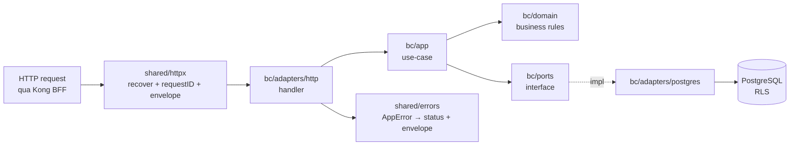

# [BE-1] Go production-grade cho HMS

> Module BE-1 · Nền tảng Go cho một modular monolith y tế production (layout, error handling, config, httpx, composition root) · Độ khó: 🥉→🥇 · Prereqs: — (module gốc, mọi module backend khác phụ thuộc bài này)

Đây là module gốc của nhánh `backend-go/`. Bạn sẽ học cách viết Go *production-grade* cho `hms-api` — một deployable duy nhất chứa 14 bounded context (ADR-001) — đủ chắc để mang dữ liệu PHI của bệnh nhân Việt Nam. Mọi ví dụ code path bên dưới đánh dấu *(planned)* vì repo CHƯA có code; ta đang mô tả thiết kế mục tiêu theo layout canon section 9.

---

## 1. Vì sao kỹ năng này quan trọng trong HMS

HMS không phải một CRUD app — nó là *system-of-record* lâm sàng bất biến. Một `panic` không recover ở giữa `cmd/hms-api` *(planned)* có thể làm rớt cả tiến trình đang phục vụ tiếp đón, khám, dược, viện phí của một khoa OPD-BHYT cùng lúc (vì là monolith). Một error message lộ ra `branch_id` của chi nhánh khác là rò rỉ PHI. Một config đọc sai khiến app-role kết nối Postgres với quyền migration-owner sẽ làm **vô hiệu hóa âm thầm FORCE RLS** (ADR-003) — toàn bộ cách ly chi nhánh sụp đổ mà mọi sơ đồ vẫn ghi "isolated".

Go được chốt làm backend (canon section 3) chính vì các tính chất production này: binary tĩnh nhỏ chạy `runAsNonRoot+readOnlyRootFS+drop-ALL-caps` (ADR deploy), khởi động nhanh phục vụ `startupProbe`/`readyz`, goroutine model hợp với outbox relay `SELECT FOR UPDATE SKIP LOCKED` (ADR-012). Nhưng "Go production-grade" không tự nhiên có — nó là kỷ luật: error wrapping có ngữ cảnh nhưng không leak PHI, config fail-fast lúc boot, graceful shutdown drain in-flight request trước khi K8s rolling `maxUnavailable=0` (ADR-019) kill pod, structured logging tách khỏi audit WORM (ADR-009).

Bài này dựng nền `internal/shared/{errors,config,httpx}` *(planned)* và composition root `cmd/hms-api/main.go` *(planned)* — phần mà MỌI bounded context dựa vào. Làm sai ở đây thì 13 module sau kế thừa lỗi.

---

## 2. Mô hình tư duy (first principles) — từ con số 0

Bắt đầu từ ba câu hỏi nguyên thủy:

1. **Một process Go là gì khi đang phục vụ bệnh nhân?** — Là một tập goroutine chia sẻ một địa chỉ không gian, mỗi HTTP request một goroutine, cùng dùng một `*pgxpool.Pool`, một `context.Context` truyền xuyên suốt request. Nếu một goroutine `panic` mà không recover → cả process chết. Vậy nguyên tắc #1: **boundary nào nhận input ngoài (HTTP handler, job worker) phải có recover + structured error response.**

2. **Lỗi đi từ DB lên người dùng như thế nào?** — `pgx` trả `error` → repository (adapter) bọc thêm ngữ cảnh → use-case (app) quyết định đây là lỗi nghiệp vụ hay hạ tầng → HTTP handler dịch sang status code + envelope. Nguyên tắc #2: **error là giá trị (value), không phải exception; phân loại error theo *ai cần biết gì* (client thấy gì vs log thấy gì vs audit thấy gì).**

3. **Khi nào process được phép coi là "sẵn sàng"?** — Chỉ khi config hợp lệ, DB ping được, secret giải mã được. Nguyên tắc #3: **fail-fast lúc boot** — thà process không start còn hơn start rồi phục vụ PHI với cấu hình sai.

Từ ba nguyên tắc đó suy ra toàn bộ kiến trúc: error là first-class type, config validate-at-load, một composition root duy nhất nối dây (DI thủ công, không magic framework), graceful shutdown tôn trọng lifecycle của K8s.



---

## 3. Khái niệm cốt lõi (tăng dần độ khó)

**🥉 Project layout & module path.** Go module `hms` (canon section 9). Layout `internal/` (private, không import được từ ngoài), một thư mục mỗi BC `internal/<bc>/{domain,app,ports,adapters}` + `internal/shared/`. `cmd/` chứa các entrypoint: `cmd/hms-api` (HTTP), `cmd/migrate` (golang-migrate runner), `cmd/worker` (River jobs). Layer rule một chiều bất khả xâm phạm (ADR-001): `adapters → ports ← app → domain`; `domain/` chỉ import stdlib; cross-BC chỉ qua outbox, KHÔNG import chéo.

**🥉 Error as value.** Không dùng exception. Định nghĩa một `AppError` mang `Code` (machine-readable), `Message` (an toàn để hiển thị, KHÔNG chứa PHI), `Kind` (validation/not_found/conflict/internal/forbidden) và `cause` ẩn (chỉ vào log). Dùng `errors.Is`/`errors.As` + `fmt.Errorf("...: %w", err)` để wrap có ngữ cảnh nhưng giữ chuỗi.

**🥈 Config fail-fast.** Đọc config từ env (12-factor; secret từ KMS/ESO theo ADR-014), validate ngay lúc `Load()`, trả error nếu thiếu/sai → `main` thoát non-zero. KHÔNG đọc env rải rác giữa runtime.

**🥈 Context propagation.** `context.Context` là tham số đầu mọi hàm chạm I/O. Mang `requestID`, `deadline`, và (quan trọng cho HMS) các giá trị để middleware `SET LOCAL app.current_branch` trong tx (ADR-005). Hủy context khi client ngắt → cancel query.

**🥇 Graceful shutdown & lifecycle.** Nhận `SIGTERM` → ngừng nhận request mới → drain in-flight (timeout) → đóng pool/worker → exit. Khớp với K8s `preStop` + `terminationGracePeriodSeconds`, để rolling deploy `maxUnavailable=0` (ADR-019) không cắt ngang một charge-capture đang chạy.

**🥇 Composition root & dependency injection thủ công.** `cmd/hms-api/main.go` là nơi DUY NHẤT wiring: tạo pool, tạo từng BC (inject repository vào use-case qua port interface), gắn route, start server. Không dùng DI container reflective — DI tường minh dễ đọc, compiler bắt lỗi thiếu dependency.

---

## 4. HMS dùng nó thế nào (bám code path — *(planned)*)

Toàn bộ path dưới đây là thiết kế mục tiêu (repo chưa có code), theo layout canon section 9.

**`internal/shared/errors`** *(planned)* — kiểu lỗi dùng chung mọi BC:

```go
// internal/shared/errors/errors.go (planned)
package errors

type Kind int

const (
	KindInternal Kind = iota
	KindValidation
	KindNotFound   // cross-branch resource cũng trả NotFound (ADR-003: 404 không 403)
	KindConflict   // ví dụ Idempotency-Key trùng (ADR-011)
	KindForbidden
	KindUnavailable // BHYT/CDSS gateway down → degraded-mode (ADR-006/008)
)

type AppError struct {
	Kind    Kind
	Code    string // ví dụ "bhyt.gateway_unavailable"
	Message string // AN TOÀN để hiển thị — KHÔNG chứa PHI
	cause   error  // chỉ vào log, không serialize ra client
}

func (e *AppError) Error() string { return e.Code + ": " + e.Message }
func (e *AppError) Unwrap() error { return e.cause }

func NotFound(code, msg string) *AppError { return &AppError{Kind: KindNotFound, Code: code, Message: msg} }
func Wrap(err error, code, msg string) *AppError {
	return &AppError{Kind: KindInternal, Code: code, Message: msg, cause: err}
}
```

**`internal/shared/config`** *(planned)* — fail-fast lúc boot:

```go
// internal/shared/config/config.go (planned)
type Config struct {
	DatabaseURL    string // app-role DSN (NOSUPERUSER, NOBYPASSRLS — ADR-003)
	KongJWKSURL    string // verify JWT độc lập (ADR-013, CVE-2026-29413)
	KMSKeyID       string // wrap DEK envelope encryption (ADR-014)
	HTTPPort       string
	ShutdownGrace  time.Duration
}

func Load() (Config, error) {
	c := Config{ /* os.Getenv ... */ }
	if c.DatabaseURL == "" {
		return Config{}, fmt.Errorf("config: DATABASE_URL bắt buộc")
	}
	// validate KMSKeyID, JWKS URL ... fail nếu thiếu
	return c, nil
}
```

**`internal/shared/httpx`** *(planned)* — middleware envelope + recover (response format theo patterns.md, neo ADR-013 trust-but-verify):

```go
// internal/shared/httpx/respond.go (planned)
type Envelope struct {
	Success bool        `json:"success"`
	Data    any         `json:"data,omitempty"`
	Error   *ErrBody    `json:"error,omitempty"`
	Meta    *PageMeta   `json:"meta,omitempty"`
}

func WriteError(w http.ResponseWriter, err error) {
	var ae *apperr.AppError
	status := http.StatusInternalServerError
	if errors.As(err, &ae) {
		status = statusFor(ae.Kind) // KindNotFound→404, KindUnavailable→503 ...
	}
	// log ae.Unwrap() (cause) ở server-side; client CHỈ thấy Code+Message an toàn
}
```

**`cmd/hms-api/main.go`** *(planned)* — composition root: `config.Load()` → tạo `pgxpool` → wiring từng BC (`identity`, `patient`, `encounter`...) → đăng ký route Gin (BE-2) → `http.Server` với `BaseContext` + graceful shutdown nghe `SIGTERM`. Đây là nơi DUY NHẤT biết về cả 14 BC; mỗi BC chỉ biết port interface của chính nó.

Liên kết module: error envelope dùng lại ở BE-2 (Gin handlers), config DSN dùng ở BE-3 (pgx/sqlc), graceful shutdown phối với BE-4 (River worker stop), lifecycle khớp K8S-1 (probes/securityContext).

---

## 5. Best practices (mỗi mục kèm nguồn đã research)

1. **Theo layout `internal/` + `cmd/` chuẩn cộng đồng** — không tạo package "utils" tạp nham; tổ chức theo domain. Nguồn: [Standard Go Project Layout](https://github.com/golang-standards/project-layout) và [Effective Go — Names/Packages](https://go.dev/doc/effective_go#names).

2. **Error wrapping với `%w`, phân loại bằng sentinel/typed error** — wrap để giữ ngữ cảnh, dùng `errors.Is/As`. Nguồn: [Go Blog — Working with Errors in Go 1.13](https://go.dev/blog/go1.13-errors).

3. **`context.Context` là tham số đầu, không lưu trong struct, hủy để cancel I/O.** Nguồn: [Go Blog — Contexts and structs](https://go.dev/blog/context-and-structs) và [pkg.go.dev context](https://pkg.go.dev/context).

4. **Graceful shutdown `http.Server.Shutdown` + tín hiệu `signal.NotifyContext`.** Nguồn: [pkg.go.dev net/http Server.Shutdown](https://pkg.go.dev/net/http#Server.Shutdown).

5. **DI tường minh ở composition root, tránh global state.** Nguồn: [Dave Cheney — Practical Go / SOLID Go design](https://dave.cheney.net/practical-go/presentations/qcon-china.html).

6. **Tuân thủ Effective Go & Code Review Comments cho style nhất quán.** Nguồn: [Go Code Review Comments](https://go.dev/wiki/CodeReviewComments).

7. **Structured logging với `log/slog` (stdlib từ Go 1.21), tách log vận hành khỏi audit WORM (ADR-009).** Nguồn: [pkg.go.dev log/slog](https://pkg.go.dev/log/slog).

---

## 6. Lỗi thường gặp & anti-patterns

| Anti-pattern | Vì sao nguy hiểm trong HMS | Cách đúng |
|---|---|---|
| Trả `err.Error()` thẳng ra client | Leak PHI / cấu trúc DB / `branch_id` chi nhánh khác | `AppError.Message` an toàn; `cause` chỉ vào log |
| `panic` để báo lỗi nghiệp vụ | Một panic không recover giết cả monolith → rớt mọi khoa | error as value; panic chỉ cho lỗi lập trình bất khả phục |
| Đọc `os.Getenv` rải rác runtime | App start với config sai, phục vụ PHI rồi mới lỗi | `config.Load()` fail-fast lúc boot |
| Bỏ qua graceful shutdown | Rolling deploy cắt ngang charge-capture/claim submit → mất nhất quán | `Shutdown` + drain + `signal.NotifyContext` |
| App-role connect với quyền owner DB | **Bypass FORCE RLS âm thầm** (ADR-003) → leak cross-branch | DSN app-role `NOSUPERUSER, NOBYPASSRLS`, không own bảng |
| `context.Background()` trong handler | Mất deadline/cancel, query treo khi client ngắt | truyền `r.Context()` xuống mọi I/O |
| Package `utils`/`common` khổng lồ | Phá layer rule, tạo import cycle, không cohesion | tổ chức theo BC + `shared/` chuyên trách |
| DI container reflective | Lỗi thiếu dependency lộ lúc runtime, khó đọc | DI thủ công ở `cmd/hms-api` — compiler bắt lỗi |
| Return cả `data` và `error` non-nil | Caller xử lý nhập nhằng | hoặc data hoặc error, không cả hai |

---

## 7. Lộ trình luyện tập NGAY trong repo

> Repo chưa có code — các bài tập tạo skeleton *(planned)* theo layout canon section 9. Làm trong nhánh riêng, không commit lên main khi chưa được yêu cầu.

**🥉 Cơ bản — dựng skeleton + error type.**
- Tạo `go.mod` module `hms` (Go 1.22+), dựng cây thư mục `cmd/hms-api`, `internal/shared/{errors,config,httpx}`.
- Viết `internal/shared/errors/errors.go` với `AppError` + `Kind` + helper `NotFound/Conflict/Wrap`.
- Viết `cmd/hms-api/main.go` tối thiểu: `http.Server` trả envelope `{"success":true}` ở `/healthz`.
- Chạy `go build ./... && go vet ./...` sạch.

**🥈 Trung cấp — config fail-fast + graceful shutdown.**
- Viết `config.Load()` validate `DATABASE_URL`, `HTTP_PORT`, `SHUTDOWN_GRACE`; test bảng (table-driven) cho case thiếu env → error.
- Thêm `signal.NotifyContext(SIGTERM)` + `server.Shutdown(ctx)` với grace timeout; verify request đang chạy được drain (giả lập handler `sleep`).
- Thêm middleware `httpx`: gắn `requestID`, recover panic → trả envelope `KindInternal` (KHÔNG lộ stack ra client, log stack server-side qua `slog`).

**🥇 Nâng cao — composition root đa-BC + envelope dịch lỗi.**
- Mô phỏng wiring hai BC giả (`identity`, `patient`) với port interface + adapter in-memory; inject ở `main.go`, chứng minh không import chéo BC.
- Viết `httpx.WriteError` dịch mọi `Kind` → status (NotFound→404, Conflict→409, Unavailable→503 cho degraded-mode BHYT/CDSS ADR-006/008).
- Thêm `/readyz` chỉ trả 200 khi pool ping OK (chuẩn bị cho BE-3); `/livez` luôn 200 nếu process sống. Viết test envelope JSON shape ổn định.

---

## 8. Skill/agent ECC nên dùng khi luyện

- **`ecc:go-review`** — review idiomatic Go, concurrency safety, error handling sau khi viết `errors`/`httpx`/`main`. Bắt buộc trước khi coi module xong (code-review.md).
- **`ecc:go-build`** — fix `go build`/`go vet`/golangci-lint incrementally khi skeleton chưa biên dịch.
- **`ecc:go-test`** — enforce TDD red-green-refactor cho `config.Load()` và envelope; verify coverage ≥80% (`go test -cover`, testing.md).
- **`ecc:golang-patterns`** + **`ecc:golang-testing`** — tham chiếu pattern idiomatic & table-driven test.
- **`ecc:security-review`** — soát error message không leak PHI, DSN app-role không có quyền owner (ADR-003), config không hardcode secret (security.md).
- **`ecc:code-review`** — review diff cục bộ trước khi tạo PR.

---

## 9. Tài nguyên học thêm (2024–2026)

- [Effective Go](https://go.dev/doc/effective_go) — văn phong & idiom nền tảng (luôn cập nhật).
- [Go Code Review Comments (wiki)](https://go.dev/wiki/CodeReviewComments) — checklist review chuẩn.
- [Go Blog — Error handling (go1.13-errors)](https://go.dev/blog/go1.13-errors) — wrapping & `errors.Is/As`.
- [pkg.go.dev — log/slog](https://pkg.go.dev/log/slog) — structured logging stdlib (Go 1.21+).
- [pkg.go.dev — net/http Server.Shutdown](https://pkg.go.dev/net/http#Server.Shutdown) — graceful shutdown.
- [Standard Go Project Layout](https://github.com/golang-standards/project-layout) — quy ước `internal/`, `cmd/`.
- [Dave Cheney — Practical Go](https://dave.cheney.net/practical-go/presentations/qcon-china.html) — DI, package design, error handling thực chiến.
- [Uber Go Style Guide](https://github.com/uber-go/guide/blob/master/style.md) — bổ sung style production.
- [The Go Memory Model](https://go.dev/ref/mem) — nền tảng cho concurrency an toàn (cần cho outbox relay BE-4).

---

## 10. Checklist "đã hiểu"

- [ ] Giải thích được vì sao một monolith Go cần recover ở mọi boundary nhận input ngoài.
- [ ] Phân biệt được `Kind` lỗi nào → status code nào, và vì sao cross-branch trả 404 không 403 (ADR-003).
- [ ] Viết được `AppError` với `Message` an toàn (không PHI) và `cause` chỉ vào log.
- [ ] Hiểu vì sao app-role DSN phải `NOSUPERUSER, NOBYPASSRLS` và không own bảng (liên hệ FORCE RLS keystone).
- [ ] Cài được `config.Load()` fail-fast và viết table-driven test cho case thiếu env.
- [ ] Cài được graceful shutdown khớp K8s `SIGTERM`/`maxUnavailable=0`.
- [ ] Chỉ ra được `cmd/hms-api/main.go` là composition root DUY NHẤT và vì sao DI thủ công > container reflective.
- [ ] Truyền `context.Context` xuyên mọi I/O và biết nó sẽ mang `app.current_branch` cho RLS (ADR-005).
- [ ] Tuân thủ layer rule `adapters→ports←app→domain`, không import chéo BC (ADR-001).
- [ ] Chạy sạch `go build ./... && go vet ./...` và `ecc:go-review` không còn issue CRITICAL/HIGH.
