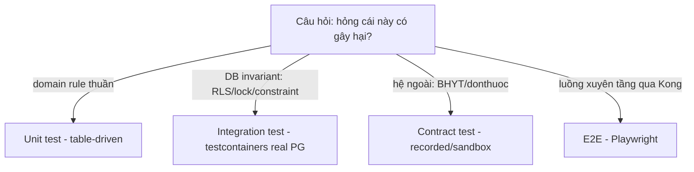

# [TEST-1] Testing strategy: testcontainers cho RLS / outbox / FEFO / idempotency

> Module **TEST-1** · Chiến lược test cho HMS — kim tự tháp test, testcontainers real-PG cho invariant không-mock-được, contract test BHYT/donthuoc, E2E critical clinical flow · Độ khó: 🥉→🥇 · Prereqs: **BE-1** (Go production-grade), **BE-3** (pgx/sqlc/golang-migrate). Liên quan: DATA-1 (RLS), ARCH-3 (outbox), DOM-2 (CDSS/FEFO/charge). Neo: **ADR-025** (testing strategy), ADR-003 (FORCE RLS keystone), ADR-011 (idempotency), ADR-008 (CDSS fail-closed), ADR-009 (audit fail-closed).

---

## 1. Vì sao kỹ năng này quan trọng trong HMS

HMS số hóa một bệnh viện thật: dữ liệu sai = bệnh nhân chết vì dị ứng đã ghi, PHI rò qua chi nhánh, claim BHYT bị từ chối, double-charge khi mạng chập chờn. Đây không phải CRUD app — là **system-of-record pháp lý** (bệnh án ký số TT 13/2025) với invariant an toàn người bệnh. Test ở đây KHÔNG phải để "đạt coverage" — nó là cơ chế chứng minh các *patient-safety invariant* và *compliance invariant* thực sự fail-closed.

Quan trọng nhất: những invariant nguy hiểm nhất của HMS **không mock được**. Chúng sống ở tầng PostgreSQL (RLS branch-isolation, FEFO `FOR UPDATE SKIP LOCKED`, unique-constraint idempotency, audit INSERT-only policy) hoặc ở contract với cổng ngoài (BHYT 4750, donthuocquocgia.vn). Nếu bạn mock DB để "test RLS", bạn đang test cái mock chứ không phải policy — và RLS leak sẽ pass review rồi rò production (open risk #1, ADR-003). Vì vậy ADR-025 chốt: RLS/outbox/FEFO/idempotency/audit-fail-closed **PHẢI** test against real Postgres qua testcontainers-go, và RLS branch-B-invisible test là **merge-blocking gate**.

## 2. Mô hình tư duy (first principles) — từ con số 0

Một test trả lời đúng một câu: *"nếu tôi đổi code và làm hỏng hành vi X, có test nào chuyển đỏ không?"* Nếu không → hành vi X không được bảo vệ. Bắt đầu từ ba câu hỏi nền:

1. **Hành vi nào, nếu hỏng, gây hại?** (dị ứng pass, PHI leak, double-charge, EMR mất sau ký). Đây là test ưu tiên cao nhất, viết trước tiên.
2. **Hành vi đó được enforce ở tầng nào?** Domain rule (pure Go) → unit test. DB invariant (RLS, constraint, lock) → integration test real-PG. Contract ngoài → contract test. Luồng xuyên tầng → E2E.
3. **Test có cô lập (isolated) và xác định (deterministic) không?** Không phụ thuộc thứ tự chạy, không chia sẻ state ngầm, không phụ thuộc clock/mạng thật.

Nguyên tắc nền: **test đúng tầng với đúng công cụ**. Mock chỉ đúng cho boundary bạn *sở hữu interface* và muốn cô lập (vd `ports.BhytGateway`). Mock SAI cho thứ bạn cần *kiểm chứng hành vi của hệ ngoài tầm kiểm soát* (Postgres RLS, lock semantics) — chỗ đó dùng real instance. Đây là lý do testcontainers tồn tại.



## 3. Khái niệm cốt lõi (tăng dần độ khó)

**3.1. Test pyramid theo HMS.** Nhiều unit (nhanh, thuần), một lớp integration đáng kể (vì invariant ở DB), ít E2E (đắt, chỉ critical flow). HMS *cố ý nặng tầng integration* hơn pyramid kinh điển — vì giá trị an toàn nằm ở DB layer.

**3.2. TDD red-green-refactor (ADR-025).** Viết test đỏ trước → implement tối thiểu cho xanh → refactor giữ xanh. Bắt buộc cho feature mới và bug fix (bug fix = viết regression test đỏ tái hiện bug trước khi sửa). Phù hợp testing rule chung của tổ chức.

**3.3. Table-driven unit test** cho `domain/` và `app/` — chuẩn idiom Go. `domain/` chỉ import stdlib (layer rule ADR-001) nên test domain là pure, không cần DB.

**3.4. Integration test với testcontainers-go.** Spin up một Postgres 16 container thật trong test, chạy migrations (golang-migrate), tạo **migration-owner role vs app-role** đúng như production (ADR-003), rồi assert hành vi. Đây là nơi duy nhất chứng minh RLS thật sự lọc.

**3.5. RLS branch-isolation test (merge-blocking, ADR-003).** Set `app.current_branch = A`, insert dữ liệu branch B (qua owner role), rồi query bằng **app-role** → phải thấy 0 row của B. Đồng thời test write-vector: `WITH CHECK` chặn insert/update với `branch_id != A`. Cross-branch resource → 404 không 403.

**3.6. Outbox + idempotency test.** Charge-capture insert ChargeItem + outbox event trong **cùng** `pgx.Tx`; relay `SELECT FOR UPDATE SKIP LOCKED`; subscriber idempotent qua `processed_events`. Test: replay cùng event 2 lần → side-effect xảy ra đúng 1 lần (ADR-011, ADR-012).

**3.7. FEFO concurrency test.** Hai goroutine cùng dispense một thuốc; `ORDER BY expiry_date ASC ... FOR UPDATE SKIP LOCKED` phải chọn lô đúng và không over-allocate (ADR-021).

**3.8. Fail-closed test (cao nhất).** CDSS timeout/error → command bị reject, KHÔNG confirm "no interaction" (ADR-008). Audit-write fail → KHÔNG trả PHI (ADR-009). Đây là test "đường lỗi" — dễ bị bỏ sót nhất, nguy hiểm nhất.

**3.9. Contract test** cho client BHYT card-check + 4750 XML và donthuocquocgia.vn (ADR-006/007/023): assert request schema, parse response/rejection-code, và degraded-mode khi timeout.

**3.10. E2E critical flow** qua Kong BFF: check-in + BHYT card-check → OPD order + CDSS hard-stop → dispense FEFO → cashier receipt+print → claim submit + reject handling.

## 4. HMS dùng nó thế nào (bám code path — *(planned)*, code chưa viết)

Layout test bám repo mục tiêu (canon §9). Toàn bộ đánh dấu *(planned)*:

| Loại test | Vị trí *(planned)* | Đối tượng |
|---|---|---|
| Unit domain | `backend/internal/encounter/domain/*_test.go` | Encounter state machine, EMR sign rule |
| Unit app | `backend/internal/billing/app/command/*_test.go` | charge-capture handler (gateway mock qua `ports`) |
| Integration RLS | `backend/internal/shared/rls/rls_isolation_test.go` | branch-B invisible (merge-blocking) |
| Integration outbox/idempotency | `backend/internal/shared/outbox/outbox_test.go` | replay → 1 side-effect |
| Integration FEFO | `backend/internal/pharmacy/adapters/postgres/dispense_fefo_test.go` | concurrent dispense |
| Integration audit | `backend/internal/audit/adapters/postgres/audit_failclosed_test.go` | audit fail → no PHI |
| Contract | `backend/internal/insurance/adapters/bhyt/contract_test.go`, `backend/internal/pharmacy/adapters/donthuoc/contract_test.go` | schema + rejection-code + degraded |
| Test harness dùng chung | `backend/internal/shared/testutil/pgcontainer.go` *(planned)* | spin PG + migrate + owner/app role |
| E2E | `frontend/e2e/opd-bhyt.spec.ts` *(planned, Playwright)* | critical flow qua Kong BFF |

Harness dùng chung dựng container một lần, chạy `migrations/000001_phase0_compliance.up.sql` (FORCE RLS keystone, ADR-024) rồi cấp 2 connection: một qua owner-role (seed cross-branch), một qua app-role (`NOSUPERUSER, NOBYPASSRLS`, không sở hữu bảng) để assert. **Quan trọng**: app-role test phải set GUC trong `tx` (`SET LOCAL app.current_branch = $1`) — phản chiếu invariant production rằng pgx pool reuse connection nên mọi PHI query phải nằm trong tx đã SET LOCAL (open risk #2).

```go
// backend/internal/shared/rls/rls_isolation_test.go (planned)
func TestRLS_BranchBInvisibleUnderBranchA(t *testing.T) {
    // Arrange: seed bằng owner-role (bypass RLS để dựng fixture 2 chi nhánh)
    seedPatient(t, ownerPool, branchA, "PA")
    seedPatient(t, ownerPool, branchB, "PB")

    // Act: đọc bằng app-role, GUC = branch A, trong tx
    tx, _ := appPool.Begin(ctx)
    defer tx.Rollback(ctx)
    _, _ = tx.Exec(ctx, "SET LOCAL app.current_branch = $1", branchA)
    rows := queryAllPatients(t, tx)

    // Assert: chỉ thấy A; B vô hình (merge-blocking nếu fail)
    require.Len(t, rows, 1)
    require.Equal(t, "PA", rows[0].Code)

    // Write-vector: WITH CHECK chặn ghi branch khác
    _, err := tx.Exec(ctx, insertPatientSQL, branchB, "PX")
    require.Error(t, err, "WITH CHECK phải chặn ghi cross-branch")
}
```

```go
// idempotency: replay event không double-post charge (ADR-011)
func TestChargeCapture_ReplayIsIdempotent(t *testing.T) {
    ev := chargeEvent{IdempotencyKey: "enc-123:order-9"}
    require.NoError(t, relay.Handle(ctx, ev))
    require.NoError(t, relay.Handle(ctx, ev)) // replay
    require.Equal(t, 1, countCharges(t, "order-9")) // đúng 1
}
```

## 5. Best practices (mỗi mục kèm 1 nguồn đã research)

1. **Dùng một test instance, isolate bằng transaction-rollback hoặc truncate, KHÔNG dựng container mỗi test.** Spin container/migrate là chậm; share một container, mỗi test chạy trong tx rollback hoặc reset state. Nguồn: testcontainers-go docs — <https://golang.testcontainers.org/features/test_session_semantics/>
2. **Table-driven test + subtest `t.Run` cho mọi domain rule.** Idiom chuẩn Go, dễ thêm case biên. Nguồn: Go Wiki TableDrivenTests — <https://go.dev/wiki/TableDrivenTests>
3. **`testing.Short()` để tách unit (luôn chạy) khỏi integration (skip khi `-short`).** CI chạy đầy đủ, dev vòng nhanh chạy `-short`. Nguồn: Go testing pkg — <https://pkg.go.dev/testing#hdr-Skipping>
4. **Đo coverage bằng `go test -coverprofile`, gate ≥80% (testing rule + ADR-025).** Nguồn: Go blog Cover Story — <https://go.dev/blog/cover>
5. **Test concurrency thật với `-race`** (FEFO, outbox relay, lock). Race detector bắt data race mà logic test không thấy. Nguồn: Go blog Race Detector — <https://go.dev/blog/race-detector>
6. **Contract test cổng ngoài chạy được offline** (recorded responses / sandbox BHXH ADR-023), không gọi production trong CI. Nguồn: Martin Fowler, ContractTest — <https://martinfowler.com/bliki/ContractTest.html>
7. **E2E chỉ cho critical user journey, không phủ mọi nhánh** (chống ice-cream-cone anti-pattern). Nguồn: Google Testing Blog, Test Sizes — <https://testing.googleblog.com/2010/12/test-sizes.html>
8. **Test cả happy path lẫn đường lỗi fail-closed** (timeout, gateway down). Với HMS đường lỗi quan trọng hơn vì đó là chỗ patient-safety control sống. Nguồn: testcontainers-go Postgres module — <https://golang.testcontainers.org/modules/postgres/>

## 6. Lỗi thường gặp & anti-patterns

- **Mock Postgres để "test RLS/lock".** Chỉ test cái mock, không test policy. RLS leak pass review. → Real PG qua testcontainers (ADR-025).
- **Test RLS bằng app-role nhưng quên `SET LOCAL` trong tx.** Trên pooled connection sẽ revert no-filter → false-pass. → Luôn assert trong tx đã SET GUC; thêm test chứng minh query NGOÀI tx leak (negative test) để khoá invariant.
- **Owner-role chạy app query trong test.** Owner bypass RLS kể cả `NOBYPASSRLS` → test xanh giả. → Tách 2 connection (owner để seed, app để assert), đúng như production.
- **Bỏ quên fail-closed test.** Chỉ test CDSS "có tương tác → chặn" mà quên "CDSS timeout → vẫn chặn" → fail-open lọt (open risk #3). → Bắt buộc test timeout/error path cho CDSS và audit.
- **E2E phình to (ice-cream cone).** Chậm, flaky, đẩy logic xuống unit thì rẻ hơn. → Giới hạn E2E ở 1 critical flow OPD-BHYT.
- **Test phụ thuộc thứ tự / state chia sẻ.** Flaky. → Mỗi test tự seed + rollback; không dựa data test trước.
- **Idempotency test thiếu vế replay.** Test post-một-lần xanh nhưng double-post production. → Luôn gọi handler ≥2 lần với cùng key.
- **Gọi cổng BHYT/donthuoc thật trong CI.** Flaky + phụ thuộc mạng + rủi ro dữ liệu. → Contract test recorded/sandbox.

## 7. Lộ trình luyện tập NGAY trong repo (🥉 → 🥈 → 🥇)

> Repo chưa có code — các bài tập định nghĩa **harness + test trước** (đúng tinh thần TDD đỏ trước), sau đó tối thiểu-implement cho xanh.

**🥉 Cơ bản — table-driven domain test.** Viết `encounter/domain` Encounter state machine (planned→arrived→...→closed) và test table-driven mọi transition hợp lệ/bất hợp lệ + rule "signed→amendment-only" (ADR-004). Chạy `go test ./internal/encounter/... -run StateMachine -v`. Mục tiêu: ≥80% coverage package domain, không chạm DB.

**🥈 Trung cấp — testcontainers RLS isolation.** Dựng `internal/shared/testutil/pgcontainer.go`: spin PG16, chạy migration 000001, tạo owner-role + app-role. Viết `rls_isolation_test.go` chứng minh branch-B invisible + WITH-CHECK chặn cross-branch write + negative test "query ngoài tx leak". Chạy `go test ./internal/shared/rls/ -race`. Đây chính là gate merge-blocking của ADR-003.

**🥇 Nâng cao — FEFO concurrency + idempotency + fail-closed + E2E.** (a) Viết FEFO test với 2 goroutine concurrent dispense, assert lô cận-hạn được chọn trước và tổng cấp phát không vượt tồn (`-race`); (b) outbox replay-idempotent test (1 side-effect); (c) CDSS-timeout → command rejected + audit-fail → no-PHI fail-closed test; (d) phác Playwright `frontend/e2e/opd-bhyt.spec.ts` chạy critical flow qua Kong BFF (check-in→order CDSS→dispense FEFO→receipt→claim+reject). Đưa cả bốn vào CI matrix với coverage gate 80%.

## 8. Skill/agent ECC nên dùng khi luyện

- **`ecc:go-test`** — enforce TDD Go: viết table-driven test trước, verify coverage 80% bằng `go test -cover`. Dùng cho bài 🥉 và xuyên suốt.
- **`ecc:golang-testing`** — pattern test Go nâng cao (subtest, golden file, race).
- **`ecc:tdd-workflow`** — kỷ luật red-green-refactor cho feature/bug.
- **`ecc:test-coverage`** — phân tích gap coverage, sinh test còn thiếu tới ngưỡng 80% (gate ADR-025).
- **`ecc:e2e-testing`** + **`ecc:browser-qa`** — dựng và verify Playwright critical flow qua Kong BFF.
- **`ecc:go-review`** + **`ecc:security-review`** — review chất lượng/idiom Go và soát fail-closed (CDSS/audit/RLS) trước merge.
- **`ecc:postgres-patterns`** + **`ecc:database-migrations`** — kiểm tra harness migration + RLS setup khớp production.

## 9. Tài nguyên học thêm (2024–2026)

- testcontainers-go — Postgres module & session semantics: <https://golang.testcontainers.org/modules/postgres/>
- Go testing package (chuẩn ngôn ngữ): <https://pkg.go.dev/testing>
- Go Wiki — TableDrivenTests: <https://go.dev/wiki/TableDrivenTests>
- Go blog — The cover story (coverage): <https://go.dev/blog/cover>
- Go blog — Data Race Detector: <https://go.dev/blog/race-detector>
- PostgreSQL 16 — Row Security Policies (USING vs WITH CHECK): <https://www.postgresql.org/docs/16/ddl-rowsecurity.html>
- pgx/v5 — testing với pgxpool: <https://github.com/jackc/pgx>
- Playwright — Test (E2E): <https://playwright.dev/docs/intro>
- Martin Fowler — Practical Test Pyramid: <https://martinfowler.com/articles/practical-test-pyramid.html>
- Google Testing Blog — Just Say No to More End-to-End Tests: <https://testing.googleblog.com/2015/04/just-say-no-to-more-end-to-end-tests.html>

## 10. Checklist "đã hiểu"

- [ ] Giải thích được vì sao RLS/outbox/FEFO/idempotency/audit-fail-closed **không mock được** và phải test real-PG (ADR-025).
- [ ] Viết được table-driven unit test cho domain rule (state machine, sign rule) không chạm DB.
- [ ] Dựng được testcontainers harness: PG16 + migration 000001 + owner-role tách app-role (ADR-003/024).
- [ ] Hiểu vì sao test RLS phải dùng app-role trong tx đã `SET LOCAL app.current_branch`, và vì sao owner-role bypass RLS.
- [ ] Viết được RLS branch-B-invisible test + WITH-CHECK write-vector test (merge-blocking gate).
- [ ] Viết được idempotency replay test (≥2 lần → 1 side-effect) và FEFO concurrent test với `-race`.
- [ ] Viết được fail-closed test cho CDSS-timeout (ADR-008) và audit-fail (ADR-009).
- [ ] Viết được contract test BHYT/donthuoc chạy offline + degraded-mode case (ADR-006/007/023).
- [ ] Phác được E2E critical flow OPD-BHYT qua Kong BFF (Playwright).
- [ ] Cấu hình được coverage gate ≥80% và `-short` để tách unit/integration trong CI.
