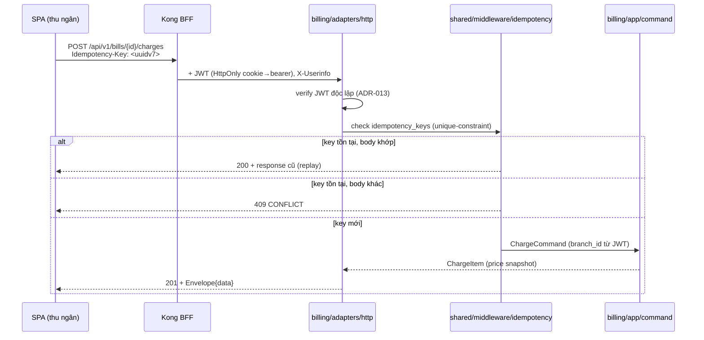

# [BE-6] API Design & OpenAPI — nguồn FE codegen, Idempotency-Key contract

> Module BE-6 · Thiết kế HTTP API nhất quán + OpenAPI spec làm single source of truth cho FE/BE · Độ khó: 🥉→🥇 · Prereqs: BE-2 (Gin behind Kong)

---

## 1. Vì sao kỹ năng này quan trọng trong HMS

API là hợp đồng (contract) giữa `hms-api` (Go monolith) và SPA per-persona (tiếp đón / bác sĩ / dược / thu ngân / giám định). Trong một bệnh viện vừa rời giấy, API không phải là "chỗ trả JSON" — nó là nơi **luật nghiệp vụ và an toàn người bệnh được phơi ra**: một endpoint cấp phát thuốc sai contract idempotency có thể double-dispense, một endpoint charge thiếu `Idempotency-Key` có thể double-post viện phí khi mạng chập chờn.

Ba lý do contract-first là bắt buộc, không phải tuỳ chọn:

- **Chống FE↔BE drift** — ADR-018 chốt FE sinh type + client từ OpenAPI qua orval/openapi-typescript. Nếu BE đổi field mà spec không đổi, build FE phải gãy ngay tại CI, không phải runtime tại quầy thu ngân.
- **Idempotency end-to-end là một scheme duy nhất** — ADR-011 + open-risk [high]: FE offline key và backend charge/claim key PHẢI cùng một scheme; double-post dispense/charge là patient-safety + tài chính hazard. Contract `Idempotency-Key` phải được mô tả trong OpenAPI để cả hai phía tuân thủ.
- **Phơi ra đúng degraded-mode** — ADR-006: khi cổng BHYT lỗi, API trả verdict `provisionally-unverified` chứ không 5xx. Status code và response shape là một phần của thiết kế an toàn, không phải afterthought.

API design tốt trong HMS = mỗi thao tác giấy bị thay bằng một endpoint có response envelope nhất quán, status code đúng ngữ nghĩa, và một spec FE có thể gen code từ đó.

---

## 2. Mô hình tư duy (first principles) — từ con số 0

Bắt đầu từ câu hỏi: *"Một resource là gì, và client cần biết gì để dùng nó an toàn?"*

1. **Resource = danh từ nghiệp vụ, không phải bảng DB.** `encounters`, `prescriptions`, `bills`, `insurance-claims` — không phải `encounter_table`. Resource phản ánh aggregate (DDD), không phản ánh schema.
2. **HTTP method = ý định.** `GET` đọc (an toàn, idempotent), `POST` tạo/command (không idempotent trừ khi có Idempotency-Key), `PUT/PATCH` cập nhật, `DELETE` xoá (hiếm trong HMS — dữ liệu lâm sàng signed→addendum, không xoá).
3. **Status code = trạng thái máy, đọc được bởi máy.** `200/201` thành công, `400` input sai (validation boundary), `401` chưa auth, `403` không đủ quyền, `404` không tồn tại **hoặc khác branch** (ADR-003: cross-branch trả 404 không 403 để không leak existence), `409` xung đột (idempotency replay với body khác), `422` business rule reject (CDSS hard-stop), `503` degraded.
4. **Contract phải máy-đọc-được trước khi người-đọc-được.** OpenAPI 3.1 là file YAML/JSON describe mọi path/schema/error → từ đó gen FE client + validate request. Đây là *source of truth*, không phải tài liệu phụ.
5. **Mỗi câu trả lời cùng một hình dạng.** Response envelope nhất quán (success/data/error/meta) để FE viết một lớp xử lý lỗi duy nhất.

Nguyên lý nền: **API là phần public-facing của domain. Domain quyết định bất biến (invariant), API chỉ dịch chúng sang HTTP một cách trung thành và nhất quán.**

---

## 3. Khái niệm cốt lõi (tăng dần độ khó)

**🥉 Resource naming & response envelope.** Theo patterns.md: mọi response có envelope nhất quán — success indicator + data (nullable on error) + error message (nullable on success) + meta cho pagination.

```go
// internal/shared/httpx/envelope.go (planned)
type Envelope[T any] struct {
    Success bool       `json:"success"`
    Data    *T         `json:"data,omitempty"`
    Error   *APIError  `json:"error,omitempty"`
    Meta    *PageMeta  `json:"meta,omitempty"`
}
type APIError struct {
    Code    string            `json:"code"`    // "VALIDATION_FAILED", "CDSS_HARD_STOP", "BHYT_GATEWAY_DEGRADED"
    Message string            `json:"message"` // vi_VN, an toàn để hiển thị
    Fields  map[string]string `json:"fields,omitempty"` // field-level validation
}
```

**🥈 Idempotency-Key contract (ADR-011).** Các POST tạo side-effect tài chính/lâm sàng (charge, dispense, claim-submit) nhận header `Idempotency-Key: <uuid v7>`. Backend persist key vào `idempotency_keys` (billing BC sở hữu) với unique-constraint. Replay cùng key + cùng body → trả lại response cũ (200/201); replay cùng key + body khác → `409 Conflict`.

**🥈 Pagination, filtering, versioning.** Cursor hoặc offset pagination qua `?page=&limit=` trả `meta{total,page,limit}`. Versioning qua path prefix `/api/v1/...` (URL versioning — đơn giản, Kong route theo path). Filter qua query params có schema trong OpenAPI.

**🥇 OpenAPI 3.1 spec-as-source.** Spec mô tả: paths per BC, components/schemas (sinh từ domain DTO), securitySchemes (bearer JWT do Kong inject), parameters (`Idempotency-Key`, pagination), responses (mọi error code). FE chạy orval/openapi-typescript đọc spec → gen TanStack Query hooks + zod schema. Một schema = form validation + API type (ADR-018).

**🥇 Trust-but-verify identity.** Kong là BFF inject identity header, NHƯNG Go verify JWT signature/claims độc lập (ADR-013, chống CVE-2026-29413). API contract KHÔNG bao giờ nhận `branch_id`/`role` từ client body — chỉ từ JWT đã verify. Object-level authz enforce trong Go, không ở Kong.

---

## 4. HMS dùng nó thế nào (bám code path — *(planned)*, code chưa viết)

Layout mục tiêu (canon §9). Mọi đường dẫn dưới đây *(planned)*:

| Thành phần | Path *(planned)* | Vai trò |
|---|---|---|
| HTTP handlers per BC | `backend/internal/<bc>/adapters/http/` | Dịch HTTP↔command/query, gắn envelope |
| Response envelope + error map | `backend/internal/shared/httpx/` | Envelope, APIError, status mapping |
| Idempotency middleware | `backend/internal/shared/middleware/idempotency.go` | Đọc header, check `idempotency_keys`, replay |
| Validation boundary | `backend/internal/<bc>/adapters/http/dto.go` | go-playground/validator (ADR theo BE-2) |
| OpenAPI spec | `backend/api/openapi.yaml` | Source of truth, FE codegen đọc |
| FE generated client | `frontend/src/api/` (orval-gen) | TanStack Query hooks + zod, KHÔNG sửa tay |

Luồng một request charge-capture (billing BC, ADR-011) *(planned)*:



OpenAPI fragment cho chính endpoint trên *(planned, `backend/api/openapi.yaml`)*:

```yaml
paths:
  /api/v1/bills/{billId}/charges:
    post:
      operationId: createCharge
      security: [{ bearerAuth: [] }]
      parameters:
        - { $ref: '#/components/parameters/IdempotencyKey' }
        - { name: billId, in: path, required: true, schema: { type: string, format: uuid } }
      requestBody:
        required: true
        content: { application/json: { schema: { $ref: '#/components/schemas/CreateChargeRequest' } } }
      responses:
        '201': { $ref: '#/components/responses/ChargeCreated' }
        '409': { $ref: '#/components/responses/IdempotencyConflict' }
        '422': { $ref: '#/components/responses/BusinessRuleRejected' }  # vd CDSS hard-stop ở dispense
        '503': { $ref: '#/components/responses/Degraded' }              # cổng BHYT/payment down
components:
  parameters:
    IdempotencyKey:
      name: Idempotency-Key
      in: header
      required: true
      schema: { type: string, format: uuid }   # UUID v7, cùng scheme FE↔BE (ADR-011)
  securitySchemes:
    bearerAuth: { type: http, scheme: bearer, bearerFormat: JWT }  # Kong inject, Go verify (ADR-013)
```

Endpoint catalog đánh dấu phase (canon §6 MVP / §7 roadmap):

| BC | Endpoint mẫu *(planned)* | Phase |
|---|---|---|
| scheduling-reception | `POST /api/v1/check-ins`, `GET /api/v1/bhyt/eligibility` | MVP |
| encounter | `POST /api/v1/encounters`, `POST /api/v1/encounters/{id}/sign` | MVP |
| orders | `POST /api/v1/encounters/{id}/orders` | MVP |
| pharmacy | `POST /api/v1/prescriptions/{id}/dispense` (Idempotency-Key) | MVP |
| billing | `POST /api/v1/bills/{id}/charges` (Idempotency-Key) | MVP |
| insurance | `POST /api/v1/claims/{id}/submit` | MVP |
| inventory / analytics | (defer) | Phase 2/3 |

External client contracts (consumed, không expose ra SPA): BHYT card-check JSON + XML 4750 (insurance BC, ADR-006/023), donthuocquocgia.vn (pharmacy BC, ADR-007) — mô tả như external contract test target (xem mục 8), KHÔNG nằm trong `openapi.yaml` public.

---

## 5. Best practices (mỗi mục kèm 1 nguồn đã research)

- **Design-first, không code-first.** Viết `openapi.yaml` trước, gen cả mock và FE client từ đó. Nguồn: OpenAPI Initiative — "API Design Guidance" <https://learn.openapis.org/best-practices.html>.
- **Idempotency-Key chuẩn IETF.** Theo IETF draft `idempotency-key-header` — key trong header, server lưu fingerprint request, replay trả response cũ, body khác → 422/409. Nguồn: <https://datatracker.ietf.org/doc/draft-ietf-httpapi-idempotency-key-header/>.
- **Status code đúng ngữ nghĩa + Problem Details.** Dùng RFC 9457 (Problem Details for HTTP APIs) làm khung error envelope. Nguồn: <https://www.rfc-editor.org/rfc/rfc9457.html>.
- **Codegen FE từ spec với orval + TanStack Query + zod.** Một schema gen ra hook + runtime validation. Nguồn: orval docs <https://orval.dev/guides/react-query>.
- **OpenAPI 3.1 align với JSON Schema.** 3.1 dùng JSON Schema 2020-12 đầy đủ → zod gen chính xác hơn. Nguồn: <https://spec.openapis.org/oas/v3.1.0.html>.
- **Versioning & evolution không phá client.** Thêm field optional, không đổi nghĩa field cũ; breaking change → `/v2`. Nguồn: Google AIP-180 (Backwards compatibility) <https://google.aip.dev/180>.
- **Verify token tại app layer, không tin gateway header.** Defense-in-depth chống gateway bypass. Nguồn: OWASP API Security Top 10 2023 — API2 Broken Authentication <https://owasp.org/API-Security/editions/2023/en/0xa2-broken-authentication/>.

---

## 6. Lỗi thường gặp & anti-patterns

- **Nhận `branch_id`/`role` từ request body.** Tenant/privilege spoofing (ADR-005). Luôn lấy từ JWT đã verify; OpenAPI request schema KHÔNG có field `branch_id`.
- **Tin mù `X-Userinfo` của Kong.** CVE-2026-29413 (ADR-013): nếu Kong bị bypass, app tin identity giả. Phải verify JWT độc lập trong handler.
- **Idempotency lệch scheme FE↔BE.** FE dùng key kiểu A, BE expect kiểu B → replay không match → double-post (open-risk [high]). Một UUID v7 scheme end-to-end, mô tả trong OpenAPI.
- **Trả 403 cho resource khác branch.** Leak existence. ADR-003: cross-branch → 404.
- **5xx khi cổng BHYT/payment down.** Phá degraded-mode (ADR-006). Trả `503` + envelope `BHYT_GATEWAY_DEGRADED` với data đã-lưu-chờ-gửi, hoặc 200 verdict `provisionally-unverified`.
- **Sửa tay file FE generated.** Mất sync khi regen, tái lập drift mà ADR-018 muốn diệt. Treat `frontend/src/api/` là build artifact.
- **Đặt business rule reject vào 400.** CDSS hard-stop, claim rejection là `422` (business) — phân biệt rõ với `400` (input malformed) để FE xử lý khác nhau.
- **Spec drift khỏi code.** OpenAPI viết tay rồi quên cập nhật → codegen sai. Thêm CI gate so khớp spec↔handlers (xem mục 8).

---

## 7. Lộ trình luyện tập NGAY trong repo (🥉→🥇)

> Repo chưa có code — các bài này tạo skeleton theo layout *(planned)* canon §9. Đánh dấu file mới là *(planned)* trong commit message.

**🥉 Cơ bản — Envelope + một endpoint đọc.**
1. Tạo `backend/internal/shared/httpx/envelope.go` với `Envelope[T]`, `APIError`, helper `OK/Created/Fail`.
2. Viết handler `GET /api/v1/encounters/{id}` ở `backend/internal/encounter/adapters/http/` trả envelope; map 404 cho cross-branch.
3. Mô tả endpoint này trong `backend/api/openapi.yaml` (path + schema + 404 response).

**🥈 Trung cấp — Idempotency-Key middleware + spec hoá.**
1. Tạo `backend/internal/shared/middleware/idempotency.go`: đọc header, hash body, tra `idempotency_keys`, replay/409.
2. Gắn middleware cho `POST /api/v1/bills/{id}/charges`; viết unit test 3 case: key mới, replay-same-body, replay-different-body.
3. Bổ sung `IdempotencyKey` parameter + `409 IdempotencyConflict` response vào `openapi.yaml`. Xác thực spec bằng `npx @redocly/cli lint backend/api/openapi.yaml`.

**🥇 Nâng cao — Codegen FE + drift gate.**
1. Cấu hình `orval` ở `frontend/` đọc `backend/api/openapi.yaml` sinh TanStack Query hooks + zod vào `frontend/src/api/`.
2. Tạo CI step (`.github/workflows`) chạy codegen rồi `git diff --exit-code frontend/src/api` — nếu spec đổi mà chưa regen, build gãy (merge-blocking).
3. Thêm endpoint `POST /api/v1/prescriptions/{id}/dispense` với `422 CDSS_HARD_STOP` + `503 Degraded`; regen FE và viết một component dùng hook sinh ra, confirm zod type khớp.

---

## 8. Skill/agent ECC nên dùng khi luyện

- **`ecc:api-design`** — REST API patterns: resource naming, status codes, pagination, error responses, versioning. Dùng khi thiết kế endpoint catalog + envelope.
- **`ecc:go-review`** (go-reviewer agent) — review handler/middleware Go: error handling, không leak PHI trong error message, đúng status mapping.
- **`ecc:security-review`** / **`ecc:security-scan`** — kiểm BOLA/IDOR, verify-JWT-độc-lập (CVE-2026-29413), không nhận branch_id từ client.
- **`ecc:go-test`** — TDD table-driven cho idempotency middleware (red→green), verify coverage ≥80%.
- **`ecc:react-review`** — khi tích hợp FE generated client + TanStack Query hooks vào component persona.
- **`ecc:update-docs`** — sync `openapi.yaml` ↔ route handlers khi schema/route đổi.
- **`ecc:backend-patterns`** — tham chiếu pattern API/DTO/validation boundary.

---

## 9. Tài nguyên học thêm (uy tín, 2024–2026)

- OpenAPI Specification 3.1.0 — <https://spec.openapis.org/oas/v3.1.0.html>
- OpenAPI Initiative Learn — Best Practices — <https://learn.openapis.org/best-practices.html>
- RFC 9457 Problem Details for HTTP APIs — <https://www.rfc-editor.org/rfc/rfc9457.html>
- IETF Idempotency-Key Header draft — <https://datatracker.ietf.org/doc/draft-ietf-httpapi-idempotency-key-header/>
- orval — OpenAPI → TanStack Query/zod codegen — <https://orval.dev/>
- openapi-typescript — <https://openapi-ts.dev/>
- Google API Improvement Proposals (AIP) — <https://google.aip.dev/>
- OWASP API Security Top 10 (2023) — <https://owasp.org/API-Security/editions/2023/en/>
- TanStack Query v5 docs — <https://tanstack.com/query/latest>
- Stripe API design (idempotency reference) — <https://docs.stripe.com/api/idempotent_requests>

---

## 10. Checklist "đã hiểu"

- [ ] Giải thích được vì sao OpenAPI là *source of truth*, không phải tài liệu phụ (ADR-018, chống FE↔BE drift).
- [ ] Phân biệt được khi nào dùng 400 / 403 / 404 / 409 / 422 / 503 trong HMS, gồm quy ước cross-branch → 404 (ADR-003).
- [ ] Mô tả được Idempotency-Key contract end-to-end một scheme FE↔BE và 3 case replay (ADR-011).
- [ ] Vẽ được luồng request charge đi qua Kong → verify JWT độc lập → idempotency middleware → command.
- [ ] Biết vì sao KHÔNG nhận branch_id/role từ client body và KHÔNG tin mù X-Userinfo (ADR-005/013, CVE-2026-29413).
- [ ] Cấu hình được orval gen FE client từ `openapi.yaml` và hiểu vì sao không sửa tay file generated.
- [ ] Biết cách phơi degraded-mode qua status/envelope thay vì 5xx (ADR-006).
- [ ] Viết được CI gate phát hiện spec↔code/FE-gen drift (merge-blocking).
- [ ] Nêu được response envelope nhất quán (success/data/error/meta) và error envelope theo RFC 9457.
- [ ] Biết external client (BHYT/donthuoc) là contract-test target, không nằm trong public openapi.yaml.
