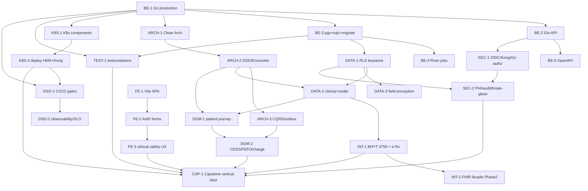

# [CAP-0] Lộ trình học theo vai trò (Reading Paths)

> Module CAP-0 · Bản đồ giáo trình `doc_tech/` + lộ trình học theo persona (BE/FE/Data/DevOps/Security/Architect) · Độ khó: 🥉 (điều hướng, không code) · Prereqs: — (đây là cửa vào)

Đây là module ĐẦU TIÊN nên đọc. Nó KHÔNG dạy kỹ năng mới — nó là **bản đồ và la bàn** cho 26 module còn lại của `doc_tech/`, ánh xạ chúng vào kiến trúc HMS thật (canon: Go modular monolith + ReactJS + Kong + Kubernetes + DevSecOps, PHI onshore VN). Repo HIỆN CHƯA CÓ CODE — toàn bộ giáo trình mô tả THIẾT KẾ MỤC TIÊU; mọi code path dưới đây đánh dấu *(planned)* theo layout canon section 9.

---

## 1. Vì sao kỹ năng này quan trọng trong HMS

Một đội IT bệnh viện nhỏ vừa rời giấy (ADR-002 — named operating model: dev team kiêm ops ở MVP) KHÔNG có thời gian đọc 26 module tuyến tính. Nếu không có reading path, ba lỗi điều hướng sẽ xảy ra ngay:

- **Học sai thứ tự → hiểu sai keystone.** Nếu một dev đọc `pharmacy` (DOM-2) trước khi nắm RLS (DATA-1), họ sẽ viết query PHI ngoài transaction wrapper và làm rò dữ liệu branch khác — đúng risk [critical] trong canon section 8 (SET LOCAL chỉ giữ trong tx). RLS branch-isolation là *keystone Phase-0 không retrofit được* (ADR-003); nó PHẢI là prereq cứng của mọi module chạm PHI.
- **Bỏ sót control fail-closed.** CDSS hard-stop (ADR-008) và audit-of-reads commit-with-response (ADR-009) là cơ chế an toàn tính mạng/pháp lý, không phải "tính năng hay". Reading path phải đảm bảo MỌI persona chạm clinical/PHI đi qua SEC-2 + DOM-2.
- **Front-load stateful system sai phase.** ADR-002 đặt "MVP component budget" cứng; nếu dev đọc INT-2 (FHIR/OIE/Orthanc, Phase 2) tưởng là MVP, họ scaffold sớm hệ thống stateful không runnable. Reading path đánh dấu rõ *(MVP)* vs *(Phase 2)*.

Reading path = "onboarding runbook" cho dự án số hóa bệnh viện: đưa đúng người (bác sĩ-dev hiểu Encounter, infra-dev hiểu K8s) tới đúng module theo đúng thứ tự prereq, neo vào nghiệp vụ thật (tiếp đón → khám → CLS → kê đơn → viện phí → giám định BHYT → ký số EMR).

---

## 2. Mô hình tư duy (first principles) — từ con số 0

Coi giáo trình là một **đồ thị có hướng (DAG)**, không phải danh sách phẳng:

- **Node** = một module (có Module ID, vd `DATA-1`).
- **Cạnh** `A → B` = "B có prereq A" (phải hiểu A trước B).
- **Tô-pô (topological order)** = một thứ tự đọc hợp lệ (mọi prereq đứng trước).
- **Lộ trình theo persona** = một *đường đi* qua DAG, chọn các node liên quan vai trò đó, giữ nguyên ràng buộc prereq.

Ba nguyên tắc chọn đường:
1. **Keystone đi trước.** BE-1 (Go production) và DATA-1 (RLS) là gốc — gần như mọi đường bắt đầu từ đây.
2. **Học theo dòng dữ liệu của người bệnh, không theo "module CRUD".** Canon section 0: thiết kế quanh HÀNH TRÌNH NGƯỜI BỆNH, mỏ neo là Encounter. Đường lâm sàng đi ARCH-2 (Encounter anchor) → DATA-2 → DOM-1 → DOM-2.
3. **Fail-closed control là bắt buộc, không optional.** Mọi đường chạm PHI/clinical PHẢI đi qua DATA-1, SEC-2, và (nếu kê đơn/cấp phát) DOM-2.

Bạn không cần đọc hết 27 module để đóng góp; bạn cần đọc đúng *đường đi* tới việc bạn làm, cộng các keystone bắt buộc.

---

## 3. Khái niệm cốt lõi (tăng dần độ khó)

### 3.1 Bản đồ toàn bộ module (27 module, 8 cụm)

| Module ID | Đường dẫn `doc_tech/` *(planned)* | Prereqs | Phase |
|---|---|---|---|
| BE-1 | `backend-go/01-go-production.md` | — | MVP |
| BE-2 | `backend-go/02-gin-http-api.md` | BE-1 | MVP |
| BE-3 | `backend-go/03-postgres-pgx-migrations.md` | BE-1 | MVP |
| BE-4 | `backend-go/04-jobs-river.md` | BE-3 | MVP |
| BE-6 | `backend-go/06-api-design-openapi.md` | BE-2 | MVP |
| TEST-1 | `backend-go/05-testing-strategy.md` | BE-1, BE-3 | MVP |
| ARCH-1 | `architecture/01-clean-architecture.md` | BE-1 | MVP |
| ARCH-2 | `architecture/02-ddd-bounded-contexts.md` | ARCH-1 | MVP |
| ARCH-3 | `architecture/03-cqrs-event-driven.md` | ARCH-2 | MVP |
| DATA-1 | `data/01-postgres-rls-multitenancy.md` | BE-3 | MVP (keystone) |
| DATA-2 | `data/02-clinical-data-model.md` | DATA-1, ARCH-2 | MVP |
| DATA-3 | `data/03-field-encryption-blind-index.md` | DATA-1 | MVP |
| FE-1 | `frontend/01-vite-react-spa.md` | — | MVP |
| FE-2 | `frontend/02-antd-clinical-forms.md` | FE-1 | MVP |
| FE-3 | `frontend/03-clinical-safety-ux.md` | FE-2 | MVP |
| K8S-1 | `kubernetes/01-architecture-components.md` | BE-1 | MVP |
| K8S-2 | `kubernetes/02-deploying-hms.md` | K8S-1 | MVP |
| DSO-1 | `devsecops/01-cicd-supply-chain.md` | BE-1, K8S-2 | MVP |
| DSO-2 | `devsecops/02-observability-slo.md` | DSO-1 | MVP |
| SEC-1 | `security/01-appsec-owasp-auth.md` | BE-2 | MVP |
| SEC-2 | `security/02-phi-compliance-audit.md` | SEC-1, DATA-1 | MVP |
| INT-1 | `interoperability/01-coded-data-bhyt-eprescription.md` | DATA-2 | MVP |
| INT-2 | `interoperability/02-fhir-facade-engine.md` | INT-1 | Phase 2 |
| DOM-1 | `domain-clinical/01-patient-journey-workflows.md` | ARCH-2, DATA-2 | MVP |
| DOM-2 | `domain-clinical/02-cdss-fefo-charge-capture.md` | DOM-1, ARCH-3 | MVP |
| CAP-0 | `capstone/00-reading-paths.md` (file này) | — | — |
| CAP-1 | `capstone/01-feature-end-to-end.md` | tất cả module nền tảng | MVP |

### 3.2 Đồ thị prerequisite (DAG)

### 3.3 Đường tới hpoint — CAP-1 hội tụ mọi tầng
CAP-1 (capstone) là điểm hợp lưu: vertical slice một use-case OPD-BHYT xuyên domain → API → FE → deploy → test. Mọi đường persona nên kết thúc bằng việc đọc CAP-1.

---

## 4. HMS dùng nó thế nào — Reading path per persona

Mỗi đường giữ ràng buộc prereq DAG ở 3.2. Code path đều *(planned)* (canon section 9).

### 4.1 🧱 Backend Engineer (Go) — đường chủ lực
`BE-1 → ARCH-1 → BE-3 → DATA-1 → ARCH-2 → ARCH-3 → BE-2 → BE-6 → BE-4 → TEST-1 → DOM-1 → DOM-2 → CAP-1`
- Neo: `cmd/hms-api/main.go` composition root, `internal/<bc>/{domain,app,ports,adapters}`, `internal/shared/{outbox,crypto,rls,auth}` *(planned)*.
- Lý do thứ tự: DATA-1 (RLS keystone, ADR-003) đặt NGAY sau BE-3 vì mọi repo PHI sau đó phải chạy trong tx đã `SET LOCAL app.current_branch` (ADR-005). ARCH-3 (outbox in-process SKIP LOCKED, ADR-012) trước DOM-2 vì charge-capture idempotent (ADR-011) phụ thuộc outbox.

### 4.2 🎨 Frontend Engineer (React) — đường song song, gặp BE ở contract
`FE-1 → FE-2 → FE-3 → (BE-6 để đọc OpenAPI contract) → SEC-1 (Kong BFF) → CAP-1`
- Neo: `frontend/src/{app,features/<persona>,shared,api(orval-gen)}` *(planned)*.
- Lý do: FE-3 dạy clinical safety UX (CDSS blocking modal + allergy-unknown state, ADR-008; barcode HID) — bắt buộc trước CAP-1. BE-6 cho biết schema = form + API type sinh từ OpenAPI (chống FE↔BE drift, ADR-018). SEC-1 giải thích token nằm trong HttpOnly cookie do Kong BFF giữ — SPA không thấy token.

### 4.3 🗄️ Data / Database Engineer
`BE-3 → DATA-1 → DATA-2 → DATA-3 → ARCH-2 → ARCH-3 → TEST-1 → INT-1`
- Neo: `backend/migrations/000001_phase0_compliance.up.sql` *(planned)* — extensions + ENABLE+FORCE RLS + migration-owner-vs-app-role (ADR-003, ADR-024).
- Lý do: DATA-2 (Encounter anchor + (code,system,display) triplets + signed→addendum + *_history) cần ARCH-2 để hiểu vì sao FK trỏ `encounter_id` chứ không `patient_id` (ADR-004). DATA-3 (envelope encryption + blind-index HMAC, ADR-014) scope hẹp phải chốt TRƯỚC data thật.

### 4.4 ⚙️ DevOps / Platform / SRE
`BE-1 → K8S-1 → K8S-2 → DSO-1 → DSO-2`
- Neo: `deploy/{helm,kustomize,kong,argocd}`, `infra/` (OpenTofu), `.github/workflows` *(planned)*.
- Lý do: K8S-2 dạy Kong KIC DB-less + CNPG/managed PG + MVP component budget (ADR-002, ADR-019). DSO-2 đặt SLO clinical-read p95<300ms và audit→WORM sink riêng (ADR-009). KHÔNG có Tempo/canary trong đường MVP (defer, ADR-019).

### 4.5 🔐 Security / Compliance Engineer
`BE-2 → SEC-1 → DATA-1 → SEC-2 → DATA-3 → DSO-1`
- Neo: `internal/shared/auth` (Go verify JWT độc lập chống CVE-2026-29413, ADR-013), `internal/audit` (read-audit commit-with-response + hash-chain + WORM) *(planned)*.
- Lý do: SEC-2 (break-the-glass time-boxed scoped + closed review loop ADR-010; consent + data-subject-rights + DPIA ADR-020) cần CẢ SEC-1 (authz) lẫn DATA-1 (RLS) làm nền.

### 4.6 🏛️ Architect / Tech Lead — đường full-breadth
`BE-1 → ARCH-1 → ARCH-2 → ARCH-3 → DATA-1 → DATA-2 → SEC-1 → SEC-2 → INT-1 → DOM-1 → DOM-2 → K8S-2 → DSO-1 → CAP-1 → (INT-2 Phase 2)`
- Lý do: cần thấy toàn cảnh 14 bounded context + 25 ADR + earn-in trigger để gác MVP component budget (ADR-002) và quyết định tách service (ADR-001).

### 4.7 🩺 Clinical / Domain SME (bác sĩ-dev, super-user)
`DOM-1 → DOM-2 → INT-1 → CAP-1` (bỏ qua chi tiết hạ tầng; vẫn nên skim DATA-2 để hiểu Encounter anchor + ICD-10/LOINC triplets).

---

## 5. Best practices (mỗi mục kèm nguồn)

1. **Mô hình hóa giáo trình thành DAG, sắp tô-pô để học** — đúng cách module bundler/Make giải dependency. Khái niệm topological ordering: [Wikipedia — Topological sorting](https://en.wikipedia.org/wiki/Topological_sorting).
2. **Onboarding theo learning path có thứ tự, không "đọc hết rồi mới làm"** — phù hợp khuyến nghị learning-path của Microsoft Learn (modular, theo vai trò): [Microsoft Learn — Learning paths](https://learn.microsoft.com/en-us/training/).
3. **Mỗi module phải truy được về một quyết định kiến trúc** — duy trì ADR log để người mới hiểu "vì sao", theo Michael Nygard: [ADR pattern (Cognitect/Nygard)](https://github.com/joelparkerhenderson/architecture-decision-record).
4. **Tổ chức code theo bounded context, không theo loại file** — DDD context map làm xương sống điều hướng: [martinfowler.com — BoundedContext](https://martinfowler.com/bliki/BoundedContext.html).
5. **Tài liệu kiến trúc đa-view cho nhiều persona (dev/ops/security)** — mô hình C4 khuyến nghị nhiều cấp view cho nhiều đối tượng: [c4model.com](https://c4model.com/).
6. **Diagram-as-code để bản đồ luôn đồng bộ với repo** — Mermaid trong Markdown render native trên GitHub: [GitHub Docs — Mermaid diagrams](https://docs.github.com/en/get-started/writing-on-github/working-with-advanced-formatting/creating-diagrams).

---

## 6. Lỗi thường gặp & anti-patterns

- **Đọc tuyến tính 00→27 bỏ qua prereq.** DAG không phẳng — đọc DOM-2 trước DATA-1 = viết code rò RLS. *Sửa:* luôn theo đường persona ở mục 4.
- **Tưởng mọi module là MVP.** INT-2 (FHIR/OIE/Orthanc) là Phase 2 (ADR-016/017); nếu coi là MVP sẽ front-load stateful system vi phạm budget (ADR-002). *Sửa:* check cột Phase ở bảng 3.1.
- **Bỏ qua keystone "vì không liên quan việc của tôi".** FE/clinical dev hay skip DATA-1/SEC-2 → không hiểu vì sao API trả 404 (không 403) cho resource khác branch (ADR-003) hay vì sao PHI-read thêm latency (ADR-009). *Sửa:* keystone DATA-1 + SEC-2 là bắt buộc cho mọi đường chạm PHI.
- **Để reading-path lệch với repo thật.** Khi code xuất hiện, code path *(planned)* phải được cập nhật khớp `internal/<bc>/...`. *Sửa:* coi CAP-0 là tài liệu sống, sync ở mỗi PR đổi cấu trúc.
- **Học domain mà bỏ ADR.** Mỗi đường phải kèm đọc `doc/13-adr.md`; không neo ADR = quyết định bị diễn giải lại sai (vd CDSS fail-open thay vì fail-closed).

---

## 7. Lộ trình luyện tập NGAY trong repo

> Lưu ý: repo CHƯA CÓ code Go/React; bài tập dưới thao tác trên cây `doc_tech/` và scaffold layout *(planned)*.

- 🥉 **Cơ bản — Tự định vị.** Mở bảng 3.1, xác định persona của bạn (mục 4), liệt kê đúng dãy Module ID bạn sẽ đọc. Kiểm tra mọi prereq của module thứ k đều nằm trước nó trong dãy (tự kiểm tra tô-pô bằng tay).
- 🥈 **Trung cấp — Dựng cây thư mục mục tiêu.** Tạo skeleton `doc_tech/` và `backend/internal/<bc>/{domain,app,ports,adapters}` rỗng theo canon section 9, đánh dấu mỗi thư mục bằng comment Module ID phụ trách. Vẽ lại mermaid DAG (3.2) chỉ cho đường persona của bạn và render thử trên GitHub preview.
- 🥇 **Nâng cao — Viết script kiểm DAG.** Viết một script nhỏ (Go test hoặc bash+awk) đọc header `Prereqs:` của mọi file `doc_tech/**/*.md`, dựng đồ thị, và FAIL nếu phát hiện chu trình (cycle) hoặc prereq trỏ tới Module ID không tồn tại. Đây là phiên bản nhỏ của idea TEST-1 (invariant có test, không phải prose) áp vào chính giáo trình.

---

## 8. Skill/agent ECC nên dùng khi luyện

- **`ecc:codebase-onboarding`** — sinh/đối chiếu onboarding map cho người mới; dùng khi cập nhật reading path khớp repo thật.
- **`ecc:update-codemaps`** — quét cấu trúc repo và sinh codemap token-lean; chạy lại sau mỗi lần layout thay đổi để CAP-0 không lệch.
- **`ecc:update-docs`** — đồng bộ tài liệu từ source-of-truth (routes/schema/exports); dùng để giữ bảng 3.1 và code path *(planned)* đúng khi code xuất hiện.
- **`ecc:architecture-decision-records`** — duy trì ADR log; dùng khi một module cần neo quyết định mới.
- **`ecc:code-tour`** — tạo tour có dẫn dắt xuyên các điểm neo *(planned)* cho persona mới.
- **`ecc:model-route`** — chọn tier model phù hợp khi luyện (đọc/điều hướng nhẹ → Haiku; thiết kế/architect → Opus).

---

## 9. Tài nguyên học thêm (2024–2026)

- DDD context mapping & strategic design — [Vaughn Vernon, *Implementing DDD* (companion site)](https://www.informit.com/store/implementing-domain-driven-design-9780321834577) và [martinfowler.com/tags/domain driven design](https://martinfowler.com/tags/domain%20driven%20design.html).
- C4 model cho tài liệu kiến trúc đa persona — [c4model.com](https://c4model.com/) (cập nhật liên tục).
- ADR template & catalog — [adr.github.io](https://adr.github.io/) và [joelparkerhenderson/architecture-decision-record](https://github.com/joelparkerhenderson/architecture-decision-record).
- Go project layout & modular monolith — [Standard Go Project Layout](https://github.com/golang-standards/project-layout) (tham khảo có phê phán; ưu tiên layout canon).
- PostgreSQL Row-Level Security (keystone) — [PostgreSQL 16 Docs — RLS](https://www.postgresql.org/docs/16/ddl-rowsecurity.html).
- Pháp lý VN nền cho domain modules: TT 13/2025/TT-BYT (EMR ký số), QĐ 4750 (XML BHYT, sửa QĐ 3176/2024), TT 26/2025 + QĐ 808 (đơn thuốc liên thông `donthuocquocgia.vn`), NĐ 13/2023 (bảo vệ DLCN) — tra cứu bản gốc trên [Cổng TTĐT Bộ Y tế](https://moh.gov.vn/) và [Cổng dữ liệu BHXH Việt Nam](https://baohiemxahoi.gov.vn/).

---

## 10. Checklist "đã hiểu"

- [ ] Tôi xác định được persona của mình và đường đọc tương ứng ở mục 4.
- [ ] Tôi đọc được DAG prereq (3.2) và giải thích vì sao DATA-1 đứng trước mọi module chạm PHI.
- [ ] Tôi phân biệt được module *(MVP)* vs *(Phase 2)* trên bảng 3.1 (đặc biệt INT-2).
- [ ] Tôi biết keystone bắt buộc cho mọi đường chạm PHI là DATA-1 (RLS, ADR-003) + SEC-2 (audit/break-glass, ADR-009/010).
- [ ] Tôi hiểu mọi đường persona hội tụ ở CAP-1 (vertical slice OPD-BHYT).
- [ ] Tôi biết code path trong giáo trình là *(planned)* (canon section 9) vì repo chưa có code.
- [ ] Tôi neo được mỗi module mình đọc về ít nhất một ADR-XXX trong `doc/13-adr.md`.
- [ ] Tôi biết dùng `ecc:update-codemaps` / `ecc:update-docs` để giữ CAP-0 đồng bộ khi code xuất hiện.
