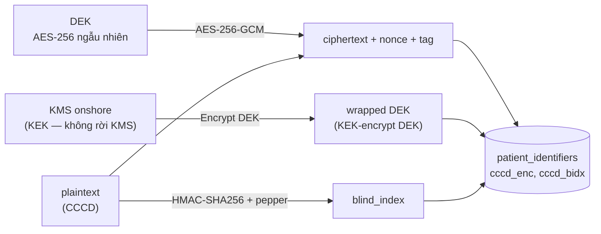

# [DATA-3] Field-level encryption & blind-index cho PHI lookup

> Module DATA-3 · Mã hóa cột siêu nhạy (CCCD, số thẻ BHYT, HIV/tâm thần/di truyền) bằng app-side AES-256-GCM envelope + blind-index HMAC để tiếp đón vẫn tra cứu exact-match · Độ khó: 🥉→🥇 · Prereqs: DATA-1 (RLS & branch_id multi-tenancy)

Neo quyết định: **ADR-014** (field-level encryption: một cơ chế app-side envelope + blind-index HMAC, scope hẹp), **ADR-003/005** (FORCE RLS + branch_id), **ADR-009** (audit-of-reads fail-closed), **ADR-021** (HMS ngoài PCI scope), **ADR-024** (migration 000001). BC sở hữu: **patient (MPI)** — bảng `patient_identifiers (encrypted + blind_index)`.

---

## 1. Vì sao kỹ năng này quan trọng trong HMS

Tiếp đón (Reception) là cửa số hóa đầu tiên của hành trình người bệnh: lễ tân gõ **CCCD** hoặc **số thẻ BHYT** để tìm đúng một `patient_id` trong MPI rồi gọi LIVE card-check cổng giám định (ADR-006). Đây là nơi va chạm trực diện giữa hai yêu cầu mâu thuẫn:

- **Pháp lý NĐ 13/2023 + NĐ 53/2022**: CCCD, số thẻ BHYT, và đặc biệt dữ liệu chẩn đoán nhạy cảm (HIV/AIDS, tâm thần, di truyền) là *dữ liệu cá nhân nhạy cảm* — bắt buộc bảo vệ at-rest, onshore VN, không để lộ kể cả khi backup/dump database rò rỉ.
- **Nghiệp vụ tiếp đón**: lễ tân phải **tìm thấy đúng người trong < 1 giây** bằng exact-match. Nếu cột bị mã hóa kiểu randomized (AES-GCM có nonce ngẫu nhiên) thì `WHERE cccd = ?` không bao giờ khớp → hoặc lễ tân không tìm được bệnh nhân, hoặc đội build lưu thêm một cột plaintext "cho tiện" → **leak** (chính rủi ro [high] trong canon §8).

ADR-014 giải mâu thuẫn này bằng hai cơ chế bù trừ: **envelope encryption** (bảo mật) + **blind-index HMAC deterministic** (tra cứu). Hiểu sai một trong hai nghĩa là: PHI bị lộ trong dump DB, hoặc tiếp đón quay về sổ giấy — cả hai đều là failure mode đã được hội đồng đánh dấu critical. Đây cũng là kỹ năng giúp HMS tránh hai cái bẫy phổ biến: pgcrypto DB-side (DB giữ key → DBA đọc được) và Vault Transit full (3-job khó vận hành, broken Vault = không decrypt được PHI = availability risk = safety risk).

---

## 2. Mô hình tư duy (first principles) — từ con số 0

Bắt đầu từ 4 câu hỏi nguyên thủy:

1. **Ai là kẻ tấn công?** Không phải "hacker mạng" chung chung mà cụ thể: người có quyền đọc file backup/WAL/disk snapshot, DBA xem `SELECT *`, hoặc lỡ tay `pg_dump` gửi nhầm. Mô hình mối đe dọa của field-encryption là **bảo vệ dữ liệu khi storage layer bị lộ** — KHÔNG thay thế RLS (RLS bảo vệ khi *app* bị lạm dụng cross-branch).

2. **Khóa để ở đâu?** Nếu khóa nằm trong DB (pgcrypto) thì kẻ đọc DB cũng đọc khóa → vô nghĩa. Nguyên lý: **khóa giải mã phải ở ngoài tầm với của kẻ đọc storage**. Đó là lý do dùng KMS onshore (VNG/Viettel) — khóa gốc (KEK) không bao giờ rời KMS.

3. **Mã hóa rồi làm sao tìm?** AES-GCM an toàn vì *cùng plaintext → khác ciphertext* (nhờ nonce ngẫu nhiên) → không thể `WHERE ciphertext = ?`. Để tra cứu exact-match ta cần một hàm *deterministic*: cùng input → cùng output, nhưng **không đảo ngược được**. Đó là HMAC với một khóa bí mật — gọi là **blind index**.

4. **Đánh đổi gì?** Blind-index deterministic làm lộ *tần suất* (hai bệnh nhân cùng CCCD sẽ có cùng blind-index — nhưng CCCD vốn unique nên không lộ gì; với cột non-unique thì lộ pattern). ADR-014 chấp nhận đánh đổi này cho cột exact-match unique.

**Mô hình envelope encryption (cốt lõi):**



Ý tưởng "envelope": ta không gọi KMS mỗi lần mã hóa một cột (chậm + tốn quota). Thay vào đó sinh một **DEK** (data encryption key) cục bộ, mã hóa dữ liệu bằng DEK, rồi *gói* (wrap) DEK bằng KEK trong KMS. Lưu cả ciphertext lẫn wrapped-DEK trong DB. Muốn đọc: gọi KMS unwrap DEK (1 lần, có cache TTL ngắn) rồi giải mã cục bộ.

---

## 3. Khái niệm cốt lõi (tăng dần độ khó)

**🥉 Cơ bản — At-rest vs in-transit vs field-level.** TLS 1.3 (Kong terminate) bảo vệ in-transit; K8s etcd + disk encryption bảo vệ at-rest toàn bộ. Field-level encryption là lớp *trên cùng*: chỉ vài cột, dữ liệu vẫn mã hóa kể cả khi disk/backup lộ. ADR-014 chỉ áp field-level cho **cột siêu nhạy hẹp**, KHÔNG mã hóa rộng (mã hóa rộng phá RLS-indexed query + search — rủi ro [high] §8).

**🥈 AES-256-GCM (AEAD).** GCM là *authenticated encryption with associated data*: vừa mã hóa vừa chống sửa (tag xác thực). Ba thành phần bắt buộc lưu: `ciphertext`, `nonce` (96-bit, **không bao giờ tái dùng với cùng DEK**), `tag` (128-bit). AAD (associated data) nên bind `patient_id` + tên cột để chống *ciphertext swap* (đổi ciphertext của bệnh nhân A sang record B). Reuse nonce với cùng key = phá hoàn toàn GCM → mỗi lần encrypt sinh nonce mới ngẫu nhiên.

**🥈 Envelope & DEK rotation.** Một DEK per-... gì? Lựa chọn HMS (ADR-014): DEK theo *key version* (không per-row, để rotation khả thi). Cột `dek_version`/`key_id` cho phép rotate KEK trong KMS mà không phải re-encrypt toàn bộ ngay. Rotation: KMS rotate KEK → re-wrap DEK (rẻ) → lazy re-encrypt khi cần (đắt, chạy nền qua River).

**🥇 Blind-index HMAC.** `blind_index = base64(HMAC-SHA256(key=pepper, msg=normalize(cccd)))`. Ba điểm sống còn: (1) **normalize** input trước HMAC (trim, bỏ khoảng trắng, chuẩn hóa chữ hoa) — nếu không "001234" và " 001234" thành hai index khác nhau, lookup miss; (2) **pepper** (khóa HMAC) ở KMS/secret, KHÔNG trong DB — nếu pepper ở DB thì kẻ đọc DB brute-force được CCCD vì không gian CCCD nhỏ (12 chữ số); (3) blind-index dùng cho **exact-match unique** (CCCD, số thẻ BHYT) — KHÔNG dùng cho range/prefix/fuzzy.

**🥇 Tách bảng để thu hẹp decryption surface.** ADR-014 tách `patient_identifiers` riêng khỏi `patients`. Lý do: chỉ một bảng nhỏ chứa cột mã hóa → giới hạn nơi cần gọi KMS, dễ audit ai-đọc-định-danh (kết hợp ADR-009 read-audit), và cho phép RLS/grant chặt riêng. `patients` (demographics không-định-danh-nhạy-cảm) query tự do; định danh nhạy cảm phải qua đường giải mã có audit.

---

## 4. HMS dùng nó thế nào (bám code path:line — *(planned)*, code chưa viết)

> Repo HIỆN CHƯA CÓ CODE. Đường dẫn dưới theo layout MỤC TIÊU (canon §9). Tất cả đánh dấu *(planned)*.

**Vị trí cơ chế crypto:** `backend/internal/shared/crypto/` *(planned)* — một package dùng chung (KHÔNG để mỗi BC tự cuộn AES). API mục tiêu:

```go
// internal/shared/crypto/envelope.go (planned)
type Cipher interface {
    // Encrypt sinh DEK-encrypted ciphertext; aad bind patient_id + column.
    Encrypt(ctx context.Context, plaintext []byte, aad []byte) (Sealed, error)
    Decrypt(ctx context.Context, s Sealed, aad []byte) ([]byte, error)
}

type Sealed struct {
    Ciphertext []byte // AES-256-GCM output
    Nonce      []byte // 96-bit, ngẫu nhiên MỖI lần encrypt
    KeyID      string // DEK/KEK version cho rotation
}

// internal/shared/crypto/blindindex.go (planned)
// BlindIndex deterministic — pepper từ KMS/secret, KHÔNG từ DB.
func BlindIndex(pepper []byte, value string) string {
    norm := normalize(value)                  // trim + upper + bỏ khoảng trắng
    mac := hmac.New(sha256.New, pepper)
    mac.Write([]byte(norm))
    return base64.RawStdEncoding.EncodeToString(mac.Sum(nil))
}
```

**Schema mục tiêu** (đặc tả ở `doc/08-database-schema.md`, hiện thực ở `backend/migrations/` *(planned)* — KHÔNG ở 000001 vì patient BC build Phase 1, nhưng FORCE RLS keystone đã có sẵn từ 000001 theo ADR-024):

```sql
-- patient_identifiers (planned) — bảng tách, FORCE RLS, branch_id NOT NULL
CREATE TABLE patient_identifiers (
    id            UUID PRIMARY KEY DEFAULT uuidv7(),
    branch_id     UUID NOT NULL,
    patient_id    UUID NOT NULL REFERENCES patients(id),
    id_type       TEXT NOT NULL,        -- 'CCCD' | 'BHYT' | 'MRN'
    value_enc     BYTEA NOT NULL,       -- AES-256-GCM ciphertext
    value_nonce   BYTEA NOT NULL,       -- 96-bit nonce
    value_bidx    TEXT  NOT NULL,       -- blind-index HMAC (lookup)
    key_id        TEXT  NOT NULL,       -- DEK/KEK version cho rotation
    created_at    TIMESTAMPTZ NOT NULL DEFAULT now()
);
-- exact-match lookup: branch_id-leading theo RLS, rồi bidx
CREATE UNIQUE INDEX ux_pid_lookup
    ON patient_identifiers (branch_id, id_type, value_bidx);
ALTER TABLE patient_identifiers ENABLE ROW LEVEL SECURITY;
ALTER TABLE patient_identifiers FORCE ROW LEVEL SECURITY;
CREATE POLICY pid_branch_isolation ON patient_identifiers
    USING (branch_id = current_setting('app.current_branch')::uuid)
    WITH CHECK (branch_id = current_setting('app.current_branch')::uuid);
```

**Luồng tiếp đón exact-match lookup** ở `internal/patient/app` + `internal/scheduling/adapters/http` *(planned)*:

```mermaid
sequenceDiagram
  participant FE as SPA Tiếp đón
  participant H as patient handler (planned)
  participant TX as pgx.Tx (SET LOCAL app.current_branch)
  participant C as shared/crypto
  participant DB as patient_identifiers
  FE->>H: GET /patients/lookup?cccd=...
  H->>C: bidx = BlindIndex(pepper, cccd)
  H->>TX: BEGIN; SET LOCAL app.current_branch=<jwt.branch>
  TX->>DB: SELECT patient_id WHERE id_type='CCCD' AND value_bidx=$1
  Note over TX,DB: RLS lọc branch_id; index ux_pid_lookup
  DB-->>TX: 0/1 row
  TX->>C: Decrypt(value_enc) — chỉ khi cần hiển thị, ghi read-audit (ADR-009)
  H-->>FE: patient summary (audit committed-with-response)
```

Điểm neo bắt buộc: query lookup PHẢI chạy **trong tx đã SET LOCAL GUC** (ADR-003/005, rủi ro [critical] §8 — pgx pool reuse connection, query ngoài tx mất branch filter). Việc *giải mã* `value_enc` để hiển thị định danh là PHI-read → phải ghi audit commit-with-response (ADR-009, `internal/audit` *(planned)*), fail-closed: không trả định danh nếu không ghi được audit.

**Thanh toán ngoài PCI scope (ADR-021):** HMS KHÔNG lưu số thẻ tín dụng thật — chỉ token + transaction id từ cổng (VNPay/Momo/napas). Field-encryption KHÔNG dùng cho thẻ thanh toán (vì không lưu), chỉ cho định danh y tế.

---

## 5. Best practices (mỗi mục kèm 1 nguồn đã research)

1. **Envelope encryption thay vì gọi KMS mỗi field** — sinh DEK cục bộ, wrap bằng KEK trong KMS; giảm latency + quota, rotation rẻ. Nguồn: AWS — Envelope encryption & data keys, <https://docs.aws.amazon.com/kms/latest/developerguide/concepts.html#enveloping>
2. **Dùng AEAD (AES-256-GCM), không bao giờ AES-CBC trần** — GCM xác thực ciphertext chống tampering; CBC thiếu integrity dễ padding-oracle. Nguồn: OWASP Cryptographic Storage Cheat Sheet, <https://cheatsheetseries.owasp.org/cheatsheets/Cryptographic_Storage_Cheat_Sheet.html>
3. **Nonce 96-bit ngẫu nhiên, không tái dùng với cùng key** — reuse nonce phá hoàn toàn GCM (lộ XOR plaintext + forge tag). Nguồn: NIST SP 800-38D §8.2 (GCM nonce uniqueness), <https://csrc.nist.gov/pubs/sp/800/38/d/final>
4. **Blind index = HMAC keyed, pepper ở KMS không ở DB** — chống brute-force khi DB lộ; deterministic cho exact-match. Nguồn: Paragon Initiative — Building searchable encrypted databases, <https://www.paragonie.com/blog/2017/05/building-searchable-encrypted-databases-with-php-and-sql>
5. **Bind AAD (associated data) để chống ciphertext swap giữa record** — gắn `patient_id`+tên cột vào AAD; giải mã sai context → fail. Nguồn: Go `crypto/cipher` GCM `Seal`/`Open` (tham số additionalData), <https://pkg.go.dev/crypto/cipher#NewGCM>
6. **Một cơ chế crypto duy nhất app-side, không pgcrypto + Vault song song (ADR-014)** — DB không giữ key; tránh hai source-of-truth crypto. Nguồn: dự án — DESIGN_CANON ADR-014 §5; nền lý thuyết key-management onshore.
7. **Thu hẹp scope cột mã hóa, chốt trước khi có data** — over-scope phá RLS-indexed query + search (rủi ro [high] §8). Nguồn: dự án — DESIGN_CANON ADR-014 + §8; chuẩn data classification PHI.
8. **Constant-time so sánh blind-index/tag** — dùng `hmac.Equal`, tránh timing leak. Nguồn: Go `crypto/hmac.Equal`, <https://pkg.go.dev/crypto/hmac#Equal>

---

## 6. Lỗi thường gặp & anti-patterns

| # | Anti-pattern | Hậu quả | Cách đúng (neo) |
|---|---|---|---|
| 1 | Mã hóa cột nhưng lưu thêm cột plaintext "cho tiện tra cứu" | PHI leak hoàn toàn trong dump DB | Blind-index HMAC, KHÔNG plaintext (rủi ro [high] §8) |
| 2 | Dùng pgcrypto (DB giữ key) HOẶC bật cả Vault Transit | DBA/đọc-DB giải mã được; hai cơ chế xung đột | MỘT cơ chế app-side envelope (ADR-014) |
| 3 | Reuse nonce hoặc nonce cố định | Phá hoàn toàn AES-GCM, lộ plaintext | Nonce 96-bit ngẫu nhiên mỗi lần (NIST 800-38D) |
| 4 | Pepper/HMAC-key lưu trong DB cùng blind-index | Brute-force CCCD (12 chữ số, không gian nhỏ) | Pepper ở KMS/secret store |
| 5 | Không normalize input trước HMAC | Lookup miss (" 001" ≠ "001"), lễ tân quay về giấy | normalize (trim/upper/bỏ space) rồi mới HMAC |
| 6 | Mã hóa rộng mọi cột PHI | Phá RLS-indexed query + ORDER BY + trigram search | Scope hẹp: CCCD/thẻ BHYT/HIV/tâm thần/di truyền |
| 7 | Giải mã định danh mà không ghi read-audit | Vi phạm ADR-009/NĐ13/HIPAA §164.312(b) | Decrypt-to-display = PHI-read → audit fail-closed |
| 8 | Lookup chạy ngoài tx có SET LOCAL branch | RLS revert → cross-branch leak (pool reuse) | Query trong tx đã SET LOCAL GUC (ADR-003/005) |
| 9 | So sánh tag/bidx bằng `==` chuỗi | Timing side-channel | `hmac.Equal` constant-time |
| 10 | Không có `key_id`/version → không rotate được | KEK rotation bắt buộc re-encrypt toàn bộ ngay | Lưu `key_id`, lazy re-encrypt qua River |

---

## 7. Lộ trình luyện tập NGAY trong repo (🥉→🥈→🥇)

> Repo chưa có code — bài tập là *tạo skeleton planned* theo layout §9, viết test trước (TDD ADR-025).

**🥉 Cơ bản — round-trip AES-256-GCM.** Tạo `backend/internal/shared/crypto/envelope_test.go` *(planned)*: viết test `Encrypt` rồi `Decrypt` ra đúng plaintext; test rằng hai lần `Encrypt` cùng input cho ra **khác** ciphertext (nonce ngẫu nhiên); test giải mã với AAD sai → lỗi. Implement `envelope.go` để pass. Mục tiêu: hiểu AEAD + nonce uniqueness.

**🥈 Trung cấp — blind-index lookup deterministic.** Tạo `blindindex.go` + test: cùng CCCD (kể cả khác whitespace/hoa-thường sau normalize) → cùng blind-index; CCCD khác → khác; verify dùng `hmac.Equal`. Viết migration *(planned)* `patient_identifiers` với `UNIQUE(branch_id, id_type, value_bidx)`; viết integration test (testcontainers, ADR-025) chèn rồi `SELECT ... WHERE value_bidx=$1` trả đúng 1 row.

**🥇 Nâng cao — lookup an toàn end-to-end + DEK rotation.** Viết integration test (testcontainers real PG) chứng minh: (a) lookup chạy trong tx đã `SET LOCAL app.current_branch` thì branch khác **vô hình** (kết hợp DATA-1 RLS test branch-isolation, merge-blocking); (b) giải mã `value_enc` đi kèm một bản ghi audit (giả lập `internal/audit` *(planned)*) — nếu audit-write fail thì handler KHÔNG trả định danh (fail-closed ADR-009); (c) viết `key_id` versioning + một River job *(planned)* re-wrap/re-encrypt lazy khi rotate, test rằng record `key_id` cũ vẫn giải mã được trong giai đoạn chuyển tiếp.

---

## 8. Skill/agent ECC nên dùng khi luyện

- **ecc:healthcare-phi-compliance** — data classification PHI/PII, access control, audit trail, encryption, các leak vector y tế; dùng để kiểm scope cột mã hóa có đúng "siêu nhạy hẹp" không.
- **ecc:security-reviewer** / skill **ecc:security-review** — soát crypto misuse (nonce reuse, pepper-in-DB, plaintext shadow column), kiểm fail-closed read-audit.
- **ecc:go-review** — review idiomatic Go cho package `shared/crypto`: dùng `crypto/cipher` GCM, `hmac.Equal`, error handling rõ ràng, immutability (trả `Sealed` mới, không mutate).
- **ecc:postgres-patterns** — review schema `patient_identifiers`: index `branch_id`-leading, UNIQUE blind-index, FORCE RLS policy USING&WITH-CHECK.
- **ecc:go-test** + **ecc:test-coverage** — TDD round-trip + testcontainers integration cho RLS/lookup, đẩy coverage ≥80% (testing rule).
- **ecc:hipaa-compliance** — tham chiếu chéo control encryption-at-rest cho PHI khi viết DPIA (ADR-020).

---

## 9. Tài nguyên học thêm (2024–2026)

- NIST SP 800-38D — GCM mode & nonce uniqueness (chuẩn nền): <https://csrc.nist.gov/pubs/sp/800/38/d/final>
- OWASP Cryptographic Storage Cheat Sheet (cập nhật liên tục): <https://cheatsheetseries.owasp.org/cheatsheets/Cryptographic_Storage_Cheat_Sheet.html>
- AWS KMS — Envelope encryption, data keys, key rotation: <https://docs.aws.amazon.com/kms/latest/developerguide/concepts.html>
- Go `crypto/cipher` GCM (`NewGCM`, `Seal`, `Open`, additionalData): <https://pkg.go.dev/crypto/cipher#NewGCM>
- Paragon Initiative — Building searchable encrypted databases (blind index): <https://www.paragonie.com/blog/2017/05/building-searchable-encrypted-databases-with-php-and-sql>
- PostgreSQL Row Security Policies (USING vs WITH CHECK, FORCE RLS): <https://www.postgresql.org/docs/16/ddl-rowsecurity.html>
- NĐ 13/2023/NĐ-CP — Bảo vệ dữ liệu cá nhân (phân loại dữ liệu nhạy cảm, DPIA): tra cứu văn bản tại <https://vanban.chinhphu.vn>
- Luật Bảo vệ dữ liệu cá nhân 2025 (hiệu lực 2026, đang superseding NĐ13) — theo dõi cập nhật nghĩa vụ (canon §8, ADR-020).

---

## 10. Checklist "đã hiểu"

- [ ] Giải thích được vì sao field-encryption KHÔNG thay thế RLS (storage-leak vs app-abuse) và cả hai cùng cần (ADR-014 + ADR-003).
- [ ] Vẽ được sơ đồ envelope: KEK ở KMS, DEK cục bộ, wrapped-DEK + ciphertext lưu DB.
- [ ] Nêu được 3 thành phần phải lưu của AES-256-GCM (ciphertext, nonce, tag) và vì sao nonce không được tái dùng.
- [ ] Giải thích blind-index = HMAC keyed deterministic, pepper ở KMS không ở DB, và đánh đổi lộ tần suất.
- [ ] Biết phải normalize input trước HMAC, nếu không lễ tân tra cứu miss.
- [ ] Liệt kê đúng scope cột siêu nhạy hẹp (CCCD, số thẻ BHYT, HIV/tâm thần/di truyền) và vì sao không mã hóa rộng.
- [ ] Hiểu vì sao chỉ MỘT cơ chế crypto app-side (không pgcrypto + Vault Transit song song — ADR-014).
- [ ] Biết lookup phải chạy trong tx đã SET LOCAL app.current_branch (ADR-003/005) và giải mã-để-hiển-thị phải ghi read-audit fail-closed (ADR-009).
- [ ] Hiểu `key_id` versioning cho phép rotate KEK mà không re-encrypt toàn bộ ngay (lazy qua River).
- [ ] Biết HMS ngoài PCI scope (ADR-021) nên field-encryption KHÔNG dùng cho số thẻ thanh toán (chỉ token).
