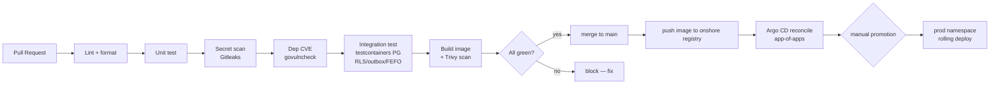

# [DSO-1] CI/CD & Supply-chain Security Gates

> Module DSO-1 · CI/CD pipeline + supply-chain security cho HMS (GitHub Actions merge-blocking gates → Argo CD rolling) · Độ khó: 🥉→🥇 · Prereqs: BE-1 (Go production), K8S-2 (triển khai HMS + Kong KIC + CNPG)

Liên kết: `doc/15-devsecops-cicd.md` (source-of-truth), `doc_tech/devsecops/02-observability-slo.md` (DSO-2), `doc_tech/kubernetes/02-deploying-hms.md` (K8S-2). Neo quyết định: **ADR-019** (Kong KIC DB-less + Argo CD rolling, security gates rẻ merge-blocking, SLSA/Cosign/ZAP follow-on), **ADR-024** (golang-migrate, migration 000001), **ADR-025** (testcontainers RLS/outbox/FEFO + E2E), **ADR-003** (CI branch-isolation test merge-blocking), **ADR-013** (Kong version-pin + patch là CI/admission gate, CVE-2026-29413).

---

## 1. Vì sao kỹ năng này quan trọng trong HMS

HMS xử lý PHI của người bệnh Việt Nam — mỗi merge vào `main` là một thay đổi có thể rò rỉ bệnh án, vô hiệu hóa RLS, hoặc đẩy một dependency có CVE vào cụm production onshore. CI/CD KHÔNG phải tiện ích "chạy test cho vui": nó là **hàng rào pháp lý và an toàn bệnh nhân được tự động hóa**, đứng giữa lập trình viên và dữ liệu sống.

Bốn rủi ro critical trong canon (mục 8) được CI/CD trực tiếp chặn:

- **FORCE RLS bị bỏ sót → leak xuyên chi nhánh âm thầm** (ADR-003). Diagram nói "isolated", code rò rỉ production. Chỉ một CI integration test chứng minh "dữ liệu branch-B vô hình dưới `app.current_branch=A`" mới bắt được — đây là **merge-blocking gate**, không phải nice-to-have.
- **Kong CVE-2026-29413 (auth-bypass, CISA-KEV, exploited healthcare gateways)** (ADR-013). Version-pin Kong + patch phải là **CI/admission gate** — một image Kong out-of-date lọt vào cụm = cổng auth có thể bị bypass.
- **Secret hardcode** (token cổng BHYT, client-cert mTLS, KMS key id) lọt vào git history = phải rotate toàn bộ + có thể vi phạm NĐ 13/2023.
- **Migration phá compliance**: nếu migration 000001 (ADR-024) — thiết lập `ENABLE+FORCE RLS`, tách migration-owner-vs-app-role — không được kiểm trong CI, một developer có thể vô tình làm app-role thành table owner (owner bypass RLS kể cả `NOBYPASSRLS`).

ADR-019 chốt một triết lý thẳng thắn: **giữ security gates RẺ và high-value làm merge-blocking ngay từ Phase 0** (Gitleaks, govulncheck, golangci-lint, Trivy), còn maturity-L4 (Argo Rollouts canary, SLSA provenance, Cosign sign, ZAP DAST) thì **earn-in sau khi pipeline ổn**. Học sai thứ tự này → đội IT bệnh viện nhỏ ngộp vận hành mà PHI vẫn không an toàn hơn.

## 2. Mô hình tư duy (first principles) — từ con số 0

Bắt đầu từ một câu hỏi: *"Điều gì phải ĐÚNG trước khi code chạm vào bệnh án thật?"* Mọi pipeline là cách trả lời câu hỏi đó một cách tự động và lặp lại được.



Bốn nguyên lý nền:

1. **Shift-left**: phát hiện lỗi càng gần lúc gõ code càng rẻ. Một secret bắt ở pre-commit/PR tốn vài giây; bắt ở production tốn một đợt rotate + báo cáo sự cố DLCN.
2. **Fail-closed (giống ADR-008/009 ở tầng pipeline)**: gate FAIL → block merge. KHÔNG có "cảnh báo rồi cho qua" cho các gate critical (secret, RLS-isolation, Kong version-pin).
3. **GitOps là single source of truth**: trạng thái mong muốn của cụm nằm trong git (Kustomize overlays + Kong CRD + Argo app-of-apps), KHÔNG `kubectl apply` thủ công. Argo CD reconcile git → cụm; drift bị phát hiện và (tùy chọn) self-heal. Đây là hệ quả trực tiếp ADR-019: "Kong config GitOps-versioned YAML".
4. **Supply-chain = chuỗi tin cậy từ source → artifact → deploy**: mỗi mắt xích phải verify mắt trước (dep có CVE? image có vuln? — Phase 3: image có được Cosign-sign + SLSA provenance?).

Phân biệt CI vs CD: **CI** = chứng minh code đúng/an toàn TRƯỚC merge (chạy trên GitHub Actions runner). **CD** = đưa artifact đã-được-chứng-minh ra cụm (Argo CD pull-based, rolling, manual promotion). HMS MVP cố tình KHÔNG dùng push-based deploy hay canary auto-rollback (ADR-019).

## 3. Khái niệm cốt lõi (tăng dần độ khó)

**3.1 — Pipeline stages & merge-blocking (🥉).** Một workflow GitHub Actions = các `job` chạy song song/tuần tự; mỗi job non-zero exit → PR đỏ → branch protection rule chặn merge. "Merge-blocking gate" = job nằm trong required status checks của `main`.

**3.2 — Bốn rẻ-mà-mạnh gates MVP (🥉→🥈)** (ADR-019, Phase 0):

| Gate | Công cụ (pinned) | Bắt cái gì |
|------|------------------|-----------|
| Secret scan | **Gitleaks** | token BHYT, client-cert, KMS id hardcode |
| Dep vuln | **govulncheck** (golang.org/x/vuln) | CVE trong Go module dependency tree |
| Lint + arch | **golangci-lint** (+ **depguard**) | bug tĩnh + **cấm cross-BC import** (ADR-001) |
| Image scan | **Trivy** | OS/lib vuln + misconfig trong container image |

**3.3 — Integration gate với testcontainers (🥈)** (ADR-025). Unit test mock được; **RLS/outbox/FEFO/idempotency KHÔNG mock được** — phải chạy trên Postgres thật. CI spin một container PG (testcontainers-go), chạy migration 000001, rồi test chứng minh branch-isolation. Đây là gate tốn Docker-in-CI nhưng là *điểm nối duy nhất* bắt được lỗi RLS (ADR-003).

**3.4 — Container build & registry onshore (🥈).** Multi-stage Dockerfile (build → distroless/nonroot final), push image lên registry onshore VN (không registry nước ngoài cho artifact chứa logic PHI). Tag bằng git SHA (immutable), KHÔNG `:latest`.

**3.5 — GitOps app-of-apps + manual promotion (🥈→🥇)** (ADR-019). Argo CD `Application` cha trỏ tới thư mục `deploy/argocd/` chứa các `Application` con (hms-api, kong, cnpg, monitoring). Dev/staging auto-sync; **prod manual promotion** (người bấm sync sau khi review) — KHÔNG auto-deploy prod.

**3.6 — Kong version-pin là admission gate (🥇)** (ADR-013, CVE-2026-29413). CI kiểm image tag Kong khớp allowlist đã patch; cụm dùng admission policy (OPA/Kyverno hoặc Trivy-operator) reject image Kong ngoài allowlist.

**3.7 — Earn-in supply-chain nâng cao (🥇, Phase 3)** (ADR-019): **Cosign** ký image + verify ở admission; **SLSA** provenance attestation; **ZAP** DAST quét endpoint sau deploy. Tất cả follow-on *sau khi pipeline ổn* — không front-load.

## 4. HMS dùng nó thế nào (bám code path — *(planned)*)

Repo HIỆN CHƯA CÓ CODE; dưới đây là layout MỤC TIÊU (canon mục 9), đánh dấu *(planned)*.

- `.github/workflows/ci.yml` *(planned)* — pipeline PR: lint → unit → gitleaks → govulncheck → integration (testcontainers) → build+Trivy.
- `.github/workflows/cd.yml` *(planned)* — sau merge `main`: build+push image SHA-tagged → bump tag trong Kustomize overlay → Argo CD reconcile.
- `backend/.golangci.yml` *(planned)* — bật **depguard** thực thi layer rule `adapters → ports ← app → domain` và cấm cross-BC import (ADR-001).
- `backend/migrations/000001_phase0_compliance.up.sql` *(planned)* — extensions + branches + accounts/roles/permissions + audit_log + migration-owner-vs-app-role + `ENABLE+FORCE RLS` (ADR-024). CI chạy file này trước integration test.
- `backend/internal/shared/rls/` *(planned)* — middleware `SET LOCAL app.current_branch` trong tx; test branch-isolation neo ở đây.
- `deploy/kong/` *(planned)* — Gateway API + KongPlugin CRD, DB-less; image Kong version-pinned (ADR-013/019).
- `deploy/kustomize/overlays/{dev,staging,prod}/` *(planned)* — image tag per-env.
- `deploy/argocd/` *(planned)* — app-of-apps; prod `Application` đặt `syncPolicy` manual.

Ví dụ CI workflow MVP *(planned)* — bốn gate rẻ + integration gate:

```yaml
# .github/workflows/ci.yml (planned)
name: ci
on: { pull_request: { branches: [main] } }
permissions: { contents: read }            # least-privilege token
jobs:
  static-and-secrets:
    runs-on: ubuntu-latest
    steps:
      - uses: actions/checkout@v4
        with: { fetch-depth: 0 }            # Gitleaks cần full history
      - uses: gitleaks/gitleaks-action@v2    # secret scan — fail-closed
      - uses: actions/setup-go@v5
        with: { go-version: '1.23' }
      - run: go run golang.org/x/vuln/cmd/govulncheck@latest ./...
      - uses: golangci/golangci-lint-action@v6   # depguard layer + cross-BC import ban
        with: { working-directory: backend }
      - run: go test -race -cover ./...      # unit, table-driven (ADR-025)
  integration-rls:                           # ADR-003 merge-blocking gate
    runs-on: ubuntu-latest
    steps:
      - uses: actions/checkout@v4
      - uses: actions/setup-go@v5
        with: { go-version: '1.23' }
      # testcontainers-go tự spin PG; test chạy migration 000001 rồi
      # assert branch-B INVISIBLE dưới app.current_branch=A
      - run: go test -tags=integration ./internal/... -run TestRLS
  build-scan:
    needs: [static-and-secrets, integration-rls]
    runs-on: ubuntu-latest
    steps:
      - uses: actions/checkout@v4
      - run: docker build -t hms-api:${{ github.sha }} backend/
      - uses: aquasecurity/trivy-action@master
        with: { image-ref: 'hms-api:${{ github.sha }}', severity: 'HIGH,CRITICAL', exit-code: '1' }
```

Test branch-isolation neo CI (kiểu, *(planned)*):

```go
// internal/patient/adapters/postgres/rls_test.go (planned) — ADR-003/025
func TestRLS_BranchBInvisibleUnderBranchA(t *testing.T) {
    // Arrange: seed patient ở branch B, mở tx SET LOCAL app.current_branch = A
    // Act:     SELECT * FROM patients trong tx của A
    // Assert:  0 row (branch-B vô hình) — fail = block merge
}
```

## 5. Best practices (mỗi mục kèm nguồn)

1. **Least-privilege `GITHUB_TOKEN`**: đặt `permissions:` tối thiểu mỗi workflow (mặc định `contents: read`), nâng quyền chỉ ở job cần. Nguồn: GitHub Docs — *Automatic token authentication / Assigning permissions to jobs* (https://docs.github.com/en/actions/security-for-github-actions/security-guides/automatic-token-authentication).
2. **Pin actions theo commit SHA cho action bên thứ ba**, không chỉ tag, để chống tag-mutation/supply-chain. Nguồn: GitHub Docs — *Security hardening for GitHub Actions* (https://docs.github.com/en/actions/security-for-github-actions/security-guides/security-hardening-for-github-actions).
3. **Gitleaks full-history scan** (`fetch-depth: 0`) để bắt secret đã commit ở quá khứ, không chỉ diff. Nguồn: Gitleaks README (https://github.com/gitleaks/gitleaks).
4. **govulncheck dùng call-graph reachability** — chỉ báo CVE thực sự gọi tới, giảm noise. Nguồn: Go Team — *Govulncheck* (https://go.dev/blog/govulncheck).
5. **golangci-lint + depguard thực thi kiến trúc** (cấm import chéo BC / lệch layer) ngay trong lint. Nguồn: golangci-lint depguard docs (https://golangci-lint.run/usage/linters/#depguard).
6. **Trivy fail trên HIGH/CRITICAL + scan cả image lẫn IaC misconfig**. Nguồn: Aqua Trivy docs (https://aquasecurity.github.io/trivy/latest/docs/).
7. **GitOps pull-based + manual sync cho prod** thay vì CI `kubectl apply`. Nguồn: Argo CD docs — *Core Concepts / Sync Options* (https://argo-cd.readthedocs.io/en/stable/user-guide/sync-options/).
8. **App-of-apps để bootstrap nhiều Application từ một root**. Nguồn: Argo CD docs — *Cluster Bootstrapping (app-of-apps)* (https://argo-cd.readthedocs.io/en/stable/operator-manual/cluster-bootstrapping/).
9. **Cosign keyless signing + verify ở admission** (earn-in Phase 3). Nguồn: Sigstore Cosign docs (https://docs.sigstore.dev/cosign/signing/signing_with_containers/).
10. **SLSA provenance levels** làm khung mục tiêu supply-chain (earn-in). Nguồn: SLSA v1.0 spec (https://slsa.dev/spec/v1.0/levels).

## 6. Lỗi thường gặp & anti-patterns

- **Gate critical chỉ "warning" rồi cho merge**. Vi phạm fail-closed — secret/RLS-leak phải block tuyệt đối. Required status checks bắt buộc bật trên `main`.
- **Mock Postgres cho RLS test** (ADR-025 loại bỏ rõ ràng): RLS sống ở DB layer, mock = test giả xanh, leak production thật.
- **App-role làm table owner trong migration** (ADR-003): owner bypass RLS kể cả `NOBYPASSRLS`. CI phải verify migration 000001 tạo migration-owner riêng.
- **`:latest` image tag**: phá tính tái lập + Argo không phát hiện thay đổi. Luôn tag git SHA immutable.
- **Front-load Argo Rollouts canary / Tempo / SLSA / Cosign / ZAP ở MVP** (ADR-019 chống over-engineering): team chưa ship v1 ngộp ops. Earn-in sau, không trước.
- **Kong DB-mode** (ADR-019 loại bỏ): thêm một Postgres phải vận hành. Dùng KIC DB-less/declarative.
- **Kong image không version-pin** (ADR-013): CVE-2026-29413 auth-bypass lọt cụm. Version-pin + patch là CI/admission gate.
- **Auto-deploy thẳng prod**: ADR-019 bắt buộc manual promotion cho prod — review trước khi PHI-serving cụm đổi.
- **Secret thật trong `.github/workflows`/`values.yaml`**: dùng GitHub Encrypted Secrets / ESO + KMS, không hardcode.
- **Đẩy audit log qua cùng pipeline log thường**: audit (compliance) ship riêng tới WORM sink (ADR-009/019), không trộn vào Loki.

## 7. Lộ trình luyện tập NGAY trong repo

- 🥉 **Cơ bản**: Viết `.github/workflows/ci.yml` *(planned)* với 3 job rẻ — Gitleaks + govulncheck + golangci-lint. Đặt `permissions: contents: read`. Cấu hình branch protection để cả ba là required status checks trên `main`. Chứng minh: tạo PR cố tình hardcode một fake token → CI phải đỏ.
- 🥈 **Trung cấp**: Thêm job `integration-rls` dùng testcontainers-go: spin PG, chạy `migrations/000001` *(planned)*, viết test `TestRLS_BranchBInvisibleUnderBranchA` (ADR-003). Cấu hình `.golangci.yml` *(planned)* với **depguard** cấm `internal/billing` import `internal/pharmacy` (cross-BC ban, ADR-001) — chứng minh lint đỏ khi vi phạm.
- 🥇 **Nâng cao**: Dựng `deploy/argocd/` app-of-apps *(planned)*: root Application → con (hms-api, kong DB-less version-pinned, cnpg). Đặt prod `Application` `syncPolicy` MANUAL (ADR-019). Thêm Trivy admission allowlist cho image Kong (ADR-013). Viết runbook: "khi Trivy bắt CRITICAL CVE trong dep BHYT client → block + bump + re-run".

## 8. Skill/agent ECC nên dùng khi luyện

- **`ecc:go-build`** — sửa lỗi build/go vet/golangci-lint khi dựng pipeline Go (depguard layer rule).
- **`ecc:go-review`** — review job test/integration đảm bảo idiomatic + concurrency-safe.
- **`ecc:security-scan`** (AgentShield) + **`ecc:security-review`** — quét secret/hook/permission surface của chính `.github/workflows` và config.
- **`ecc:kubernetes-patterns`** + **`ecc:deployment-patterns`** — Argo CD app-of-apps, manifest, admission policy.
- **`ecc:docker-patterns`** — multi-stage build, distroless/nonroot, Trivy-clean image.
- **`ecc:github-ops`** — branch protection, required checks, Actions config.
- **`ecc:test-coverage`** — verify gate coverage 80% (ADR-025) là merge-blocking.
- **`ecc:healthcare-phi-compliance`** — đối chiếu gate với nghĩa vụ NĐ 13/2023 (audit→WORM, residency onshore).

## 9. Tài nguyên học thêm (2024–2026)

- GitHub Actions — *Security hardening for GitHub Actions* (https://docs.github.com/en/actions/security-for-github-actions/security-guides/security-hardening-for-github-actions)
- Argo CD — *Operator Manual & app-of-apps* (https://argo-cd.readthedocs.io/en/stable/)
- Sigstore Cosign — *Signing containers* (https://docs.sigstore.dev/cosign/)
- SLSA v1.0 — *Supply-chain Levels for Software Artifacts* (https://slsa.dev/spec/v1.0/)
- Aqua Trivy — *Scanner docs* (https://aquasecurity.github.io/trivy/)
- Go Vulnerability Management — *govulncheck* (https://go.dev/doc/security/vuln/)
- testcontainers-go — *Quickstart* (https://golang.testcontainers.org/)
- Kong Ingress Controller — *Gateway API & DB-less* (https://docs.konghq.com/kubernetes-ingress-controller/)
- CISA KEV Catalog (theo dõi CVE-2026-29413 Kong) (https://www.cisa.gov/known-exploited-vulnerabilities-catalog)
- OWASP — *CI/CD Security Cheat Sheet* (https://cheatsheetseries.owasp.org/cheatsheets/CI_CD_Security_Cheat_Sheet.html)

## 10. Checklist "đã hiểu"

- [ ] Giải thích được vì sao gate RLS-branch-isolation là **merge-blocking**, không mock được (ADR-003/025)
- [ ] Liệt kê đúng 4 gate rẻ MVP (Gitleaks/govulncheck/golangci-lint/Trivy) và phân biệt với 5 earn-in Phase 3 (ADR-019)
- [ ] Biết tại sao Kong version-pin là CI/admission gate (CVE-2026-29413, ADR-013)
- [ ] Phân biệt CI (chứng minh trước merge) vs CD (Argo CD pull-based rolling + manual promotion prod)
- [ ] Cấu hình được `permissions:` least-privilege + pin action theo SHA
- [ ] Hiểu vì sao depguard thực thi layer rule + cấm cross-BC import (ADR-001)
- [ ] Biết audit log ship WORM riêng, không trộn pipeline log thường (ADR-009/019)
- [ ] Nêu được lý do KHÔNG front-load canary/Tempo/SLSA/Cosign/ZAP ở MVP
- [ ] Tạo được app-of-apps Argo CD với prod sync MANUAL
- [ ] Dựng được job testcontainers chạy migration 000001 trước integration test
