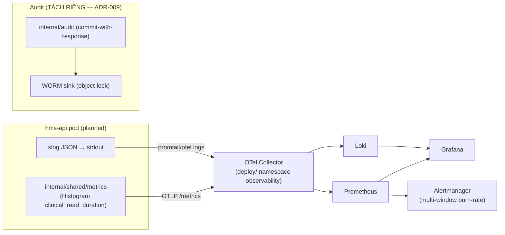

# [DSO-2] Observability MVP & SLO — Prometheus + Loki + Grafana

> Module DSO-2 · Observability "ba trụ cột" (metrics/logs + audit tách riêng) và SLO/error-budget cho HMS · Độ khó: 🥈→🥇 · Prereqs: DSO-1 (CI/CD & supply-chain), nên đã đọc K8S-1/K8S-2 và BE-2.

Neo quyết định: **ADR-019** (OTel→Prometheus+Loki+Grafana+Alertmanager, multi-window burn-rate, KHÔNG Tempo MVP), **ADR-002** (MVP component budget — không thêm stateful system), **ADR-009** (audit-of-reads ship riêng WORM, KHÔNG chỉ Loki), **ADR-015** (signed-EMR synchronous durability — ảnh hưởng SLO write path).

---

## 1. Vì sao kỹ năng này quan trọng trong HMS

Một bệnh viện vừa bỏ giấy không có "đường lùi". Nếu trang khám của bác sĩ treo 3 giây mỗi lần load Encounter, hoặc cổng giám định BHYT chậm mà không ai biết, staff sẽ **quay lại sổ giấy trong tuần đầu** — đó là failure mode #1 của cả dự án (Open risk [high], canon §8). Observability ở HMS không phải "dashboard cho đẹp" mà là cơ chế phát hiện ba loại sự cố trước khi người bệnh xếp hàng:

- **Clinical-read chậm** — bác sĩ/điều dưỡng đọc PHI là hot path. SLO chốt: **p95 < 300ms cho clinical-read** (ADR-019). Vượt ngưỡng = trang khám lag = mất niềm tin.
- **Claim/charge backlog** — outbox relay (ADR-012) hoặc River job (BE-4) đẩy XML 4750 lên cổng giám định có thể ùn. Một "claim-event-processing budget" phải đo được, nếu không tiền BHYT về chậm và không ai biết tại sao.
- **Degraded-mode kích hoạt im lặng** — khi cổng BHYT/donthuocquocgia.vn lỗi (ADR-006/007), hệ thống *vẫn chạy* (admit-and-flag, queue-and-retry). Đó là tính năng, nhưng nếu hàng đợi retry phình mà không alert, ta tích lũy nợ kỹ thuật pháp lý (claim chưa gửi).

Điểm tinh tế bậc nhất: **audit log KHÔNG phải là observability log**. Audit-of-reads (ADR-009) là bằng chứng pháp lý HIPAA §164.312(b)/NĐ13, phải fail-closed + hash-chain + WORM sink riêng. Loki là best-effort, có retention ngắn, có thể mất log khi sập — tuyệt đối không được nhầm hai đường này. Trộn chúng là một lỗi compliance nghiêm trọng, không chỉ là lỗi kỹ thuật.

## 2. Mô hình tư duy (first principles) — từ con số 0

Bắt đầu từ một câu hỏi: *"Khi bác sĩ báo 'hệ thống chậm', tôi trả lời được trong 5 phút là chậm ở đâu không?"*

Ba trụ cột kinh điển (metrics, logs, traces) trả lời ba câu khác nhau:

| Trụ cột | Trả lời câu hỏi | Bản chất dữ liệu | Công cụ HMS (MVP) |
|---|---|---|---|
| **Metrics** | "Có vấn đề không? Mức độ?" | số đếm/đo theo thời gian, rẻ, aggregate | Prometheus |
| **Logs** | "Chuyện gì xảy ra ở request cụ thể?" | sự kiện rời rạc, có cardinality cao | Loki |
| **Traces** | "Request đi qua đâu, chậm ở span nào?" | cây span xuyên service | **defer** (ADR-019) |

Tại sao **defer Tracing/Tempo ở MVP?** Distributed tracing có giá trị khi một request nhảy qua nhiều process. HMS MVP là **một modular monolith** (ADR-001) — một request vào `hms-api` chạy in-process, cross-BC qua outbox in-process. Span graph gần như tuyến tính; metrics theo endpoint + structured log đủ chẩn đoán. Thêm Tempo = thêm một stateful store đội IT nhỏ phải vận hành, vi phạm MVP component budget (ADR-002). Trigger earn-in Tempo: khi tách BC ra service (Phase 3) request mới thực sự xuyên process.

Nguyên tắc nền (đặt trước mọi tool): **đo cái người dùng cảm nhận, không đo cái máy chủ cảm nhận.** CPU 90% không phải sự cố nếu p95 latency vẫn < 300ms. Đây là tinh thần SLO (Service Level Objective) của Google SRE: chọn vài chỉ số phản ánh trải nghiệm (SLI), đặt mục tiêu (SLO), phần còn lại là **error budget** được phép "tiêu".

```
SLI  (đo)        = tỷ lệ request tốt / tổng request   (vd: latency<300ms, status<500)
SLO  (mục tiêu)  = 99.9% availability, p95<300ms clinical-read
Error budget     = 100% − SLO = 0.1%  → trong 30 ngày ≈ 43 phút được phép "xấu"
Burn rate        = tốc độ tiêu budget so với mức đều  (burn=1 → hết đúng 30 ngày)
```

## 3. Khái niệm cốt lõi (tăng dần độ khó)

**3.1 Pull vs push.** Prometheus *pull* (scrape) endpoint `/metrics` của mỗi pod theo interval. Lợi: Prometheus biết target nào "down" (scrape fail). Trong K8s, dùng `ServiceMonitor`/`PodMonitor` (Prometheus Operator) để auto-discover pod `hms-api`.

**3.2 Bốn loại metric.** `Counter` (chỉ tăng — số request, số claim submitted), `Gauge` (lên xuống — số job trong queue, số connection pool), `Histogram` (phân phối — latency, dùng cho p95/p99 qua bucket), `Summary` (quantile tính client-side, ít dùng). Latency LUÔN là Histogram để tính được percentile phía server.

**3.3 RED method** cho mỗi endpoint: **R**ate (req/s), **E**rrors (tỷ lệ lỗi), **D**uration (latency distribution). Đây là khung tối thiểu cho clinical-read SLI.

**3.4 Labels & cardinality — cạm bẫy chí mạng.** Mỗi tổ hợp label = một time-series. Gắn `patient_id` hay `encounter_id` làm label sẽ nổ cardinality (hàng triệu series) → Prometheus OOM. Quy tắc: label chỉ chứa giá trị bounded (`route`, `method`, `status_class`, `branch_id` nếu số branch nhỏ). PHI **không bao giờ** vào label hay log.

**3.5 Structured logging + correlation.** Log JSON (slog của Go 1.21+) với `trace_id`/`request_id` để liên kết logs↔metrics dù chưa có Tempo. Loki index theo *label* (giữ ít: `app`, `namespace`, `level`), nội dung query bằng LogQL grep.

**3.6 Multi-window multi-burn-rate alerting** (cốt lõi của ADR-019). Thay vì alert "p95 > 300ms" (ồn ào, flap), ta alert theo **tốc độ tiêu error budget**: cảnh báo nhanh (fast burn, vd 14.4× trong 1h) cho sự cố cấp tính; cảnh báo chậm (slow burn, vd 6× trong 6h) cho rò rỉ từ từ. Hai cửa sổ giảm false-positive.

**3.7 OpenTelemetry Collector** là điểm thu trung lập: app export OTLP → Collector → fan-out tới Prometheus (metrics) và Loki (logs). Lợi: app không bind cứng vào backend; đổi backend chỉ sửa Collector config.

## 4. HMS dùng nó thế nào (bám code path — *(planned)*, chưa có code)

Luồng telemetry mục tiêu (canon §9 layout):



- **`backend/internal/shared/metrics/`** *(planned)* — middleware Gin (xem BE-2) bọc mọi handler, ghi `Histogram` `hms_http_request_duration_seconds{route,method,status_class}` và `Counter` lỗi. Phân biệt clinical-read route (gắn nhãn `slo="clinical_read"`) để tính SLI riêng.
- **`backend/internal/shared/middleware/`** *(planned)* — inject `request_id`, set `slog` context; KHÔNG log body PHI.
- **`backend/internal/shared/jobs/` (River, BE-4)** *(planned)* — expose Gauge `hms_river_jobs_pending{queue="claim_submit|fefo_sweep|outbox_cleanup"}` để alert backlog claim/outbox.
- **`backend/internal/shared/outbox/`** *(planned)* — Gauge `hms_outbox_unrelayed_total` + Counter `hms_outbox_relay_failures_total`; đây là tín hiệu degraded-mode (ADR-006/007).
- **`deploy/kustomize/base/observability/`** *(planned)* — manifests OTel Collector + ServiceMonitor cho `hms-api`; reconciled bởi Argo CD app-of-apps (ADR-019, DSO-1).
- **`backend/internal/audit/`** *(planned)* — ĐƯỜNG RIÊNG: audit-of-reads commit-with-response + hash-chain + WORM (ADR-009). KHÔNG đi qua OTel/Loki. Xem SEC-2.
- Health endpoints `/livez` `/readyz` (canon §3 deploy) — readyz kiểm DB + KMS reachability; probe K8s dùng chúng (K8S-1).

Ví dụ middleware metric (minh hoạ, *planned*):

```go
// internal/shared/metrics/http.go (planned)
var reqDur = prometheus.NewHistogramVec(prometheus.HistogramOpts{
    Name:    "hms_http_request_duration_seconds",
    Buckets: []float64{.05, .1, .2, .3, .5, 1, 2, 5}, // .3 = ranh giới SLO clinical-read
}, []string{"route", "method", "status_class", "slo"})

func Middleware() gin.HandlerFunc {
    return func(c *gin.Context) {
        start := time.Now()
        c.Next() // PHI ở body/handler — KHÔNG đụng vào label
        reqDur.WithLabelValues(
            c.FullPath(), c.Request.Method,
            statusClass(c.Writer.Status()), sloClass(c.FullPath()),
        ).Observe(time.Since(start).Seconds())
    }
}
```

PromQL tính SLI clinical-read (good = <300ms và không 5xx):

```promql
# Tỷ lệ "tốt" trong 5m cho clinical-read
sum(rate(hms_http_request_duration_seconds_bucket{slo="clinical_read",le="0.3"}[5m]))
/ sum(rate(hms_http_request_duration_seconds_count{slo="clinical_read"}[5m]))
```

## 5. Best practices (mỗi mục kèm 1 nguồn đã research)

1. **Đặt SLO theo trải nghiệm người dùng, alert theo error-budget burn-rate, không theo ngưỡng tài nguyên.** Đây là chương "Alerting on SLOs" — multi-window multi-burn-rate là khuyến nghị chuẩn (chính là ADR-019). Nguồn: Google SRE Workbook, ch. "Alerting on SLOs" — https://sre.google/workbook/alerting-on-slos/
2. **Instrument theo RED method cho mọi request-driven service.** Rate/Errors/Duration là khung tối thiểu. Nguồn: Grafana, "The RED Method: How to instrument your services" — https://grafana.com/blog/2018/08/02/the-red-method-how-to-instrument-your-services/
3. **Kiểm soát cardinality nghiêm ngặt — không bao giờ dùng ID người dùng/PHI làm label.** Nguồn: Prometheus docs, "Metric and label naming / Instrumentation best practices" — https://prometheus.io/docs/practices/naming/ và https://prometheus.io/docs/practices/instrumentation/
4. **Loki: index ít label, query bằng LogQL trên nội dung; tách stream theo app/namespace/level.** Cardinality label cao làm Loki chậm/đắt. Nguồn: Grafana Loki, "Label best practices" — https://grafana.com/docs/loki/latest/get-started/labels/bp-labels/
5. **Dùng OpenTelemetry Collector làm lớp trung lập giữa app và backend** để tránh vendor lock-in và tập trung xử lý/redaction. Nguồn: OpenTelemetry docs, "Collector" — https://opentelemetry.io/docs/collector/
6. **Structured logging với `log/slog` chuẩn thư viện Go**, ghi JSON ra stdout (12-factor), để Collector/promtail thu. Nguồn: Go blog/pkg, "Structured Logging with slog" — https://go.dev/blog/slog
7. **Audit/compliance log phải tách kênh, immutable, WORM** — không dựa vào pipeline observability best-effort. Nguồn: HHS HIPAA Security Rule §164.312(b) Audit controls — https://www.ecfr.gov/current/title-45/subtitle-A/subchapter-C/part-164/subpart-C/section-164.312 (kết hợp ADR-009).

## 6. Lỗi thường gặp & anti-patterns

- **PHI rò vào logs/metrics.** Log query có `?cccd=...`, hay label `patient_id`. → Lỗi compliance + cardinality. Quy tắc: redaction ở Collector + lint review cấm log PHI; PHI chỉ sống trong audit channel.
- **Nhầm Loki là audit sink.** Loki có retention, có thể mất log, best-effort — KHÔNG tamper-evident. Audit phải hash-chain + WORM (ADR-009). Đây là anti-pattern nguy hiểm nhất của module này.
- **Alert theo ngưỡng tĩnh (CPU>80%, p95>300ms).** Gây alert fatigue → staff tắt thông báo. Dùng burn-rate multi-window (ADR-019).
- **Đo p95 bằng `avg` latency.** Trung bình giấu đuôi; một số bệnh nhân chờ 3s vẫn "trung bình 200ms". Luôn dùng Histogram + `histogram_quantile`.
- **Thêm Tempo/Jaeger "cho đủ bộ".** Vi phạm ADR-002/019; một service không cần distributed tracing. Defer tới khi tách service.
- **Cardinality bomb.** `status_code` đầy đủ (5xx riêng từng mã) + `route` chưa normalize (path param thành label) → triệu series. Normalize route (`/encounters/:id`), gom status thành class (2xx/4xx/5xx).
- **Không đo degraded-mode.** Cổng BHYT lỗi nhưng outbox/River backlog không có metric → nợ claim tích lũy âm thầm. Phải có Gauge backlog + alert.
- **`/readyz` chỉ trả 200 vô điều kiện.** Không kiểm DB/KMS → K8s route traffic vào pod không thể đọc PHI. readyz phải kiểm dependency thật (nhưng nhẹ, có cache để không tự gây tải).

## 7. Lộ trình luyện tập NGAY trong repo

> Repo CHƯA có code — bài tập tạo file *(planned)* đúng layout canon §9 và viết spec/manifest/PromQL chạy được trên minikube/kind.

- 🥉 **Cơ bản — SLI/SLO trên giấy + endpoint mẫu.** Tạo `doc/observability-slo.md` liệt kê 3 SLO HMS (availability 99.9%, clinical-read p95<300ms, claim-event budget), tính error budget 30 ngày cho từng cái. Trong `backend/internal/shared/metrics/` *(planned)* viết một `HistogramVec` + bài test bảng (table-driven) kiểm `statusClass()`/`sloClass()` phân loại đúng. Chạy `go test ./internal/shared/metrics/...`.
- 🥈 **Trung cấp — pipeline cục bộ + PromQL.** Viết `deploy/kustomize/base/observability/` *(planned)*: OTel Collector + Prometheus + Loki + Grafana (kind/minikube). Expose `/metrics` từ một stub `hms-api`. Viết PromQL SLI clinical-read (§4) và một Grafana dashboard JSON với panel p95 + error-rate. Bắn tải giả (`hey`/`vegeta`) để thấy p95 đổi.
- 🥇 **Nâng cao — burn-rate alert + audit tách kênh.** Viết Alertmanager rule multi-window (fast 14.4×/1h + slow 6×/6h) cho SLO clinical-read; thử nghiệm: inject latency, xác nhận chỉ fast-burn kêu. Đồng thời chứng minh **audit KHÔNG đi qua Loki**: vẽ sequence diagram + viết test (hoặc spec) cho `internal/audit` *(planned)* rằng nếu WORM write fail thì PHI không trả về (fail-closed, ADR-009) — và metric chỉ ghi *số lần* audit-fail, không ghi nội dung.

## 8. Skill/agent ECC nên dùng khi luyện

- **`ecc:kubernetes-patterns`** — bố trí ServiceMonitor, namespace `observability`, NetworkPolicy cho Collector/Prometheus (default-deny, canon §3).
- **`ecc:go-review`** (go-reviewer) — review middleware metrics: rò PHI vào label, cardinality, dùng Histogram đúng cách, slog context.
- **`ecc:security-review`** / **`ecc:healthcare-phi-compliance`** — kiểm ranh giới audit-vs-observability, redaction PHI ở Collector, fail-closed audit (ADR-009).
- **`ecc:deployment-patterns`** + **`ecc:docker-patterns`** — đóng gói Collector/Grafana, probe `/livez` `/readyz`.
- **`ecc:benchmark`** — tạo tải để verify SLO p95<300ms thực nghiệm, so sánh trước/sau thay đổi.
- **`ecc:code-review`** — review PromQL/alert rules và dashboard JSON như code (version trong Git, GitOps).

## 9. Tài nguyên học thêm (2024–2026)

- Google SRE Workbook — "Implementing SLOs" & "Alerting on SLOs": https://sre.google/workbook/implementing-slos/ · https://sre.google/workbook/alerting-on-slos/
- Prometheus — Best practices (naming, instrumentation, histograms): https://prometheus.io/docs/practices/histograms/
- Grafana Loki — Get started + label best practices: https://grafana.com/docs/loki/latest/get-started/
- OpenTelemetry — Collector & Go SDK: https://opentelemetry.io/docs/collector/ · https://opentelemetry.io/docs/languages/go/
- Grafana Alerting (multi-window burn-rate patterns): https://grafana.com/docs/grafana/latest/alerting/
- Prometheus Operator (ServiceMonitor/PodMonitor CRD): https://prometheus-operator.dev/docs/
- Go `log/slog` package: https://pkg.go.dev/log/slog
- HIPAA Security Rule §164.312 (audit controls) — nền cho tách kênh audit: https://www.ecfr.gov/current/title-45/section-164.312

## 10. Checklist "đã hiểu"

- [ ] Giải thích được vì sao HMS MVP **defer Tempo/distributed-tracing** và trigger earn-in (ADR-019/002).
- [ ] Phân biệt rạch ròi **observability log (Loki, best-effort)** vs **audit log (WORM, fail-closed, hash-chain)** và vì sao không được trộn (ADR-009).
- [ ] Viết được SLI clinical-read bằng PromQL từ Histogram và tính error budget 30 ngày.
- [ ] Hiểu **cardinality** và liệt kê được những gì TUYỆT ĐỐI không làm label (PHI, ID không bounded).
- [ ] Thiết kế được **multi-window multi-burn-rate alert** thay cho ngưỡng tĩnh.
- [ ] Biết đo **degraded-mode** (outbox/River backlog) để bắt nợ claim BHYT âm thầm (ADR-006/007/012).
- [ ] Cấu hình `/livez` `/readyz` kiểm dependency thật mà không tự gây tải.
- [ ] Biết OTel Collector đứng giữa app↔backend để tránh lock-in và tập trung redaction PHI.
- [ ] Khớp được mọi quyết định observability với MVP component budget (ADR-002) — không lén thêm stateful store.
