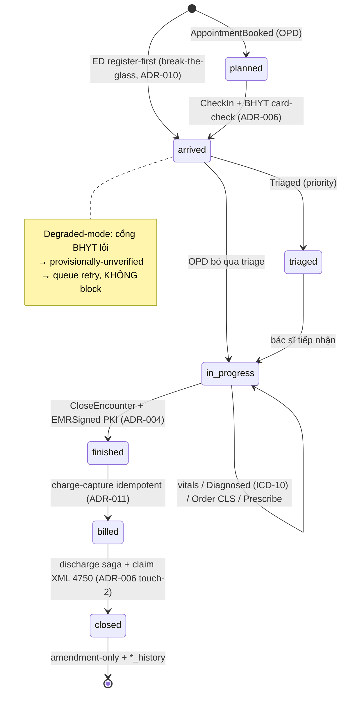
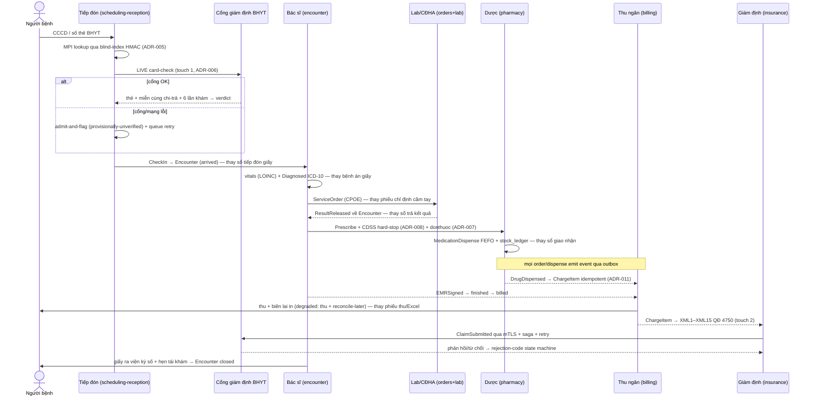

# [DOM-1] Patient journey & clinical workflows — số hóa giấy thành chuỗi Encounter có trạng thái

> Module DOM-1 · Hành trình người bệnh end-to-end (tiếp đón→triage→khám→CLS→kết quả→chẩn đoán→kê đơn/cấp phát→viện phí→giám định BHYT→ra viện→tái khám) như một chuỗi `Encounter` có state machine, mỗi bước thay một thao tác giấy/Excel bằng một sự kiện số có audit · Độ khó: 🥉→🥇 · Prereqs: **ARCH-2** (DDD & Bounded Contexts — Encounter anchor), **DATA-2** (Clinical data model — terminology triplets, versioning)

Tham chiếu: [doc/00-tong-quan.md] (transformation thesis), [doc/03-clinical-encounter-emr.md] (Encounter domain), [DOM-2] (CDSS/FEFO/charge-capture), [INT-1] (BHYT 4750 + e-prescription). Neo quyết định: **ADR-004** (Encounter là mỏ neo lâm sàng), **ADR-006** (BHYT hai chạm + degraded-mode), **ADR-022** (dual-run + print phiếu pháp lý). Phụ thuộc: ADR-005 (MPI dùng chung), ADR-007 (donthuoc liên thông), ADR-008 (CDSS), ADR-010 (break-the-glass ED), ADR-011 (charge-capture), ADR-023 (BHXH sandbox).

---

## 1. Vì sao kỹ năng này quan trọng trong HMS

HMS KHÔNG phải 10 module CRUD hành chính. Nó là phần mềm số hóa **một hành trình người bệnh có thật**: một người bước vào cổng bệnh viện, được tiếp đón, phân luồng, khám, làm cận lâm sàng, nhận chẩn đoán, lấy thuốc, đóng tiền, được giám định BHYT, rồi ra về với hẹn tái khám. Trên giấy, hành trình đó là một xấp phiếu rời rạc mà **người bệnh tự cầm đi từ bàn này sang bàn kia** — và mỗi tờ phiếu là một điểm thất lạc, sai sót, hoặc gian lận tiềm tàng.

Nếu kỹ sư mô hình hóa sai hành trình này thành các bảng độc lập (`patients`, `prescriptions`, `bills` không liên kết), hệ thống sẽ tái tạo đúng nỗi đau của giấy ở dạng số: chẩn đoán không gắn với lượt khám nào, đơn thuốc không truy ngược được tới bác sĩ ký, claim BHYT không khớp hóa đơn → **giám định từ chối, bệnh viện mất tiền, và pháp lý không bảo vệ được ai**.

ADR-004 chốt mô hình đúng: **mọi sự kiện lâm sàng FK tới `encounter_id`, KHÔNG tới `patient_id` trực tiếp**. Một `Encounter` là "một lượt khám / một đợt điều trị" — nó có vòng đời (state machine), gom toàn bộ vitals, chẩn đoán ICD-10, order CLS, kết quả, đơn thuốc, charge của lượt đó, rồi khi đóng thì **kết tinh thành EMRDocument bất biến ký số PKI** (TT 13/2025). Hiểu hành trình người bệnh như chuỗi Encounter có trạng thái là **module nền của toàn bộ tầng domain lâm sàng** — DOM-2, INT-1 và capstone CAP-1 đều dựng trên nó.

---

## 2. Mô hình tư duy (first principles) — từ con số 0

Bắt đầu bằng câu hỏi: *trên giấy, cái gì giữ tất cả các tờ phiếu của một người trong một lượt khám lại với nhau?* Câu trả lời là **"đợt khám" trong đầu nhân viên** — một khái niệm ngầm, không được mã hóa ở đâu cả, nên mỗi khi một tờ phiếu rời khỏi tay người bệnh là context bị mất.

Ba nguyên lý dẫn tới thiết kế:

1. **Mỗi thao tác giấy = một transition trạng thái có chủ thể + audit.** Chuyển đổi số (canon §2) không phải "scan tờ phiếu thành PDF" mà là biến thao tác thành **một sự kiện số có người chịu trách nhiệm ký số và vết audit bất biến** — đo được bằng "đã tắt sổ/phiếu giấy gì". "Bác sĩ ký vào tờ điều trị" → transition `in-progress → finished` + `EMRSigned`. "Thu ngân đóng dấu phiếu thu" → `PaymentRecorded`. Không có thao tác nào "lơ lửng" ngoài state machine.

2. **Encounter là aggregate root giữ chuỗi lại với nhau** (ADR-004). Thay vì khái niệm "đợt khám" ngầm trong đầu người, ta materialize nó thành một aggregate có `state`, có `encounter_id` mà mọi thực thể con FK vào. Mất tờ phiếu giấy → tra `encounter_id` ra toàn bộ lượt khám. Đây là Dependency Inversion của *nghiệp vụ*: dữ liệu lâm sàng phụ thuộc Encounter, không phụ thuộc thứ tự vật lý người bệnh đi qua các bàn.

3. **Hệ thống không bao giờ được chặn người bệnh khi hạ tầng lỗi** (ADR-006). Trên giấy, mạng down không chặn ai cả — staff cứ ghi giấy. Nếu phiên bản số *chặn* khi cổng BHYT lỗi, staff sẽ quay về sổ giấy vĩnh viễn (trigger #1 abandon system, canon §8). Vì vậy mọi điểm chạm external (BHYT card-check, donthuoc, cổng giám định) phải có **degraded-mode** first-class: *admit-and-flag, queue-and-retry, reconcile-later* — số hóa phải an toàn-khi-hỏng hơn giấy, không mong manh hơn.

Meta-nguyên lý: **state machine của Encounter là bản dịch trung thực của hành trình vật lý người bệnh — mỗi bước giấy ánh xạ 1-1 vào một transition có chủ thể, audit và degraded-mode.**

---

## 3. Khái niệm cốt lõi (tăng dần độ khó)

### 3.1 Encounter state machine (🥉)
- States: `planned → arrived → triaged → in-progress → finished → billed → closed` (canon §4, ADR-004). Loại: `OPD` (ngoại trú), `ED` (cấp cứu), `IPD` (nội trú — có `Admission` con).
- Transition do **command** kích hoạt, mỗi command có actor (persona) + emit domain event qua outbox.
- `closed` là trạng thái hấp thụ (terminal): sau khi EMRDocument ký số, chỉ còn amendment-only (ADR-004).

### 3.2 Ánh xạ "thao tác giấy → sự kiện số" (🥉→🥈)
Bảng cốt lõi của module (canon §2 — số hóa từng khoa):

| Bước hành trình | Thao tác GIẤY/EXCEL bị thay | Sự kiện số / transition | BC sở hữu |
|---|---|---|---|
| Tiếp đón | Sổ tiếp đón giấy, kiểm đúng-tuyến tay | `CheckIn` + `BhytEligibilityVerdict` (LIVE card-check) → `arrived` | scheduling-reception |
| Triage | Phân luồng tay, ghi mức ưu tiên trên giấy | `Triaged` (priority) → `triaged` | scheduling-reception |
| Khám OPD | Bệnh án giấy, tờ điều trị, phiếu khám viết tay | vitals (LOINC) + `Diagnosed` (ICD-10) + clinical note → `in-progress` | encounter |
| Chỉ định CLS | Phiếu chỉ định người bệnh cầm tay sang khoa | `ServiceOrder` (CPOE) routed tới lab/imaging | orders |
| Kết quả | Sổ trả kết quả giấy | `ResultReleased` về Encounter (nhập tay MVP) | lab |
| Kê đơn | Đơn thuốc viết tay | `Prescription` + CDSS hard-stop + `NationalRxLink` (donthuoc) | pharmacy |
| Cấp phát | Sổ giao nhận thuốc, phiếu lĩnh | `MedicationDispense` FEFO + `stock_ledger` append | pharmacy |
| Viện phí | Phiếu thu giấy, Excel đối soát | `ChargeItem` auto idempotent + `PaymentRecorded` → `billed` | billing |
| Giám định BHYT | Gõ tay/đối soát XML, từ chối qua điện thoại | XML1–XML15 (QĐ 4750) từ ChargeItem + `ClaimSubmitted` | insurance |
| Ra viện | Giấy ra viện viết tay | `EMRSigned` + discharge saga → `closed` | encounter + billing |
| Tái khám | Sổ hẹn giấy | `AppointmentBooked` → reminder job (River) | scheduling-reception |

### 3.3 BHYT hai chạm + degraded-mode (🥈)
- **Touch 1** (tiếp đón): LIVE web service JSON trả giá trị thẻ + miễn cùng chi-trả + cờ thu hồi/tạm khóa + 6 lần khám gần nhất → verdict `eligible/ineligible/co-pay` (ADR-006).
- **Touch 2** (quyết toán): bộ XML1–XML15 QĐ 4750 (sửa 3176, hiệu lực 01/01/2025) đẩy cổng giám định qua mTLS + saga + idempotency (INT-1).
- **Degraded-mode bắt buộc**: cổng/mạng lỗi → thẻ `provisionally-unverified`, queue retry, **không bao giờ chặn người bệnh**; UI hiện "đã lưu, chờ gửi cổng".

### 3.4 Walk-in & ED register-first-identify-later (🥈→🥇)
- Walk-in lấy số thứ tự (queue ticket first-class), bệnh nhân tạm/chưa-định-danh → merge MPI sau (ADR-005).
- ED: tạo Encounter **không cần appointment + chưa confirm MPI**; cứu người trước, định danh sau. Mọi access/creation trong cấp cứu đi qua **break-the-glass time-boxed + scoped + reviewer** (ADR-010) — break-the-glass áp cho CẢ access VÀ ordering, không chỉ đọc.

### 3.5 Dual-run & print phiếu pháp lý (🥇)
- Dual-run 2–4 tuần/khoa với super-user, checklist đối chiếu giấy↔số (ADR-022, HIGH priority).
- Print template phải là **form pháp lý**: đơn thuốc (TT 27/26-2025) có QR/mã đơn quốc gia + block chữ ký số, phiếu thanh toán theo bảng 4750, giấy ra viện. Phiếu in không hợp lệ pháp lý → staff giữ sổ cũ → permanent-paper.
- Feature-flag-per-department "tắt giấy tại KPI" có named owner + ngưỡng adoption.

---

## 4. HMS dùng nó thế nào (bám code path — *(planned)*, code chưa viết)

Repo HIỆN CHƯA CÓ CODE; dưới đây là layout mục tiêu (canon §9). Cross-BC chỉ qua **outbox in-process**, KHÔNG import chéo BC.

| Bước | Path *(planned)* | BC · arch style |
|---|---|---|
| Encounter aggregate + state machine | `internal/encounter/domain/encounter.go` | encounter · clean+ddd+cqrs |
| Transition command | `internal/encounter/app/command/` (Arrive, Triage, Diagnose, CloseEncounter) | encounter |
| Tiếp đón + BHYT card-check | `internal/scheduling/app/` + `adapters/bhyt/` (LIVE JSON, degraded) | scheduling-reception · clean |
| MPI lookup (blind-index) | `internal/patient/adapters/postgres/` (HMAC exact-match) | patient · clean |
| CPOE order | `internal/orders/app/command/PlaceOrder` | orders · clean+ddd+cqrs |
| Kết quả CLS | `internal/lab/app/command/ReleaseResult` → outbox về encounter | lab · clean+ddd+cqrs |
| Kê đơn + CDSS + donthuoc | `internal/pharmacy/app/command/Prescribe` (ADR-008, ADR-007) | pharmacy · clean+ddd+cqrs |
| Charge-capture | `internal/billing/app/command/` subscriber `DrugDispensed`/`OrderPlaced` | billing · clean+ddd+cqrs |
| Claim XML 4750 | `internal/insurance/app/command/` (từ ChargeItem) | insurance · clean+ddd+cqrs |
| Discharge saga | `internal/billing/app/command/` orchestrator + River | billing |
| Print phiếu pháp lý | `internal/shared/` PDF signing + `frontend/features/<persona>` print view | shared + FE |

**Encounter state machine (planned, Go)** — transition là invariant của aggregate, KHÔNG để handler HTTP tự đổi `state`:

```go
// internal/encounter/domain/encounter.go  (planned)
type State string

const (
    StatePlanned    State = "planned"
    StateArrived    State = "arrived"
    StateTriaged    State = "triaged"
    StateInProgress State = "in_progress"
    StateFinished   State = "finished"
    StateBilled     State = "billed"
    StateClosed     State = "closed"
)

// Transition hợp lệ — bảng dịch chuyển là luật nghiệp vụ (ADR-004), không phải if rải rác.
var allowed = map[State][]State{
    StatePlanned:    {StateArrived},
    StateArrived:    {StateTriaged, StateInProgress}, // OPD có thể bỏ qua triage
    StateTriaged:    {StateInProgress},
    StateInProgress: {StateFinished},
    StateFinished:   {StateBilled},
    StateBilled:     {StateClosed},
}

// Advance trả về Encounter MỚI (immutability, coding-style), không mutate receiver.
func (e Encounter) Advance(to State, now time.Time) (Encounter, error) {
    for _, ok := range allowed[e.State] {
        if ok == to {
            next := e            // copy
            next.State = to
            next.UpdatedAt = now
            return next, nil
        }
    }
    return e, fmt.Errorf("%w: %s -> %s", ErrIllegalTransition, e.State, to)
}
```

**Đóng Encounter = kết tinh EMRDocument ký số (planned)** — synchronous durability trước khi UI báo "signed" (ADR-004, ADR-015):

```go
// internal/encounter/app/command/close_encounter.go  (planned)
func (h *CloseHandler) Handle(ctx context.Context, cmd CloseCmd) error {
    enc, err := h.repo.FindByID(ctx, cmd.EncounterID) // tx đã SET LOCAL app.current_branch (RLS, DATA-1)
    if err != nil { return err }
    finished, err := enc.Advance(domain.StateFinished, h.clock.Now())
    if err != nil { return err } // illegal transition bị chặn ở domain
    doc := domain.CrystallizeEMR(finished, cmd.SignedBy) // hash + signedBy/At/signatureBlob
    if err := h.repo.SaveSigned(ctx, doc); err != nil { return err } // commit confirmed TRƯỚC khi báo signed
    return h.outbox.Append(ctx, domain.EMRSigned{EncounterID: enc.ID}) // drives charge + claim + interop
}
```

**Tiếp đón BHYT degraded-mode (planned)** — không bao giờ chặn người bệnh (ADR-006):

```go
// internal/scheduling/app/check_in.go  (planned)
verdict, err := h.bhyt.CheckEligibility(ctx, cardNo) // LIVE JSON, timeout ngắn
if err != nil {
    // DEGRADED: admit-and-flag, KHÔNG block — queue retry job (River)
    verdict = domain.VerdictProvisionallyUnverified
    h.jobs.Enqueue(ctx, RetryBhytCheck{CardNo: cardNo, EncounterID: enc.ID})
}
// luôn cho check-in: enc.Advance(StateArrived)
```

---

## 5. Best practices (mỗi mục kèm 1 nguồn đã research)

1. **Mô hình hóa vòng đời nghiệp vụ bằng explicit state machine, không bằng cờ boolean rải rác.** Bảng transition hợp lệ là source-of-truth, illegal transition bị chặn ở domain. — Martin Fowler, *State Machine / Modeling lifecycle*: <https://martinfowler.com/eaaCatalog/index.html> và *State pattern* (GoF) q: <https://refactoring.guru/design-patterns/state>
2. **Encounter là đơn vị neo của dữ liệu lâm sàng** — phản ánh đúng "một lượt khám / một đợt điều trị", ánh xạ FHIR `Encounter`. — HL7 FHIR R4, *Encounter resource*: <https://hl7.org/fhir/R4/encounter.html>
3. **Diagnose bằng coded concept (ICD-10), không free-text** — gắn (code, system, display) triplet để claim/báo cáo/interop dùng lại (DATA-2). — WHO ICD-10 + QĐ 4469/QĐ-BYT (danh mục ICD-10 dùng tại VN): <https://icd.who.int/browse10>
4. **Thiết kế cho degraded-mode ngay từ đầu** — dependency external phải có fallback admit-and-flag/queue-retry, fail không được chặn luồng người bệnh. — AWS Well-Architected, *Reliability — graceful degradation*: <https://docs.aws.amazon.com/wellarchitected/latest/reliability-pillar/rel_mitigate_interaction_failure_graceful_degradation.html>
5. **Append-only audit cho mọi transition trạng thái** — vòng đời Encounter phải truy ngược được who/when/what. — NIST SP 800-92, *Guide to Computer Security Log Management*: <https://csrc.nist.gov/pubs/sp/800/92/final>
6. **Saga cho quy trình quyết toán/ra viện nhiều bước** với compensating actions (giải phóng tạm ứng + chốt claim). — microservices.io, *Saga pattern*: <https://microservices.io/patterns/data/saga.html>
7. **Bệnh án/đơn thuốc điện tử phải có chữ ký số hợp lệ để thay thế giấy về mặt pháp lý** — print template là form pháp lý có QR/mã đơn + signature block (ADR-022). — TT 13/2025/TT-BYT (bệnh án điện tử) + TT 26/2025/TT-BYT & QĐ 808 (đơn thuốc điện tử liên thông donthuocquocgia.vn): <https://moh.gov.vn>

---

## 6. Lỗi thường gặp & anti-patterns

- **Treo dữ liệu lâm sàng vào `patient_id` thay vì `encounter_id`** → không phản ánh lượt khám, không sinh claim được, khó map FHIR (ADR-004 từ chối rõ ràng). *Fix:* mọi FK lâm sàng trỏ `encounter_id`.
- **Đổi `state` trực tiếp ở handler HTTP / SQL `UPDATE state = ...`** → mất kiểm soát transition hợp lệ, có thể nhảy `arrived → closed`. *Fix:* chỉ `Encounter.Advance()` ở domain mới đổi state; bảng `allowed` là luật.
- **Chặn người bệnh khi cổng BHYT/mạng lỗi** → staff quay về giấy vĩnh viễn (critical risk canon §8). *Fix:* degraded-mode admit-and-flag + queue retry, never-block (ADR-006).
- **Mô hình BHYT chỉ là batch XML cuối encounter** → bỏ số hóa tiếp đón, tuyến/thẻ vẫn kiểm tay (ADR-006 từ chối). *Fix:* hai chạm — LIVE card-check ở tiếp đón + XML ở quyết toán.
- **Cho phép sửa EMR sau ký** → vi phạm tính pháp lý bất biến (TT 13/2025). *Fix:* signed → amendment-only + `*_history` versioning.
- **ED bắt buộc có appointment + MPI confirmed trước khi tạo Encounter** → chỗ giấy thắng ở cấp cứu, không cứu được người. *Fix:* register-first-identify-later + break-the-glass cho creation/ordering (ADR-010).
- **Walk-in không phải first-class** (ép mọi người qua luồng appointment) → tiếp đón thực tế ùn tắc, staff bỏ hệ thống. *Fix:* queue ticket + bệnh nhân tạm + merge MPI sau (ADR-005).
- **In phiếu không có mã đơn quốc gia / không có signature block** → phiếu không substitutable pháp lý, staff giữ sổ cũ (ADR-022). *Fix:* print template = form pháp lý có QR + chữ ký số.
- **Dual-run "med priority" không có KPI-owner** → thành permanent-paper, dự án thất bại mục tiêu cốt lõi (bỏ giấy). *Fix:* dual-run HIGH priority + named owner + adoption KPI + feature-flag tắt giấy.
- **Transition Encounter / charge query chạy ngoài tx đã `SET LOCAL app.current_branch`** → RLS revert no-filter trên pooled connection → leak chi nhánh (critical risk canon §8). *Fix:* mọi PHI command chạy trong tx đã set GUC (DATA-1).

---

## 7. Lộ trình luyện tập NGAY trong repo

> Repo CHƯA có code — bài tập dựng skeleton *(planned)* theo layout canon §9. Mục tiêu: tập tư duy state-machine + ánh xạ giấy→sự kiện + degraded-mode.

- 🥉 **Cơ bản** — Viết `internal/encounter/domain/encounter.go` *(planned)* với enum `State`, bảng `allowed` transition, và method thuần `Advance(to, now) (Encounter, error)` trả bản sao mới (immutability). Viết test bảng (table-driven) `internal/encounter/domain/encounter_test.go` cho: `planned→arrived` hợp lệ, `arrived→closed` reject (`ErrIllegalTransition`), `closed→*` reject. Chạy TDD red-green, chưa cần DB.
- 🥈 **Trung cấp** — Lập **bảng ánh xạ giấy→sự kiện** (như §3.2) cho TRỌN vòng OPD-BHYT, rồi với mỗi dòng viết tên command + domain event + BC sở hữu. Phác `internal/scheduling/app/check_in.go` *(planned)* có degraded-mode: BHYT timeout → verdict `provisionally-unverified` + enqueue retry, vẫn `Advance(StateArrived)`. Unit test 2 path (cổng OK / cổng lỗi) bằng fake BHYT client, assert **không path nào chặn check-in**.
- 🥇 **Nâng cao** — Vẽ mermaid state diagram Encounter của riêng bạn + sequence diagram luồng OPD-BHYT (như §dưới). Mô phỏng end-to-end *(planned)*: `CloseEncounter` → emit `EMRSigned` qua outbox stub → billing subscriber sinh `ChargeItem` → insurance đọc ChargeItem sinh claim. Viết integration test (testcontainers, ADR-025) cho ED register-first: tạo Encounter chưa confirm MPI + break-the-glass grant time-boxed, assert grant auto-expire sau N giờ và sinh audit cờ đỏ (ADR-010).

---

## 8. Skill/agent ECC nên dùng khi luyện

- **`ecc:healthcare-emr-patterns`** — encounter workflow, prescription generation, clinical safety UI; khuôn mẫu cho state machine lâm sàng.
- **`ecc:healthcare-reviewer`** (agent `healthcare-reviewer`) — review clinical-safety: transition hợp lệ, EMR immutable sau ký, degraded-mode không chặn người bệnh.
- **`ecc:architect`** (agent `ecc:architect`) — kiểm thiết kế Encounter là aggregate root đúng boundary, cross-BC qua outbox.
- **`ecc:code-explorer`** (agent `code-explorer`) — trace luồng tiếp đón→khám→CLS→viện phí qua các BC khi code đã có.
- **`ecc:go-review`** + **`ecc:go-test`** — review aggregate invariant (immutability, illegal-transition) + TDD table-driven, coverage ≥80% (ADR-025).
- **`ecc:postgres-patterns`** — RLS + `SET LOCAL app.current_branch` cho mọi transition query (DATA-1).

---

## 9. Tài nguyên học thêm (2024–2026)

- HL7 FHIR R4 — `Encounter` resource (mô hình lượt khám/đợt điều trị): <https://hl7.org/fhir/R4/encounter.html>
- Martin Fowler — *Patterns of Enterprise Application Architecture* (state/lifecycle modeling): <https://martinfowler.com/eaaCatalog/>
- microservices.io — *Saga pattern* (quyết toán/ra viện multi-step): <https://microservices.io/patterns/data/saga.html>
- AWS Well-Architected — *Reliability pillar: graceful degradation* (degraded-mode design): <https://docs.aws.amazon.com/wellarchitected/latest/reliability-pillar/>
- WHO ICD-10 + QĐ 4469/QĐ-BYT — danh mục chẩn đoán ICD-10 dùng tại VN: <https://icd.who.int/browse10>
- TT 13/2025/TT-BYT (bệnh án điện tử ký số), TT 26/2025/TT-BYT + QĐ 808 (đơn thuốc điện tử liên thông), QĐ 4750/QĐ-BYT sửa QĐ 3176 (XML giám định BHYT): <https://moh.gov.vn>
- NIST SP 800-92 — Guide to Computer Security Log Management (audit transition): <https://csrc.nist.gov/pubs/sp/800/92/final>

---

## Sơ đồ — Encounter state machine



## Sơ đồ — Sequence luồng OPD-BHYT (số hóa trọn vòng)



---

## 10. Checklist "đã hiểu"

- [ ] Giải thích được vì sao dữ liệu lâm sàng FK tới `encounter_id` chứ KHÔNG tới `patient_id` (ADR-004).
- [ ] Vẽ được state machine Encounter `planned→arrived→triaged→in_progress→finished→billed→closed` và nêu command nào kích hoạt mỗi transition.
- [ ] Với mỗi bước hành trình (tiếp đón→...→tái khám) chỉ ra được thao tác GIẤY/EXCEL nào bị thay bằng sự kiện số nào, và BC nào sở hữu.
- [ ] Phân biệt được BHYT hai chạm: LIVE card-check ở tiếp đón (touch 1) vs XML 4750 ở quyết toán (touch 2) (ADR-006).
- [ ] Mô tả được degraded-mode admit-and-flag/queue-retry/reconcile-later và vì sao "không bao giờ chặn người bệnh" (canon §8).
- [ ] Giải thích được ED register-first-identify-later + break-the-glass time-boxed scoped cho cả access lẫn ordering (ADR-010).
- [ ] Hiểu vì sao walk-in + bệnh nhân tạm/chưa-định-danh phải first-class và merge MPI sau (ADR-005).
- [ ] Biết khi đóng Encounter thì kết tinh EMRDocument ký số PKI bất biến (signed→amendment-only) cần synchronous durability (ADR-004, ADR-015).
- [ ] Giải thích được vì sao print phiếu pháp lý (QR/mã đơn + chữ ký số) + dual-run có KPI-owner là điều kiện để "tắt giấy" thật (ADR-022).
- [ ] Hiểu mọi transition/charge query phải chạy trong tx đã `SET LOCAL app.current_branch` (RLS, DATA-1).
