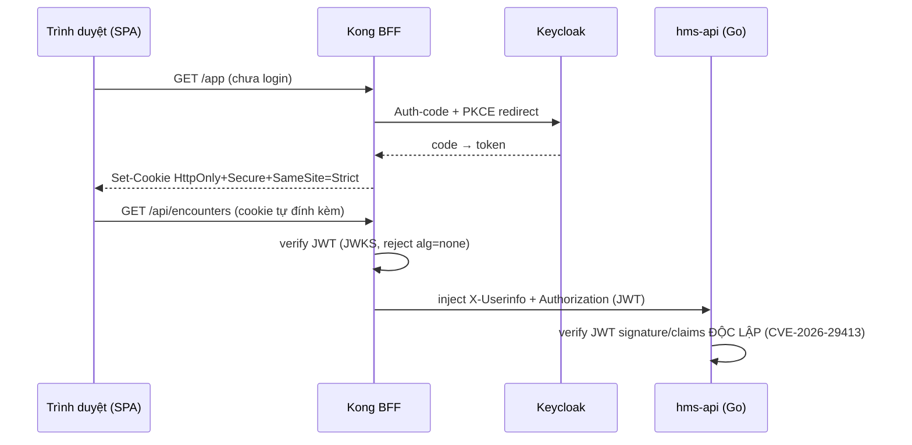

# [FE-3] Clinical Safety UX: barcode/QR, CDSS blocking modal, Kong BFF auth

> Module **FE-3** · Clinical safety UX — barcode/QR scan, CDSS blocking modal + allergy-unknown state, Kong BFF auth (token KHÔNG ở SPA), hard-online gate · Độ khó: 🥈→🥇 · Prereqs: **FE-2** (AntD v6 + RHF/zod clinical forms), nên đã đọc FE-1 (Vite SPA per-persona)

Đây là module khó nhất của track frontend: nơi UI chạm trực tiếp vào **an toàn người bệnh** và **bảo mật phiên**. Mọi quyết định ở đây neo vào ADR-008 (CDSS hard-stop fail-closed), ADR-013 (Kong BFF + Go verify JWT độc lập), ADR-018 (SPA không giữ token, KHÔNG PWA write-outbox), ADR-021 (tokenization thanh toán), ADR-022 (print phiếu pháp lý). Repo CHƯA CÓ CODE — mọi path bên dưới là *(planned)* theo layout canon section 9.

---

## 1. Vì sao kỹ năng này quan trọng trong HMS

Ở các module trước bạn dựng form và bảng. Ở đây UI trở thành **một mắt xích trong chuỗi an toàn lâm sàng** — và bài học cốt lõi là: **frontend KHÔNG BAO GIỜ là control**. Ba tình huống thật trong một khoa OPD-BHYT:

- **Dược sĩ chuẩn bị cấp phát** quét mã vạch lô thuốc. Nếu UI cho gõ tay lô và bỏ qua scan, FEFO (ADR-021) bị phá: cấp nhầm lô cận hạn/đã thu hồi. Barcode/QR là cơ chế **chống nhầm bệnh nhân–thuốc–lô**.
- **Bác sĩ kê một thuốc mà bệnh nhân đã ghi dị ứng.** Backend (pharmacy aggregate, ADR-008) hard-stop reject command. UI phải hiển thị modal **chặn** rõ ràng — nhưng nếu lập trình viên FE coi modal là "the check" và cho bypass bằng nút đóng, họ đã hiểu sai: modal chỉ là UX phản ánh quyết định backend. Tệ hơn: khi CDSS chưa biết tiền sử dị ứng, UI phải hiện **"chưa rõ dị ứng" (allergy-unknown) — KHÔNG BAO GIỜ render là "an toàn"**.
- **Một máy trạm tiếp đón bị nhiễm XSS hoặc bị mở devtools.** Nếu access token nằm trong `localStorage` của SPA, kẻ tấn công đọc được và mạo danh lễ tân truy cập PHI. ADR-013/018 đặt token trong **HttpOnly+Secure+SameSite=Strict cookie do Kong BFF quản lý — SPA không bao giờ thấy token**.

Tóm lại: module này dạy bạn xây UI mà khi nó bị bypass/lỗi/offline thì **hệ thống vẫn an toàn** (fail-closed), vì control thật nằm ở backend + Postgres + Kong, không ở React.

---

## 2. Mô hình tư duy (first principles) — từ con số 0

Bắt đầu từ một câu hỏi: *điều gì xảy ra nếu lớp này biến mất hoặc nói dối?*

1. **Trust boundary.** SPA chạy trên máy bạn không kiểm soát (browser người dùng). Mọi byte SPA gửi đi đều **untrusted**. Vì vậy: validation FE = UX (phản hồi tức thì), validation BE = security (control thật). Cùng một zod schema (FE-2) chạy hai phía nhưng phía BE mới là quyết định.
2. **Confused-deputy & token theft.** Nếu SPA cầm token, một script lạ trên trang cũng cầm được. Giải pháp: SPA **không cầm token**. Browser tự đính kèm cookie (do trình duyệt quản lý, JS không đọc được vì HttpOnly), Kong đổi cookie → JWT inject tới upstream. Đây là **Backend-for-Frontend (BFF) pattern**.
3. **Fail-closed vs fail-open.** Khi một check không chạy được (CDSS timeout, mạng rớt), có hai lựa chọn: cho qua (fail-open) hay chặn (fail-closed). Trong y tế, fail-open = "không biết có dị ứng → coi như an toàn → bệnh nhân chết". Nên mọi safety gate **mặc định CHẶN**. "Unknown" là một trạng thái thứ ba, hiển thị riêng, không gộp vào "safe".
4. **Idempotency end-to-end (ADR-011).** Người dùng bấm "Cấp phát" hai lần vì mạng chậm. Nếu FE sinh `Idempotency-Key` một lần per-intent và gắn vào request, BE dedupe → không cấp đôi. FE và BE phải dùng **MỘT scheme** key.
5. **Hard-online cho hành động không thể replay.** Dispense/cashier/BHYT không có offline write-queue (ADR-018 cắt PWA write-outbox) — vì mis-replay một lệnh cấp phát là patient-safety hazard. Reference data (danh mục thuốc, ICD-10) được cache read-only; hành động ghi bị **gate cứng online**.

Nếu bạn nắm 5 nguyên lý này, mọi code bên dưới chỉ là hiện thực.

---

## 3. Khái niệm cốt lõi (tăng dần độ khó)

| # | Khái niệm | Bản chất | Vì sao khó/quan trọng |
|---|-----------|----------|------------------------|
| 1 | **Barcode/QR capture** | HID scanner = keyboard wedge (gõ ký tự + Enter); fallback camera qua `html5-qrcode` | HID đến như keystroke → phải bắt đúng input focus, debounce, không lẫn với người gõ tay |
| 2 | **CDSS blocking modal** | Modal phản ánh verdict từ BE: `block` / `warn` / `allergy-unknown` | Modal là **mirror**, không phải gate; nút "Ghi đè" PHẢI gọi BE với reason+authorizer |
| 3 | **allergy-unknown state** | Trạng thái thứ ba ≠ "no allergy" | Render màu/nhãn riêng; KHÔNG được hiển thị xanh "an toàn" |
| 4 | **Kong BFF auth** | Token trong HttpOnly cookie; SPA gọi `/auth/me` để biết danh tính, không decode token | SPA mã hóa "ai đang đăng nhập" qua endpoint, không qua JWT trong JS |
| 5 | **Step-up auth** | Hành động nhạy cảm (ký EMR, break-the-glass) yêu cầu MFA lại | UI bắt 401-with-step-up-required → đẩy luồng MFA → retry |
| 6 | **Idempotency-Key** | UUID v7 sinh per-intent ở FE, gắn header, giữ qua retry | Một intent = một key; reset key khi user sửa nội dung |
| 7 | **Hard-online gate** | Chặn submit khi `navigator.onLine===false` hoặc health-probe fail | Chỉ áp cho dispense/cashier/BHYT, KHÔNG cho đọc reference |
| 8 | **Print phiếu pháp lý** | Đơn thuốc có QR/mã đơn quốc gia + block chữ ký số (server-render PDF) | FE chỉ trigger; nội dung ký số do BE sinh (ADR-022) |

---

## 4. HMS dùng nó thế nào (bám code path — *(planned)*)

Layout planned (canon §9): `frontend/src/{app,features/<persona>,shared,api(orval-gen)}`. Các artifact dưới đây *(planned)*.

### 4.1 Kong BFF auth — SPA không thấy token (ADR-013, ADR-018)



- *(planned)* `frontend/src/shared/auth/useSession.ts` — gọi `GET /auth/me` (qua Kong) lấy `{ accountId, persona, branchId, displayName }`. **Không** có hàm `getToken()` nào trong SPA. TanStack Query cache session, refetch on focus.
- *(planned)* `frontend/src/app/router.tsx` — TanStack Router `beforeLoad` guard: nếu `/auth/me` trả 401 → redirect tới Kong login route; per-persona route mask theo `persona` (lễ tân không thấy route kê đơn).
- Lưu ý: Kong verify JWT là edge-auth; **object-level authz vẫn ở Go** (ADR-013). FE không tự quyết "bác sĩ này xem được bệnh nhân kia".

### 4.2 CDSS blocking modal + allergy-unknown (ADR-008)

```tsx
// frontend/src/features/bac_si/prescribe/CdssGuard.tsx  (planned)
// Modal CHỈ phản ánh verdict từ POST /prescriptions (backend aggregate).
type CdssVerdict =
  | { kind: 'ok' }
  | { kind: 'allergy_unknown' }                 // KHÔNG render là 'safe'
  | { kind: 'warn'; interactions: Interaction[] }
  | { kind: 'block'; reason: string };          // command đã bị BE reject

function onSubmitError(err: ApiError) {
  if (err.code === 'CDSS_HARD_STOP') {
    // BE đã từ chối. Muốn ghi đè → gọi LẠI BE kèm override record.
    openOverrideDialog({ requireReason: true, requireAuthorizer: true });
  }
}
```

- *(planned)* `frontend/src/shared/clinical/AllergyBanner.tsx` (dựng ở FE-2) có **ba** biến thể màu: đỏ (đã ghi dị ứng), vàng/sọc (`allergy_unknown`), không-có-banner chỉ khi BE xác nhận "đã rà soát, không dị ứng". Sọc xám-vàng cho unknown để **không bao giờ trông như "ổn"**.
- Nút "Ghi đè" mở dialog bắt buộc `reason` + `authorizer` (zod required) → POST lại với field override; BE ghi audit. Đóng modal **không** gửi gì = không kê đơn (fail-closed phía nghiệp vụ).

### 4.3 Barcode/QR (HID + html5-qrcode) (ADR-021)

- *(planned)* `frontend/src/shared/scan/useHidScanner.ts` — listen `keydown` ở scope, gom ký tự tới khi gặp `Enter`, phân biệt scan (burst <30ms/ký tự) với gõ tay; trả `onScan(code)`. Dùng trong dispense (quét lô) và check-in (quét QR thẻ/giấy hẹn).
- *(planned)* `frontend/src/shared/scan/QrCamera.tsx` — fallback `html5-qrcode` khi không có HID; dùng cho quét QR mã đơn quốc gia khi đối chiếu.

### 4.4 Hard-online gate + Idempotency-Key (ADR-018, ADR-011)

```ts
// frontend/src/shared/net/useHardOnlineMutation.ts  (planned)
// Dispense / cashier / BHYT submit: chặn khi offline, gắn Idempotency-Key per-intent.
const idemKey = useRef(uuidv7());            // MỘT key/intent, giữ qua retry
function reset() { idemKey.current = uuidv7(); } // chỉ reset khi user sửa nội dung
async function submit(body) {
  if (!navigator.onLine || !(await healthOk())) {
    throw new BlockedOfflineError(); // UI: 'Cần kết nối để cấp phát/thu tiền'
  }
  return api.post(url, body, { headers: { 'Idempotency-Key': idemKey.current } });
}
```

- *(planned)* `frontend/src/shared/net/cachedReference.ts` — danh mục thuốc/ICD-10/service_catalog cache read-only (TanStack Query `staleTime` dài, persist). **Read được offline; write thì KHÔNG.**

### 4.5 Print phiếu pháp lý (ADR-022, ADR-007)

- *(planned)* `frontend/src/features/duoc_si/print/PrescriptionPrint.tsx` — gọi `GET /prescriptions/{id}/legal-pdf` (server-render). FE **không tự dựng** chữ ký số/QR; BE nhúng QR mã đơn quốc gia + block chữ ký số (donthuocquocgia.vn, TT 26/2025). FE chỉ mở print dialog / iframe PDF.

---

## 5. Best practices (mỗi mục 1 nguồn đã research)

1. **Token KHÔNG ở localStorage/JS — dùng cookie do BFF set.** OWASP khuyến nghị tránh lưu session token nơi JS đọc được; BFF giữ token, browser gửi cookie. — OWASP Cheat Sheet, *HTML5 Security / Local Storage*: https://cheatsheetseries.owasp.org/cheatsheets/HTML5_Security_Cheat_Sheet.html
2. **Auth-code + PKCE cho SPA, không Implicit flow.** PKCE chống intercept code. — IETF *OAuth 2.0 for Browser-Based Apps* (BFF pattern khuyến nghị): https://datatracker.ietf.org/doc/html/draft-ietf-oauth-browser-based-apps
3. **CSRF defense khi dùng cookie auth.** SameSite=Strict + anti-CSRF cho state-changing request. — OWASP *CSRF Prevention Cheat Sheet*: https://cheatsheetseries.owasp.org/cheatsheets/Cross-Site_Request_Forgery_Prevention_Cheat_Sheet.html
4. **CDS alerts phải tránh "alert fatigue" nhưng hard-stop cho high-severity.** Phân tầng block vs warn theo mức nguy hiểm. — *JAMIA, Tiered CDS alerts*: https://academic.oup.com/jamia
5. **Accessibility cho modal chặn lâm sàng (focus trap, ARIA role=alertdialog).** WCAG 2.2 AA + ARIA APG dialog pattern. — W3C ARIA Authoring Practices, *Alert and Message Dialog*: https://www.w3.org/WAI/ARIA/apg/patterns/alertdialog/
6. **Mutation idempotency từ client.** Sinh key per-intent, giữ qua retry; server dedupe. — Stripe *Idempotent Requests* (mô hình tham chiếu): https://docs.stripe.com/api/idempotent_requests
7. **TanStack Query cho cache/retry hành động mạng có kiểm soát.** Tách read-cache (offline-ok) khỏi write (online-gate). — TanStack Query v5 docs: https://tanstack.com/query/v5/docs/framework/react/guides/mutations

---

## 6. Lỗi thường gặp & anti-patterns

| Anti-pattern | Vì sao nguy hiểm | Đúng phải là |
|--------------|------------------|--------------|
| Coi React modal là "the CDSS check" | Bypass bằng devtools/đóng modal/gọi API trực tiếp → kê thuốc dị ứng | Control ở BE aggregate (ADR-008); modal chỉ mirror verdict |
| Render `allergy-unknown` thành banner xanh hoặc ẩn đi | Bác sĩ tưởng "không dị ứng" → kê nhầm | Trạng thái thứ ba, màu cảnh báo riêng, không bao giờ "safe" |
| Lưu access token trong `localStorage`/`Zustand`/memory SPA | XSS đọc được → mạo danh truy cập PHI | HttpOnly cookie qua Kong BFF; SPA chỉ biết qua `/auth/me` |
| Decode JWT trong SPA để lấy role rồi tin nó | Token bị giả/sửa client-side; role có thể stale | FE chỉ hiển thị; authz thật ở Go object-level (ADR-013) |
| FE tự sinh PDF đơn thuốc + "vẽ" chữ ký số/QR | Không hợp lệ pháp lý, không liên thông | Server-render PDF có QR mã đơn + ký số (ADR-022, ADR-007) |
| Offline write-queue cho dispense/cashier (PWA outbox) | Mis-replay cấp phát = double-dispense (patient-safety) | Hard-online gate; ADR-018 cắt write-outbox ở MVP |
| Sinh Idempotency-Key mỗi lần retry | Mỗi retry thành lệnh mới → double-post charge/dispense | Một key/intent, giữ qua retry, reset khi sửa nội dung (ADR-011) |
| Gõ tay lô thuốc thay vì quét barcode | Phá FEFO, cấp lô cận hạn/thu hồi | Bắt buộc scan; gõ tay chỉ khi fallback có cờ + audit (ADR-021) |
| Modal chặn không focus-trap / không `role=alertdialog` | Screen-reader bỏ qua cảnh báo sống còn | ARIA alertdialog + focus trap (WCAG 2.2 AA) |

---

## 7. Lộ trình luyện tập NGAY trong repo

> Repo chưa có code; các bài tập tạo file *(planned)* theo layout §9. Dùng Vite 6 + React 19 + TS strict + AntD v6 (vi_VN) như ADR-018.

- 🥉 **Cơ bản — AllergyBanner ba trạng thái.** Tạo *(planned)* `frontend/src/shared/clinical/AllergyBanner.tsx` nhận prop `status: 'has_allergy' | 'unknown' | 'reviewed_none'`. Yêu cầu: `unknown` render khác hẳn `reviewed_none` (màu cảnh báo, nhãn "Chưa rõ tiền sử dị ứng"); viết test RTL khẳng định `unknown` KHÔNG có text/màu "an toàn".
- 🥈 **Trung cấp — useHardOnlineMutation + Idempotency-Key.** Tạo *(planned)* `frontend/src/shared/net/useHardOnlineMutation.ts`: chặn khi `navigator.onLine===false`, gắn `Idempotency-Key` (uuid v7) per-intent, giữ key qua retry, hàm `reset()` khi nội dung đổi. Test: hai lần submit liên tiếp dùng **cùng** key; sau `reset()` thì key đổi; offline thì throw `BlockedOfflineError`.
- 🥇 **Nâng cao — CdssGuard modal đúng nghĩa "mirror".** Tạo *(planned)* `frontend/src/features/bac_si/prescribe/CdssGuard.tsx`: submit kê đơn, khi BE trả `CDSS_HARD_STOP` mở `role=alertdialog` (focus-trap) bắt buộc `reason`+`authorizer` (zod), POST lại với override → audit. Khẳng định: đóng modal KHÔNG gửi gì; ghi đè PHẢI gọi BE; không có đường nào kê đơn mà không qua BE. Thêm test axe (a11y) cho dialog. Đối chiếu với endpoint contract của BE-6 / SEC-1.

---

## 8. Skill/agent ECC nên dùng khi luyện

- **`ecc:react-review`** — review hook correctness, render perf, server/client boundary; đặc biệt soát "modal-as-control" anti-pattern và việc token rò vào client state.
- **`ecc:react-test`** (RTL behavior-first) + **`ecc:accessibility`** — viết test cho ba trạng thái allergy, focus-trap, `role=alertdialog`; chạy axe gate mỗi PR (ADR-025: Vitest+RTL+axe merge-gate).
- **`ecc:security-review`** / **`ecc:frontend-a11y`** — kiểm token storage, CSRF, XSS surface và WCAG 2.2 AA cho UI lâm sàng dày.
- **`ecc:react-patterns`** + **`ecc:react-performance`** — chuẩn hóa TanStack Query read-cache vs write-mutation, tách hard-online gate.
- **`ecc:browser-qa`** / **`verify`** (Playwright) — E2E luồng CDSS hard-stop → override; kiểm "đóng modal = không kê đơn".
- Khi cần đối chiếu hành vi Anthropic/agent: dùng **claude-api** skill (đừng trả lời từ trí nhớ).

---

## 9. Tài nguyên học thêm (2024–2026)

- OWASP *Cheat Sheet Series* — HTML5 Security, CSRF, Session Management: https://cheatsheetseries.owasp.org/
- IETF Draft *OAuth 2.0 for Browser-Based Apps* (BFF pattern): https://datatracker.ietf.org/doc/html/draft-ietf-oauth-browser-based-apps
- React 19 docs (Actions, `useActionState`, form): https://react.dev/
- TanStack Query v5 — Mutations & retry: https://tanstack.com/query/v5/docs/framework/react/guides/mutations
- TanStack Router — typed routes & `beforeLoad`: https://tanstack.com/router/latest
- Ant Design v6 — ConfigProvider (`vi_VN`), Modal a11y: https://ant.design/
- W3C ARIA APG — Alert & Message Dialog pattern: https://www.w3.org/WAI/ARIA/apg/patterns/alertdialog/
- WCAG 2.2 (AA): https://www.w3.org/TR/WCAG22/
- `html5-qrcode` (camera fallback scan): https://github.com/mebjas/html5-qrcode
- Cổng liên thông đơn thuốc quốc gia (mã đơn, TT 26/2025): https://donthuocquocgia.vn/

---

## 10. Checklist "đã hiểu"

- [ ] Giải thích được vì sao **frontend không bao giờ là control** (modal CDSS chỉ mirror verdict BE — ADR-008).
- [ ] Phân biệt rõ ba trạng thái dị ứng và biết `allergy-unknown` **không bao giờ** render là "safe".
- [ ] Mô tả được luồng Kong BFF: token ở HttpOnly cookie, SPA biết danh tính qua `/auth/me`, KHÔNG decode JWT (ADR-013/018).
- [ ] Hiểu vì sao Go vẫn verify JWT độc lập dù Kong đã verify (CVE-2026-29413) và authz object-level ở Go.
- [ ] Cài được hard-online gate cho dispense/cashier/BHYT và biết vì sao MVP cắt PWA write-outbox (ADR-018).
- [ ] Sinh và giữ đúng **một** `Idempotency-Key` per-intent qua retry, reset khi nội dung đổi (ADR-011).
- [ ] Bắt HID scanner (keyboard-wedge) đúng và biết khi nào fallback `html5-qrcode`.
- [ ] Biết phiếu pháp lý (đơn thuốc QR/mã đơn + chữ ký số) do **server** sinh, FE chỉ trigger (ADR-022/007).
- [ ] Áp dụng `role=alertdialog` + focus-trap + axe gate cho modal chặn (WCAG 2.2 AA, ADR-025).
- [ ] Phân biệt validation FE (UX) vs validation BE (security) dùng chung zod schema.
