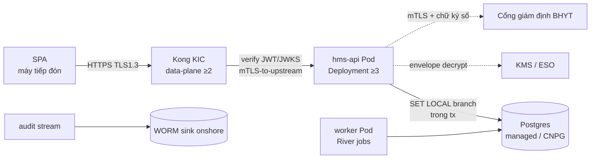

# [K8S-2] Triển khai HMS + Kong KIC + CNPG/managed PG

> Module K8S-2 · Triển khai hms-api lên Kubernetes onshore với Kong KIC DB-less, Postgres (managed/CNPG-async), cert-manager TLS và External Secrets · Độ khó: 🥉→🥇 · Prereqs: K8S-1 (architecture & components)

> Repo HIỆN CHƯA CÓ CODE — module mô tả THIẾT KẾ MỤC TIÊU. Mọi code path đánh dấu *(planned)* dùng layout canon section 9. Neo quyết định vào ADR-002 (MVP component budget), ADR-015 (Postgres), ADR-019 (Kong KIC + Argo rolling), ADR-021 (BHYT mTLS), section 3 (deploy/secrets pinned).

---

## 1. Vì sao kỹ năng này quan trọng trong HMS

K8S-1 cho bạn các primitive (Deployment, Service, Probe, NetworkPolicy). Module này dạy **ghép chúng thành một hệ chạy được**: làm sao một request từ máy tiếp đón đi qua Kong vào `hms-api` *(planned)*, chạm Postgres, và trả PHI — mà không một bước nào rò rỉ chi nhánh hay rớt khi cổng BHYT lỗi.

Điều này load-bearing với bệnh viện vì:

- **PHI onshore là ràng buộc cứng** (NĐ 53/2022 + NĐ 13/2023): cluster, Postgres, object-storage, KMS đều phải đặt tại VN. Một sai lầm "tiện tay dùng RDS Singapore" là vi phạm pháp lý, không phải bug.
- **Charge-capture và signed-EMR cần ACID + synchronous durability** (ADR-011, ADR-015): topology Postgres bạn chọn quyết định liệu UI có được phép báo "đã ký" hay "đã thu" hay không. Chọn 2 sync replica = gấp đôi write-latency trên đúng path nóng nhất.
- **MVP do một đội IT bệnh viện nhỏ vận hành** (ADR-002): mỗi stateful system thừa (Vault-đầy-đủ, Kafka, Debezium) là một thứ vận hành kém → "broken Vault = app không decrypt PHI" → availability chính là patient-safety risk. Triển khai đúng nghĩa là triển khai **ít** thứ.
- **Kong là edge auth duy nhất** (ADR-013, ADR-019): nếu Kong KIC config sai, hoặc data-plane không đủ replica + PDB, thì hoặc auth bypass (CVE-2026-29413) hoặc downtime tiếp đón.

Bạn không deploy "một web app". Bạn deploy một hệ thống y tế nơi sai cấu hình hạ tầng = staff quay về giấy hoặc rò PHI.

---

## 2. Mô hình tư duy (first principles) — từ con số 0

Bắt đầu từ một câu hỏi: *"Một bệnh nhân đến tiếp đón, làm sao byte đầu tiên của request đến được code Go và byte cuối của response về lại màn hình — và ai chịu trách nhiệm mỗi chặng?"*



Bốn nguyên lý nền:

1. **Mỗi tầng có một trách nhiệm, không lấn nhau.** Kong = coarse edge (TLS, JWT verify, rate-limit). Go = object-level authz + RLS context. Postgres = FORCE RLS enforce. K8s = isolation (NetworkPolicy, namespace, securityContext). Đừng đẩy authz lâm sàng lên Kong (ADR-013).
2. **Declarative > imperative.** Bạn không `kubectl apply` bằng tay lên prod. Mọi thứ là YAML trong Git, Argo CD reconcile (ADR-019). Cluster state = Git state. Drift bị tự sửa.
3. **Stateful là đắt; mỗi cái phải earn-in.** Postgres là stateful bắt-buộc-có. Mọi stateful khác phải vượt một trigger viết sẵn (ADR-002). Câu hỏi mặc định khi ai đó đề xuất thêm operator: *"trigger earn-in của nó đã đạt chưa?"*
4. **Fail-soft cho bệnh nhân, fail-closed cho an toàn.** Cổng BHYT down → degraded-mode admit-and-flag (không chặn bệnh nhân, ADR-006). CDSS/audit down → fail-closed (ADR-008/009). Topology phải hiện thực được cả hai.

---

## 3. Khái niệm cốt lõi (tăng dần độ khó)

### 3.1 — Namespace-per-env (ngày 1) → cluster-per-prod (go-live)
MVP: một shared cluster, namespace `hms-dev` / `hms-staging` / `hms-prod` (ADR/section 3 deploy). Go-live: prod tách **cluster riêng**. PHI namespace isolated, `NetworkPolicy` default-deny (đã học K8S-1) — chỉ mở đúng port Kong→api, api→PG.

### 3.2 — Deployment hms-api: production-grade pod spec
Pinned từ section 3 deploy:
- `replicas: ≥3`, rolling `maxUnavailable: 0` (không bao giờ giảm capacity dưới ngưỡng khi deploy).
- `livenessProbe /livez` + `readinessProbe /readyz` + `startupProbe` (Go expose qua `internal/shared/httpx` *(planned)*).
- `HPA` (scale theo CPU/RPS), `PDB minAvailable: 2` (chống voluntary eviction kéo service xuống).
- `securityContext`: `runAsNonRoot`, `readOnlyRootFilesystem`, `drop: ["ALL"]` caps, `seccompProfile: RuntimeDefault`.
- `topologySpreadConstraints` rải pod qua ≥2 AZ.

### 3.3 — Kong KIC DB-less / declarative
Kong **Ingress Controller** ở chế độ DB-less (KHÔNG Kong Postgres, ADR-019). Cấu hình qua **Gateway API** (`Gateway` + `HTTPRoute`) + **KongPlugin CRD** (jwt, rate-limiting, request-size-limiting, ip-restriction, bot-detection). ≥2 data-plane replica + PDB. Version-pinned, patch là CI/admission gate (CVE-2026-29413). Tất cả reconciled bởi Argo CD.

### 3.4 — Postgres: managed-first, CNPG-async fallback (ADR-015)
- **Ưu tiên**: VN-managed PG (VNG/Viettel/FPT) đạt residency → bỏ gánh vận hành lớn nhất.
- **Fallback** nếu không có managed onshore chấp nhận được: **CloudNativePG (CNPG) 1 primary + 1 ASYNC replica** (KHÔNG 2 sync — sync gấp đôi write-latency trên charge/claim) + WAL archive + base backup S3-compatible onshore. PITR RPO≤5min, RTO≤1h, quarterly restore drill.
- **Signed-EMR/MAR** cần synchronous durability riêng: commit confirmed TRƯỚC khi UI báo 'signed'/'administered', và phải survive PITR restore.

### 3.5 — cert-manager TLS + ESO secrets
- `cert-manager` cấp TLS (Vault/VN-CA issuer cho internal, ADR/section 3). Kong terminate TLS 1.3, mTLS-to-upstream tới `hms-api`.
- **External Secrets Operator** (hoặc cloud KMS VNG/Viettel) đồng bộ static-but-rotated secrets vào K8s Secret (ADR-014/section 3 secrets). App-side AES-256-GCM envelope với KMS-wrapped DEK chỉ cho cột siêu nhạy. K8s etcd encryption-at-rest. **MỘT cơ chế crypto** — không pgcrypto + Vault Transit song song.

### 3.6 — Argo CD app-of-apps, rolling + manual promotion
Argo CD reconcile toàn bộ (`deploy/argocd` app-of-apps *(planned)*): hms-api, worker, Kong KIC, CNPG cluster, ESO, kube-prometheus. **ROLLING** deploy + manual promotion. KHÔNG Argo Rollouts canary/SLO-auto-rollback ở MVP (ADR-019 — đó là maturity-L4, earn-in khi multi-service).

---

## 4. HMS dùng nó thế nào (bám code path — *(planned)*)

Layout triển khai theo canon section 9, tất cả *(planned)*:

```
deploy/
├── helm/                         # Helm cho operators (CNPG, ESO, kube-prometheus)
├── kustomize/
│   ├── base/                     # Deployment hms-api, worker, Service, HPA, PDB
│   └── overlays/{dev,staging,prod}   # replica count, resource, env-specific
├── kong/                         # Gateway API + KongPlugin CRD (DB-less)
└── argocd/                       # app-of-apps (reconcile tất cả ở trên)
infra/                            # OpenTofu cloud/cluster/network onshore
```

- `deploy/kustomize/base/hms-api-deployment.yaml` *(planned)* — pod spec mục 3.2; mTLS cert mount từ cert-manager; env `DATABASE_URL`, `KMS_KEY_ID` từ ESO-synced Secret.
- `deploy/kong/httproute-hms.yaml` + `kongplugin-jwt.yaml` *(planned)* — route `/api/*` → Service `hms-api`; KongPlugin jwt verify JWKS Keycloak (reject `alg=none`). Lưu ý: Go vẫn verify JWT độc lập trong `internal/shared/auth` *(planned)* — KHÔNG mù tin `X-Userinfo` (ADR-013, CVE-2026-29413).
- `deploy/helm/cnpg-cluster.yaml` *(planned)* — `Cluster` CRD: `instances: 2`, `primaryUpdateStrategy`, async replica, `backup.barmanObjectStore` trỏ S3 onshore; hoặc nếu managed PG thì chỉ ExternalName Service + ESO-synced connection secret.
- `cmd/worker/main.go` *(planned)* — River jobs (claim submit/retry, FEFO sweep, outbox cleanup, audit retention) deploy như Deployment riêng, cùng Postgres, KHÔNG broker ngoài (ADR-012).
- Migration chạy như Argo CD **PreSync hook Job** `cmd/migrate` *(planned)* — golang-migrate, **migration-owner role** (KHÔNG app-role) chạy DDL (ADR-003/024). App-role là `NOSUPERUSER, NOBYPASSRLS`, không sở hữu bảng.
- BHYT outbound (`internal/insurance/adapters` *(planned)*): mTLS + chữ ký số, client cert nằm trong ESO-synced Secret, không hardcode (ADR-021).

**MVP component budget** (ADR-002) — chỉ những thứ này chạy, không gì khác:

| Thành phần | Lựa chọn pinned | Earn-in để thêm/nâng |
|---|---|---|
| Database | Managed PG / CNPG 1 primary + 1 async | DB-per-branch: branch cực lớn cần cô lập (Phase 4) |
| Gateway | Kong KIC DB-less + Argo rolling | Argo Rollouts canary: multi-service (Phase 3) |
| Secrets | KMS / ESO + app-side envelope | Vault-đầy-đủ: PKI signing thật / dynamic DB creds / service extraction |
| Messaging | In-process outbox + River | Kafka: tách BC ra service riêng (proven scaling) |
| Observability | Prometheus + Loki + Grafana | Tempo/tracing: nhiều service (Phase 3) |
| Deploy | Argo CD app-of-apps rolling | Service mesh Linkerd: khi BC tách (Phase 3) |

---

## 5. Best practices (mỗi mục kèm 1 nguồn)

1. **Kong KIC DB-less qua Gateway API + KongPlugin, không Kong Postgres.** Giảm một stateful store, config GitOps-versioned. — Kong KIC docs: https://docs.konghq.com/kubernetes-ingress-controller/latest/
2. **CNPG cho Postgres tự vận hành, ưu tiên 1 primary + 1 async.** Operator lo failover/backup/PITR; tránh tự bê HA Postgres bằng tay. — CloudNativePG: https://cloudnative-pg.io/documentation/current/
3. **External Secrets Operator đồng bộ từ KMS, không commit secret vào Git.** — ESO docs: https://external-secrets.io/latest/
4. **cert-manager tự động cấp/rotate TLS, dùng Issuer/ClusterIssuer.** — cert-manager: https://cert-manager.io/docs/
5. **Argo CD app-of-apps, declarative GitOps, manual promotion giữa env.** — Argo CD app-of-apps: https://argo-cd.readthedocs.io/en/stable/operator-manual/cluster-bootstrapping/
6. **Pod hardening: runAsNonRoot, readOnlyRootFS, drop ALL caps, seccomp RuntimeDefault.** — Kubernetes Pod Security Standards (restricted): https://kubernetes.io/docs/concepts/security/pod-security-standards/
7. **PodDisruptionBudget + topologySpread để rolling deploy không kéo service xuống.** — K8s Disruptions: https://kubernetes.io/docs/concepts/workloads/pods/disruptions/
8. **Pin Kong version + patch là gate (CVE-2026-29413).** Theo dõi advisory upstream và CISA-KEV. — Kong security advisories: https://github.com/Kong/kong/security/advisories

---

## 6. Lỗi thường gặp & anti-patterns

- ❌ **golang-migrate chạy bằng app-role** → app-role thành table OWNER → bypass RLS âm thầm, mọi diagram nói "isolated" nhưng leak prod (ADR-003). ✅ Migration Job dùng **migration-owner role** tách biệt.
- ❌ **Chọn CNPG 2 sync replica cho "an toàn hơn"** → gấp đôi write-latency + write-stall khi replica lag, đúng trên charge/claim path (ADR-015). ✅ 1 primary + 1 async; synchronous durability chỉ cho signed-EMR/MAR.
- ❌ **Đẩy authz lâm sàng lên Kong KongPlugin** ("bác sĩ này xem bệnh nhân kia") → BOLA, gateway không có context lâm sàng (ADR-013). ✅ Kong chỉ coarse edge; object-level authz ở Go.
- ❌ **App tin `X-Userinfo` header từ Kong** → forged identity nếu Kong bypass (CVE-2026-29413). ✅ Go verify JWT signature/claims độc lập.
- ❌ **Thêm Vault/Kafka/Debezium "vì sẽ cần"** → over-operated, broken Vault = không decrypt PHI = availability risk (ADR-002/014). ✅ Earn-in trigger phải đạt trước.
- ❌ **Block bệnh nhân khi cổng BHYT down** → staff quay về giấy vĩnh viễn (ADR-006). ✅ Degraded-mode admit-and-flag là first-class, có runbook.
- ❌ **`kubectl apply` tay lên prod** → drift, không reproducible. ✅ Argo CD reconcile từ Git.
- ❌ **Secret trong ConfigMap/Git/image layer** → leak. ✅ ESO + etcd encryption-at-rest; secret-scan (Gitleaks) merge-blocking.
- ❌ **Bỏ PDB hoặc đặt `maxUnavailable > 0`** → rolling deploy + node drain đồng thời kéo tiếp đón offline. ✅ `maxUnavailable: 0` + `PDB minAvailable: 2`.

---

## 7. Lộ trình luyện tập NGAY trong repo (🥉→🥇)

> Repo chưa có code/manifest — bài tập là **tạo các artifact *(planned)*** đúng layout section 9, validate cục bộ.

- 🥉 **Cơ bản — viết Deployment + Service hms-api production-grade.** Trong `deploy/kustomize/base/` *(planned)* tạo `hms-api-deployment.yaml`: 3 replica, rolling `maxUnavailable: 0`, `/livez` `/readyz` `startupProbe`, full `securityContext` (mục 3.2), resource requests/limits. Validate bằng `kubectl apply --dry-run=client -f` và `kubeconform`. Tiêu chí: pass restricted Pod Security Standard.

- 🥈 **Trung cấp — route Kong + 3 plugin + PDB.** Trong `deploy/kong/` *(planned)* tạo `HTTPRoute` map `/api/*` → Service `hms-api`, `KongPlugin` cho jwt (JWKS Keycloak, reject `alg=none`), rate-limiting (Redis), request-size-limiting. Thêm `PodDisruptionBudget minAvailable: 2` + `topologySpreadConstraints` qua 2 zone. Vẽ lại flowchart mục 2 với đúng tên resource bạn tạo. Tiêu chí: giải thích được vì sao authz lâm sàng KHÔNG nằm ở đây.

- 🥇 **Nâng cao — full app-of-apps + CNPG + migration hook + degraded-mode runbook.** Trong `deploy/argocd/` *(planned)* viết app-of-apps gom: hms-api, worker, Kong KIC, CNPG `Cluster` (1 primary + 1 async, `barmanObjectStore` S3 onshore), ESO. Thêm Argo **PreSync hook Job** chạy `cmd/migrate` bằng migration-owner role. Viết một runbook ngắn "cổng BHYT down → degraded reception" và "DB restore drill đo RTO≤1h vào ephemeral namespace". Tiêu chí: chứng minh app-role không sở hữu bảng, và signed-EMR commit path tách khỏi RPO chung.

---

## 8. Skill/agent ECC nên dùng khi luyện

- **`ecc:kubernetes-patterns`** — review manifest Deployment/PDB/securityContext, Pod Security Standards, NetworkPolicy default-deny.
- **`ecc:deployment-patterns`** — pattern GitOps/Argo CD, rolling vs canary, env promotion.
- **`ecc:docker-patterns`** — multi-stage build hms-api image (distroless, non-root) trước khi deploy.
- **`ecc:security-review`** / **`ecc:security-scan`** — soi secret trong manifest, Kong CVE pin, mTLS, etcd encryption-at-rest.
- **`ecc:postgres-patterns`** — review CNPG Cluster CRD, backup/PITR, đảm bảo không 2-sync.
- **`ecc:canary-watch`** — smoke/canary verify URL sau deploy (`/readyz`, không console error).
- **`ecc:quality-gate`** — chạy formatter/lint gate cho YAML trước commit.

---

## 9. Tài nguyên học thêm (2024–2026)

- Kubernetes Production Best Practices — https://kubernetes.io/docs/setup/best-practices/
- CloudNativePG — Architecture & Backup/Recovery — https://cloudnative-pg.io/documentation/current/
- Kong Ingress Controller (Gateway API) — https://docs.konghq.com/kubernetes-ingress-controller/latest/
- Argo CD — Declarative GitOps — https://argo-cd.readthedocs.io/en/stable/
- External Secrets Operator — https://external-secrets.io/latest/
- cert-manager — https://cert-manager.io/docs/
- Pod Security Standards — https://kubernetes.io/docs/concepts/security/pod-security-standards/
- NĐ 13/2023 về bảo vệ dữ liệu cá nhân (data residency PHI) — Cổng TTĐT Chính phủ
- Kong CVE-2026-29413 advisory & CISA-KEV catalog — https://www.cisa.gov/known-exploited-vulnerabilities-catalog

---

## 10. Checklist "đã hiểu"

- [ ] Vẽ được luồng request SPA → Kong → hms-api → Postgres và nói rõ ai chịu trách nhiệm mỗi chặng.
- [ ] Giải thích vì sao Postgres chọn 1 primary + 1 **async** (không 2 sync) và đâu là path cần synchronous durability (ADR-015).
- [ ] Biết MVP component budget gồm gì và mỗi stateful bị defer có earn-in trigger nào (ADR-002).
- [ ] Viết được Deployment hms-api pass restricted Pod Security Standard (runAsNonRoot, readOnlyRootFS, drop ALL, seccomp).
- [ ] Cấu hình được Kong KIC DB-less qua Gateway API + KongPlugin và biết vì sao authz lâm sàng KHÔNG ở Kong (ADR-013).
- [ ] Hiểu migration chạy bằng **migration-owner role** tách app-role, và vì sao app-role làm owner = RLS no-op (ADR-003/024).
- [ ] Cấu hình ESO + cert-manager + etcd encryption-at-rest; biết "một cơ chế crypto" nghĩa là gì (ADR-014).
- [ ] Mô tả Argo CD app-of-apps rolling + manual promotion và vì sao KHÔNG canary ở MVP (ADR-019).
- [ ] Biết degraded-mode khi cổng BHYT down giữ topology không chặn bệnh nhân (ADR-006), và RTO≤1h / RPO≤5min mục tiêu.
- [ ] Pin Kong version + patch là gate, hiểu rủi ro CVE-2026-29413 trên healthcare gateway.
