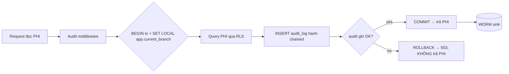

# [SEC-2] PHI Compliance: audit-of-reads, break-the-glass, DPIA, consent

> Module **SEC-2** · Tuân thủ PHI ở tầng ứng dụng: ghi vết ĐỌC PHI fail-closed + hash-chain + WORM, break-the-glass time-boxed, consent & data-subject-rights (NĐ 13/2023), DPIA · Độ khó: 🥉→🥇 · Prereqs: **SEC-1** (Keycloak OIDC + Kong edge + Go object-level authz), **DATA-1** (FORCE RLS & branch_id multi-tenancy)

Tài liệu nguồn liên quan: `doc/06-identity-rbac-audit.md`, `doc/09-security.md`, `doc_tech/data/01-postgres-rls-multitenancy.md`. Neo quyết định: **ADR-009** (audit-of-reads commit-with-response), **ADR-010** (break-the-glass), **ADR-020** (DPIA + consent + DSR Phase-0), **ADR-003/005** (RLS keystone).

---

## 1. Vì sao kỹ năng này quan trọng trong HMS

Trong một bệnh viện đã rời giấy, mọi lần một le_tan tra cứu thẻ BHYT, một bac_si mở Encounter của bệnh nhân hàng xóm, một duoc_si in đơn — đều là một lần **chạm PHI**. Trên giấy, vết để lại là chữ ký mực và sổ giao nhận. Khi số hóa, nếu hệ thống không ghi lại "ai đã ĐỌC hồ sơ nào, lúc nào", thì ta vừa xóa control mạnh nhất của mô hình giấy mà không thay bằng gì. Đây không phải tính năng nice-to-have: HIPAA §164.312(b) và NĐ 13/2023 (Bảo vệ dữ liệu cá nhân) coi audit truy cập là **nghĩa vụ pháp lý**, và auditor sẽ hỏi "cho tôi xem ai đã xem bệnh án ông X trong 6 tháng qua".

Ba tình huống bệnh viện thật mà module này giải quyết:
- **Snooping**: một nhân viên xem hồ sơ người nổi tiếng / người thân vì tò mò. Phát hiện được CHỈ KHI mọi lần đọc đều có vết — và vết đó không thể bị chính DBA xóa.
- **Cấp cứu (ED)**: bệnh nhân hôn mê, bác sĩ trực chưa có quan hệ điều trị, ABAC sẽ chặn. Ta cần **break-the-glass** — cho phép vượt rào trong tình huống sinh tử nhưng để lại cờ đỏ và bắt buộc hậu kiểm (ADR-010).
- **Quyền của chủ thể dữ liệu**: NĐ 13/2023 cho bệnh nhân quyền truy cập / yêu cầu xóa / rút đồng ý. Không có cơ chế DSR + consent thì go-live là vi phạm pháp luật ngay ngày đầu (ADR-020).

Khác biệt cốt lõi của HMS so với app CRUD thường: **đọc cũng phải audit, và audit phải fail-closed** — nếu không ghi được vết thì KHÔNG được trả PHI ra. Đây là module biến khẩu hiệu "compliance" thành cơ chế có test.

## 2. Mô hình tư duy (first principles) — từ con số 0

Bắt đầu từ một câu hỏi pháp lý: *"Làm sao chứng minh trước thanh tra rằng dữ liệu sức khỏe được xử lý đúng?"* Trả lời cần 4 tính chất, suy ra từ bản chất chứ không từ công cụ:

1. **Tính đầy đủ (completeness)** — mọi truy cập PHI để lại vết, kể cả READ. Nếu chỉ ghi create/update/delete (như app thường), bạn không phát hiện được snooping vì snooping chỉ đọc.
2. **Tính bền vững gắn với hành vi (durability tied to the action)** — vết phải tồn tại *trước hoặc cùng lúc* với việc trả dữ liệu. Nếu audit ghi async best-effort, một crash giữa "trả PHI" và "ghi audit" tạo ra cửa sổ PHI rò rỉ không vết → vi phạm. ⟹ **fail-closed**: ghi audit fail thì rollback luôn, không trả PHI.
3. **Tính không thể chối bỏ / chống giả mạo (tamper-evidence)** — một dòng audit trong Postgres mà DBA/superuser sửa được thì vô giá trị trước tòa. Postgres policy `INSERT-only` chống được app-role, nhưng KHÔNG chống superuser. ⟹ cần **hash-chain** (mỗi bản ghi chứa hash của bản ghi trước → sửa một dòng làm gãy chuỗi) + **WORM sink ngoài Postgres** (write-once-read-many, object-lock).
4. **Tính tối thiểu cần thiết (minimum necessary) + đồng ý (consent)** — chỉ xử lý đúng mục đích điều trị; ngoài mục đích đó phải có consent; chủ thể có quyền truy cập/xóa/rút.

Từ 4 tính chất này suy ra kiến trúc: audit-READ đi **đồng bộ trong cùng transaction trả response** (ADR-009), audit-WRITE/state-change đi qua **outbox** (đã durable trong tx ghi domain rồi). Break-the-glass là một *grant tạm* mở rộng quyền ABAC nhưng đặt mọi hành động trong phạm vi grant dưới đèn pha audit.



## 3. Khái niệm cốt lõi (tăng dần độ khó)

**🥉 Audit event & các trường bắt buộc.** Một `AuditEvent` ghi: `who` (account_id), `when` (timestamptz), `action` ∈ {read, create, update, delete, print, export}, `resource` (loại + id), `patient_id`, `before/after` (cho thay đổi), `ip`, `session_id`, `branch_id` (ADR-009). Bảng `audit_log` là BIGINT IDENTITY, partition theo tháng, FORCE RLS, INSERT-only.

**🥉 Read-audit vs write-audit.** Read-audit phải đồng bộ-với-response (durable trước khi PHI rời server). Write-audit/state-change đi qua transactional outbox (event đã nằm trong cùng tx với thay đổi domain → không cần ghi lại đồng bộ, tránh nhân đôi ghi).

**🥈 Hash-chain (tamper-evidence).** Mỗi bản ghi lưu `prev_hash` và `row_hash = H(prev_hash ‖ canonical(payload))`. Một auditor chạy lại chuỗi: nếu một dòng bị sửa/xóa, hash sau đó không khớp → phát hiện. Quan trọng: hash-chain phải **sống sót PITR restore** (giữ nguyên thứ tự và giá trị sau khôi phục).

**🥈 WORM sink.** Hash-chain chống *phát hiện* sửa, nhưng vẫn cần một bản sao bất biến ngoài tầm với DBA. Stream audit ra object storage onshore có **object-lock / retention** (write-once-read-many). DBA có toàn quyền Postgres vẫn không xóa được bản WORM.

**🥈 Consent & minimum-necessary.** `consents` ghi đồng ý xử lý theo mục đích (điều trị / nghiên cứu / chia sẻ). Xử lý ngoài mục đích điều trị phải kiểm consent ở tầng app TRƯỚC khi thực hiện (ADR-020).

**🥇 Break-the-glass (BTG).** Một `BreakGlassGrant`: nhân viên khai lý do → cấp quyền **time-boxed** (auto-expire sau N giờ), **scoped** (đúng patient/encounter), sinh audit cờ đỏ + thông báo security officer, có **named reviewer + SLA hậu kiểm + consequence path**. Áp dụng cho cả ACCESS lẫn CREATION/ordering trong ED (register-first-identify-later) — ADR-010.

**🥇 Data-subject-rights (DSR).** `data_subject_requests` mô hình hóa quyền truy cập / xóa / rút đồng ý theo NĐ 13. "Xóa" với dữ liệu sức khỏe phức tạp: bệnh án ký số là bản ghi pháp lý bất biến (TT 13/2025) → không xóa cứng được; phải cân bằng giữa quyền chủ thể và nghĩa vụ lưu trữ y tế (thường là pseudonymization + ghi nhận yêu cầu, không destroy bệnh án hợp lệ).

**🥇 DPIA.** Hồ sơ đánh giá tác động xử lý DLCN — nghĩa vụ NĐ 13: nộp Bộ Công an/A05 trong 60 ngày kể từ khi BẮT ĐẦU xử lý (= go-live). Là **legal artifact Phase-0**, không phải tài liệu hậu kỳ (ADR-020).

## 4. HMS dùng nó thế nào (bám code path — *(planned)*, repo chưa có code)

BC sở hữu: **audit-compliance** (`clean+ddd+cqrs`), bảng `audit_log` (partitioned monthly, FORCE RLS, INSERT-only), `data_subject_requests`, `dpia_records`, `data_access_log`. BTG grant sống ở **identity-access** (`break_glass_grants`, `BreakGlassGrant` aggregate). Consent ở **patient** BC (`consents`).

- `internal/audit/domain/` *(planned)* — `AuditEvent` (immutable, hash-chained), value object cho action enum, hàm tính `row_hash`. Chỉ import stdlib (layer rule ADR-001).
- `internal/audit/app/command/record_read.go` *(planned)* — use-case ghi read-audit; trả error nếu ghi fail (để caller fail-closed).
- `internal/shared/middleware/audit_read.go` *(planned)* — middleware bọc handler PHI-read: mở tx, `SET LOCAL app.current_branch` (DATA-1), chạy query, INSERT audit_log, COMMIT; nếu INSERT fail → ROLLBACK + trả 503, **không** trả PHI (ADR-009). Đây là điểm fail-closed.
- `internal/audit/adapters/postgres/` *(planned)* — repo INSERT-only; adapter stream sang WORM sink (object-lock). State-change audit nhận từ outbox subscriber.
- `internal/audit/adapters/worm/` *(planned)* — writer tới object storage onshore (S3-compatible, object-lock retention).
- `internal/identity/domain/break_glass.go` *(planned)* — `BreakGlassGrant{reason, scope(patient/encounter), expiresAt, reviewer, status}`; ABAC enforcer (SEC-1) tham chiếu grant còn hiệu lực để mở rào object-level.
- `internal/identity/app/command/activate_break_glass.go` *(planned)* — tạo grant, emit `BreakGlassActivated` qua outbox → thông báo security officer + tạo review task (River job, BE-4).
- `internal/patient/domain/consent.go` *(planned)* — `Consent` aggregate; check consent cho xử lý ngoài mục đích điều trị.
- `backend/migrations/000001_phase0_compliance.up.sql` *(planned)* — tạo `audit_log` (partition, FORCE RLS, policy chặn UPDATE/DELETE `USING false` kể cả app-role), `break_glass_grants`, `data_subject_requests`, `dpia_records` ngay Phase-0 (ADR-024).

Ví dụ migration cho audit_log INSERT-only + RLS *(planned)*:

```sql
-- 000001_phase0_compliance.up.sql (trích) (planned)
CREATE TABLE audit_log (
  id           BIGINT GENERATED ALWAYS AS IDENTITY PRIMARY KEY,
  branch_id    UUID NOT NULL,
  actor_id     UUID NOT NULL,
  action       TEXT NOT NULL CHECK (action IN
                 ('read','create','update','delete','print','export')),
  resource     TEXT NOT NULL,
  resource_id  UUID,
  patient_id   UUID,
  before_data  JSONB,
  after_data   JSONB,
  ip           INET,
  session_id   UUID,
  prev_hash    BYTEA,
  row_hash     BYTEA NOT NULL,
  occurred_at  TIMESTAMPTZ NOT NULL DEFAULT now()
) PARTITION BY RANGE (occurred_at);

ALTER TABLE audit_log ENABLE ROW LEVEL SECURITY;
ALTER TABLE audit_log FORCE ROW LEVEL SECURITY;        -- ADR-003 keystone

-- INSERT-only: chặn UPDATE/DELETE kể cả app-role (ADR-009)
CREATE POLICY audit_no_mutate ON audit_log
  FOR UPDATE USING (false) WITH CHECK (false);
CREATE POLICY audit_no_delete ON audit_log
  FOR DELETE USING (false);
CREATE POLICY audit_insert ON audit_log
  FOR INSERT WITH CHECK (branch_id = current_setting('app.current_branch')::uuid);
```

Ví dụ middleware fail-closed *(planned, minh họa)*:

```go
// internal/shared/middleware/audit_read.go (planned)
func AuditedRead(pool *pgxpool.Pool, audit AuditRecorder) gin.HandlerFunc {
    return func(c *gin.Context) {
        ident := auth.Identity(c) // JWT đã verify độc lập (SEC-1, CVE-2026-29413)
        tx, err := pool.Begin(c)
        if err != nil { httpx.Fail(c, 503, "audit_unavailable"); return }
        defer tx.Rollback(c)
        // RLS contract (DATA-1): branch_id từ JWT, KHÔNG từ client
        if _, err := tx.Exec(c, "SET LOCAL app.current_branch = $1", ident.BranchID); err != nil {
            httpx.Fail(c, 503, "rls_setup_failed"); return
        }
        c.Set("tx", tx)
        c.Next() // handler đọc PHI trong tx này
        // Ghi audit-of-read TRƯỚC khi commit — fail-closed (ADR-009)
        if err := audit.RecordRead(c, tx, ident, c.GetString("phi_resource")); err != nil {
            httpx.Fail(c, 503, "audit_write_failed") // KHÔNG trả PHI
            return
        }
        if err := tx.Commit(c); err != nil { httpx.Fail(c, 503, "commit_failed"); return }
    }
}
```

## 5. Best practices (mỗi mục kèm 1 nguồn đã research)

- **Audit cả READ, không chỉ ghi/sửa/xóa.** Snooping chỉ là read; bỏ read-audit là bỏ control chính. — HIPAA Security Rule §164.312(b) Audit controls: https://www.ecfr.gov/current/title-45/subtitle-A/subchapter-C/part-164/subpart-C/section-164.312
- **Fail-closed cho audit-of-reads (durable trước response).** Không trả dữ liệu nhạy cảm nếu chưa chắc đã ghi được vết. — OWASP Logging Cheat Sheet (event reliability, fail-safe): https://cheatsheetseries.owasp.org/cheatsheets/Logging_Cheat_Sheet.html
- **Tamper-evident log bằng hash-chain + lưu bất biến ngoài DB.** Postgres policy không chống được superuser; cần chuỗi hash + WORM. — NIST SP 800-92 Guide to Computer Security Log Management (log integrity & protection): https://csrc.nist.gov/pubs/sp/800/92/final
- **WORM / object-lock cho immutable retention.** Object storage retention chống xóa kể cả admin. — AWS S3 Object Lock (mô hình WORM tham chiếu): https://docs.aws.amazon.com/AmazonS3/latest/userguide/object-lock.html
- **Break-the-glass phải time-boxed + scoped + có hậu kiểm.** Emergency access không closed-loop là finding của auditor. — HL7/HealthIT "Break-the-Glass" emergency access pattern (HEART/OAuth context): https://www.healthit.gov/sites/default/files/page/2021-04/BreakTheGlass.pdf
- **Minimum necessary + consent enforcement ở tầng app.** Chỉ xử lý đúng mục đích điều trị; ngoài đó cần consent. — Nghị định 13/2023/NĐ-CP về bảo vệ dữ liệu cá nhân (quyền chủ thể, DPIA, mục đích xử lý): https://datafiles.chinhphu.vn/cpp/files/vbpq/2023/4/13-nd.signed.pdf
- **DPIA là nghĩa vụ pháp lý có deadline, không phải docs.** Nộp A05 trong 60 ngày kể từ khi xử lý. — Hướng dẫn DPIA theo NĐ 13 (Bộ Công an / phân tích pháp lý): https://www.mic.gov.vn (cổng văn bản) + đối chiếu Điều 24 NĐ 13/2023.
- **Append-only audit table bằng RLS policy `USING false` cho UPDATE/DELETE.** — PostgreSQL Row Security Policies (FORCE RLS, per-command policy): https://www.postgresql.org/docs/16/ddl-rowsecurity.html

## 6. Lỗi thường gặp & anti-patterns

| Anti-pattern | Vì sao nguy hiểm | Cách đúng (ADR) |
|---|---|---|
| Audit-read async best-effort (fire-and-forget goroutine) | Crash giữa trả-PHI và ghi-audit ⟹ PHI rò rỉ không vết, vi phạm §164.312(b)/NĐ13 | Commit-with-response, fail-closed (ADR-009) |
| Chỉ dựa vào Postgres "immutable policy" | Superuser/DBA vẫn sửa được → không tamper-evident trước tòa | Hash-chain + WORM external (ADR-009) |
| Ghi audit ngoài tx của query PHI trên pooled connection | `SET LOCAL` chỉ sống trong tx; connection reuse revert branch filter → audit ghi sai branch hoặc query leak | Audit + PHI query CÙNG một tx đã SET LOCAL (DATA-1, ADR-003) |
| BTG chỉ log, không review/expire/scope | Auditor NĐ13 coi unreviewed emergency-access là finding; grant over-broad vĩnh viễn | Time-boxed + scoped + named reviewer + SLA (ADR-010) |
| Render "allergy unknown" như "no allergy / safe" | Nhầm an toàn → kê thuốc gây dị ứng (giao với SEC/CDSS) | Trạng thái unknown tách bạch, không bao giờ là "safe" (ADR-008) |
| "Xóa" DSR = hard-delete bệnh án ký số | Phá bản ghi pháp lý bất biến TT 13/2025 + gãy hash-chain | Pseudonymize + ghi nhận yêu cầu, giữ bệnh án hợp lệ (ADR-020/004) |
| Audit_log không FORCE RLS | Audit của branch B lộ cho branch A | FORCE RLS + branch_id NOT NULL (ADR-003) — nhưng cross-branch reviewer qua policy escalation |
| Coi DPIA là tài liệu viết sau go-live | Vi phạm deadline 60 ngày NĐ13 | DPIA là Phase-0 deliverable (ADR-020) |

## 7. Lộ trình luyện tập NGAY trong repo (🥉→🥈→🥇)

> Repo chưa có code — các bài tập tạo file *(planned)* theo layout ADR-001/section 9, hoặc viết test/spec trước (TDD red, theo testing rule). Dùng path tuyệt đối trong repo.

- **🥉 Cơ bản — thiết kế bảng & event.** Trong `backend/migrations/000001_phase0_compliance.up.sql` *(planned)* viết DDL `audit_log` đầy đủ (partition tháng, FORCE RLS, policy INSERT-only `USING false` cho UPDATE/DELETE). Viết `internal/audit/domain/audit_event.go` *(planned)* với 6 action enum + hàm `RowHash(prev, payload)`. Tự kiểm: liệt kê đủ trường who/when/action/resource/patient/branch/ip/session.

- **🥈 Trung cấp — hash-chain + fail-closed test.** Viết `internal/audit/domain/chain_test.go` *(planned)*: arrange 3 event nối chuỗi, act sửa event giữa, assert verify chuỗi phát hiện gãy. Viết integration test (testcontainers, ADR-025) `internal/shared/middleware/audit_read_test.go` *(planned)*: inject lỗi INSERT audit → assert handler trả 503 và **không** có PHI trong response body. Đây là RED test cho fail-closed.

- **🥇 Nâng cao — break-the-glass closed loop.** Thiết kế `internal/identity/domain/break_glass.go` + `app/command/activate_break_glass.go` *(planned)*: grant time-boxed (expiresAt), scoped (patient_id/encounter_id), emit `BreakGlassActivated` qua outbox; viết River job *(planned)* tạo review task + auto-expire grant; viết integration test chứng minh: (a) grant hết hạn thì ABAC chặn lại, (b) mọi action trong cửa sổ BTG đều sinh audit cờ đỏ, (c) reviewer chưa duyệt sau SLA thì cảnh báo. Kết hợp với SEC-1 ABAC enforcer để mở rào object-level đúng scope.

## 8. Skill/agent ECC nên dùng khi luyện

- **`ecc:healthcare-phi-compliance`** — patterns PHI/PII: data classification, access control, audit trails, encryption, leak vectors. Dùng để review thiết kế audit + consent.
- **`ecc:hipaa-compliance`** — đối chiếu §164.312(b) audit controls + minimum necessary; map sang NĐ13.
- **`ecc:security-review` / `ecc:security-reviewer`** — quét fail-open path, audit-bypass, BOLA quanh BTG; chạy trước commit (security.md gate).
- **`ecc:postgres-patterns`** — review RLS policy `USING false`, partition, index branch_id-leading cho audit_log.
- **`ecc:go-review`** — review middleware tx-scoping (fail-closed, không leak PHI khi audit fail), error handling.
- **`ecc:go-test`** — TDD table-driven cho hash-chain + integration test fail-closed (testcontainers real PG, ADR-025).
- **`ecc:healthcare-eval-harness`** — eval các failure mode (audit-fail → no PHI; BTG expire → block) như test suite.

## 9. Tài nguyên học thêm (2024–2026)

- HIPAA Security Rule §164.312 (audit controls, integrity) — eCFR: https://www.ecfr.gov/current/title-45/subtitle-A/subchapter-C/part-164/subpart-C/section-164.312
- Nghị định 13/2023/NĐ-CP (Bảo vệ dữ liệu cá nhân) — bản gốc: https://datafiles.chinhphu.vn/cpp/files/vbpq/2023/4/13-nd.signed.pdf
- Luật Bảo vệ dữ liệu cá nhân (hiệu lực 2026, đang superseding NĐ13) — theo dõi cập nhật Quốc hội/MIC: https://www.mic.gov.vn
- Thông tư 13/2025/TT-BYT (bệnh án điện tử ký số) — Cổng thông tin Bộ Y tế: https://moh.gov.vn
- NIST SP 800-92 Log Management: https://csrc.nist.gov/pubs/sp/800/92/final
- OWASP Logging Cheat Sheet: https://cheatsheetseries.owasp.org/cheatsheets/Logging_Cheat_Sheet.html
- OWASP Top 10 2021 — A09 Security Logging & Monitoring Failures: https://owasp.org/Top10/A09_2021-Security_Logging_and_Monitoring_Failures/
- PostgreSQL 16 Row Security Policies: https://www.postgresql.org/docs/16/ddl-rowsecurity.html
- AWS S3 Object Lock (mô hình WORM tham chiếu cho sink onshore): https://docs.aws.amazon.com/AmazonS3/latest/userguide/object-lock.html
- HealthIT Break-the-Glass pattern: https://www.healthit.gov

## 10. Checklist "đã hiểu"

- [ ] Giải thích được vì sao **đọc PHI cũng phải audit** và phân biệt read-audit (sync) vs write-audit (outbox).
- [ ] Mô tả được luồng **fail-closed**: audit ghi fail ⟹ ROLLBACK ⟹ KHÔNG trả PHI (ADR-009), và viết được integration test chứng minh.
- [ ] Hiểu vì sao Postgres "immutable policy" KHÔNG đủ và cần **hash-chain + WORM** ngoài DB; hash-chain phải sống sót PITR.
- [ ] Viết được DDL `audit_log` FORCE RLS + INSERT-only (`USING false` cho UPDATE/DELETE) trong migration 000001.
- [ ] Nắm contract **SET LOCAL trong cùng tx** với query PHI (DATA-1) và vì sao query/audit ngoài tx trên pooled connection gây leak.
- [ ] Thiết kế được **break-the-glass** time-boxed + scoped + named reviewer + SLA + consequence, áp cho cả access lẫn creation/ordering ED (ADR-010).
- [ ] Phân biệt **consent / minimum-necessary** và biết khi nào phải kiểm consent (xử lý ngoài mục đích điều trị).
- [ ] Biết **DSR "xóa"** với bệnh án ký số ≠ hard-delete (TT 13/2025) — dùng pseudonymization + ghi nhận yêu cầu.
- [ ] Biết **DPIA** là legal artifact Phase-0 có deadline 60 ngày kể từ go-live (NĐ13/ADR-020).
- [ ] Chạy được `ecc:healthcare-phi-compliance` + `ecc:security-review` trên thiết kế audit của mình.
